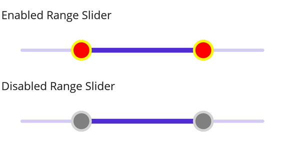

# Thumb and Overlay in DateTime Range Slider (SfDateTimeRangeSlider)

This section explains how to customize the thumb and thumb overlay in the DateTime Range Slider.

- **Thumb**: A slider element that can be dragged to alter the selected range slider value.
- **Thumb Overlay**: Renders around the thumbs during interaction.

## Thumb Size

Modify the thumb size using the [`Radius`](https://help.syncfusion.com/cr/maui/Syncfusion.Maui.Sliders.SliderThumbStyle.html#Syncfusion_Maui_Sliders_SliderThumbStyle_Radius) property of the [`ThumbStyle`](https://help.syncfusion.com/cr/maui/Syncfusion.Maui.Sliders.SliderThumbStyle.html) class. The default `Radius` is `10.0`.





<sliders:SfDateTimeRangeSlider Minimum="2010-01-01" 
                               Maximum="2018-01-01" 
                               RangeStart="2012-01-01" 
                               RangeEnd="2016-01-01">
   
   <sliders:SfDateTimeRangeSlider.ThumbStyle>
       <sliders:SliderThumbStyle Radius="15" />
   </sliders:SfDateTimeRangeSlider.ThumbStyle>

</sliders:SfDateTimeRangeSlider>





SfDateTimeRangeSlider rangeSlider = new SfDateTimeRangeSlider();
rangeSlider.Minimum = new DateTime(2010, 01, 01);
rangeSlider.Maximum = new DateTime(2018, 01, 01);
rangeSlider.RangeStart = new DateTime(2012, 01, 01);
rangeSlider.RangeEnd = new DateTime(2016, 01, 01);
rangeSlider.ThumbStyle.Radius = 15;
        




## Thumb Color

Change the thumb color using the [`Fill`](https://help.syncfusion.com/cr/maui/Syncfusion.Maui.Sliders.SliderThumbStyle.html#Syncfusion_Maui_Sliders_SliderThumbStyle_Fill) property of the [`ThumbStyle`](https://help.syncfusion.com/cr/maui/Syncfusion.Maui.Sliders.SliderThumbStyle.html) class.





<sliders:SfDateTimeRangeSlider Minimum="2010-01-01" 
                               Maximum="2018-01-01" 
                               RangeStart="2012-01-01" 
                               RangeEnd="2016-01-01">
   
   <sliders:SfDateTimeRangeSlider.ThumbStyle>
       <sliders:SliderThumbStyle Fill="#EE3F3F" />
   </sliders:SfDateTimeRangeSlider.ThumbStyle>

</sliders:SfDateTimeRangeSlider>





SfDateTimeRangeSlider rangeSlider = new SfDateTimeRangeSlider();
rangeSlider.Minimum = new DateTime(2010, 01, 01);
rangeSlider.Maximum = new DateTime(2018, 01, 01);
rangeSlider.RangeStart = new DateTime(2012, 01, 01);
rangeSlider.RangeEnd = new DateTime(2016, 01, 01);
rangeSlider.ThumbStyle.Fill = new SolidColorBrush(Color.FromArgb("#EE3F3F"));
        




## Thumb Stroke Thickness and Stroke Color

Adjust the thumb stroke width using the [`StrokeThickness`](https://help.syncfusion.com/cr/maui/Syncfusion.Maui.Sliders.SliderThumbStyle.html#Syncfusion_Maui_Sliders_SliderThumbStyle_StrokeThickness) property and change the stroke color using the [`Stroke`](https://help.syncfusion.com/cr/maui/Syncfusion.Maui.Sliders.SliderThumbStyle.html#Syncfusion_Maui_Sliders_SliderThumbStyle_Stroke) property.





<sliders:SfDateTimeRangeSlider Minimum="2010-01-01" 
                               Maximum="2018-01-01" 
                               RangeStart="2012-01-01" 
                               RangeEnd="2016-01-01">
   
   <sliders:SfDateTimeRangeSlider.ThumbStyle>
       <sliders:SliderThumbStyle StrokeThickness="2" Stroke="#EE3F3F" />
   </sliders:SfDateTimeRangeSlider.ThumbStyle>

</sliders:SfDateTimeRangeSlider>





SfDateTimeRangeSlider rangeSlider = new SfDateTimeRangeSlider();
rangeSlider.Minimum = new DateTime(2010, 01, 01);
rangeSlider.Maximum = new DateTime(2018, 01, 01);
rangeSlider.RangeStart = new DateTime(2012, 01, 01);
rangeSlider.RangeEnd = new DateTime(2016, 01, 01);
rangeSlider.ThumbStyle.Stroke = new SolidColorBrush(Color.FromArgb("#EE3F3F"));
rangeSlider.ThumbStyle.StrokeThickness = 2;
        




## Thumb Overlapping Stroke Color

Change the thumb stroke color when thumbs overlap using the [`OverlapStroke`](https://help.syncfusion.com/cr/maui/Syncfusion.Maui.Sliders.SliderThumbStyle.html#Syncfusion_Maui_Sliders_SliderThumbStyle_OverlapStroke) property.





<sliders:SfDateTimeRangeSlider Minimum="2010-01-01" 
                               Maximum="2018-01-01" 
                               RangeStart="2012-01-01" 
                               RangeEnd="2016-01-01">
  
  <sliders:SfDateTimeRangeSlider.ThumbStyle>
      <sliders:SliderThumbStyle OverlapStroke="#EE3F3F" />
  </sliders:SfDateTimeRangeSlider.ThumbStyle>

</sliders:SfDateTimeRangeSlider>





SfDateTimeRangeSlider rangeSlider = new SfDateTimeRangeSlider();
rangeSlider.Minimum = new DateTime(2010, 01, 01);
rangeSlider.Maximum = new DateTime(2018, 01, 01);
rangeSlider.RangeStart = new DateTime(2012, 01, 01);
rangeSlider.RangeEnd = new DateTime(2016, 01, 01);
rangeSlider.ThumbStyle.OverlapStroke = new SolidColorBrush(Color.FromArgb("#EE3F3F"));
        




## Thumb Overlay Size

Adjust the thumb overlay size using the [`Radius`](https://help.syncfusion.com/cr/maui/Syncfusion.Maui.Sliders.SliderThumbOverlayStyle.html#Syncfusion_Maui_Sliders_SliderThumbOverlayStyle_Radius) property of the [`ThumbOverlayStyle`](https://help.syncfusion.com/cr/maui/Syncfusion.Maui.Sliders.SliderThumbOverlayStyle.html) class. The default is `24.0`.





<sliders:SfDateTimeRangeSlider Minimum="2010-01-01" 
                               Maximum="2018-01-01" 
                               RangeStart="2012-01-01" 
                               RangeEnd="2016-01-01">
   
   <sliders:SfDateTimeRangeSlider.ThumbOverlayStyle>
      <sliders:SliderThumbOverlayStyle Radius="18"/>
   </sliders:SfDateTimeRangeSlider.ThumbOverlayStyle>

</sliders:SfDateTimeRangeSlider>





SfDateTimeRangeSlider rangeSlider = new SfDateTimeRangeSlider();
rangeSlider.Minimum = new DateTime(2010, 01, 01);
rangeSlider.Maximum = new DateTime(2018, 01, 01);
rangeSlider.RangeStart = new DateTime(2012, 01, 01);
rangeSlider.RangeEnd = new DateTime(2016, 01, 01);
rangeSlider.ThumbOverlayStyle.Radius = 18;
        




## Thumb Overlay Color

Change the thumb overlay color using the [`Fill`](https://help.syncfusion.com/cr/maui/Syncfusion.Maui.Sliders.SliderThumbOverlayStyle.html#Syncfusion_Maui_Sliders_SliderThumbOverlayStyle_Fill) property.





<sliders:SfDateTimeRangeSlider Minimum="2010-01-01" 
                               Maximum="2018-01-01" 
                               RangeStart="2012-01-01" 
                               RangeEnd="2016-01-01">
   
   <sliders:SfDateTimeRangeSlider.ThumbOverlayStyle>
      <sliders:SliderThumbOverlayStyle Fill="#66FFD700"/>
   </sliders:SfDateTimeRangeSlider.ThumbOverlayStyle>

</sliders:SfDateTimeRangeSlider>





SfDateTimeRangeSlider rangeSlider = new SfDateTimeRangeSlider();
rangeSlider.Minimum = new DateTime(2010, 01, 01);
rangeSlider.Maximum = new DateTime(2018, 01, 01);
rangeSlider.RangeStart = new DateTime(2012, 01, 01);
rangeSlider.RangeEnd = new DateTime(2016, 01, 01);
rangeSlider.ThumbOverlayStyle.Fill = new SolidColorBrush(Color.FromArgb("#66FFD700"));
        




## Disabled Thumb

To disable the DateTime Range Slider, set the `IsEnabled` property to `false`. Customize thumb properties for enabled and disabled states using the Visual State Manager (VSM).




<ContentPage.Resources>
    
</ContentPage.Resources>

<ContentPage.Content>
    <VerticalStackLayout>
        <Label Text="Enabled"
               Padding="24,10" />
        <sliders:SfDateTimeRangeSlider />
        <Label Text="Disabled"
               Padding="24,10" />
        <sliders:SfDateTimeRangeSlider IsEnabled="False" />
    </VerticalStackLayout>
</ContentPage.Content>





VerticalStackLayout stackLayout = new();
SfDateTimeRangeSlider defaultRangeSlider = new()
{
    Minimum = new DateTime(2010, 01, 01),
    Maximum = new DateTime(2018, 01, 01),
    RangeStart = new DateTime(2012, 01, 01),
    RangeEnd = new DateTime(2016, 01, 01),
    Interval = 2
};
SfDateTimeRangeSlider disabledRangeSlider = new()
{
    Minimum = new DateTime(2010, 01, 01),
    Maximum = new DateTime(2018, 01, 01),
    RangeStart = new DateTime(2012, 01, 01),
    RangeEnd = new DateTime(2016, 01, 01),
    IsEnabled = false,
    Interval = 2
};

VisualStateGroupList visualStateGroupList = new();
VisualStateGroup commonStateGroup = new();
// Default State.
VisualState defaultState = new() { Name = "Default" };
defaultState.Setters.Add(new Setter
{
    Property = SfDateTimeRangeSlider.ThumbStyleProperty,
    Value = new SliderThumbStyle
    {
        Radius = 13,
        Fill = Colors.Red,
        Stroke = Colors.Yellow,
        StrokeThickness = 3,
    }
});
// Disabled State.
VisualState disabledState = new VisualState { Name = "Disabled" };
disabledState.Setters.Add(new Setter
{
    Property = SfDateTimeRangeSlider.ThumbStyleProperty,
    Value = new SliderThumbStyle
    {
        Radius = 13,
        Fill = Colors.Gray,
        Stroke = Colors.LightGray,
        StrokeThickness = 3,
    }
});
disabledState.Setters.Add(new Setter
{
    Property = SfDateTimeRangeSlider.TrackStyleProperty,
    Value = new SliderTrackStyle
    {
        ActiveFill = Colors.Gray,
        InactiveFill = Colors.LightGray,
    }
});

commonStateGroup.States.Add(defaultState);
commonStateGroup.States.Add(disabledState);
visualStateGroupList.Add(commonStateGroup);
VisualStateManager.SetVisualStateGroups(defaultRangeSlider, visualStateGroupList);
VisualStateManager.SetVisualStateGroups(disabledRangeSlider, visualStateGroupList);

stackLayout.Children.Add(new Label() { Text = "Enabled", Padding = new Thickness(24, 10) });
stackLayout.Children.Add(defaultRangeSlider);
stackLayout.Children.Add(new Label() { Text = "Disabled", Padding = new Thickness(24, 10) });
stackLayout.Children.Add(disabledRangeSlider);
this.Content = stackLayout;





