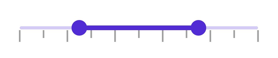
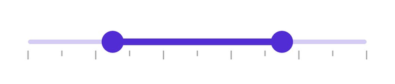

# Ticks in .NET MAUI DateTime Range Slider (SfDateTimeRangeSlider)

This section explains how to add major and minor ticks in the DateTime Range Slider.

## Show Major Ticks

Enable major ticks on the track to represent major interval points. The default value of the [`ShowTicks`](https://help.syncfusion.com/cr/maui/Syncfusion.Maui.Sliders.RangeView-1.html#Syncfusion_Maui_Sliders_RangeView_1_ShowTicks) property is `False`.

For example, with a [`Minimum`](https://help.syncfusion.com/cr/maui/Syncfusion.Maui.Sliders.RangeView-1.html#Syncfusion_Maui_Sliders_RangeView_1_Minimum) of `DateTime(2000, 01, 01)`, a [`Maximum`](https://help.syncfusion.com/cr/maui/Syncfusion.Maui.Sliders.RangeView-1.html#Syncfusion_Maui_Sliders_RangeView_1_Maximum) of `DateTime(2018, 01, 01)`, and an [`Interval`](https://help.syncfusion.com/cr/maui/Syncfusion.Maui.Sliders.RangeView-1.html#Syncfusion_Maui_Sliders_RangeView_1_Interval) of 1, the range slider will render major ticks at 2000, 2001, 2002, and so on.

### Without Interval





<sliders:SfDateTimeRangeSlider Minimum="2010-01-01" 
                               Maximum="2018-01-01" 
                               RangeStart="2012-01-01" 
                               RangeEnd="2016-01-01"
                               ShowTicks="True" />





SfDateTimeRangeSlider rangeSlider = new SfDateTimeRangeSlider();
rangeSlider.Minimum = new DateTime(2010, 01, 01);
rangeSlider.Maximum = new DateTime(2018, 01, 01);
rangeSlider.RangeStart = new DateTime(2012, 01, 01);
rangeSlider.RangeEnd = new DateTime(2016, 01, 01);
rangeSlider.ShowTicks = true;





### With Interval





<sliders:SfDateTimeRangeSlider Minimum="2010-01-01" 
                               Maximum="2020-01-01" 
                               RangeStart="2012-01-01" 
                               RangeEnd="2018-01-01"
                               Interval="2"
                               ShowTicks="True">
</sliders:SfDateTimeRangeSlider>





SfDateTimeRangeSlider rangeSlider = new SfDateTimeRangeSlider();
rangeSlider.Minimum = new DateTime(2010, 01, 01);
rangeSlider.Maximum = new DateTime(2020, 01, 01);
rangeSlider.RangeStart = new DateTime(2012, 01, 01);
rangeSlider.RangeEnd = new DateTime(2018, 01, 01);
rangeSlider.Interval = 2;
rangeSlider.ShowTicks = true;





## Show Minor Ticks

Minor ticks represent the number of smaller ticks between two major ticks. For example, with a [`Minimum`](https://help.syncfusion.com/cr/maui/Syncfusion.Maui.Sliders.RangeView-1.html#Syncfusion_Maui_Sliders_RangeView_1_Minimum) of `DateTime(2010, 01, 01)`, a [`Maximum`](https://help.syncfusion.com/cr/maui/Syncfusion.Maui.Sliders.RangeView-1.html#Syncfusion_Maui_Sliders_RangeView_1_Maximum) of `DateTime(2018, 01, 01)`, and an [`Interval`](https://help.syncfusion.com/cr/maui/Syncfusion.Maui.Sliders.RangeView-1.html#Syncfusion_Maui_Sliders_RangeView_1_Interval) of 1, the DateTime Range Slider will render major ticks at 2010, 2011, and so on. If [`MinorTicksPerInterval`](https://help.syncfusion.com/cr/maui/Syncfusion.Maui.Sliders.RangeView-1.html#Syncfusion_Maui_Sliders_RangeView_1_MinorTicksPerInterval) is 1, smaller ticks will appear between each major tick. The default value of `MinorTicksPerInterval` is `0`.

### Without Interval





<sliders:SfDateTimeRangeSlider Minimum="2010-01-01" 
                               Maximum="2018-01-01" 
                               RangeStart="2012-01-01" 
                               RangeEnd="2016-01-01"
                               MinorTicksPerInterval="3"
                               ShowTicks="True">
</sliders:SfDateTimeRangeSlider>





SfDateTimeRangeSlider rangeSlider = new SfDateTimeRangeSlider();
rangeSlider.Minimum = new DateTime(2010, 01, 01);
rangeSlider.Maximum = new DateTime(2018, 01, 01);
rangeSlider.RangeStart = new DateTime(2012, 01, 01);
rangeSlider.RangeEnd = new DateTime(2016, 01, 01);
rangeSlider.MinorTicksPerInterval = 3;
rangeSlider.ShowTicks = true;





### With Interval





<sliders:SfDateTimeRangeSlider Minimum="2010-01-01" 
                               Maximum="2020-01-01" 
                               RangeStart="2012-01-01" 
                               RangeEnd="2018-01-01"
                               Interval="2" 
                               MinorTicksPerInterval="1" 
                               ShowTicks="True">
</sliders:SfDateTimeRangeSlider>





SfDateTimeRangeSlider rangeSlider = new SfDateTimeRangeSlider();
rangeSlider.Minimum = new DateTime(2010, 01, 01);
rangeSlider.Maximum = new DateTime(2020, 01, 01);
rangeSlider.RangeStart = new DateTime(2012, 01, 01);
rangeSlider.RangeEnd = new DateTime(2018, 01, 01);
rangeSlider.Interval = 2;
rangeSlider.MinorTicksPerInterval = 1;
rangeSlider.ShowTicks = true;





## Major Ticks Color

Change the color of active and inactive major ticks using the [`ActiveFill`](https://help.syncfusion.com/cr/maui/Syncfusion.Maui.Sliders.SliderTickStyle.html#Syncfusion_Maui_Sliders_SliderTickStyle_ActiveFill) and [`InactiveFill`](https://help.syncfusion.com/cr/maui/Syncfusion.Maui.Sliders.SliderTickStyle.html#Syncfusion_Maui_Sliders_SliderTickStyle_InactiveFill) properties of the [`MajorTickStyle`](https://help.syncfusion.com/cr/maui/Syncfusion.Maui.Sliders.RangeView-1.html#Syncfusion_Maui_Sliders_RangeView_1_MajorTickStyle) class.

The active side of the DateTime Range Slider is between the start and end thumbs.

The inactive side of the DateTime Range Slider is between the [`Minimum`](https://help.syncfusion.com/cr/maui/Syncfusion.Maui.Sliders.RangeView-1.html#Syncfusion_Maui_Sliders_RangeView_1_Minimum) value and the left thumb, and the right thumb and the [`Maximum`](https://help.syncfusion.com/cr/maui/Syncfusion.Maui.Sliders.RangeView-1.html#Syncfusion_Maui_Sliders_RangeView_1_Maximum) value.





<sliders:SfDateTimeRangeSlider Minimum="2010-01-01" 
                               Maximum="2020-01-01" 
                               RangeStart="2012-01-01" 
                               RangeEnd="2018-01-01"
                               Interval="2"
                               ShowTicks="True">
    
    <sliders:SfDateTimeRangeSlider.MajorTickStyle>
         <sliders:SliderTickStyle ActiveFill="#EE3F3F" 
                                  InactiveFill="#F7B1AE" />
    </sliders:SfDateTimeRangeSlider.MajorTickStyle>

</sliders:SfDateTimeRangeSlider>





SfDateTimeRangeSlider rangeSlider = new SfDateTimeRangeSlider();
rangeSlider.Minimum = new DateTime(2010, 01, 01);
rangeSlider.Maximum = new DateTime(2020, 01, 01);
rangeSlider.RangeStart = new DateTime(2012, 01, 01);
rangeSlider.RangeEnd = new DateTime(2018, 01, 01);
rangeSlider.Interval = 2;
rangeSlider.ShowTicks = true;
rangeSlider.MajorTickStyle.ActiveFill = new SolidColorBrush(Color.FromArgb("#EE3F3F"));
rangeSlider.MajorTickStyle.InactiveFill = new SolidColorBrush(Color.FromArgb("#F7B1AE"));





## Minor Ticks Color

Customize the active and inactive minor ticks color using the [`ActiveFill`](https://help.syncfusion.com/cr/maui/Syncfusion.Maui.Sliders.SliderTickStyle.html#Syncfusion_Maui_Sliders_SliderTickStyle_ActiveFill) and [`InactiveFill`](https://help.syncfusion.com/cr/maui/Syncfusion.Maui.Sliders.SliderTickStyle.html#Syncfusion_Maui_Sliders_SliderTickStyle_InactiveFill) properties of the [`MinorTickStyle`](https://help.syncfusion.com/cr/maui/Syncfusion.Maui.Sliders.RangeView-1.html#Syncfusion_Maui_Sliders_RangeView_1_MinorTickStyle) class.

The active side of the DateTime Range Slider is between the start and end thumbs.

The inactive side of the DateTime Range Slider is between the [`Minimum`](https://help.syncfusion.com/cr/maui/Syncfusion.Maui.Sliders.RangeView-1.html#Syncfusion_Maui_Sliders_RangeView_1_Minimum) value and the left thumb, and the right thumb and the [`Maximum`](https://help.syncfusion.com/cr/maui/Syncfusion.Maui.Sliders.RangeView-1.html#Syncfusion_Maui_Sliders_RangeView_1_Maximum) value.





<sliders:SfDateTimeRangeSlider Minimum="2010-01-01" 
                               Maximum="2020-01-01" 
                               RangeStart="2012-01-01" 
                               RangeEnd="2018-01-01"
                               Interval="2" 
                               ShowTicks="True" 
                               MinorTicksPerInterval="1">
    
    <sliders:SfDateTimeRangeSlider.MinorTickStyle>
         <sliders:SliderTickStyle ActiveFill="#EE3F3F" 
                                  InactiveFill="#F7B1AE" />
     </sliders:SfDateTimeRangeSlider.MinorTickStyle>

</sliders:SfDateTimeRangeSlider>





SfDateTimeRangeSlider rangeSlider = new SfDateTimeRangeSlider();
rangeSlider.Minimum = new DateTime(2010, 01, 01);
rangeSlider.Maximum = new DateTime(2020, 01, 01);
rangeSlider.RangeStart = new DateTime(2012, 01, 01);
rangeSlider.RangeEnd = new DateTime(2018, 01, 01);
rangeSlider.Interval = 2;
rangeSlider.ShowTicks = true;
rangeSlider.MinorTicksPerInterval = 1;
rangeSlider.MinorTickStyle.ActiveFill = new SolidColorBrush(Color.FromArgb("#EE3F3F"));
rangeSlider.MinorTickStyle.InactiveFill = new SolidColorBrush(Color.FromArgb("#F7B1AE"));





## Ticks Size

Adjust the size of major and minor ticks using the [`ActiveSize`](https://help.syncfusion.com/cr/maui/Syncfusion.Maui.Sliders.SliderTickStyle.html#Syncfusion_Maui_Sliders_SliderTickStyle_ActiveSize) and [`InactiveSize`](https://help.syncfusion.com/cr/maui/Syncfusion.Maui.Sliders.SliderTickStyle.html#Syncfusion_Maui_Sliders_SliderTickStyle_InactiveSize) properties for both [`MajorTickStyle`](https://help.syncfusion.com/cr/maui/Syncfusion.Maui.Sliders.RangeView-1.html#Syncfusion_Maui_Sliders_RangeView_1_MajorTickStyle) and [`MinorTickStyle`](https://help.syncfusion.com/cr/maui/Syncfusion.Maui.Sliders.RangeView-1.html#Syncfusion_Maui_Sliders_RangeView_1_MinorTickStyle). The default value is `Size(2.0, 8.0)`.





<sliders:SfDateTimeRangeSlider Minimum="2010-01-01" 
                               Maximum="2018-01-01" 
                               RangeStart="2012-01-01" 
                               RangeEnd="2016-01-01"
                               Interval="2"
                               ShowTicks="True"
                               MinorTicksPerInterval="1">
    
    <sliders:SfDateTimeRangeSlider.MinorTickStyle>
       <sliders:SliderTickStyle ActiveSize="2,10" InactiveSize="2, 10" />
    </sliders:SfDateTimeRangeSlider.MinorTickStyle>
    
    <sliders:SfDateTimeRangeSlider.MajorTickStyle>
        <sliders:SliderTickStyle ActiveSize="2,15" InactiveSize="2, 15" />
    </sliders:SfDateTimeRangeSlider.MajorTickStyle>

</sliders:SfDateTimeRangeSlider>





SfDateTimeRangeSlider rangeSlider = new SfDateTimeRangeSlider();
rangeSlider.Minimum = new DateTime(2010, 01, 01);
rangeSlider.Maximum = new DateTime(2018, 01, 01);
rangeSlider.RangeStart = new DateTime(2012, 01, 01);
rangeSlider.RangeEnd = new DateTime(2016, 01, 01);
rangeSlider.Interval = 2;
rangeSlider.ShowTicks = true;
rangeSlider.MinorTicksPerInterval = 1;
rangeSlider.MinorTickStyle.ActiveSize = new Size(2, 10);
rangeSlider.MinorTickStyle.InactiveSize = new Size(2, 10);
rangeSlider.MajorTickStyle.ActiveSize = new Size(2, 15);
rangeSlider.MajorTickStyle.InactiveSize = new Size(2, 15);





## Ticks Offset

Adjust the space between the track and ticks using the [`Offset`](https://help.syncfusion.com/cr/maui/Syncfusion.Maui.Sliders.SliderTickStyle.html#Syncfusion_Maui_Sliders_SliderTickStyle_Offset) property of the [`MajorTickStyle`](https://help.syncfusion.com/cr/maui/Syncfusion.Maui.Sliders.RangeView-1.html#Syncfusion_Maui_Sliders_RangeView_1_MajorTickStyle) and [`MinorTickStyle`](https://help.syncfusion.com/cr/maui/Syncfusion.Maui.Sliders.RangeView-1.html#Syncfusion_Maui_Sliders_RangeView_1_MinorTickStyle). The default value is `3.0`.





<sliders:SfDateTimeRangeSlider Minimum="2010-01-01" 
                               Maximum="2018-01-01" 
                               RangeStart="2012-01-01" 
                               RangeEnd="2016-01-01"
                               Interval="2"
                               ShowTicks="True" 
                               MinorTicksPerInterval="1">
   
    <sliders:SfDateTimeRangeSlider.MinorTickStyle>
       <sliders:SliderTickStyle Offset="5" />
    </sliders:SfDateTimeRangeSlider.MinorTickStyle>
   
    <sliders:SfDateTimeRangeSlider.MajorTickStyle>
       <sliders:SliderTickStyle Offset="5" />
    </sliders:SfDateTimeRangeSlider.MajorTickStyle>
</sliders:SfDateTimeRangeSlider>





SfDateTimeRangeSlider rangeSlider = new SfDateTimeRangeSlider();
rangeSlider.Minimum = new DateTime(2010, 01, 01);
rangeSlider.Maximum = new DateTime(2018, 01, 01);
rangeSlider.RangeStart = new DateTime(2012, 01, 01);
rangeSlider.RangeEnd = new DateTime(2016, 01, 01);
rangeSlider.Interval = 2;
rangeSlider.ShowTicks = true;
rangeSlider.MinorTicksPerInterval = 1;
rangeSlider.MinorTickStyle.Offset = 5;
rangeSlider.MajorTickStyle.Offset = 5;





## Disabled Ticks

Disable the DateTime Range Slider by setting `false` to the `IsEnabled` property. Customize major and minor tick properties based on visual states using the Visual State Manager (VSM). The default states include enabled and disabled.





<ContentPage.Resources>
    
</ContentPage.Resources>

<ContentPage.Content>
    <VerticalStackLayout>
        <Label Text="Enabled"
               Padding="24,10" />
        <sliders:SfDateTimeRangeSlider />
        <Label Text="Disabled"
               Padding="24,10" />
        <sliders:SfDateTimeRangeSlider IsEnabled="False" />
    </VerticalStackLayout>
</ContentPage.Content>





VerticalStackLayout stackLayout = new VerticalStackLayout();
SfDateTimeRangeSlider defaultRangeSlider = new SfDateTimeRangeSlider()
{
    Minimum = new DateTime(2010, 01, 01),
    Maximum = new DateTime(2018, 01, 01),
    RangeStart = new DateTime(2012, 01, 01),
    RangeEnd = new DateTime(2016, 01, 01),
    Interval = 2,
    ShowTicks = true,
    MinorTicksPerInterval = 2
};
SfDateTimeRangeSlider disabledRangeSlider = new SfDateTimeRangeSlider()
{
    Minimum = new DateTime(2010, 01, 01),
    Maximum = new DateTime(2018, 01, 01),
    RangeStart = new DateTime(2012, 01, 01),
    RangeEnd = new DateTime(2016, 01, 01),
    IsEnabled = false,
    Interval = 2,
    ShowTicks = true,
    MinorTicksPerInterval = 2
};

VisualStateGroupList visualStateGroupList = new VisualStateGroupList();
VisualStateGroup commonStateGroup = new VisualStateGroup();
// Default State.
VisualState defaultState = new VisualState { Name = "Default" };
defaultState.Setters.Add(new Setter
{
    Property = SfDateTimeRangeSlider.MajorTickStyleProperty,
    Value = new SliderTickStyle
    {
        ActiveSize = new Size(3, 10),
        InactiveSize = new Size(3, 10),
        ActiveFill = Color.FromArgb("#EE3F3F"),
        InactiveFill = Color.FromArgb("#F7B1AE"),
    }
});
defaultState.Setters.Add(new Setter
{
    Property = SfDateTimeRangeSlider.MinorTickStyleProperty,
    Value = new SliderTickStyle
    {
        ActiveSize = new Size(3, 6),
        InactiveSize = new Size(3, 6),
        ActiveFill = Color.FromArgb("#EE3F3F"),
        InactiveFill = Color.FromArgb("#F7B1AE"),
    }
});
// Disabled State.
VisualState disabledState = new VisualState { Name = "Disabled" };
disabledState.Setters.Add(new Setter
{
    Property = SfDateTimeRangeSlider.MajorTickStyleProperty,
    Value = new SliderTickStyle
    {
        ActiveSize = new Size(3, 10),
        InactiveSize = new Size(3, 10),
        ActiveFill = Colors.Gray,
        InactiveFill = Colors.LightGray,
    }
});
disabledState.Setters.Add(new Setter
{
    Property = SfDateTimeRangeSlider.MinorTickStyleProperty,
    Value = new SliderTickStyle
    {
        ActiveSize = new Size(3, 6),
        InactiveSize = new Size(3, 6),
        ActiveFill = Colors.Gray,
        InactiveFill = Colors.LightGray,
    }
});
disabledState.Setters.Add(new Setter
{
    Property = SfDateTimeRangeSlider.ThumbStyleProperty,
    Value = new SliderThumbStyle
    {
        Fill = Colors.Gray,
    }
});
disabledState.Setters.Add(new Setter
{
    Property = SfDateTimeRangeSlider.TrackStyleProperty,
    Value = new SliderTrackStyle
    {
        ActiveFill = Colors.Gray,
        InactiveFill = Colors.LightGray,
    }
});

commonStateGroup.States.Add(defaultState);
commonStateGroup.States.Add(disabledState);
visualStateGroupList.Add(commonStateGroup);
VisualStateManager.SetVisualStateGroups(defaultRangeSlider, visualStateGroupList);
VisualStateManager.SetVisualStateGroups(disabledRangeSlider, visualStateGroupList);

stackLayout.Children.Add(new Label() { Text = "Enabled", Padding = new Thickness(24, 10) });
stackLayout.Children.Add(defaultRangeSlider);
stackLayout.Children.Add(new Label() { Text = "Disabled", Padding = new Thickness(24, 10) });
stackLayout.Children.Add(disabledRangeSlider);
this.Content = stackLayout;





