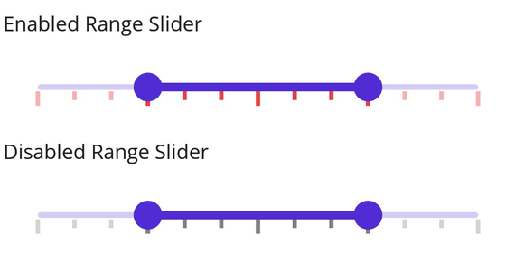

# Tick in .NET MAUI DateTime Range Slider (SfDateTimeRangeSlider)

This section helps to learn about how to add major and minor ticks in the date-time range slider.

## Show major ticks

You can enable the major ticks on the track. It is a shape which is used to represent the major interval points of the track. The default value of [`ShowTicks`](https://help.syncfusion.com/cr/maui/Syncfusion.Maui.Sliders.SliderBase.html#Syncfusion_Maui_Sliders_SliderBase_ShowTicks) property is `False`.

For example, if [`Minimum`](https://help.syncfusion.com/cr/maui/Syncfusion.Maui.Sliders.NumericRangeSliderBase.html#Syncfusion_Maui_Sliders_NumericRangeSliderBase_Minimum) is 0.0 and [`Maximum`](https://help.syncfusion.com/cr/maui/Syncfusion.Maui.Sliders.NumericRangeSliderBase.html#Syncfusion_Maui_Sliders_NumericRangeSliderBase_Maximum) is 10.0 and [`Interval`](https://help.syncfusion.com/cr/maui/Syncfusion.Maui.Sliders.SliderBase.html#Syncfusion_Maui_Sliders_SliderBase_Interval) is 2.0, the range slider will render the major ticks at 0.0, 2.0, 4.0 and so on.

### Without interval





<sliders:SfDateTimeRangeSlider Minimum="2010-01-01" 
                               Maximum="2018-01-01" 
                               RangeStart="2012-01-01" 
                               RangeEnd="2016-01-01"
                               ShowTicks="True" />





SfDateTimeRangeSlider rangeSlider = new SfDateTimeRangeSlider();
rangeSlider.Minimum = new DateTime(2010, 01, 01);
rangeSlider.Maximum = new DateTime(2018, 01, 01);
rangeSlider.RangeStart = new DateTime(2012, 01, 01);
rangeSlider.RangeEnd = new DateTime(2016, 01, 01);
rangeSlider.ShowTicks = true;





### With interval





<sliders:SfDateTimeRangeSlider Minimum="2010-01-01" 
                               Maximum="2018-01-01" 
                               RangeStart="2012-01-01" 
                               RangeEnd="2016-01-01"
                               Interval="2"
                               ShowTicks="True">
</sliders:SfDateTimeRangeSlider>





SfDateTimeRangeSlider rangeSlider = new SfDateTimeRangeSlider();
rangeSlider.Minimum = new DateTime(2010, 01, 01);
rangeSlider.Maximum = new DateTime(2018, 01, 01);
rangeSlider.RangeStart = new DateTime(2012, 01, 01);
rangeSlider.RangeEnd = new DateTime(2016, 01, 01);
rangeSlider.Interval = 2;
rangeSlider.ShowTicks = true;





## Show minor ticks

It is used to represent the number of smaller ticks between two major ticks. For example, if [`Minimum`](https://help.syncfusion.com/cr/maui/Syncfusion.Maui.Sliders.NumericRangeSliderBase.html#Syncfusion_Maui_Sliders_NumericRangeSliderBase_Minimum) is 0.0 and [`Maximum`](https://help.syncfusion.com/cr/maui/Syncfusion.Maui.Sliders.NumericRangeSliderBase.html#Syncfusion_Maui_Sliders_NumericRangeSliderBase_Maximum) is 10.0 and [`Interval`](https://help.syncfusion.com/cr/maui/Syncfusion.Maui.Sliders.SliderBase.html#Syncfusion_Maui_Sliders_SliderBase_Interval) is 2.0, the range slider will render the major ticks at 0.0, 2.0, 4.0 and so on. If [`MinorTicksPerInterval`](https://help.syncfusion.com/cr/maui/Syncfusion.Maui.Sliders.SliderBase.html#Syncfusion_Maui_Sliders_SliderBase_MinorTicksPerInterval) is 1, then smaller ticks will be rendered on 1.0 and 3.0 and so on. The default value of [`MinorTicksPerInterval`](https://help.syncfusion.com/cr/maui/Syncfusion.Maui.Sliders.SliderBase.html#Syncfusion_Maui_Sliders_SliderBase_MinorTicksPerInterval) property is Zero.

### Without interval





<sliders:SfDateTimeRangeSlider Minimum="2010-01-01" 
                               Maximum="2018-01-01" 
                               RangeStart="2012-01-01" 
                               RangeEnd="2016-01-01"
                               MinorTicksPerInterval="1"
                               ShowTicks="True">
</sliders:SfDateTimeRangeSlider>





SfDateTimeRangeSlider rangeSlider = new SfDateTimeRangeSlider();
rangeSlider.Minimum = new DateTime(2010, 01, 01);
rangeSlider.Maximum = new DateTime(2018, 01, 01);
rangeSlider.RangeStart = new DateTime(2012, 01, 01);
rangeSlider.RangeEnd = new DateTime(2016, 01, 01);
rangeSlider.MinorTicksPerInterval = 1;
rangeSlider.ShowTicks = true;





### With interval




<sliders:SfDateTimeRangeSlider Minimum="2010-01-01" 
                               Maximum="2018-01-01" 
                               RangeStart="2012-01-01" 
                               RangeEnd="2016-01-01"
                               Interval="2" 
                               MinorTicksPerInterval="1" 
                               ShowTicks="True">
</sliders:SfDateTimeRangeSlider>





SfDateTimeRangeSlider rangeSlider = new SfDateTimeRangeSlider();
rangeSlider.Minimum = new DateTime(2010, 01, 01);
rangeSlider.Maximum = new DateTime(2018, 01, 01);
rangeSlider.RangeStart = new DateTime(2012, 01, 01);
rangeSlider.RangeEnd = new DateTime(2016, 01, 01);
rangeSlider.Interval = 2;
rangeSlider.MinorTicksPerInterval = 1;
rangeSlider.ShowTicks = true;





## Major ticks color

You can change the active and inactive major ticks color of the range slider using the [`ActiveFill`](https://help.syncfusion.com/cr/maui/Syncfusion.Maui.Sliders.SliderTickStyle.html#Syncfusion_Maui_Sliders_SliderTickStyle_ActiveFill) and [`InactiveFill`](https://help.syncfusion.com/cr/maui/Syncfusion.Maui.Sliders.SliderTickStyle.html#Syncfusion_Maui_Sliders_SliderTickStyle_InactiveFill) properties of the [`MajorTickStyle`](https://help.syncfusion.com/cr/maui/Syncfusion.Maui.Sliders.SliderBase.html#Syncfusion_Maui_Sliders_SliderBase_MajorTickStyle) class.

The active side of the range slider is between start and end thumbs.

The inactive side of the range slider is between the [`Minimum`](https://help.syncfusion.com/cr/maui/Syncfusion.Maui.Sliders.SliderBase.html#Syncfusion_Maui_Sliders_SliderBase_Minimum) value and the left thumb, and the right thumb and the [`Maximum`](https://help.syncfusion.com/cr/maui/Syncfusion.Maui.Sliders.SliderBase.html#Syncfusion_Maui_Sliders_SliderBase_Maximum) value.





<sliders:SfDateTimeRangeSlider Minimum="2010-01-01" 
                               Maximum="2018-01-01" 
                               RangeStart="2012-01-01" 
                               RangeEnd="2016-01-01"
                               Interval="2"
                               ShowTicks="True">
    
    <sliders:SfDateTimeRangeSlider.MajorTickStyle>
         <sliders:SliderTickStyle ActiveFill="#EE3F3F" 
                                  InactiveFill="#F7B1AE" />
    </sliders:SfDateTimeRangeSlider.MajorTickStyle>

</sliders:SfDateTimeRangeSlider>





SfDateTimeRangeSlider rangeSlider = new SfDateTimeRangeSlider();
rangeSlider.Minimum = new DateTime(2010, 01, 01);
rangeSlider.Maximum = new DateTime(2018, 01, 01);
rangeSlider.RangeStart = new DateTime(2012, 01, 01);
rangeSlider.RangeEnd = new DateTime(2016, 01, 01);
rangeSlider.Interval = 2;
rangeSlider.ShowTicks = true;
rangeSlider.MajorTickStyle.ActiveFill = new SolidColorBrush(Color.FromArgb("#EE3F3F"));
rangeSlider.MajorTickStyle.InactiveFill = new SolidColorBrush(Color.FromArgb("#F7B1AE"));





## Minor ticks color

You can change the active and inactive minor ticks color of the range slider using the [`ActiveFill`](https://help.syncfusion.com/cr/maui/Syncfusion.Maui.Sliders.SliderTickStyle.html#Syncfusion_Maui_Sliders_SliderTickStyle_ActiveFill) and [`InactiveFill`](https://help.syncfusion.com/cr/maui/Syncfusion.Maui.Sliders.SliderTickStyle.html#Syncfusion_Maui_Sliders_SliderTickStyle_InactiveFill) properties of the [`MinorTickStyle`](https://help.syncfusion.com/cr/maui/Syncfusion.Maui.Sliders.SliderBase.html#Syncfusion_Maui_Sliders_SliderBase_MinorTickStyle) class.

The active side of the range slider is between start and end thumbs.

The inactive side of the range slider is between the [`Minimum`](https://help.syncfusion.com/cr/maui/Syncfusion.Maui.Sliders.SliderBase.html#Syncfusion_Maui_Sliders_SliderBase_Minimum) value and the left thumb, and the right thumb and the [`Maximum`](https://help.syncfusion.com/cr/maui/Syncfusion.Maui.Sliders.SliderBase.html#Syncfusion_Maui_Sliders_SliderBase_Maximum) value.





<sliders:SfDateTimeRangeSlider Minimum="2010-01-01" 
                               Maximum="2018-01-01" 
                               RangeStart="2012-01-01" 
                               RangeEnd="2016-01-01"
                               Interval="0.2" 
                               ShowTicks="True" 
                               MinorTicksPerInterval="1">
    
    <sliders:SfDateTimeRangeSlider.MinorTickStyle>
         <sliders:SliderTickStyle ActiveFill="#EE3F3F" 
                                  InactiveFill="#F7B1AE" />
     </sliders:SfDateTimeRangeSlider.MinorTickStyle>

</sliders:SfDateTimeRangeSlider>





SfDateTimeRangeSlider rangeSlider = new SfDateTimeRangeSlider();
rangeSlider.Minimum = new DateTime(2010, 01, 01);
rangeSlider.Maximum = new DateTime(2018, 01, 01);
rangeSlider.RangeStart = new DateTime(2012, 01, 01);
rangeSlider.RangeEnd = new DateTime(2016, 01, 01);
rangeSlider.Interval = 2;
rangeSlider.ShowTicks = true;
rangeSlider.MinorTicksPerInterval = 1;
rangeSlider.MinorTickStyle.ActiveFill = new SolidColorBrush(Color.FromArgb("#EE3F3F"));
rangeSlider.MinorTickStyle.InactiveFill = new SolidColorBrush(Color.FromArgb("#F7B1AE"));





## Ticks size

You can change the major and minor ticks size of the range slider using the [`ActiveSize`](https://help.syncfusion.com/cr/maui/Syncfusion.Maui.Sliders.SliderTickStyle.html#Syncfusion_Maui_Sliders_SliderTickStyle_ActiveSize) and [`InactiveSize`](https://help.syncfusion.com/cr/maui/Syncfusion.Maui.Sliders.SliderTickStyle.html#Syncfusion_Maui_Sliders_SliderTickStyle_InactiveSize) property of the [`MajorTickStyle`](https://help.syncfusion.com/cr/maui/Syncfusion.Maui.Sliders.SliderBase.html#Syncfusion_Maui_Sliders_SliderBase_MajorTickStyle) and [`MinorTickStyle`](https://help.syncfusion.com/cr/maui/Syncfusion.Maui.Sliders.SliderBase.html#Syncfusion_Maui_Sliders_SliderBase_MinorTickStyle)  classes. The default value is is `Size(2.0, 8.0)`.





<sliders:SfDateTimeRangeSlider Minimum="2010-01-01" 
                               Maximum="2018-01-01" 
                               RangeStart="2012-01-01" 
                               RangeEnd="2016-01-01"
                               Interval="2"
                               ShowTicks="True"
                               MinorTicksPerInterval="1">
    
    <sliders:SfDateTimeRangeSlider.MinorTickStyle>
       <sliders:SliderTickStyle ActiveSize="2,10" InactiveSize="2, 10" />
    </sliders:SfDateTimeRangeSlider.MinorTickStyle>
    
    <sliders:SfDateTimeRangeSlider.MajorTickStyle>
        <sliders:SliderTickStyle ActiveSize="2,15" InactiveSize="2, 15" />
    </sliders:SfDateTimeRangeSlider.MajorTickStyle>

</sliders:SfDateTimeRangeSlider>





SfDateTimeRangeSlider rangeSlider = new SfDateTimeRangeSlider();
rangeSlider.Minimum = new DateTime(2010, 01, 01);
rangeSlider.Maximum = new DateTime(2018, 01, 01);
rangeSlider.RangeStart = new DateTime(2012, 01, 01);
rangeSlider.RangeEnd = new DateTime(2016, 01, 01);
rangeSlider.Interval = 2;
rangeSlider.ShowTicks = true;
rangeSlider.MinorTicksPerInterval = 1;
rangeSlider.MinorTickStyle.ActiveSize = new Size(2, 10);
rangeSlider.MinorTickStyle.InactiveSize = new Size(2, 10);
rangeSlider.MajorTickStyle.ActiveSize = new Size(2, 15);
rangeSlider.MajorTickStyle.InactiveSize = new Size(2, 15);





## Ticks offset

You can adjust the space between track and ticks of the range slider using the [`Offset`](https://help.syncfusion.com/cr/maui/Syncfusion.Maui.Sliders.SliderTickStyle.html#Syncfusion_Maui_Sliders_SliderTickStyle_Offset) property of the [`MajorTickStyle`](https://help.syncfusion.com/cr/maui/Syncfusion.Maui.Sliders.SliderBase.html#Syncfusion_Maui_Sliders_SliderBase_MajorTickStyle) and [`MinorTickStyle`](https://help.syncfusion.com/cr/maui/Syncfusion.Maui.Sliders.SliderBase.html#Syncfusion_Maui_Sliders_SliderBase_MinorTickStyle) . The default value of the [`Offset`](https://help.syncfusion.com/cr/maui/Syncfusion.Maui.Sliders.SliderTickStyle.html#Syncfusion_Maui_Sliders_SliderTickStyle_Offset) property is `3.0`.





<sliders:SfDateTimeRangeSlider Minimum="2010-01-01" 
                               Maximum="2018-01-01" 
                               RangeStart="2012-01-01" 
                               RangeEnd="2016-01-01"
                               Interval="2"
                               ShowTicks="True" 
                               MinorTicksPerInterval="1">
   
    <sliders:SfDateTimeRangeSlider.MinorTickStyle>
       <sliders:SliderTickStyle Offset="5" />
    </sliders:SfDateTimeRangeSlider.MinorTickStyle>
   
    <sliders:SfDateTimeRangeSlider.MajorTickStyle>
       <sliders:SliderTickStyle Offset="5" />
    </sliders:SfDateTimeRangeSlider.MajorTickStyle>
</sliders:SfDateTimeRangeSlider>





SfDateTimeRangeSlider rangeSlider = new SfDateTimeRangeSlider();
rangeSlider.Minimum = new DateTime(2010, 01, 01);
rangeSlider.Maximum = new DateTime(2018, 01, 01);
rangeSlider.RangeStart = new DateTime(2012, 01, 01);
rangeSlider.RangeEnd = new DateTime(2016, 01, 01);
rangeSlider.Interval = 2;
rangeSlider.ShowTicks = true;
rangeSlider.MinorTicksPerInterval = 1;
rangeSlider.MinorTickStyle.Offset = 5;
rangeSlider.MajorTickStyle.Offset = 5;





## Disabled ticks

You can change the state of the range slider to disabled by setting `false` to the `IsEnabled` property. Using the Visual State Manager (VSM), you can customize the range slider’s major and minor tick properties based on the visual states. The applicable visual states are enabled(default) and disabled.





<ContentPage.Resources>
    
</ContentPage.Resources>

<ContentPage.Content>
    <VerticalStackLayout>
        <Label Text="Enabled Range Slider" Padding="0,10"/>
        <sliders:SfDateTimeRangeSlider/>
        <Label Text="Disabled Range Slider" Padding="0,10"/>
        <sliders:SfDateTimeRangeSlider IsEnabled="False"/>
    </VerticalStackLayout>
</ContentPage.Content>





VerticalStackLayout stackLayout = new VerticalStackLayout();
SfDateTimeRangeSlider defaultRangeSlider = new SfDateTimeRangeSlider { Interval = 0.25, ShowTicks = true, MinorTicksPerInterval = 2 };
SfDateTimeRangeSlider disabledRangeSlider = new SfDateTimeRangeSlider { IsEnabled = false, Interval = 0.25, ShowTicks = true, MinorTicksPerInterval = 2 };

VisualStateGroupList visualStateGroupList = new VisualStateGroupList();
VisualStateGroup commonStateGroup = new VisualStateGroup();
// Default State.
VisualState defaultState = new VisualState { Name = "Default" };
defaultState.Setters.Add(new Setter
{
    Property = SfDateTimeRangeSlider.MajorTickStyleProperty,
    Value = new SliderTickStyle
    {
        ActiveSize = new Size(3, 10),
        InactiveSize = new Size(3, 10),
        ActiveFill = Color.FromArgb("#EE3F3F"),
        InactiveFill = Color.FromArgb("#F7B1AE"),
    }
});
defaultState.Setters.Add(new Setter
{
    Property = SfDateTimeRangeSlider.MinorTickStyleProperty,
    Value = new SliderTickStyle
    {
        ActiveSize = new Size(3, 6),
        InactiveSize = new Size(3, 6),
        ActiveFill = Color.FromArgb("#EE3F3F"),
        InactiveFill = Color.FromArgb("#F7B1AE"),
    }
});
// Disabled State.
VisualState disabledState = new VisualState { Name = "Disabled" };
disabledState.Setters.Add(new Setter
{
    Property = SfDateTimeRangeSlider.MajorTickStyleProperty,
    Value = new SliderTickStyle
    {
        ActiveSize = new Size(3, 10),
        InactiveSize = new Size(3, 10),
        ActiveFill = Colors.Grey,
        InactiveFill = Colors.LightGrey,
    }
});
disabledState.Setters.Add(new Setter
{
    Property = SfDateTimeRangeSlider.MinorTickStyleProperty,
    Value = new SliderTickStyle
    {
        ActiveSize = new Size(3, 6),
        InactiveSize = new Size(3, 6),
        ActiveFill = Colors.Grey,
        InactiveFill = Colors.LightGrey,
    }
});

commonStateGroup.States.Add(defaultState);
commonStateGroup.States.Add(disabledState);
visualStateGroupList.Add(commonStateGroup);
VisualStateManager.SetVisualStateGroups(defaultRangeSlider, visualStateGroupList);
VisualStateManager.SetVisualStateGroups(disabledRangeSlider, visualStateGroupList);

stackLayout.Children.Add(new Label() { Text = "Default Range Slider", Padding = new Thickness(0, 10) });
stackLayout.Children.Add(defaultRangeSlider);
stackLayout.Children.Add(new Label() { Text = "Disabled Range Slider", Padding = new Thickness(0, 10) });
stackLayout.Children.Add(disabledRangeSlider);
this.Content = stackLayout;





