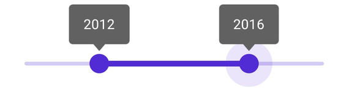

# Tooltip in .NET MAUI DateTime Range Slider (SfDateTimeRangeSlider)

This section helps to learn about how to add tooltip in the DateTime Range Slider.

## Enable tooltip

Enable the tooltip for the thumb by setting the [`Tooltip`](https://help.syncfusion.com/cr/maui/Syncfusion.Maui.Sliders.SliderBase.html#Syncfusion_Maui_Sliders_SliderBase_Tooltip) property to [`SliderTooltip`](https://help.syncfusion.com/cr/maui/Syncfusion.Maui.Sliders.SliderTooltip.html). It is used to clearly indicate the current selection of the value during the interaction. The default value of the [`Tooltip`](https://help.syncfusion.com/cr/maui/Syncfusion.Maui.Sliders.SliderBase.html#Syncfusion_Maui_Sliders_SliderBase_Tooltip) property is `null`.  





<sliders:SfDateTimeRangeSlider Minimum="2010-01-01" 
                               Maximum="2018-01-01" 
                               RangeStart="2012-01-01" 
                               RangeEnd="2016-01-01">
   
   <sliders:SfDateTimeRangeSlider.Tooltip>
      <sliders:SliderTooltip />
   </sliders:SfDateTimeRangeSlider.Tooltip>

</sliders:SfDateTimeRangeSlider>





SfDateTimeRangeSlider rangeSlider = new SfDateTimeRangeSlider();
rangeSlider.Minimum = new DateTime(2010, 01, 01);
rangeSlider.Maximum = new DateTime(2018, 01, 01);
rangeSlider.RangeStart = new DateTime(2012, 01, 01);
rangeSlider.RangeEnd = new DateTime(2016, 01, 01);
rangeSlider.Tooltip = new SliderTooltip();





## Show always

Always shows a tooltip with and without the thumb interaction by setting the [`SliderTooltip.ShowAlways`](https://help.syncfusion.com/cr/maui/Syncfusion.Maui.Sliders.SliderTooltip.html#Syncfusion_Maui_Sliders_SliderTooltip_ShowAlways) property. The default value of the [`SliderTooltip.ShowAlways`](https://help.syncfusion.com/cr/maui/Syncfusion.Maui.Sliders.SliderTooltip.html#Syncfusion_Maui_Sliders_SliderTooltip_ShowAlways) property is `False`.





<sliders:SfDateTimeRangeSlider Minimum="2010-01-01" 
                               Maximum="2018-01-01" 
                               RangeStart="2012-01-01" 
                               RangeEnd="2016-01-01">
   
   <sliders:SfDateTimeRangeSlider.Tooltip>
      <sliders:SliderTooltip ShowAlways="True" />
   </sliders:SfDateTimeRangeSlider.Tooltip>

</sliders:SfDateTimeRangeSlider>





SfDateTimeRangeSlider rangeSlider = new SfDateTimeRangeSlider();
rangeSlider.Minimum = new DateTime(2010, 01, 01);
rangeSlider.Maximum = new DateTime(2018, 01, 01);
rangeSlider.RangeStart = new DateTime(2012, 01, 01);
rangeSlider.RangeEnd = new DateTime(2016, 01, 01);
rangeSlider.Tooltip = new SliderTooltip();
rangeSlider.Tooltip.ShowAlways = true;





N> Refer [here](https://help.syncfusion.com/maui/datetime-range-slider/events-and-commands#tooltip-text-format) to customize the tooltip text format through DateTime Range Slider events.

## Tooltip label style

Change the appearance of the tooltip using the [`Fill`](https://help.syncfusion.com/cr/maui/Syncfusion.Maui.Sliders.SliderTooltip.html#Syncfusion_Maui_Sliders_SliderTooltip_Fill), [`Stroke`](https://help.syncfusion.com/cr/maui/Syncfusion.Maui.Sliders.SliderTooltip.html#Syncfusion_Maui_Sliders_SliderTooltip_Stroke), [`StrokeThickness`](https://help.syncfusion.com/cr/maui/Syncfusion.Maui.Sliders.SliderTooltip.html#Syncfusion_Maui_Sliders_SliderTooltip_StrokeThickness), and [`Position`](https://help.syncfusion.com/cr/maui/Syncfusion.Maui.Sliders.SliderTooltip.html#Syncfusion_Maui_Sliders_SliderTooltip_Position) properties. Also, customize the tooltip text using the [`TextColor`](https://help.syncfusion.com/cr/maui/Syncfusion.Maui.Sliders.SliderTooltip.html#Syncfusion_Maui_Sliders_SliderTooltip_TextColor), [`FontSize`](https://help.syncfusion.com/cr/maui/Syncfusion.Maui.Sliders.SliderTooltip.html#Syncfusion_Maui_Sliders_SliderTooltip_FontSize), [`FontAttributes`](https://help.syncfusion.com/cr/maui/Syncfusion.Maui.Sliders.SliderTooltip.html#Syncfusion_Maui_Sliders_SliderTooltip_FontAttributes), [`FontFamily`](https://help.syncfusion.com/cr/maui/Syncfusion.Maui.Sliders.SliderTooltip.html#Syncfusion_Maui_Sliders_SliderTooltip_FontFamily), [`Padding`](https://help.syncfusion.com/cr/maui/Syncfusion.Maui.Sliders.SliderTooltip.html#Syncfusion_Maui_Sliders_SliderTooltip_Padding), and [`DateFormat`](https://help.syncfusion.com/cr/maui/Syncfusion.Maui.Sliders.SliderTooltip.html#Syncfusion_Maui_Sliders_SliderTooltip_DateFormat) properties of the [`SliderTooltip`](https://help.syncfusion.com/cr/maui/Syncfusion.Maui.Sliders.SliderTooltip.html) class.





<sliders:SfDateTimeRangeSlider Minimum="2010-01-01" 
                               Maximum="2018-01-01" 
                               RangeStart="2012-01-01" 
                               RangeEnd="2016-01-01">
    
    <sliders:SfDateTimeRangeSlider.Tooltip>
       <sliders:SliderTooltip Fill="#F7B1AE" 
                              Stroke="#EE3F3F" 
                              StrokeThickness="2" />
    </sliders:SfDateTimeRangeSlider.Tooltip>
 
 </sliders:SfDateTimeRangeSlider>





SfDateTimeRangeSlider rangeSlider = new SfDateTimeRangeSlider();
rangeSlider.Minimum = new DateTime(2010, 01, 01);
rangeSlider.Maximum = new DateTime(2018, 01, 01);
rangeSlider.RangeStart = new DateTime(2012, 01, 01);
rangeSlider.RangeEnd = new DateTime(2016, 01, 01);
 rangeSlider.Tooltip.Fill = new SolidColorBrush(Color.FromArgb("#F7B1AE"));
 rangeSlider.Tooltip.Stroke = new SolidColorBrush(Color.FromArgb("#EE3F3F"));
 rangeSlider.Tooltip.StrokeThickness = 2;





