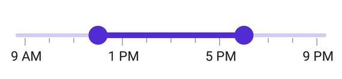

# Track in .NET MAUI DateTime Range Slider (SfDateTimeRangeSlider)

This section helps to learn about how to customize the track in the DateTime Range Slider.

## Track color

Change the active and inactive track color of the DateTime range slider using the [`ActiveFill`](https://help.syncfusion.com/cr/maui/Syncfusion.Maui.Sliders.SliderTrackStyle.html#Syncfusion_Maui_Sliders_SliderTrackStyle_ActiveFill) and [`InactiveFill`](https://help.syncfusion.com/cr/maui/Syncfusion.Maui.Sliders.SliderTrackStyle.html#Syncfusion_Maui_Sliders_SliderTrackStyle_InactiveFill) properties of the [`TrackStyle`](https://help.syncfusion.com/cr/maui/Syncfusion.Maui.Sliders.SliderBase.html#Syncfusion_Maui_Sliders_SliderBase_TrackStyle) class.

The active side of the DateTime Range Slider is between the start and end thumbs.

The inactive side of the DateTime Range Slider is between the [`Minimum`](https://help.syncfusion.com/cr/maui/Syncfusion.Maui.Sliders.NumericRangeSliderBase.html#Syncfusion_Maui_Sliders_NumericRangeSliderBase_Minimum) value and the left thumb and the right thumb and the [`Maximum`](https://help.syncfusion.com/cr/maui/Syncfusion.Maui.Sliders.NumericRangeSliderBase.html#Syncfusion_Maui_Sliders_NumericRangeSliderBase_Maximum) value.





<sliders:SfDateTimeRangeSlider Minimum="2010-01-01" 
                               Maximum="2018-01-01" 
                               RangeStart="2012-01-01" 
                               RangeEnd="2016-01-01">
  
  <sliders:SfDateTimeRangeSlider.TrackStyle>
      <sliders:SliderTrackStyle ActiveFill="#EE3F3F" InactiveFill="#F7B1AE" />
  </sliders:SfDateTimeRangeSlider.TrackStyle>

</sliders:SfDateTimeRangeSlider>





SfDateTimeRangeSlider rangeSlider = new SfDateTimeRangeSlider();
rangeSlider.Minimum = new DateTime(2010, 01, 01);
rangeSlider.Maximum = new DateTime(2018, 01, 01);
rangeSlider.RangeStart = new DateTime(2012, 01, 01);
rangeSlider.RangeEnd = new DateTime(2016, 01, 01);
rangeSlider.TrackStyle.ActiveFill = new SolidColorBrush(Color.FromArgb("#EE3F3F"));
rangeSlider.TrackStyle.InactiveFill = new SolidColorBrush(Color.FromArgb("#F7B1AE"));





## Track height

Change the active and inactive track height using the [`ActiveSize`](https://help.syncfusion.com/cr/maui/Syncfusion.Maui.Sliders.SliderTrackStyle.html#Syncfusion_Maui_Sliders_SliderTrackStyle_ActiveSize) and [`InactiveSize`](https://help.syncfusion.com/cr/maui/Syncfusion.Maui.Sliders.SliderTrackStyle.html#Syncfusion_Maui_Sliders_SliderTrackStyle_InactiveSize) properties of the [`TrackStyle`](https://help.syncfusion.com/cr/maui/Syncfusion.Maui.Sliders.SliderBase.html#Syncfusion_Maui_Sliders_SliderBase_TrackStyle) class. The default value of the [`ActiveSize`](https://help.syncfusion.com/cr/maui/Syncfusion.Maui.Sliders.SliderTrackStyle.html#Syncfusion_Maui_Sliders_SliderTrackStyle_ActiveSize) and the [`InactiveSize`](https://help.syncfusion.com/cr/maui/Syncfusion.Maui.Sliders.SliderTrackStyle.html#Syncfusion_Maui_Sliders_SliderTrackStyle_InactiveSize) properties are `8.0` and `6.0` respectively.





<sliders:SfDateTimeRangeSlider Minimum="2010-01-01" 
                               Maximum="2018-01-01" 
                               RangeStart="2012-01-01" 
                               RangeEnd="2016-01-01">
   
   <sliders:SfDateTimeRangeSlider.TrackStyle>
      <sliders:SliderTrackStyle ActiveSize="10" InactiveSize="8" />
   </sliders:SfDateTimeRangeSlider.TrackStyle>

</sliders:SfDateTimeRangeSlider>





SfDateTimeRangeSlider rangeSlider = new SfDateTimeRangeSlider();
rangeSlider.Minimum = new DateTime(2010, 01, 01);
rangeSlider.Maximum = new DateTime(2018, 01, 01);
rangeSlider.RangeStart = new DateTime(2012, 01, 01);
rangeSlider.RangeEnd = new DateTime(2016, 01, 01);
rangeSlider.TrackStyle.ActiveSize = 10;
rangeSlider.TrackStyle.InactiveSize = 8;





## Track extent

You can extend the track at the edges using the [`TrackExtent`](https://help.syncfusion.com/cr/maui/Syncfusion.Maui.Sliders.SliderBase.html#Syncfusion_Maui_Sliders_SliderBase_TrackExtent) property. The default value is `0`, and it should be in pixels.





<sliders:SfDateTimeRangeSlider Minimum="2000-01-01T09:00:00"
                               Maximum="2000-01-01T21:00:00"
                               RangeStart="2000-01-01T12:00:00"
                               RangeEnd="2000-01-01T18:00:00"
                               IntervalType="Hours"
                               DateFormat="h tt"
                               MinorTicksPerInterval="3"
                               Interval="4"
                               ShowTicks="True"
                               ShowLabels="True"
                               TrackExtent="10" />





SfDateTimeSlider rangeSlider = new SfDateTimeSlider();
rangeSlider.Minimum = new DateTime(2000, 01, 01, 09, 00, 00);
rangeSlider.Maximum = new DateTime(2019, 01, 01, 21, 00, 00);
rangeSlider.RangeStart = new DateTime(2000, 01, 01, 12, 00, 00);
rangeSlider.RangeEnd = new DateTime(2000, 01, 01, 18, 00, 00);
rangeSlider.Interval = 4;
rangeSlider.MinorTicksPerInterval = 3;
rangeSlider.IntervalType = SliderDateIntervalType.Hours;
rangeSlider.DateFormat = "h tt";
rangeSlider.ShowLabels = true;
rangeSlider.ShowTicks = true;
rangeSlider.TrackExtent = 10;





## Disabled track

Change the state of the DateTime Range Slider to disabled by setting `false` to the `IsEnabled` property. Using the Visual State Manager (VSM), customize the range slider track properties based on the visual states. The applicable visual states are enabled(default) and disabled.





<ContentPage.Resources>
    
</ContentPage.Resources>

<ContentPage.Content>
    <VerticalStackLayout>
        <Label Text="Enabled Range Slider" Padding="0,10"/>
        <sliders:SfDateTimeRangeSlider />
        <Label Text="Disabled Range Slider" Padding="0,10"/>
        <sliders:SfDateTimeRangeSlider IsEnabled="False"/>
    </VerticalStackLayout>
</ContentPage.Content>





VerticalStackLayout stackLayout = new VerticalStackLayout();
SfDateTimeRangeSlider defaultRangeSlider = new SfDateTimeRangeSlider()
{
    Minimum = new DateTime(2010, 01, 01),
    Maximum = new DateTime(2018, 01, 01),
    RangeStart = new DateTime(2012, 01, 01),
    RangeEnd = new DateTime(2016, 01, 01),
};
SfDateTimeRangeSlider disabledRangeSlider = new SfDateTimeRangeSlider()
{
    Minimum = new DateTime(2010, 01, 01),
    Maximum = new DateTime(2018, 01, 01),
    RangeStart = new DateTime(2012, 01, 01),
    RangeEnd = new DateTime(2016, 01, 01),
    IsEnabled = false, 
};

VisualStateGroupList visualStateGroupList = new VisualStateGroupList();
VisualStateGroup commonStateGroup = new VisualStateGroup();
// Default State.
VisualState defaultState = new VisualState { Name = "Default" };
defaultState.Setters.Add(new Setter
{
    Property = SfDateTimeRangeSlider.TrackStyleProperty,
    Value = new SliderTrackStyle
    {
        ActiveFill = Color.FromArgb("#EE3F3F"),
        InactiveFill = Color.FromArgb("#F7B1AE"),
        ActiveSize = 8,
        InactiveSize = 6,
    }
});
// Disabled State.
VisualState disabledState = new VisualState { Name = "Disabled" };
disabledState.Setters.Add(new Setter
{
    Property = SfDateTimeRangeSlider.TrackStyleProperty,
    Value = new SliderTrackStyle
    {
        ActiveFill = Colors.Gray,
        InactiveFill = Colors.LightGray,
        ActiveSize = 10,
        InactiveSize = 8,
    }
});

commonStateGroup.States.Add(defaultState);
commonStateGroup.States.Add(disabledState);
visualStateGroupList.Add(commonStateGroup);
VisualStateManager.SetVisualStateGroups(defaultRangeSlider, visualStateGroupList);
VisualStateManager.SetVisualStateGroups(disabledRangeSlider, visualStateGroupList);

stackLayout.Children.Add(new Label() { Text = "Default Range Slider", Padding = new Thickness(0, 10) });
stackLayout.Children.Add(defaultRangeSlider);
stackLayout.Children.Add(new Label() { Text = "Disabled Range Slider", Padding = new Thickness(0, 10) });
stackLayout.Children.Add(disabledRangeSlider);
this.Content = stackLayout;





