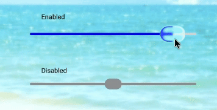

# Liquid Glass Effect in .NET MAUI DateTime Slider (SfDateTimeSlider)

The Liquid Glass Effect introduces a modern, translucent design with adaptive color tinting and light refraction, creating a sleek, glass like user experience that remains clear and accessible. This section explains how to enable and customize the effect in the Syncfusion® .NET MAUI DateTime Slider (SfDateTimeSlider) control.

## Apply liquid glass effect

Follow these steps to enable and configure the Liquid Glass Effect in the DateTime Slider control:

### Step 1: Enable the liquid glass effect on DateTime Slider

Set the `EnableLiquidGlassEffect` property to `true` in the `SfDateTimeSlider` control to apply the Liquid Glass Effect. When enabled,it provides responsive interaction for a smooth and engaging user experience.

The following code snippet demonstrates how to apply the Liquid Glass Effect to the `SfDateTimeSlider` control:



    <Grid>
        <Image Source="Wallpaper.png" Aspect="AspectFill">
            <sliders:SfDateTimeSlider
                Minimum="2010-01-01" 
                Maximum="2018-01-01" 
                EnableLiquidGlassEffect="True" />
    </Grid>



using Syncfusion.Maui.Sliders;
var grid = new Grid
{
    BackgroundColor = Colors.Transparent
};

var image = new Image
{
    Source = "Wallpaper.png",
    Aspect = Aspect.AspectFill
};
grid.Children.Add(image);

SfDateTimeSlider dateTimeSlider = new SfDateTimeSlider
{
    Minimun = new DateTime(2010, 01, 01),
    Maximum = new DateTime(2018, 01, 01),
    EnableLiquidGlassEffect = true
};

grid.Children.Add(dateTimeSlider);
this.Content = grid;




The following screenshot illustrates SfDateTimeSlider with the glass effect visible on the thumb while it is pressed.

N>
This feature is supported only on .NET 10 along with iOS 26 and macOS 26 