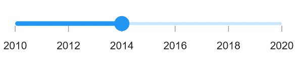

# Basic features  in .NET MAUI DateTime Slider (SfDateTimeSlider)

This section explains about how to add the date-time slider.

## Minimum

The minimum value that the user can select. The default value of [`Minimum`](https://help.syncfusion.com/cr/maui/Syncfusion.Maui.Sliders.IDateTimeElement.html#Syncfusion_Maui_Sliders_IDateTimeElement_Minimum) property is `null`. 
The [`Minimum`](https://help.syncfusion.com/cr/maui/Syncfusion.Maui.Sliders.IDateTimeElement.html#Syncfusion_Maui_Sliders_IDateTimeElement_Minimum) must be less than the [`Maximum`](https://help.syncfusion.com/cr/maui/Syncfusion.Maui.Sliders.IDateTimeElement.html#Syncfusion_Maui_Sliders_IDateTimeElement_Maximum) value.

## Maximum

The maximum value that the user can select. The default value of [`Maximum`](https://help.syncfusion.com/cr/maui/Syncfusion.Maui.Sliders.IDateTimeElement.html#Syncfusion_Maui_Sliders_IDateTimeElement_Maximum) property is `null`.
The [`Maximum`](https://help.syncfusion.com/cr/maui/Syncfusion.Maui.Sliders.IDateTimeElement.html#Syncfusion_Maui_Sliders_IDateTimeElement_Maximum) value must be greater than the [`Minimum`](https://help.syncfusion.com/cr/maui/Syncfusion.Maui.Sliders.SfSlider.html#Syncfusion_Maui_Sliders_SfSlider_Maximum) value.

## Value

It represents the value currently selected in the date-time slider. The slider's thumb is drawn corresponding to this value.

It does not have auto interval support. So, it is mandatory to set [`Interval`](https://help.syncfusion.com/cr/maui/Syncfusion.Maui.Sliders.SliderBase.html?tabs=tabid-1#Syncfusion_Maui_Sliders_SliderBase_Interval), [`IntervalType`](https://help.syncfusion.com/cr/maui/Syncfusion.Maui.Sliders.SfDateTimeSlider.html#Syncfusion_Maui_Sliders_SfDateTimeSlider_IntervalType), and [`DateFormat`](https://help.syncfusion.com/cr/maui/Syncfusion.Maui.Sliders.SfDateTimeSlider.html#Syncfusion_Maui_Sliders_SfDateTimeSlider_DateFormat) for date values.





<sliders:SfDateTimeSlider Minimum="2010-01-01"
                          Maximum="2020-01-01"
                          Value="2014-01-01"
                          ShowTicks="True"
                          ShowLabels="True" />





SfDateTimeSlider slider = new SfDateTimeSlider();
slider.Minimum = new DateTime(2010, 01, 01);
slider.Maximum = new DateTime(2020, 01, 01);
slider.Value = new DateTime(2014, 01, 01);
slider.ShowTicks = true;
slider.ShowLabels = true;





