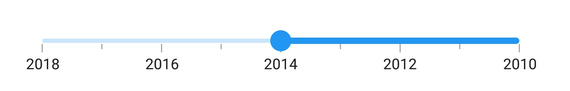
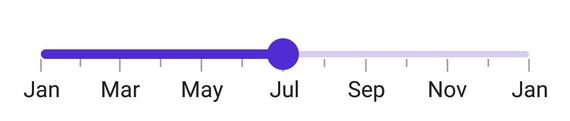

# Customization in .NET MAUI DateTime Slider (SfDateTimeSlider)

## Inverse the slider

Invert the slider using the [IsInversed](https://help.syncfusion.com/cr/maui/Syncfusion.Maui.Sliders.RangeView-1.html#Syncfusion_Maui_Sliders_RangeView_1_IsInversed) property. The default value of the [IsInversed](https://help.syncfusion.com/cr/maui/Syncfusion.Maui.Sliders.RangeView-1.html#Syncfusion_Maui_Sliders_RangeView_1_IsInversed) property is **False**.





<sliders:SfDateTimeSlider Minimum="2010-01-01"
                          Maximum="2018-01-01"
                          Value="2014-01-01"
                          IsInversed="True"
                          ShowLabels="True"
                          ShowTicks="True"
                          Interval="2"
                          MinorTicksPerInterval="1" />





SfDateTimeSlider slider = new SfDateTimeSlider();
slider.Minimum = new DateTime(2010, 01, 01);
slider.Maximum = new DateTime(2018, 01, 01);
slider.Value = new DateTime(2014, 01, 01);
slider.IsInversed = true;
slider.ShowLabels = true;
slider.Interval = 2;
slider.ShowTicks = true;
slider.MinorTicksPerInterval = 1;





## Formatting labels

Add prefix or suffix to the labels using the [DateFormat](https://help.syncfusion.com/cr/maui/Syncfusion.Maui.Sliders.SfDateTimeSlider.html#Syncfusion_Maui_Sliders_SfDateTimeSlider_DateFormat) property.





<sliders:SfDateTimeSlider Minimum="2010-01-01"
                          Maximum="2011-01-01"
                          Value="2010-07-01"
                          DateFormat="MMM"
                          IntervalType="Months"
                          ShowTicks="True"
                          MinorTicksPerInterval="1"
                          ShowLabels="True"
                          Interval="2" />





SfDateTimeSlider slider = new SfDateTimeSlider()
{
    Minimum = new DateTime(2010, 01, 01),
    Maximum = new DateTime(2011, 01, 01),
    Value = new DateTime(2010, 07, 01),
    Interval = 2,
    ShowLabels = true,
    ShowTicks = true,
    MinorTicksPerInterval = 1,
    DateFormat = "MMM",
    IntervalType = SliderDateIntervalType.Months,
};





