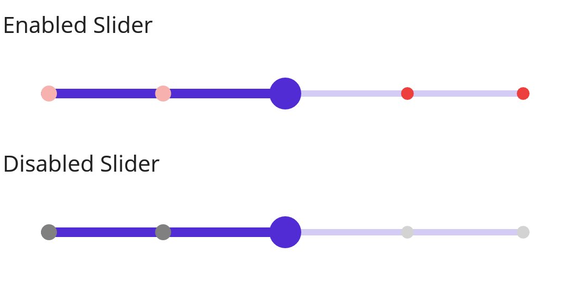

# Dividers in .NET MAUI DateTime Slider (SfDateTimeSlider)

This section explains how to add dividers to the DateTime Slider.

## Show Dividers

The [`ShowDividers`](https://help.syncfusion.com/cr/maui/Syncfusion.Maui.Sliders.RangeView-1.html#Syncfusion_Maui_Sliders_RangeView_1_ShowDividers) property renders dividers on the track, used to represent major interval points. The default value is `False`.
For instance, if [`Minimum`](https://help.syncfusion.com/cr/maui/Syncfusion.Maui.Sliders.RangeView-1.html#Syncfusion_Maui_Sliders_RangeView_1_Minimum) is `DateTime(2010, 01, 01)`, [`Maximum`](https://help.syncfusion.com/cr/maui/Syncfusion.Maui.Sliders.RangeView-1.html#Syncfusion_Maui_Sliders_RangeView_1_Maximum) is `DateTime(2018, 01, 01)`, and [`Interval`](https://help.syncfusion.com/cr/maui/Syncfusion.Maui.Sliders.RangeView-1.html#Syncfusion_Maui_Sliders_RangeView_1_Interval) is `2.0`, the DateTime Slider will show dividers at 2010, 2012, 2014, etc.





<sliders:SfDateTimeSlider Minimum="2010-01-01"
                          Maximum="2018-01-01"
                          Value="2014-01-01"
                          Interval="2"
                          ShowDividers="True" />





SfDateTimeSlider slider = new SfDateTimeSlider()
{
    Minimum = new DateTime(2010, 01, 01),
    Maximum = new DateTime(2018, 01, 01),
    Value = new DateTime(2014, 01, 01),
    Interval = 2,
    ShowDividers = true,
};





## Divider Radius

Change the divider radius using the [`ActiveRadius`](https://help.syncfusion.com/cr/maui/Syncfusion.Maui.Sliders.SliderDividerStyle.html#Syncfusion_Maui_Sliders_SliderDividerStyle_ActiveRadius) and the [`InactiveRadius`](https://help.syncfusion.com/cr/maui/Syncfusion.Maui.Sliders.SliderDividerStyle.html#Syncfusion_Maui_Sliders_SliderDividerStyle_InactiveRadius) properties of the [`DividerStyle`](https://help.syncfusion.com/cr/maui/Syncfusion.Maui.Sliders.SliderDividerStyle.html) class.





<sliders:SfDateTimeSlider Minimum="2010-01-01"
                          Maximum="2020-01-01"
                          Value="2015-01-01"
                          Interval="2"
                          ShowDividers="True">

    <sliders:SfDateTimeSlider.DividerStyle>
        <sliders:SliderDividerStyle ActiveRadius="3"
                                    InactiveRadius="7" />
    </sliders:SfDateTimeSlider.DividerStyle>

</sliders:SfDateTimeSlider>





SfDateTimeSlider slider = new SfDateTimeSlider()
{
    Minimum = new DateTime(2010, 01, 01),
    Maximum = new DateTime(2020, 01, 01),
    Value = new DateTime(2015, 01, 01),
    Interval = 2,
    ShowDividers = true,
};
slider.DividerStyle.ActiveRadius = 3;
slider.DividerStyle.InactiveRadius = 7;





## Divider Color

Modify the divider color using the [`ActiveFill`](https://help.syncfusion.com/cr/maui/Syncfusion.Maui.Sliders.SliderDividerStyle.html#Syncfusion_Maui_Sliders_SliderDividerStyle_ActiveFill) and [`InactiveFill`](https://help.syncfusion.com/cr/maui/Syncfusion.Maui.Sliders.SliderDividerStyle.html#Syncfusion_Maui_Sliders_SliderDividerStyle_InactiveFill) properties.





<sliders:SfDateTimeSlider Minimum="2010-01-01"
                          Maximum="2018-01-01"
                          Value="2014-01-01"
                          Interval="2"
                          ShowDividers="True">

    <sliders:SfDateTimeSlider.DividerStyle>
       <sliders:SliderDividerStyle ActiveRadius="7" 
                                   InactiveRadius="7" 
				                   ActiveFill="#EE3F3F" 
				                   InactiveFill="#F7B1AE"/>
      </sliders:SfDateTimeSlider.DividerStyle>

</sliders:SfDateTimeSlider>





SfDateTimeSlider slider = new SfDateTimeSlider()
{
    Minimum = new DateTime(2010, 01, 01),
    Maximum = new DateTime(2018, 01, 01),
    Value = new DateTime(2014, 01, 01),
    Interval = 2,
    ShowDividers = true,
};
slider.DividerStyle.ActiveRadius = 7;
slider.DividerStyle.InactiveRadius = 7;
slider.DividerStyle.ActiveFill = new SolidColorBrush(Color.FromArgb("#EE3F3F"));
slider.DividerStyle.InactiveFill = new SolidColorBrush(Color.FromArgb("#F7B1AE"));





## Divider Stroke Width and Color

Adjust the divider stroke width using the [`ActiveStrokeThickness`](https://help.syncfusion.com/cr/maui/Syncfusion.Maui.Sliders.SliderDividerStyle.html#Syncfusion_Maui_Sliders_SliderDividerStyle_ActiveStrokeThickness) and [`InactiveStrokeThickness`](https://help.syncfusion.com/cr/maui/Syncfusion.Maui.Sliders.SliderDividerStyle.html#Syncfusion_Maui_Sliders_SliderDividerStyle_InactiveStrokeThickness) properties.

Also, modify the divider stroke color using the [`ActiveStroke`](https://help.syncfusion.com/cr/maui/Syncfusion.Maui.Sliders.SliderDividerStyle.html#Syncfusion_Maui_Sliders_SliderDividerStyle_ActiveStroke) and [`InactiveStroke`](https://help.syncfusion.com/cr/maui/Syncfusion.Maui.Sliders.SliderDividerStyle.html#Syncfusion_Maui_Sliders_SliderDividerStyle_InactiveStroke) properties.





<sliders:SfDateTimeSlider Minimum="2010-01-01"
                          Maximum="2018-01-01"
                          Value="2014-01-01"
                          Interval="2"
                          ShowDividers="True">

    <sliders:SfDateTimeSlider.DividerStyle>
        <sliders:SliderDividerStyle ActiveRadius="7"
                                    InactiveRadius="7"
                                    ActiveFill="#EE3F3F"
                                    InactiveFill="#F7B1AE"
                                    ActiveStrokeThickness="2"
                                    InactiveStrokeThickness="2"
                                    ActiveStroke="#FFD700"
                                    InactiveStroke="#FFD700" />
    </sliders:SfDateTimeSlider.DividerStyle>

</sliders:SfDateTimeSlider>





SfDateTimeSlider slider = new SfDateTimeSlider()
{
    Minimum = new DateTime(2010, 01, 01),
    Maximum = new DateTime(2018, 01, 01),
    Value = new DateTime(2014, 01, 01),
    Interval = 2,
    ShowDividers = true,
};
slider.DividerStyle.ActiveRadius = 7;
slider.DividerStyle.InactiveRadius = 7;
slider.DividerStyle.ActiveFill = new SolidColorBrush(Color.FromArgb("#EE3F3F"));
slider.DividerStyle.InactiveFill = new SolidColorBrush(Color.FromArgb("#F7B1AE"));
slider.DividerStyle.ActiveStroke = new SolidColorBrush(Color.FromArgb("#FFD700"));
slider.DividerStyle.InactiveStroke = new SolidColorBrush(Color.FromArgb("#FFD700"));
slider.DividerStyle.ActiveStrokeThickness = 2;
slider.DividerStyle.InactiveStrokeThickness = 2;





## Disabled Divider

Set `IsEnabled` to `false` to disable the slider. Customize divider properties for various visual states using the Visual State Manager (VSM). The default states include enabled and disabled.




<ContentPage.Resources>
    
</ContentPage.Resources>

<ContentPage.Content>
    <VerticalStackLayout>
        <Label Text="Enabled"
               Padding="24,10" />
        <sliders:SfDateTimeSlider />
        <Label Text="Disabled"
               Padding="24,10" />
        <sliders:SfDateTimeSlider IsEnabled="False" />
    </VerticalStackLayout>
</ContentPage.Content>





VerticalStackLayout stackLayout = new();
SfDateTimeSlider defaultSlider = new()
{
    Minimum = new DateTime(2010, 01, 01),
    Maximum = new DateTime(2018, 01, 01),
    Value = new DateTime(2014, 01, 01),
    Interval = 2,
    ShowDividers = true
};
SfDateTimeSlider disabledSlider = new()
{
    Minimum = new DateTime(2010, 01, 01),
    Maximum = new DateTime(2018, 01, 01),
    Value = new DateTime(2014, 01, 01),
    IsEnabled = false,
    Interval = 2,
    ShowDividers = true
};

VisualStateGroupList visualStateGroupList = new();
VisualStateGroup commonStateGroup = new();
// Default State.
VisualState defaultState = new() { Name = "Default" };
defaultState.Setters.Add(new Setter
{
    Property = SfDateTimeSlider.DividerStyleProperty,
    Value = new SliderDividerStyle
    {
        ActiveFill = Color.FromArgb("#EE3F3F"),
        InactiveFill = Color.FromArgb("#88EE3F3F"),
        ActiveRadius = 5,
        InactiveRadius = 4,
    }
});
// Disabled State.
VisualState disabledState = new VisualState { Name = "Disabled" };
disabledState.Setters.Add(new Setter
{
    Property = SfDateTimeSlider.DividerStyleProperty,
    Value = new SliderDividerStyle
    {
        ActiveFill = Colors.Gray,
        InactiveFill = Colors.LightGray,
        ActiveRadius = 5,
        InactiveRadius = 4,
    }
});
disabledState.Setters.Add(new Setter
{
    Property = SfDateTimeSlider.TrackStyleProperty,
    Value = new SliderTrackStyle
    {
        ActiveFill = Colors.Gray,
        InactiveFill = Colors.LightGray,
    }
});
disabledState.Setters.Add(new Setter
{
    Property = SfDateTimeSlider.ThumbStyleProperty,
    Value = new SliderThumbStyle
    {
        Fill = Colors.Gray,
    }
});

commonStateGroup.States.Add(defaultState);
commonStateGroup.States.Add(disabledState);
visualStateGroupList.Add(commonStateGroup);
VisualStateManager.SetVisualStateGroups(defaultSlider, visualStateGroupList);
VisualStateManager.SetVisualStateGroups(disabledSlider, visualStateGroupList);

stackLayout.Children.Add(new Label() { Text = "Enabled", Padding = new Thickness(24, 10) });
stackLayout.Children.Add(defaultSlider);
stackLayout.Children.Add(new Label() { Text = "Disabled", Padding = new Thickness(24, 10) });
stackLayout.Children.Add(disabledSlider);
this.Content = stackLayout;





