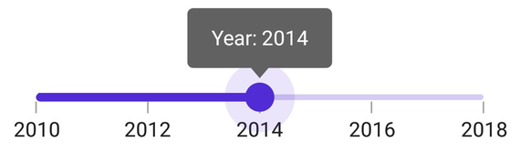

# Events and Commands in .NET MAUI DateTime Slider (SfDateTimeSlider)

This section describes how to add events and commands for the DateTime Slider.

## Events

### Handle Callbacks

- [ValueChangeStart](https://help.syncfusion.com/cr/maui/Syncfusion.Maui.Sliders.RangeView-1.html#Syncfusion_Maui_Sliders_RangeView_1_ValueChangeStart) - Invoked when the user begins selecting a new value by tapping or clicking the thumb.
- [ValueChanging](https://help.syncfusion.com/cr/maui/Syncfusion.Maui.Sliders.SfDateTimeSlider.html#Syncfusion_Maui_Sliders_SfDateTimeSlider_ValueChanging) - Invoked while dragging the thumb to select a new value.
- [ValueChanged](https://help.syncfusion.com/cr/maui/Syncfusion.Maui.Sliders.SfDateTimeSlider.html#Syncfusion_Maui_Sliders_SfDateTimeSlider_ValueChanged) - Invoked when the user completes selecting a new value.
- [ValueChangeEnd](https://help.syncfusion.com/cr/maui/Syncfusion.Maui.Sliders.RangeView-1.html#Syncfusion_Maui_Sliders_RangeView_1_ValueChangeEnd) - Invoked when the user stops interacting with the slider by releasing the thumb.





<sliders:SfDateTimeSlider  Minimum="2010-01-01"
                           Maximum="2018-01-01"
                           Value="2014-01-01"
                           ValueChangeStart="OnValueChangeStart"
                           ValueChanging="OnValueChanging"
                           ValueChanged="OnValueChanged"
                           ValueChangeEnd="OnValueChangeEnd" />





{
    SfDateTimeSlider slider = new SfDateTimeSlider()
    {
        Minimum = new DateTime(2010, 01, 01),
        Maximum = new DateTime(2018, 01, 01),
        Value = new DateTime(2014, 01, 01),
    };
    slider.ValueChangeStart += OnValueChangeStart;
    slider.ValueChanging += OnValueChanging;
    slider.ValueChanged += OnValueChanged;
    slider.ValueChangeEnd += OnValueChangeEnd;
}

private void OnValueChangeStart(object sender, EventArgs e)
{
}

private void OnValueChanging(object sender, DateTimeSliderValueChangingEventArgs e)
{
}

private void OnValueChanged(object sender, DateTimeSliderValueChangedEventArgs e) 
{
}

private void OnValueChangeEnd(object sender, EventArgs e)
{
}





### Customize Label Text

Format or change label text using the [`LabelCreated`](https://help.syncfusion.com/cr/maui/Syncfusion.Maui.Sliders.RangeView-1.html#Syncfusion_Maui_Sliders_RangeView_1_LabelCreated) event. The [`SliderLabelCreatedEventArgs`](https://help.syncfusion.com/cr/maui/Syncfusion.Maui.Sliders.SliderLabelCreatedEventArgs.html) provide the following parameters:

- Text: Customize the text color using the [`Text`](https://help.syncfusion.com/cr/maui/Syncfusion.Maui.Sliders.SliderLabelCreatedEventArgs.html#Syncfusion_Maui_Sliders_SliderLabelCreatedEventArgs_Text) parameter.
- Style: Format the text color, font size, font family, and offset using the [`Style`](https://help.syncfusion.com/cr/maui/Syncfusion.Maui.Sliders.SliderLabelCreatedEventArgs.html#Syncfusion_Maui_Sliders_SliderLabelCreatedEventArgs_Style) parameter.





<sliders:SfDateTimeSlider Minimum="2010-01-01"
                          Maximum="2011-01-01"
                          Value="2010-07-01"
                          Interval="3"
                          DateFormat="MMM"
                          ShowTicks="True"
                          LabelsPlacement="BetweenTicks"
                          IntervalType="Months"
                          LabelCreated="OnLabelCreated"
                          ShowLabels="True" />





{
    SfDateTimeSlider slider = new SfDateTimeSlider()
    {
        Minimum = new DateTime(2010, 01, 01),
        Maximum = new DateTime(2011, 01, 01),
        Value = new DateTime(2010, 07, 01),
        Interval = 3,
        DateFormat = "MMM",
        IntervalType = SliderDateIntervalType.Months,
        LabelsPlacement = SliderLabelsPlacement.BetweenTicks,
        ShowTicks = true,
        ShowLabels = true,
    };
    slider.LabelCreated += OnLabelCreated;
}

private void OnLabelCreated(object sender, SliderLabelCreatedEventArgs e)
{
    if (e.Text == "Jan")
    {
        e.Text = "Quarter 1";
    }
    else if (e.Text == "Apr")
    {
        e.Text = "Quarter 2";
    }
    else if (e.Text == "Jul")
    {
        e.Text = "Quarter 3";
    }
    else
    {
        e.Text = "Quarter 4";
    }
}





### Tooltip Text Format

By default, tooltip text is formatted based on the [`SliderTooltip.DateFormat`](https://help.syncfusion.com/cr/maui/Syncfusion.Maui.Sliders.SliderTooltip.html#Syncfusion_Maui_Sliders_SliderTooltip_DateFormat) property.

Format or change tooltip text using the [`TooltipLabelCreated`](https://help.syncfusion.com/cr/maui/Syncfusion.Maui.Sliders.SliderTooltip.html#Syncfusion_Maui_Sliders_SliderTooltip_TooltipLabelCreated) event. The [`SliderTooltipLabelCreatedEventArgs`](https://help.syncfusion.com/cr/maui/Syncfusion.Maui.Sliders.SliderTooltipLabelCreatedEventArgs.html) offer the following parameters:

- Text: Modify the tooltip text using the [`Text`](https://help.syncfusion.com/cr/maui/Syncfusion.Maui.Sliders.SliderTooltipLabelCreatedEventArgs.html#Syncfusion_Maui_Sliders_SliderTooltipLabelCreatedEventArgs_Text) property.
- Color: Change the tooltip text color using the [`TextColor`](https://help.syncfusion.com/cr/maui/Syncfusion.Maui.Sliders.SliderTooltipLabelCreatedEventArgs.html#Syncfusion_Maui_Sliders_SliderTooltipLabelCreatedEventArgs_TextColor) property.
- Font Size: Adjust the font size using the [`FontSize`](https://help.syncfusion.com/cr/maui/Syncfusion.Maui.Sliders.SliderTooltipLabelCreatedEventArgs.html#Syncfusion_Maui_Sliders_SliderTooltipLabelCreatedEventArgs_FontSize) property.
- Font Family: Define the font family using the [`FontFamily`](https://help.syncfusion.com/cr/maui/Syncfusion.Maui.Sliders.SliderTooltipLabelCreatedEventArgs.html#Syncfusion_Maui_Sliders_SliderTooltipLabelCreatedEventArgs_FontFamily) property.
- Font Attributes: Set font attributes using the [`FontAttributes`](https://help.syncfusion.com/cr/maui/Syncfusion.Maui.Sliders.SliderTooltipLabelCreatedEventArgs.html#Syncfusion_Maui_Sliders_SliderTooltipLabelCreatedEventArgs_FontAttributes) property.





<sliders:SfDateTimeSlider Minimum="2010-01-01"
                          Maximum="2018-01-01"
                          Value="2014-01-01"
                          Interval="2"
                          ShowTicks="True"
                          ShowLabels="True">

    <sliders:SfDateTimeSlider.Tooltip>
        <sliders:SliderTooltip TooltipLabelCreated="OnTooltipLabelCreated" />
    </sliders:SfDateTimeSlider.Tooltip>
    
</sliders:SfDateTimeSlider>





{
    SfDateTimeSlider slider = new SfDateTimeSlider()
    {
        Minimum = new DateTime(2010, 01, 01),
        Maximum = new DateTime(2018, 01, 01),
        Value = new DateTime(2014, 01, 01),
        Interval = 3,
        ShowTicks = true,
        ShowLabels = true,
        Tooltip = new SliderTooltip(),
    };
    slider.Tooltip.TooltipLabelCreated += OnTooltipLabelCreated;
}

private void OnTooltipLabelCreated(object sender, SliderTooltipLabelCreatedEventArgs e)
{
    e.Text = "Year: " + e.Text;
}





## Commands and Their Parameters

### Drag Started Command

The [`DragStartedCommand`](https://help.syncfusion.com/cr/maui/Syncfusion.Maui.Sliders.RangeView-1.html#Syncfusion_Maui_Sliders_RangeView_1_DragStartedCommand) is executed when the user begins moving the thumb.





<ContentPage.BindingContext>
    <local:ViewModel x:Name="viewModel" />
</ContentPage.BindingContext>

<ContentPage.Content>
    <sliders:SfDateTimeSlider Minimum="2010-01-01"
                              Maximum="2018-01-01"
                              Value="2014-01-01"
                              DragStartedCommand="{Binding DragStartedCommand}" />
</ContentPage.Content>





SfDateTimeSlider slider = new SfDateTimeSlider()
{
    Minimum = new DateTime(2010, 01, 01),
    Maximum = new DateTime(2020, 01, 01),
    Value = new DateTime(2014, 01, 01),
    DragStartedCommand = viewModel.DragStartedCommand,
};

public class ViewModel
{
    public ICommand DragStartedCommand { get; }

    public ViewModel()
    {
        DragStartedCommand = new Command(OnDragStarted);
    }

    private void OnDragStarted(object obj)
    {
    }
}





### Drag Started Command Parameter

The [`DragStartedCommandParameter`](https://help.syncfusion.com/cr/maui/Syncfusion.Maui.Sliders.RangeView-1.html#Syncfusion_Maui_Sliders_RangeView_1_DragStartedCommandParameter) is executed when the user starts moving the thumb with a specified parameter.





<ContentPage.BindingContext>
    <local:ViewModel x:Name="viewModel" />
</ContentPage.BindingContext>

<ContentPage.Content>
    <sliders:SfDateTimeSlider Minimum="2010-01-01"
                              Maximum="2018-01-01"
                              Value="2014-01-01"
                              DragStartedCommand="{Binding DragStartedCommand}"
                              DragStartedCommandParameter="1" />
</ContentPage.Content>





SfDateTimeSlider slider = new SfDateTimeSlider()
{
    Minimum = new DateTime(2010, 01, 01),
    Maximum = new DateTime(2020, 01, 01),
    Value = new DateTime(2014, 01, 01),
    DragStartedCommand = viewModel.DragStartedCommand,
    DragStartedCommandParameter = "1"
};

public class ViewModel
{
    public ICommand DragStartedCommand { get; }

    public ViewModel()
    {
        DragStartedCommand = new Command(OnDragStarted);
    }

    private void OnDragStarted(object obj)
    {
    }
}





### Drag Completed Command

The [`DragCompletedCommand`](https://help.syncfusion.com/cr/maui/Syncfusion.Maui.Sliders.RangeView-1.html#Syncfusion_Maui_Sliders_RangeView_1_DragCompletedCommand) is executed when the user finishes moving the thumb.





<ContentPage.BindingContext>
    <local:ViewModel x:Name="viewModel" />
</ContentPage.BindingContext>

<ContentPage.Content>
    <sliders:SfDateTimeSlider Minimum="2010-01-01"
                              Maximum="2018-01-01"
                              Value="2014-01-01"
                              DragCompletedCommand="{Binding DragCompletedCommand}" />
</ContentPage.Content>





SfDateTimeSlider slider = new SfDateTimeSlider()
{
    Minimum = new DateTime(2010, 01, 01),
    Maximum = new DateTime(2020, 01, 01),
    Value = new DateTime(2014, 01, 01),
    DragCompletedCommand = viewModel.DragCompletedCommand
};

public class ViewModel
{
    public ICommand DragCompletedCommand { get; }

    public ViewModel()
    {
        DragCompletedCommand = new Command(OnDragCompleted);
    }

    private void OnDragCompleted(object obj)
    {
    }
}





### Drag Completed Command Parameter

The [`DragCompletedCommandParameter`](https://help.syncfusion.com/cr/maui/Syncfusion.Maui.Sliders.RangeView-1.html#Syncfusion_Maui_Sliders_RangeView_1_DragCompletedCommandParameter) executes after the user finishes moving the thumb, using a specified parameter.





<ContentPage.BindingContext>
    <local:ViewModel x:Name="viewModel" />
</ContentPage.BindingContext>

<ContentPage.Content>
    <sliders:SfDateTimeSlider Minimum="2010-01-01"
                              Maximum="2018-01-01"
                              Value="2014-01-01"
                              DragCompletedCommand="{Binding DragCompletedCommand}"
                              DragCompletedCommandParameter="1" />
</ContentPage.Content>





SfDateTimeSlider slider = new SfDateTimeSlider()
{
    Minimum = new DateTime(2010, 01, 01),
    Maximum = new DateTime(2020, 01, 01),
    Value = new DateTime(2014, 01, 01),
    DragCompletedCommand = viewModel.DragCompletedCommand,
    DragCompletedCommandParameter = "1"
};

public class ViewModel
{
    public ICommand DragCompletedCommand { get; }

    public ViewModel()
    {
        DragCompletedCommand = new Command(OnDragCompleted);
    }

    private void OnDragCompleted(object obj)
    {
    }
}



