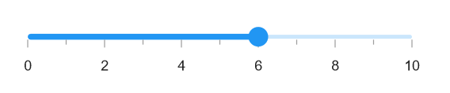

# Getting Started with .NET MAUI DateTime Slider

This section guides you through setting up and configuring a [DateTime Slider](https://help.syncfusion.com/cr/maui/Syncfusion.Maui.Sliders.SfDateTimeSlider.html?tabs=tabid-2) in your .NET MAUI application. Follow the steps below to add a basic DateTime Slider to your project.

To quickly get started with the .NET MAUI DateTime Slider, watch this video.

<iframe id='MAUIDateTimeSliderVideoTutorial' src='https://www.youtube.com/embed/MIdD3Np485M'></iframe>




## Prerequisites
Before proceeding, ensure the following are set up:

1. Install [.NET 9 SDK](https://dotnet.microsoft.com/en-us/download/dotnet/9.0) or later.
2. Set up a .NET MAUI environment with Visual Studio 2022 v17.12 or later.

## Step 1: Create a new .NET MAUI Project

1. Go to **File > New > Project** and choose the **.NET MAUI App** template.
2. Name the project and choose a location. Then, click **Next.**
3. Select the .NET framework version and click **Create.**

## Step 2: Install the Syncfusion® MAUI TreeView NuGet package

1. In **Solution Explorer,** right-click the project and choose **Manage NuGet Packages.**
2. Search for [Syncfusion.Maui.Sliders](https://www.nuget.org/packages/Syncfusion.Maui.Sliders/) and install the latest version.
3. Ensure the necessary dependencies are installed correctly, and the project is restored. If not, Open the Terminal in Rider and manually run: `dotnet restore`




## Prerequisites

Before proceeding, ensure the following are set up:

1. Install [.NET 9 SDK](https://dotnet.microsoft.com/en-us/download/dotnet/9.0) or later.
2. Set up a .NET MAUI environment with Visual Studio Code.
3. Ensure that the .NET MAUI workloads are installed and configured as described [here](https://learn.microsoft.com/en-us/dotnet/maui/get-started/installation?view=net-maui-9.0&tabs=visual-studio-code).

## Step 1: Create a .NET MAUI project

1. Open the command palette by pressing `Ctrl+Shift+P` and type **.NET:New Project** and enter.
2. Choose the **.NET MAUI App** template.
3. Select the project location, type the project name and press **Enter.**
4. Then choose **Create project.**

## Step 2: Install the Syncfusion® MAUI TreeView NuGet package

1. In **Solution Explorer,** right-click the project and choose **Manage NuGet Packages.**
2. Search for [Syncfusion.Maui.Sliders](https://www.nuget.org/packages/Syncfusion.Maui.Sliders/) and install the latest version.
3. Ensure the necessary dependencies are installed correctly, and the project is restored. If not, Open the Terminal in Rider and manually run: `dotnet restore`




## Prerequisites

Before proceeding, ensure the following are set up:

1. Install [.NET 9 SDK](https://dotnet.microsoft.com/en-us/download/dotnet/9.0) or later.
2. Set up a .NET MAUI environment with JetBrains Rider 2024.3 or later.
3. Make sure the MAUI workloads are installed and configured as described [here.](https://www.jetbrains.com/help/rider/MAUI.html#before-you-start)

## Step 1: Create a new .NET MAUI project

1. Go to **File > New Solution,** Select .NET (C#) and choose the .NET MAUI App template.
2. Enter the Project Name, Solution Name, and Location.
3. Select the .NET framework version and click Create.

## Step 2: Install the Syncfusion® MAUI TreeView NuGet package

1. In **Solution Explorer,** right-click the project and choose **Manage NuGet Packages.**
2. Search for [Syncfusion.Maui.Sliders](https://www.nuget.org/packages/Syncfusion.Maui.Sliders/) and install the latest version.
3. Ensure the necessary dependencies are installed correctly, and the project is restored. If not, Open the Terminal in Rider and manually run: `dotnet restore`




## Step 3: Register Syncfusion handler

Make sure to add the namespace.
 


using Syncfusion.Maui.Core.Hosting;


 
Register the Syncfusion core handler in your `CreateMauiApp` method of `MauiProgram.cs` file to use Syncfusion controls.
 


builder.ConfigureSyncfusionCore();


 
## Step 4: Import the DateTime Slider namespace
 
Add the following namespace in your XAML or C#.
 


 
xmlns:sliders="clr-namespace:Syncfusion.Maui.Sliders;assembly=Syncfusion.Maui.Sliders"
 


 
using Syncfusion.Maui.Sliders;
 



## Step 5: Create a DateTime Slider with labels and ticks

Initialize the [SfDateTimeSlider](https://help.syncfusion.com/cr/maui/Syncfusion.Maui.Sliders.SfDateTimeSlider.html?tabs=tabid-2%2Ctabid-1) and configure its visual elements using label and tick properties. The [ShowLabels](https://help.syncfusion.com/cr/maui/Syncfusion.Maui.Sliders.RangeView-1.html#Syncfusion_Maui_Sliders_RangeView_1_ShowLabels) property enables labels to be displayed at specified intervals along the slider. The [ShowTicks](https://help.syncfusion.com/cr/maui/Syncfusion.Maui.Sliders.RangeView-1.html#Syncfusion_Maui_Sliders_RangeView_1_ShowTicks) property controls the visibility of major tick marks, while the [MinorTicksPerInterval](https://help.syncfusion.com/cr/maui/Syncfusion.Maui.Sliders.RangeView-1.html#Syncfusion_Maui_Sliders_RangeView_1_MinorTicksPerInterval) property defines the number of minor ticks displayed between each pair of major ticks.





<sliders:SfDateTimeSlider Minimum="2010-01-01"
                          Maximum="2018-01-01"
                          Value="2014-01-01"
                          ShowLabels="True"
                          ShowTicks="True"
                          Interval="2"
                          MinorTicksPerInterval="1" />





SfDateTimeSlider slider = new SfDateTimeSlider()
{
    Minimum = new DateTime(2010, 01, 01),
    Maximum = new DateTime(2018, 01, 01),
    Value = new DateTime(2014, 01, 01),
    Interval = 2,
    ShowLabels = true,
    ShowTicks = true,
    MinorTicksPerInterval = 1,
};
content = slider;





You can download the DateTime Slider Getting Started sample from [GitHub](https://github.com/SyncfusionExamples/getting-started-with-the-dotnet-maui-datetime-slider).