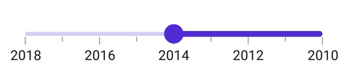

# Getting Started with .NET MAUI DateTime Slider

This section guides you through setting up and configuring a [DateTime Slider](https://help.syncfusion.com/cr/maui/Syncfusion.Maui.Sliders.SfDateTimeSlider.html?tabs=tabid-2) in your .NET MAUI application. Follow the steps below to add a basic DateTime Slider to your project.

To quickly get started with the .NET MAUI DateTime Slider, watch this video.

<iframe id='MAUIDateTimeSliderVideoTutorial' src='https://www.youtube.com/embed/MIdD3Np485M'></iframe>




## Prerequisites

Before proceeding, ensure the following are in place:

1. Install [.NET 8 SDK](https://dotnet.microsoft.com/en-us/download/dotnet/8.0) or later.
2. Set up a .NET MAUI environment with Visual Studio 2022 (v17.8 or later).

## Step 1: Create a New .NET MAUI Project

1. Go to **File > New > Project** and choose the **.NET MAUI App** template.
2. Name the project and choose a location. Then, click **Next**.
3. Select the .NET framework version and click **Create**.

## Step 2: Install the Syncfusion® MAUI Sliders NuGet Package

1. In **Solution Explorer**, right-click the project and choose **Manage NuGet Packages**.
2. Search for [Syncfusion.Maui.Sliders](https://www.nuget.org/packages/Syncfusion.Maui.Sliders) and install the latest version.
3. Ensure the necessary dependencies are installed correctly, and the project is restored.

## Step 3: Register the handler

 [Syncfusion.Maui.Core](https://www.nuget.org/packages/Syncfusion.Maui.Core) nuget is a dependent package for all Syncfusion® controls of .NET MAUI. In the MauiProgram.cs file, register the handler for Syncfusion® core.


using Microsoft.Maui;
using Microsoft.Maui.Hosting;
using Microsoft.Maui.Controls.Compatibility;
using Microsoft.Maui.Controls.Hosting;
using Microsoft.Maui.Controls.Xaml;
using Syncfusion.Maui.Core.Hosting;

namespace SliderGettingStarted
{
    public static class MauiProgram
    {
        public static MauiApp CreateMauiApp()
        {
            var builder = MauiApp.CreateBuilder();
            builder
            .UseMauiApp<App>()
            .ConfigureSyncfusionCore()
            .ConfigureFonts(fonts =>
            {
                fonts.AddFont("OpenSans-Regular.ttf", "OpenSansRegular");
            });

            return builder.Build();
        }
    }
}



## Step 4: Add a Basic Datetime Slider

Import the [SfDateTimeSlider](https://help.syncfusion.com/cr/maui/Syncfusion.Maui.Sliders.SfDateTimeSlider.html?tabs=tabid-2) namespace and initialize the DateTime Slider as shown below.





<ContentPage
    . . .
             xmlns:sliders="clr-namespace:Syncfusion.Maui.Sliders;assembly=Syncfusion.Maui.Sliders">
    <Grid>
        <sliders:SfDateTimeSlider Minimum="2010-01-01"
                                  Maximum="2018-01-01"
                                  Value="2014-01-01" />
    </Grid>
</ContentPage>





using Syncfusion.Maui.Sliders;

namespace SliderGettingStarted
{
    public partial class MainPage : ContentPage
    {
        public MainPage()
        {
            InitializeComponent();
            SfDateTimeSlider slider = new SfDateTimeSlider();
            slider.Minimum = new DateTime(2010, 01, 01);
            slider.Maximum = new DateTime(2018, 01, 01);
            slider.Value = new DateTime(2014, 01, 01);
            this.content = slider;
        }
    }
}








## Prerequisites

Before proceeding, ensure the following are set up:

1. Install [.NET 8 SDK](https://dotnet.microsoft.com/en-us/download/dotnet/8.0) or later is installed.
2. Set up a .NET MAUI environment with Visual Studio Code.
3. Ensure that the .NET MAUI extension is installed and configured as described [here.](https://learn.microsoft.com/en-us/dotnet/maui/get-started/installation?view=net-maui-8.0&tabs=visual-studio-code)

## Step 1: Create a New .NET MAUI Project

1. Open the Command Palette by pressing **Ctrl+Shift+P** and type **.NET:New Project** and press Enter.
2. Choose the **.NET MAUI App** template.
3. Select the project location, type the project name and press Enter.
4. Then choose **Create project**

## Step 2: Install the Syncfusion® MAUI Sliders NuGet Package

1. Press <kbd>Ctrl</kbd> + <kbd>`</kbd> (backtick) to open the integrated terminal in Visual Studio Code.
2. Ensure you're in the project root directory where your .csproj file is located.
3. Run the command `dotnet add package Syncfusion.Maui.Sliders` to install the Syncfusion® .NET MAUI Sliders package.
4. To ensure all dependencies are installed, run `dotnet restore`.

## Step 3: Register the handler

 [Syncfusion.Maui.Core](https://www.nuget.org/packages/Syncfusion.Maui.Core) nuget is a dependent package for all Syncfusion® controls of .NET MAUI. In the MauiProgram.cs file, register the handler for Syncfusion® core.


using Microsoft.Maui;
using Microsoft.Maui.Hosting;
using Microsoft.Maui.Controls.Compatibility;
using Microsoft.Maui.Controls.Hosting;
using Microsoft.Maui.Controls.Xaml;
using Syncfusion.Maui.Core.Hosting;

namespace SliderGettingStarted
{
    public static class MauiProgram
    {
        public static MauiApp CreateMauiApp()
        {
            var builder = MauiApp.CreateBuilder();
            builder
            .UseMauiApp<App>()
            .ConfigureSyncfusionCore()
            .ConfigureFonts(fonts =>
            {
                fonts.AddFont("OpenSans-Regular.ttf", "OpenSansRegular");
            });

            return builder.Build();
        }
    }
}



## Step 4: Add a Basic Datetime Slider

Import the [SfDateTimeSlider](https://help.syncfusion.com/cr/maui/Syncfusion.Maui.Sliders.SfDateTimeSlider.html?tabs=tabid-2) namespace and initialize the DateTime Slider as shown below.





<ContentPage
    . . .
             xmlns:sliders="clr-namespace:Syncfusion.Maui.Sliders;assembly=Syncfusion.Maui.Sliders">
    <Grid>
        <sliders:SfDateTimeSlider Minimum="2010-01-01"
                                  Maximum="2018-01-01"
                                  Value="2014-01-01" />
    </Grid>
</ContentPage>





using Syncfusion.Maui.Sliders;

namespace SliderGettingStarted
{
    public partial class MainPage : ContentPage
    {
        public MainPage()
        {
            InitializeComponent();
            SfDateTimeSlider slider = new SfDateTimeSlider();
            slider.Minimum = new DateTime(2010, 01, 01);
            slider.Maximum = new DateTime(2018, 01, 01);
            slider.Value = new DateTime(2014, 01, 01);
            this.content = slider;
        }
    }
}









## Prerequisites

Before proceeding, ensure the following are set up:

1. Ensure you have the latest version of JetBrains Rider.
2. Install [.NET 8 SDK](https://dotnet.microsoft.com/en-us/download/dotnet/8.0) or later is installed.
3. Make sure the MAUI workloads are installed and configured as described [here.](https://www.jetbrains.com/help/rider/MAUI.html#before-you-start)

## Step 1: Create a new .NET MAUI Project

1. Go to **File > New Solution,** Select .NET (C#) and choose the .NET MAUI App template.
2. Enter the Project Name, Solution Name, and Location.
3. Select the .NET framework version and click Create.

## Step 2: Install the Syncfusion® MAUI Sliders NuGet Package

1. In **Solution Explorer,** right-click the project and choose **Manage NuGet Packages.**
2. Search for [Syncfusion.Maui.Sliders](https://www.nuget.org/packages/Syncfusion.Maui.Sliders/) and install the latest version.
3. Ensure the necessary dependencies are installed correctly, and the project is restored. If not, Open the Terminal in Rider and manually run: `dotnet restore`

## Step 3: Register the handler

 [Syncfusion.Maui.Core](https://www.nuget.org/packages/Syncfusion.Maui.Core) nuget is a dependent package for all Syncfusion® controls of .NET MAUI. In the MauiProgram.cs file, register the handler for Syncfusion® core.


using Microsoft.Maui;
using Microsoft.Maui.Hosting;
using Microsoft.Maui.Controls.Compatibility;
using Microsoft.Maui.Controls.Hosting;
using Microsoft.Maui.Controls.Xaml;
using Syncfusion.Maui.Core.Hosting;

namespace SliderGettingStarted
{
    public static class MauiProgram
    {
        public static MauiApp CreateMauiApp()
        {
            var builder = MauiApp.CreateBuilder();
            builder
            .UseMauiApp<App>()
            .ConfigureSyncfusionCore()
            .ConfigureFonts(fonts =>
            {
                fonts.AddFont("OpenSans-Regular.ttf", "OpenSansRegular");
            });

            return builder.Build();
        }
    }
}



## Step 4: Add a Basic Datetime Slider

Import the [SfDateTimeSlider](https://help.syncfusion.com/cr/maui/Syncfusion.Maui.Sliders.SfDateTimeSlider.html?tabs=tabid-2) namespace and initialize the DateTime Slider as shown below.





<ContentPage
    . . .
             xmlns:sliders="clr-namespace:Syncfusion.Maui.Sliders;assembly=Syncfusion.Maui.Sliders">
    <Grid>
        <sliders:SfDateTimeSlider Minimum="2010-01-01"
                                  Maximum="2018-01-01"
                                  Value="2014-01-01" />
    </Grid>
</ContentPage>





using Syncfusion.Maui.Sliders;

namespace SliderGettingStarted
{
    public partial class MainPage : ContentPage
    {
        public MainPage()
        {
            InitializeComponent();
            SfDateTimeSlider slider = new SfDateTimeSlider();
            slider.Minimum = new DateTime(2010, 01, 01);
            slider.Maximum = new DateTime(2018, 01, 01);
            slider.Value = new DateTime(2014, 01, 01);
            this.content = slider;
        }
    }
}








## Step 5: Enable labels

The [ShowLabels](https://help.syncfusion.com/cr/maui/Syncfusion.Maui.Sliders.RangeView-1.html#Syncfusion_Maui_Sliders_RangeView_1_ShowLabels) property enables the labels which renders on given interval.





<sliders:SfDateTimeSlider Minimum="2010-01-01"
                          Maximum="2018-01-01"
                          Value="2014-01-01"
                          ShowLabels="True"
                          Interval="2" />





SfDateTimeSlider slider = new SfDateTimeSlider();
slider.Minimum = new DateTime(2010, 01, 01);
slider.Maximum = new DateTime(2018, 01, 01);
slider.Value = new DateTime(2014, 01, 01);
slider.ShowLabels = true;
slider.Interval = 2;





## Step 6: Enable ticks

The [ShowTicks](https://help.syncfusion.com/cr/maui/Syncfusion.Maui.Sliders.RangeView-1.html#Syncfusion_Maui_Sliders_RangeView_1_ShowTicks) property enables the ticks in the range selector, while the [MinorTicksPerInterval](https://help.syncfusion.com/cr/maui/Syncfusion.Maui.Sliders.RangeView-1.html#Syncfusion_Maui_Sliders_RangeView_1_MinorTicksPerInterval) property enables the minor ticks between the major ticks.





<sliders:SfDateTimeSlider Minimum="2010-01-01"
                          Maximum="2018-01-01"
                          Value="2014-01-01"
                          ShowLabels="True"
                          ShowTicks="True"
                          Interval="2"
                          MinorTicksPerInterval="1" />





SfDateTimeSlider slider = new SfDateTimeSlider()
{
    Minimum = new DateTime(2010, 01, 01),
    Maximum = new DateTime(2018, 01, 01),
    Value = new DateTime(2014, 01, 01),
    Interval = 2,
    ShowLabels = true,
    ShowTicks = true,
    MinorTicksPerInterval = 1,
};





## Orientation

The [Orientation](https://help.syncfusion.com/cr/maui/Syncfusion.Maui.Sliders.SliderBase-1.html#Syncfusion_Maui_Sliders_SliderBase_1_Orientation) property allows you to show the slider in both horizontal and vertical directions. The default value of the Orientation property is **Horizontal**.





<sliders:SfDateTimeSlider Orientation="Vertical"
                          Minimum="2010-01-01"
                          Maximum="2018-01-01"
                          Value="2014-01-01"
                          ShowLabels="True"
                          ShowTicks="True"
                          Interval="2"
                          MinorTicksPerInterval="1" />





SfDateTimeSlider slider = new SfDateTimeSlider();
slider.Orientation = SliderOrientation.Vertical;
slider.Minimum = new DateTime(2010, 01, 01);
slider.Maximum = new DateTime(2018, 01, 01);
slider.Value = new DateTime(2014, 01, 01);
slider.ShowLabels = true;
slider.Interval = 2;
slider.ShowTicks = true;
slider.MinorTicksPerInterval = 1;





## Inverse the slider

Invert the slider using the [IsInversed](https://help.syncfusion.com/cr/maui/Syncfusion.Maui.Sliders.RangeView-1.html#Syncfusion_Maui_Sliders_RangeView_1_IsInversed) property. The default value of the [IsInversed](https://help.syncfusion.com/cr/maui/Syncfusion.Maui.Sliders.RangeView-1.html#Syncfusion_Maui_Sliders_RangeView_1_IsInversed) property is **False**.





<sliders:SfDateTimeSlider Minimum="2010-01-01"
                          Maximum="2018-01-01"
                          Value="2014-01-01"
                          IsInversed="True"
                          ShowLabels="True"
                          ShowTicks="True"
                          Interval="2"
                          MinorTicksPerInterval="1" />





SfDateTimeSlider slider = new SfDateTimeSlider();
slider.Minimum = new DateTime(2010, 01, 01);
slider.Maximum = new DateTime(2018, 01, 01);
slider.Value = new DateTime(2014, 01, 01);
slider.IsInversed = true;
slider.ShowLabels = true;
slider.Interval = 2;
slider.ShowTicks = true;
slider.MinorTicksPerInterval = 1;





## Formatting labels

Add prefix or suffix to the labels using the [DateFormat](https://help.syncfusion.com/cr/maui/Syncfusion.Maui.Sliders.SfDateTimeSlider.html#Syncfusion_Maui_Sliders_SfDateTimeSlider_DateFormat) property.





<sliders:SfDateTimeSlider Minimum="2010-01-01"
                          Maximum="2011-01-01"
                          Value="2010-07-01"
                          DateFormat="MMM"
                          IntervalType="Months"
                          ShowTicks="True"
                          MinorTicksPerInterval="1"
                          ShowLabels="True"
                          Interval="2" />





SfDateTimeSlider slider = new SfDateTimeSlider()
{
    Minimum = new DateTime(2010, 01, 01),
    Maximum = new DateTime(2011, 01, 01),
    Value = new DateTime(2010, 07, 01),
    Interval = 2,
    ShowLabels = true,
    ShowTicks = true,
    MinorTicksPerInterval = 1,
    DateFormat = "MMM",
    IntervalType = SliderDateIntervalType.Months,
};





