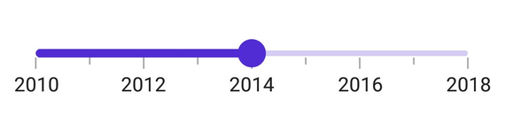

# Getting Started with .NET MAUI DateTime Slider (SfDateTimeSlider)

This section explains the steps required to add the DateTime Slider control and its elements track, ticks, labels and tooltip. This section covers only basic features needed to know to get started with Syncfusion DateTime Slider.

## Creating an application with .NET MAUI

Create a new .NET MAUI application in Visual Studio.

 

## Adding SfDateTimeSlider reference

 Syncfusion .NET MAUI components are available in [nuget.org](https://www.nuget.org/). To add SfDateTimeSlider to your project, open the NuGet package manager in Visual Studio, search for Syncfusion.Maui.Sliders and then install it.

 

## Handler registration

In the MauiProgram.cs file, register the handler for Syncfusion core



using Microsoft.Maui;
using Microsoft.Maui.Hosting;
using Microsoft.Maui.Controls.Compatibility;
using Microsoft.Maui.Controls.Hosting;
using Microsoft.Maui.Controls.Xaml;
using Syncfusion.Maui.Core.Hosting;

namespace SliderGettingStarted
{
    public static class MauiProgram
    {
        public static MauiApp CreateMauiApp()
        {
            var builder = MauiApp.CreateBuilder();
            builder
            .UseMauiApp<App>()
            .ConfigureSyncfusionCore()
            .ConfigureFonts(fonts =>
            {
                fonts.AddFont("OpenSans-Regular.ttf", "OpenSansRegular");
            });

            return builder.Build();
        }
    }
}



## Initialize DateTimeSlider

Import the [`SfDateTimeSlider`](https://help.syncfusion.com/cr/maui/Syncfusion.Maui.Sliders.SfDateTimeSlider.html?tabs=tabid-2) namespace and initialize the date-time slider as shown below.





<ContentPage
    . . .
             xmlns:sliders="clr-namespace:Syncfusion.Maui.Sliders;assembly=Syncfusion.Maui.Sliders">
    <Grid>
        <sliders:SfDateTimeSlider Minimum="2010-01-01"
                                  Maximum="2018-01-01"
                                  Value="2014-01-01" />
    </Grid>
</ContentPage>





using Syncfusion.Maui.Sliders;

namespace SliderGettingStarted
{
    public partial class MainPage : ContentPage
    {
        public MainPage()
        {
            InitializeComponent();
            SfDateTimeSlider slider = new SfDateTimeSlider();
            slider.Minimum = new DateTime(2010, 01, 01);
            slider.Maximum = new DateTime(2018, 01, 01);
            slider.Value = new DateTime(2014, 01, 01);
            this.content = slider;
        }
    }
}





## Enable labels

The [`ShowLabels`](https://help.syncfusion.com/cr/maui/Syncfusion.Maui.Sliders.SliderBase.html#Syncfusion_Maui_Sliders_SliderBase_ShowLabels) property enables the labels which renders on given interval.





<sliders:SfDateTimeSlider Minimum="2010-01-01"
                          Maximum="2018-01-01"
                          Value="2014-01-01"
                          ShowLabels="True"
                          Interval="2" />





SfDateTimeSlider slider = new SfDateTimeSlider();
slider.Minimum = new DateTime(2010, 01, 01);
slider.Maximum = new DateTime(2018, 01, 01);
slider.Value = new DateTime(2014, 01, 01);
slider.ShowLabels = true;
slider.Interval = 2;





## Enable ticks

The [`ShowTicks`](https://help.syncfusion.com/cr/maui/Syncfusion.Maui.Sliders.SliderBase.html#Syncfusion_Maui_Sliders_SliderBase_ShowTicks) property enables the ticks in the range selector, while the [`MinorTicksPerInterval`](https://help.syncfusion.com/cr/maui/Syncfusion.Maui.Sliders.SliderBase.html#Syncfusion_Maui_Sliders_SliderBase_MinorTicksPerInterval) property enables the minor ticks between the major ticks.





<sliders:SfDateTimeSlider Minimum="2010-01-01" 
                          Maximum="2018-01-01" 
                          Value="2014-01-01" 
		                  ShowLabels="True"  
		                  ShowTicks="True" 
		                  Interval="2" 
		                  MinorTicksPerInterval="1">
</sliders:SfDateTimeSlider>





SfDateTimeSlider slider = new SfDateTimeSlider();
slider.Minimum = new DateTime(2010, 01, 01);
slider.Maximum = new DateTime(2018, 01, 01);
slider.Value = new DateTime(2014, 01, 01);
slider.ShowLabels = true;
slider.Interval = 2;
slider.ShowTicks = true;
slider.MinorTicksPerInterval = 1;





## Orientation

The [`Orientation`](https://help.syncfusion.com/cr/maui/Syncfusion.Maui.Sliders.SfSlider.html#Syncfusion_Maui_Sliders_SfSlider_Orientation) property allows you to show the slider in both horizontal and vertical directions. The default value of the [`Orientation`](https://help.syncfusion.com/cr/maui/Syncfusion.Maui.Sliders.SfSlider.html#Syncfusion_Maui_Sliders_SfSlider_Orientation) property is `Horizontal`.





<sliders:SfDateTimeSlider Orientation="Vertical"
                          Minimum="2010-01-01" 
                          Maximum="2018-01-01" 
                          Value="2014-01-01" 
		                  ShowLabels="True"  
		                  ShowTicks="True" 
		                  Interval="2" 
		                  MinorTicksPerInterval="1">
</sliders:SfDateTimeSlider>





SfDateTimeSlider slider = new SfDateTimeSlider();
slider.Orientation = SliderOrientation.Vertical;
slider.Minimum = new DateTime(2010, 01, 01);
slider.Maximum = new DateTime(2018, 01, 01);
slider.Value = new DateTime(2014, 01, 01);
slider.ShowLabels = true;
slider.Interval = 2;
slider.ShowTicks = true;
slider.MinorTicksPerInterval = 1;





## Inverse the slider

You can invert the slider using the [`IsInversed`](https://help.syncfusion.com/cr/maui/Syncfusion.Maui.Sliders.SliderBase.html#Syncfusion_Maui_Sliders_SliderBase_IsInversed) property. The default value of the [`IsInversed`](https://help.syncfusion.com/cr/maui/Syncfusion.Maui.Sliders.SliderBase.html#Syncfusion_Maui_Sliders_SliderBase_IsInversed) property is `False`.





<sliders:SfDateTimeSlider Minimum="2010-01-01" 
                          Maximum="2018-01-01" 
                          Value="2014-01-01" 
                          IsInversed="True"
		                  ShowLabels="True"  
		                  ShowTicks="True" 
		                  Interval="2" 
		                  MinorTicksPerInterval="1">
</sliders:SfDateTimeSlider>





SfDateTimeSlider slider = new SfDateTimeSlider();
slider.Minimum = new DateTime(2010, 01, 01);
slider.Maximum = new DateTime(2018, 01, 01);
slider.Value = new DateTime(2014, 01, 01);
slider.IsInversed = true;
slider.ShowLabels = true;
slider.Interval = 2;
slider.ShowTicks = true;
slider.MinorTicksPerInterval = 1;





## Formatting labels

You can add prefix or suffix to the labels using the [`NumberFormat`](https://help.syncfusion.com/cr/maui/Syncfusion.Maui.Sliders.SfSlider.html#Syncfusion_Maui_Sliders_SfSlider_NumberFormat) or [`DateFormat`](https://help.syncfusion.com/cr/maui/Syncfusion.Maui.Sliders.SfDateTimeSlider.html#Syncfusion_Maui_Sliders_SfDateTimeSlider_DateFormat) properties.





<sliders:SfDateTimeSlider Minimum="2010-01-01"
                          Maximum="2011-01-01"
                          Value="2010-07-01"
                          DateFormat="MMM"
                          IntervalType="Months"
                          ShowTicks="True"
                          MinorTicksPerInterval="1"
                          ShowLabels="True"
                          Interval="2" />





SfDateTimeSlider slider = new SfDateTimeSlider();
slider.Minimum = new DateTime(2010, 01, 01);
slider.Maximum = new DateTime(2011, 01, 01);
slider.Value = new DateTime(2010, 07, 01);
slider.ShowLabels = true;
slider.Interval = 2;
slider.ShowTicks = true;
slider.MinorTicksPerInterval = 1;
slider.DateFormat = "MMM";
slider.IntervalType = SliderDateIntervalType.Months;





