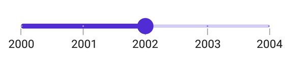

# Interval in .NET MAUI DateTime Slider (SfDateTimeSlider)

This section explains how to define intervals in the DateTime Slider.

## Date Interval

Slider elements like labels, ticks, and dividers are rendered based on the [`Interval`](https://help.syncfusion.com/cr/maui/Syncfusion.Maui.Sliders.RangeView-1.html#Syncfusion_Maui_Sliders_RangeView_1_Interval), [`Minimum`](https://help.syncfusion.com/cr/maui/Syncfusion.Maui.Sliders.SfSlider.html#Syncfusion_Maui_Sliders_SfSlider_Minimum), and [`Maximum`](https://help.syncfusion.com/cr/maui/Syncfusion.Maui.Sliders.SfSlider.html#Syncfusion_Maui_Sliders_SfSlider_Maximum) properties. The default interval value is `0`.

Change the interval type using the [`IntervalType`](https://help.syncfusion.com/cr/maui/Syncfusion.Maui.Sliders.IDateTimeElement.html#Syncfusion_Maui_Sliders_IDateTimeElement_IntervalType) property. Format or change the label text using the [`DateFormat`](https://help.syncfusion.com/cr/maui/Syncfusion.Maui.Sliders.IDateTimeElement.html#Syncfusion_Maui_Sliders_IDateTimeElement_DateFormat) property.

For instance, if the [`Minimum`](https://help.syncfusion.com/cr/maui/Syncfusion.Maui.Sliders.RangeView-1.html#Syncfusion_Maui_Sliders_RangeView_1_Minimum) is `DateTime(2000, 01, 01)`, the [`Maximum`](https://help.syncfusion.com/cr/maui/Syncfusion.Maui.Sliders.RangeView-1.html#Syncfusion_Maui_Sliders_RangeView_1_Maximum) is `DateTime(2005, 01, 01)`, and the [`Interval`](https://help.syncfusion.com/cr/maui/Syncfusion.Maui.Sliders.RangeView-1.html#Syncfusion_Maui_Sliders_RangeView_1_Interval) is `1`, with [`IntervalType`](https://help.syncfusion.com/cr/maui/Syncfusion.Maui.Sliders.SfDateTimeSlider.html#Syncfusion_Maui_Sliders_SfDateTimeSlider_IntervalType) set to [`SliderDateIntervalType.Years`](https://help.syncfusion.com/cr/maui/Syncfusion.Maui.Sliders.SliderDateIntervalType.html#Syncfusion_Maui_Sliders_SliderDateIntervalType_Years), and [`DateFormat`](https://help.syncfusion.com/cr/maui/Syncfusion.Maui.Sliders.SfDateTimeSlider.html#Syncfusion_Maui_Sliders_SfDateTimeSlider_DateFormat) set to `yyyy`, the Slider will render labels, major ticks, and dividers at 2000, 2001, 2002, and so forth.





<sliders:SfDateTimeSlider Minimum="2000-01-01"
                          Maximum="2004-01-01"
                          Value="2002-01-01"
                          Interval="1"
                          DateFormat="yyyy"
                          IntervalType="Years"
                          ShowLabels="True"
                          ShowTicks="True"
                          ShowDividers="True" />





SfDateTimeSlider slider = new SfDateTimeSlider()
{
    Minimum = new DateTime(2010, 01, 01),
    Maximum = new DateTime(2004, 01, 01),
    Value = new DateTime(2002, 01, 01),
    Interval = 1,
    IntervalType = SliderDateIntervalType.Years,
    DateFormat = "yyyy",
    ShowLabels = true,
    ShowTicks = true,
    ShowDividers = true,
};





## Auto Interval

If the [`ShowTicks`](https://help.syncfusion.com/cr/maui/Syncfusion.Maui.Sliders.RangeView-1.html#Syncfusion_Maui_Sliders_RangeView_1_ShowTicks), [`ShowLabels`](https://help.syncfusion.com/cr/maui/Syncfusion.Maui.Sliders.RangeView-1.html#Syncfusion_Maui_Sliders_RangeView_1_ShowLabels), or [`ShowDividers`](https://help.syncfusion.com/cr/maui/Syncfusion.Maui.Sliders.RangeView-1.html#Syncfusion_Maui_Sliders_RangeView_1_ShowDividers) properties are `True`, and the [`Interval`](https://help.syncfusion.com/cr/maui/Syncfusion.Maui.Sliders.RangeView-1.html#Syncfusion_Maui_Sliders_RangeView_1_Interval) is `0`, the interval will be automatically calculated based on the available size. If the [`IntervalType`](https://help.syncfusion.com/cr/maui/Syncfusion.Maui.Sliders.IDateTimeElement.html#Syncfusion_Maui_Sliders_IDateTimeElement_IntervalType) or [`DateFormat`](https://help.syncfusion.com/cr/maui/Syncfusion.Maui.Sliders.IDateTimeElement.html#Syncfusion_Maui_Sliders_IDateTimeElement_DateFormat) properties are not set, their values will also be calculated automatically.

For example, if the [`Minimum`](https://help.syncfusion.com/cr/maui/Syncfusion.Maui.Sliders.RangeView-1.html#Syncfusion_Maui_Sliders_RangeView_1_Minimum) is `DateTime(2000, 01, 01)`, the [`Maximum`](https://help.syncfusion.com/cr/maui/Syncfusion.Maui.Sliders.RangeView-1.html#Syncfusion_Maui_Sliders_RangeView_1_Maximum) is `DateTime(2001, 01, 01)`, and `Interval` is `0`, with an available size considered as 350, the Slider will render labels, major ticks, and dividers at `Jan 01, 2000`, `Jul 01, 2000`, and `Nov 01, 2000`, respectively.





<sliders:SfDateTimeSlider Minimum="2000-01-01"
                          Maximum="2004-01-01"
                          Value="2002-01-01"
                          ShowLabels="True"
                          ShowTicks="True"
                          ShowDividers="True" />





SfDateTimeSlider slider = new SfDateTimeSlider()
{
    Minimum = new DateTime(2010, 01, 01),
    Maximum = new DateTime(2004, 01, 01),
    Value = new DateTime(2002, 01, 01),
    ShowLabels = true,
    ShowTicks = true,
    ShowDividers = true,
};



