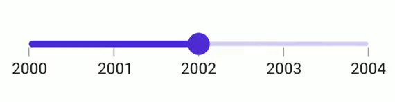

# Interval in .NET MAUI DateTime Slider (SfDateTimeSlider)

This section explains how to add the interval for DateTime Slider.

## Date interval

Slider elements like labels, ticks, and dividers are rendered based on the [`Interval`](https://help.syncfusion.com/cr/maui/Syncfusion.Maui.Sliders.SliderBase.html#Syncfusion_Maui_Sliders_SliderBase_Interval), [`Minimum`](https://help.syncfusion.com/cr/maui/Syncfusion.Maui.Sliders.SfSlider.html#Syncfusion_Maui_Sliders_SfSlider_Minimum), and [`Maximum`](https://help.syncfusion.com/cr/maui/Syncfusion.Maui.Sliders.SfSlider.html#Syncfusion_Maui_Sliders_SfSlider_Maximum) properties. The default value is `Zero`.

For date values, the slider does not have auto interval support. So, setting [`Interval`](https://help.syncfusion.com/cr/maui/Syncfusion.Maui.Sliders.SliderBase.html#Syncfusion_Maui_Sliders_SliderBase_Interval), [`IntervalType`](https://help.syncfusion.com/cr/maui/Syncfusion.Maui.Sliders.SliderBase.html#Syncfusion_Maui_Sliders_SliderBase_DateIntervalType), and [`DateFormat`](https://help.syncfusion.com/cr/maui/Syncfusion.Maui.Sliders.SfDateTimeSlider.html#Syncfusion_Maui_Sliders_SfDateTimeSlider_DateFormat) for date values is mandatory.

 The default value of  [`IntervalType`](https://help.syncfusion.com/cr/maui/Syncfusion.Maui.Sliders.SfDateTimeSlider.html#Syncfusion_Maui_Sliders_SfDateTimeSlider_IntervalType) property is `DateTime.Year`.It can be years to seconds.

For example, if the [`Minimum`](https://help.syncfusion.com/cr/maui/Syncfusion.Maui.Sliders.SfDateTimeSlider.html#Syncfusion_Maui_Sliders_SfDateTimeSlider_Minimum) is `DateTime(2000, 01, 01)`, the [`Maximum`](https://help.syncfusion.com/cr/maui/Syncfusion.Maui.Sliders.SfDateTimeSlider.html#Syncfusion_Maui_Sliders_SfDateTimeSlider_Maximum) is `DateTime(2005, 01, 01)`, and [`Interval`](https://help.syncfusion.com/cr/maui/Syncfusion.Maui.Sliders.SliderBase.html#Syncfusion_Maui_Sliders_SliderBase_Interval) is `1`, [`IntervalType`](https://help.syncfusion.com/cr/maui/Syncfusion.Maui.Sliders.SfDateTimeSlider.html#Syncfusion_Maui_Sliders_SfDateTimeSlider_IntervalType) is [`SliderDateIntervalType.Years`](https://help.syncfusion.com/cr/maui/Syncfusion.Maui.Sliders.SliderDateIntervalType.html#Syncfusion_Maui_Sliders_SliderDateIntervalType_Years), [`DateFormat`](https://help.syncfusion.com/cr/maui/Syncfusion.Maui.Sliders.SfDateTimeSlider.html#Syncfusion_Maui_Sliders_SfDateTimeSlider_DateFormat) is `yyyy` then the slider will render the labels, major ticks, and dividers at 2000, 2001, 2002, and so on.





<sliders:SfDateTimeSlider Minimum="2000-01-01" 
                          Maximum="2005-01-01" 
                          Interval="1" 
                          Value="2002-01-01" 
                          DateFormat="yyyy" 
                          IntervalType="Years" 
                          ShowLabels="True"
                          ShowTicks="True" 
                          ShowDividers="True">
</sliders:SfDateTimeSlider>





SfSlider slider = new SfSlider();
slider.Minimum = new DateTime(2000, 01, 01);
slider.Maximum = new DateTime(2005, 01, 01);
slider.Value = new DateTime(2002, 01, 01); 
slider.Interval = 1;
slider.IntervalType = SliderDateIntervalType.Years;
slider.DateFormat = "yyyy";
slider.ShowLabels = true;
slider.ShowTicks = true;
slider.ShowDividers = true;





## Discrete selection

Move the thumb in discrete manner for date values using the [`StepDuration`](https://help.syncfusion.com/cr/maui/Syncfusion.Maui.Sliders.SfDateTimeSlider.html#Syncfusion_Maui_Sliders_SfDateTimeSlider_StepDuration) property in the slider.

For example, if the [`Minimum`](https://help.syncfusion.com/cr/maui/Syncfusion.Maui.Sliders.SfDateTimeSlider.html#Syncfusion_Maui_Sliders_SfDateTimeSlider_Minimum) is DateTime(2015, 01, 01), the [`Maximum`](https://help.syncfusion.com/cr/maui/Syncfusion.Maui.Sliders.SfDateTimeSlider.html#Syncfusion_Maui_Sliders_SfDateTimeSlider_Maximum) is DateTime(2020, 01, 01), and [`StepDuration`](https://help.syncfusion.com/cr/maui/Syncfusion.Maui.Sliders.SfDateTimeSlider.html#Syncfusion_Maui_Sliders_SfDateTimeSlider_StepDuration) is `1`,the slider will move the thumbs at DateTime(2015, 01, 01), DateTime(2016, 01, 01), DateTime(2017, 01, 01),and DateTime(2018, 01, 01).





 <sliders:SfDateTimeSlider Minimum="2000-01-01" 
                           Maximum="2005-01-01" 
                           Value="2002-01-01"
                           StepDuration="1"  
                           IntervalType="Years" >
</sliders:SfDateTimeSlider>





SfDateTimeSlider slider = new SfDateTimeSlider();
slider.Minimum = new DateTime(2000, 01, 01);
slider.Maximum = new DateTime(2005, 01, 01);
slider.Value = new DateTime(2002, 01, 01); ;
slider.IntervalType = SliderDateIntervalType.Years;
slider.StepDuration = new SliderStepDuration(years: 1);





