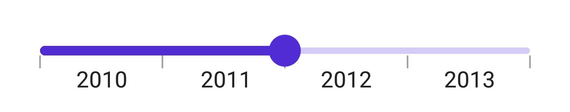
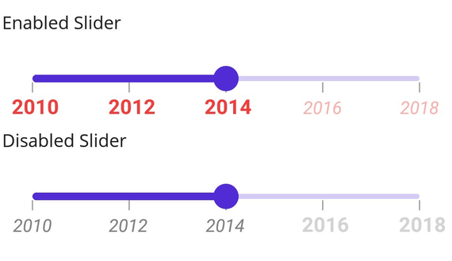

# Labels in .NET MAUI DateTime Slider (SfDateTimeSlider)

This section explains how to add and customize labels in the DateTime Slider.

## Show Labels

The [`ShowLabels`](https://help.syncfusion.com/cr/maui/Syncfusion.Maui.Sliders.RangeView-1.html#Syncfusion_Maui_Sliders_RangeView_1_ShowLabels) property renders labels at specified intervals. By default, this property is set to `False`.





<sliders:SfDateTimeSlider Minimum="2010-01-01"
                          Maximum="2018-01-01"
                          Value="2014-01-01"
                          Interval="2"
                          ShowLabels="True"
                          ShowTicks="True" />





SfDateTimeSlider slider = new SfDateTimeSlider();
slider.Minimum = new DateTime(2010, 01, 01);
slider.Maximum = new DateTime(2018, 01, 01);
slider.Value = new DateTime(2014, 01, 01);
slider.Interval = 2;
slider.ShowTicks = true;
slider.ShowLabels = true;





## Date Format

The [`DateFormat`](https://help.syncfusion.com/cr/maui/Syncfusion.Maui.Sliders.SfDateTimeSlider.html#Syncfusion_Maui_Sliders_SfDateTimeSlider_DateFormat) property formats the date labels. It defaults to `string.Empty`.





<sliders:SfDateTimeSlider Minimum="2000-01-01T09:00:00"
                          Maximum="2000-01-01T17:00:00"
                          Value="2000-01-01T13:00:00"
                          ShowLabels="True"
                          ShowTicks="True"
                          IntervalType="Hours"
                          Interval="2"
                          DateFormat="h tt" />





SfDateTimeSlider slider = new SfDateTimeSlider();
slider.Minimum = new DateTime(2000, 01, 01, 09, 00, 00);
slider.Maximum = new DateTime(2000, 01, 01, 17, 00, 00);
slider.Value = new DateTime(2000, 01, 01, 13, 00, 00);
slider.Interval = 2;
slider.IntervalType = SliderDateIntervalType.Hours;
slider.DateFormat = "h tt";
slider.ShowLabels = true;
slider.ShowTicks = true;
    




## Label Placement

Use the [`LabelsPlacement`](https://help.syncfusion.com/cr/maui/Syncfusion.Maui.Sliders.RangeView-1.html#Syncfusion_Maui_Sliders_RangeView_1_LabelsPlacement) property to position labels either between major ticks or on them. The default is [`SliderLabelsPlacement.OnTicks`](https://help.syncfusion.com/cr/maui/Syncfusion.Maui.Sliders.SliderLabelsPlacement.html#Syncfusion_Maui_Sliders_SliderLabelsPlacement_OnTicks).





<sliders:SfDateTimeSlider Minimum="2010-01-01"
                          Maximum="2014-01-01"
                          Value="2012-01-01"
                          Interval="1"
                          LabelsPlacement="BetweenTicks"
                          ShowLabels="True"
                          ShowTicks="True" />





SfDateTimeSlider slider = new SfDateTimeSlider();
slider.Minimum = new DateTime(2010, 01, 01);
slider.Maximum = new DateTime(2014, 01, 01);
slider.Value = new DateTime(2012, 01, 01);
slider.Interval = 1;
slider.LabelsPlacement = SliderLabelsPlacement.BetweenTicks;
slider.ShowLabels = true;
slider.ShowTicks = true;





> Note: Refer [here](https://help.syncfusion.com/maui/slider/events) to customize label text formats through slider events.

## Edge Labels Placement

Use the [`EdgeLabelsPlacement`](https://help.syncfusion.com/cr/maui/Syncfusion.Maui.Sliders.RangeView-1.html#Syncfusion_Maui_Sliders_RangeView_1_EdgeLabelsPlacement) property to move the first and last label either inside the track bounds or based on intervals. The default is [`SliderEdgeLabelPlacement.Default`](https://help.syncfusion.com/cr/maui/Syncfusion.Maui.Sliders.SliderEdgeLabelsPlacement.html#Syncfusion_Maui_Sliders_SliderEdgeLabelsPlacement_Default).

If [`TrackExtent`](https://help.syncfusion.com/cr/maui/Syncfusion.Maui.Sliders.RangeView-1.html#Syncfusion_Maui_Sliders_RangeView_1_TrackExtent) > 0 and `EdgeLabelsPlacement` is set to [`SliderEdgeLabelsPlacement.Inside`](https://help.syncfusion.com/cr/maui/Syncfusion.Maui.Sliders.SliderEdgeLabelsPlacement.html#Syncfusion_Maui_Sliders_SliderEdgeLabelsPlacement_Inside), labels are placed inside the extended track edges.





<sliders:SfDateTimeSlider Minimum="2010-01-01" 
                          Maximum="2018-01-01" 
                          Value="2014-01-01" 
                          Interval="2"
                          EdgeLabelsPlacement="Inside"
                          ShowLabels="True"
                          ShowTicks="True" />





SfDateTimeSlider slider = new SfDateTimeSlider();
slider.Minimum = new DateTime(2010, 01, 01);
slider.Maximum = new DateTime(2018, 01, 01);
slider.Value = new DateTime(2014, 01, 01);
slider.Interval = 2;
slider.EdgeLabelsPlacement = SliderEdgeLabelsPlacement.Inside;
slider.ShowLabels = true;
slider.ShowTicks = true;





## Label Style

Change the active and inactive label appearance of the slider using the [`ActiveTextColor`](https://help.syncfusion.com/cr/maui/Syncfusion.Maui.Sliders.SliderLabelStyle.html#Syncfusion_Maui_Sliders_SliderLabelStyle_ActiveTextColor), [`ActiveFontSize`](https://help.syncfusion.com/cr/maui/Syncfusion.Maui.Sliders.SliderLabelStyle.html#Syncfusion_Maui_Sliders_SliderLabelStyle_ActiveFontSize), [`ActiveFontFamily`](https://help.syncfusion.com/cr/maui/Syncfusion.Maui.Sliders.SliderLabelStyle.html#Syncfusion_Maui_Sliders_SliderLabelStyle_ActiveFontFamily), [`ActiveFontAttributes`](https://help.syncfusion.com/cr/maui/Syncfusion.Maui.Sliders.SliderLabelStyle.html#Syncfusion_Maui_Sliders_SliderLabelStyle_ActiveFontAttributes), [`InactiveTextColor`](https://help.syncfusion.com/cr/maui/Syncfusion.Maui.Sliders.SliderLabelStyle.html#Syncfusion_Maui_Sliders_SliderLabelStyle_InactiveTextColor), [`InactiveFontSize`](https://help.syncfusion.com/cr/maui/Syncfusion.Maui.Sliders.SliderLabelStyle.html#Syncfusion_Maui_Sliders_SliderLabelStyle_InactiveFontSize), [`InactiveFontFamily`](https://help.syncfusion.com/cr/maui/Syncfusion.Maui.Sliders.SliderLabelStyle.html#Syncfusion_Maui_Sliders_SliderLabelStyle_InactiveFontFamily), [`InactiveFontAttributes`](https://help.syncfusion.com/cr/maui/Syncfusion.Maui.Sliders.SliderLabelStyle.html#Syncfusion_Maui_Sliders_SliderLabelStyle_InactiveFontAttributes), and [`Offset`](https://help.syncfusion.com/cr/maui/Syncfusion.Maui.Sliders.SliderLabelStyle.html#Syncfusion_Maui_Sliders_SliderLabelStyle_Offset)  properties of the [`LabelStyle`](https://help.syncfusion.com/cr/maui/Syncfusion.Maui.Sliders.SliderLabelStyle.html) class.

The active side of the slider is between the [`Minimum`](https://help.syncfusion.com/cr/maui/Syncfusion.Maui.Sliders.SfSlider.html#Syncfusion_Maui_Sliders_SfSlider_Minimum) value and the thumb.

The inactive side of the slider is between the thumb and the [`Maximum`](https://help.syncfusion.com/cr/maui/Syncfusion.Maui.Sliders.SfSlider.html#Syncfusion_Maui_Sliders_SfSlider_Maximum) value.





<sliders:SfDateTimeSlider Minimum="2010-01-01"
                          Maximum="2018-01-01"
                          Value="2014-01-01"
                          Interval="2"
                          ShowTicks="True"
                          ShowLabels="True">
    
    <sliders:SfDateTimeSlider.LabelStyle>
        <sliders:SliderLabelStyle ActiveTextColor="#EE3F3F"
                                  InactiveTextColor="#F7B1AE"
                                  ActiveFontAttributes="Italic"
                                  InactiveFontAttributes="Bold"
                                  ActiveFontSize="16"
                                  InactiveFontSize="16" />
    </sliders:SfDateTimeSlider.LabelStyle>
    
</sliders:SfDateTimeSlider>





SfDateTimeSlider slider = new SfDateTimeSlider();
slider.Minimum = new DateTime(2010, 01, 01);
slider.Maximum = new DateTime(2018, 01, 01);
slider.Value = new DateTime(2014, 01, 01);
slider.Interval = 2;
slider.ShowLabels = true;
slider.ShowTicks = true;
slider.LabelStyle.ActiveTextColor = Color.FromArgb("#EE3F3F");
slider.LabelStyle.InactiveTextColor = Color.FromArgb("#F7B1AE");
slider.LabelStyle.ActiveFontSize = 16;
slider.LabelStyle.InactiveFontSize = 16;
slider.LabelStyle.ActiveFontAttributes = FontAttributes.Italic;
slider.LabelStyle.InactiveFontAttributes = FontAttributes.Bold;





## Label Offset

Adjust the space between ticks and labels using the [`Offset`](https://help.syncfusion.com/cr/maui/Syncfusion.Maui.Sliders.SliderLabelStyle.html#Syncfusion_Maui_Sliders_SliderLabelStyle_OffsetProperty) property. The default `Offset` is `5.0` when [`ShowTicks`](https://help.syncfusion.com/cr/maui/Syncfusion.Maui.Sliders.RangeView-1.html#Syncfusion_Maui_Sliders_RangeView_1_ShowTicks) is enabled, otherwise it's `15.0`.





<sliders:SfDateTimeSlider Minimum="2010-01-01"
                          Maximum="2018-01-01"
                          Value="2014-01-01"
                          Interval="2"
                          ShowTicks="True"
                          ShowLabels="True">

    <sliders:SfDateTimeSlider.LabelStyle>
        <sliders:SliderLabelStyle Offset="15" />
    </sliders:SfDateTimeSlider.LabelStyle>

</sliders:SfDateTimeSlider>





SfDateTimeSlider slider = new SfDateTimeSlider();
slider.Minimum = new DateTime(2010, 01, 01);
slider.Maximum = new DateTime(2018, 01, 01);
slider.Value = new DateTime(2014, 01, 01);
slider.Interval = 2;
slider.ShowLabels = true;
slider.ShowTicks = true;
slider.LabelStyle.Offset = 15;





## Disabled Labels

Disable the slider by setting the `IsEnabled` property to `false`. Customize label properties for each visual state using the Visual State Manager (VSM). The default states include enabled and disabled.




<ContentPage.Resources>
    
</ContentPage.Resources>

<ContentPage.Content>
    <VerticalStackLayout>
        <Label Text="Enabled"
               Padding="10" />
        <sliders:SfDateTimeSlider />
        <Label Text="Disabled"
               Padding="10" />
        <sliders:SfDateTimeSlider IsEnabled="False" />
    </VerticalStackLayout>
</ContentPage.Content>





VerticalStackLayout stackLayout = new();
SfDateTimeSlider defaultSlider = new()
{
    Minimum = new DateTime(2010, 01, 01),
    Maximum = new DateTime(2018, 01, 01),
    Value = new DateTime(2014, 01, 01),
    Interval = 2,
    ShowTicks = true,
    ShowLabels = true
};
SfDateTimeSlider disabledSlider = new()
{
    Minimum = new DateTime(2010, 01, 01),
    Maximum = new DateTime(2018, 01, 01),
    Value = new DateTime(2014, 01, 01),
    IsEnabled = false,
    Interval = 2,
    ShowTicks = true,
    ShowLabels = true
};

VisualStateGroupList visualStateGroupList = new();
VisualStateGroup commonStateGroup = new();
// Default State.
VisualState defaultState = new() { Name = "Default" };
defaultState.Setters.Add(new Setter
{
    Property = SfDateTimeSlider.LabelStyleProperty,
    Value = new SliderLabelStyle
    {
        ActiveFontSize = 16,
        InactiveFontSize = 14,
        ActiveTextColor = Color.FromArgb("#EE3F3F"),
        InactiveTextColor = Color.FromArgb("#F7B1AE"),
        ActiveFontAttributes = FontAttributes.Bold,
        InactiveFontAttributes = FontAttributes.Italic,
    }
});
// Disabled State.
VisualState disabledState = new VisualState { Name = "Disabled" };
disabledState.Setters.Add(new Setter
{
    Property = SfDateTimeSlider.LabelStyleProperty,
    Value = new SliderLabelStyle
    {
        ActiveFontSize = 16,
        InactiveFontSize = 14,
        ActiveTextColor = Color.FromArgb("#EE3F3F"),
        InactiveTextColor = Color.FromArgb("#F7B1AE"),
        ActiveFontAttributes = FontAttributes.Italic,
        InactiveFontAttributes = FontAttributes.Bold,
    }
});
disabledState.Setters.Add(new Setter
{
    Property = SfDateTimeSlider.ThumbStyleProperty,
    Value = new SliderThumbStyle
    {
        Fill = Colors.Gray,
    }
});
disabledState.Setters.Add(new Setter
{
    Property = SfDateTimeSlider.TrackStyleProperty,
    Value = new SliderTrackStyle
    {
        ActiveFill = Colors.Gray,
        InactiveFill = Colors.LightGray,
    }
});

commonStateGroup.States.Add(defaultState);
commonStateGroup.States.Add(disabledState);
visualStateGroupList.Add(commonStateGroup);
VisualStateManager.SetVisualStateGroups(defaultSlider, visualStateGroupList);
VisualStateManager.SetVisualStateGroups(disabledSlider, visualStateGroupList);

stackLayout.Children.Add(new Label() { Text = "Enabled", Padding = new Thickness(10) });
stackLayout.Children.Add(defaultSlider);
stackLayout.Children.Add(new Label() { Text = "Disabled", Padding = new Thickness(10) });
stackLayout.Children.Add(disabledSlider);
this.Content = stackLayout;





