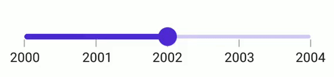

# Value selection in .NET MAUI DateTime Slider (SfDateTimeSlider)

This section helps to learn about customization options available to configure the value selection in the DateTime Slider.

## Default

By default, the thumb gets moved on continuous manner in the DateTime Slider. 





<sliders:SfSlider Minimum="20"
                  Maximum="40"
                  Interval="5"
                  Value="30"
                  ShowLabels="True"
                  ShowTicks="True"
                  ShowDividers="True" />                 





SfSlider slider = new SfSlider()
{
    Minimum = 20,
    Maximum = 40,
    Value = 30,
    Interval = 5,
    ShowTicks = true,
    ShowLabels = true,
    ShowDividers = true,
};
         




## Discrete selection

Move the thumb in discrete manner for date values using the [`StepDuration`](https://help.syncfusion.com/cr/maui/Syncfusion.Maui.Sliders.SfDateTimeSlider.html#Syncfusion_Maui_Sliders_SfDateTimeSlider_StepDuration) property in the slider.

For example, if the [`Minimum`](https://help.syncfusion.com/cr/maui/Syncfusion.Maui.Sliders.SfDateTimeSlider.html#Syncfusion_Maui_Sliders_SfDateTimeSlider_Minimum) is DateTime(2015, 01, 01), the [`Maximum`](https://help.syncfusion.com/cr/maui/Syncfusion.Maui.Sliders.SfDateTimeSlider.html#Syncfusion_Maui_Sliders_SfDateTimeSlider_Maximum) is DateTime(2020, 01, 01), and [`StepDuration`](https://help.syncfusion.com/cr/maui/Syncfusion.Maui.Sliders.SfDateTimeSlider.html#Syncfusion_Maui_Sliders_SfDateTimeSlider_StepDuration) is `1`,the slider will move the thumbs at DateTime(2015, 01, 01), DateTime(2016, 01, 01), DateTime(2017, 01, 01),and DateTime(2018, 01, 01).





<sliders:SfDateTimeSlider Minimum="2000-01-01"
                          Maximum="2005-01-01"
                          Value="2002-01-01"
                          StepDuration="1"
                          IntervalType="Years" />





SfDateTimeSlider slider = new SfDateTimeSlider()
{
    Minimum = new DateTime(2000, 01, 01),
    Maximum = new DateTime(2005, 01, 01),
    Value = new DateTime(2002, 01, 01),
    StepDuration = new SliderStepDuration(years: 1),
    IntervalType = SliderDateIntervalType.Years,
};





