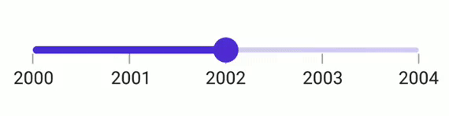

# Value selection in .NET MAUI DateTime Slider (SfDateTimeSlider)

This section helps to learn about the value selection in the DateTime Slider.

## Discrete selection

Move the thumb in discrete manner for date values using the [`StepDuration`](https://help.syncfusion.com/cr/maui/Syncfusion.Maui.Sliders.SfDateTimeSlider.html#Syncfusion_Maui_Sliders_SfDateTimeSlider_StepDuration) property in the slider.

For example, if the [`Minimum`](https://help.syncfusion.com/cr/maui/Syncfusion.Maui.Sliders.RangeView-1.html#Syncfusion_Maui_Sliders_RangeView_1_Minimum) is DateTime(2015, 01, 01), the [`Maximum`](https://help.syncfusion.com/cr/maui/Syncfusion.Maui.Sliders.RangeView-1.html#Syncfusion_Maui_Sliders_RangeView_1_Maximum) is DateTime(2020, 01, 01), and [`StepDuration`](https://help.syncfusion.com/cr/maui/Syncfusion.Maui.Sliders.SfDateTimeSlider.html#Syncfusion_Maui_Sliders_SfDateTimeSlider_StepDuration) is `1`,the slider will move the thumbs at DateTime(2015, 01, 01), DateTime(2016, 01, 01), DateTime(2017, 01, 01),and DateTime(2018, 01, 01).





<sliders:SfDateTimeSlider Minimum="2000-01-01"
                          Maximum="2004-01-01"
                          Value="2002-01-01"
                          Interval="1"
                          StepDuration="1"
                          IntervalType="Years"
                          ShowTicks="True"
                          ShowLabels="True" />





SfDateTimeSlider slider = new SfDateTimeSlider()
{
    Minimum = new DateTime(2000, 01, 01),
    Maximum = new DateTime(2004, 01, 01),
    Value = new DateTime(2002, 01, 01),
    Interval = 1,
    StepDuration = new SliderStepDuration(years: 1),
    IntervalType = SliderDateIntervalType.Years,
    ShowTicks = true,
    ShowLabels = true,
};





## Deferred update

You can control when the dependent components are updated while thumbs are being dragged continuously. It can be achieved by setting the `EnableDeferredUpdate` property and the delay in the update can be achieved by setting the `DeferredUpdateDelay` property. The default value of the `DeferredUpdateDelay` property is `500` milliseconds.

It invokes the `ValueChanging` event when the thumb is dragged and held for the duration specified in the `DeferredUpdateDelay`. However, the values are immediately updated in touch-up action.





<sliders:SfDateTimeSlider Minimum="2000-01-01"
                          Maximum="2004-01-01"
                          Value="2002-01-01"
                          Interval="1"
                          ShowTicks="True"
                          ShowLabels="True"
                          EnableDeferredUpdate="True"
                          DeferredUpdateDelay="1000" />





SfDateTimeSlider slider = new SfDateTimeSlider()
{
    Minimum = new DateTime(2000, 01, 01),
    Maximum = new DateTime(2004, 01, 01),
    Value = new DateTime(2002, 01, 01),
    Interval = 1,
    ShowTicks = true,
    ShowLabels = true,
    EnableDeferredUpdate = true,
    DeferredUpdateDelay = 1000,
};



