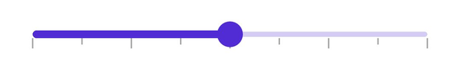
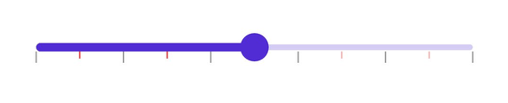
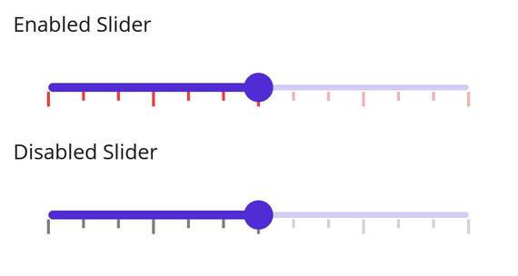

# Tick in .NET MAUI Slider (SfDateTimeSlider)

This section helps to learn about how to add major and minor ticks in the DateTime Slider.

## Show major ticks

Enable the major ticks on the track. It is a shape used to represent the major interval points of the track. The default value of the [`ShowTicks`](https://help.syncfusion.com/cr/maui/Syncfusion.Maui.Sliders.RangeView-1.html#Syncfusion_Maui_Sliders_RangeView_1_ShowTicks) property is `False`.

For example, if the [`Minimum`](https://help.syncfusion.com/cr/maui/Syncfusion.Maui.Sliders.RangeView-1.html#Syncfusion_Maui_Sliders_RangeView_1_Minimum) is `DateTime(2000, 01, 01)`, [`Maximum`](https://help.syncfusion.com/cr/maui/Syncfusion.Maui.Sliders.RangeView-1.html#Syncfusion_Maui_Sliders_RangeView_1_Maximum) is `DateTime(2018, 01, 01)`, and [`Interval`](https://help.syncfusion.com/cr/maui/Syncfusion.Maui.Sliders.RangeView-1.html#Syncfusion_Maui_Sliders_RangeView_1_Interval) is 1, the range slider will render the major ticks at 2000, 2001, 2002, and so on.

### Without Interval





<sliders:SfDateTimeSlider Minimum="2010-01-01" 
                          Maximum="2018-01-01" 
                          Value="2014-01-01" 
                          ShowTicks="True" />





SfDateTimeSlider slider = new SfDateTimeSlider();
slider.Minimum = new DateTime(2010, 01, 01);
slider.Maximum = new DateTime(2018, 01, 01);
slider.Value = new DateTime(2014, 01, 01);
slider.ShowTicks = true;





### With Interval





<sliders:SfDateTimeSlider Minimum="2010-01-01" 
                          Maximum="2020-01-01" 
                          Value="2015-01-01"
                          Interval="2" 
                          ShowTicks="True">
</sliders:SfDateTimeSlider>





SfDateTimeSlider slider = new SfDateTimeSlider();
slider.Minimum = new DateTime(2010, 01, 01);
slider.Maximum = new DateTime(2020, 01, 01);
slider.Value = new DateTime(2015, 01, 01);
slider.Interval = 2;
slider.ShowTicks = true;





## Show minor ticks

It is used to represent the number of smaller ticks between two major ticks. For example, if the [`Minimum`](https://help.syncfusion.com/cr/maui/Syncfusion.Maui.Sliders.RangeView-1.html#Syncfusion_Maui_Sliders_RangeView_1_Minimum) is `DateTime(2010, 01, 01)`, the [`Maximum`](https://help.syncfusion.com/cr/maui/Syncfusion.Maui.Sliders.RangeView-1.html#Syncfusion_Maui_Sliders_RangeView_1_Maximum) is `DateTime(2018, 01, 01)`, and [`Interval`](https://help.syncfusion.com/cr/maui/Syncfusion.Maui.Sliders.RangeView-1.html#Syncfusion_Maui_Sliders_RangeView_1_Interval) is 1, the DateTime Slider will render the major ticks at 2010, 2011, 2012, and so on. If the [`MinorTicksPerInterval`](https://help.syncfusion.com/cr/maui/Syncfusion.Maui.Sliders.RangeView-1.html#Syncfusion_Maui_Sliders_RangeView_1_MinorTicksPerInterval) is 1, then smaller ticks will be rendered between 2010 and 2011, so on. The default value of the [`MinorTicksPerInterval`](https://help.syncfusion.com/cr/maui/Syncfusion.Maui.Sliders.RangeView-1.html#Syncfusion_Maui_Sliders_RangeView_1_MinorTicksPerInterval) property is `0`.

### Without Interval





<sliders:SfDateTimeSlider Minimum="2010-01-01" 
                          Maximum="2018-01-01" 
                          Value="2014-01-01"
                          MinorTicksPerInterval="7" 
		                  ShowTicks="True">
</sliders:SfDateTimeSlider>





SfDateTimeSlider slider = new SfDateTimeSlider();
slider.Minimum = new DateTime(2010, 01, 01);
slider.Maximum = new DateTime(2018, 01, 01);
slider.Value = new DateTime(2014, 01, 01);
slider.MinorTicksPerInterval = 7;
slider.ShowTicks = true;





### With Interval





<sliders:SfDateTimeSlider Minimum="2010-01-01" 
                          Maximum="2020-01-01" 
                          Value="2015-01-01"
                          Interval="2" 
                          MinorTicksPerInterval="1" 
		                  ShowTicks="True">
</sliders:SfDateTimeSlider>





SfDateTimeSlider slider = new SfDateTimeSlider();
slider.Minimum = new DateTime(2010, 01, 01);
slider.Maximum = new DateTime(2020, 01, 01);
slider.Value = new DateTime(2015, 01, 01);
slider.Interval = 2;
slider.MinorTicksPerInterval = 1;
slider.ShowTicks = true;





## Major ticks color

Change the active and inactive major ticks color of the slider using the [`ActiveFill`](https://help.syncfusion.com/cr/maui/Syncfusion.Maui.Sliders.SliderTickStyle.html#Syncfusion_Maui_Sliders_SliderTickStyle_ActiveFill) and [`InactiveFill`](https://help.syncfusion.com/cr/maui/Syncfusion.Maui.Sliders.SliderTickStyle.html#Syncfusion_Maui_Sliders_SliderTickStyle_InactiveFill) properties of the [`MajorTickStyle`](https://help.syncfusion.com/cr/maui/Syncfusion.Maui.Sliders.RangeView-1.html#Syncfusion_Maui_Sliders_RangeView_1_MajorTickStyle) class.

The active side of the slider is between the [`Minimum`](https://help.syncfusion.com/cr/maui/Syncfusion.Maui.Sliders.SfSlider.html#Syncfusion_Maui_Sliders_SfSlider_Minimum) value and the thumb.

The inactive side of the slider is between the thumb and the [`Maximum`](https://help.syncfusion.com/cr/maui/Syncfusion.Maui.Sliders.SfSlider.html#Syncfusion_Maui_Sliders_SfSlider_Maximum) value.





<sliders:SfDateTimeSlider Minimum="2010-01-01" 
                          Maximum="2020-01-01" 
                          Value="2015-01-01"
                          Interval="2" 
                          ShowTicks="True">
   <sliders:SfDateTimeSlider.MajorTickStyle>
      <sliders:SliderTickStyle ActiveFill="#EE3F3F" 
                               InactiveFill="#F7B1AE"/>
    </sliders:SfDateTimeSlider.MajorTickStyle>
</sliders:SfDateTimeSlider>





SfDateTimeSlider slider = new SfDateTimeSlider();
slider.Minimum = new DateTime(2010, 01, 01);
slider.Maximum = new DateTime(2020, 01, 01);
slider.Value = new DateTime(2015, 01, 01);
slider.Interval = 2;
slider.ShowTicks = true;
slider.MajorTickStyle.ActiveFill = new SolidColorBrush(Color.FromArgb("#EE3F3F"));
slider.MajorTickStyle.InactiveFill = new SolidColorBrush(Color.FromArgb("#F7B1AE"));





## Minor ticks color

Change the active and inactive minor ticks color of the slider using the [`ActiveFill`](https://help.syncfusion.com/cr/maui/Syncfusion.Maui.Sliders.SliderTickStyle.html#Syncfusion_Maui_Sliders_SliderTickStyle_ActiveFill) and [`InactiveFill`](https://help.syncfusion.com/cr/maui/Syncfusion.Maui.Sliders.SliderTickStyle.html#Syncfusion_Maui_Sliders_SliderTickStyle_InactiveFill) properties of the [`MinorTickStyle`](https://help.syncfusion.com/cr/maui/Syncfusion.Maui.Sliders.RangeView-1.html#Syncfusion_Maui_Sliders_RangeView_1_MinorTickStyle) class.

The active side of the slider is between the [`Minimum`](https://help.syncfusion.com/cr/maui/Syncfusion.Maui.Sliders.SfSlider.html#Syncfusion_Maui_Sliders_SfSlider_Minimum) value and the thumb.

The inactive side of the slider is between the thumb and the [`Maximum`](https://help.syncfusion.com/cr/maui/Syncfusion.Maui.Sliders.SfSlider.html#Syncfusion_Maui_Sliders_SfSlider_Maximum) value.





<sliders:SfDateTimeSlider Minimum="2010-01-01" 
                          Maximum="2018-01-01" 
                          Value="2014-01-01"
                          Interval="2"
                          ShowTicks="True"
                          MinorTicksPerInterval="1">
     <sliders:SfDateTimeSlider.MinorTickStyle>
        <sliders:SliderTickStyle ActiveFill="#EE3F3F" 
                                 InactiveFill="#F7B1AE"/>
      </sliders:SfDateTimeSlider.MinorTickStyle>
</sliders:SfDateTimeSlider> 





SfDateTimeSlider slider = new SfDateTimeSlider();
slider.Minimum = new DateTime(2010, 01, 01);
slider.Maximum = new DateTime(2018, 01, 01);
slider.Value = new DateTime(2014, 01, 01);
slider.Interval = 2;
slider.ShowTicks = true;
slider.MinorTicksPerInterval = 1;
slider.MinorTickStyle.ActiveFill = new SolidColorBrush(Color.FromArgb("#EE3F3F"));
slider.MinorTickStyle.InactiveFill = new SolidColorBrush(Color.FromArgb("#F7B1AE"));





## Tick size

Change the major and minor tick size of the slider using the [`ActiveSize`](https://help.syncfusion.com/cr/maui/Syncfusion.Maui.Sliders.SliderTickStyle.html#Syncfusion_Maui_Sliders_SliderTickStyle_ActiveSize) and [`InactiveSize`](https://help.syncfusion.com/cr/maui/Syncfusion.Maui.Sliders.SliderTickStyle.html#Syncfusion_Maui_Sliders_SliderTickStyle_InactiveSize) property of the [`MajorTickStyle`](https://help.syncfusion.com/cr/maui/Syncfusion.Maui.Sliders.RangeView-1.html#Syncfusion_Maui_Sliders_RangeView_1_MajorTickStyle) and [`MinorTickStyle`](https://help.syncfusion.com/cr/maui/Syncfusion.Maui.Sliders.RangeView-1.html#Syncfusion_Maui_Sliders_RangeView_1_MinorTickStyle)  classes. The default value is `Size(2.0, 8.0)`.





<sliders:SfDateTimeSlider Minimum="2010-01-01" 
                          Maximum="2020-01-01" 
                          Value="2015-01-01"
                          Interval="2" 
                          ShowTicks="True" 
		                  MinorTicksPerInterval="1">
     <sliders:SfDateTimeSlider.MinorTickStyle>
         <sliders:SliderTickStyle ActiveSize="2,10" 
                                  InactiveSize="2, 10"/>
     </sliders:SfDateTimeSlider.MinorTickStyle>
     <sliders:SfDateTimeSlider.MajorTickStyle>
         <sliders:SliderTickStyle ActiveSize="2,15" 
                                  InactiveSize="2, 15"/>
     </sliders:SfDateTimeSlider.MajorTickStyle>
</sliders:SfDateTimeSlider>





SfDateTimeSlider slider = new SfDateTimeSlider();
slider.Minimum = new DateTime(2010, 01, 01);
slider.Maximum = new DateTime(2020, 01, 01);
slider.Value = new DateTime(2015, 01, 01);
slider.Interval = 2;
slider.ShowTicks = true;
slider.MinorTicksPerInterval = 1;
slider.MinorTickStyle.ActiveSize = new Size(2, 10);
slider.MinorTickStyle.InactiveSize = new Size(2, 10);
slider.MajorTickStyle.ActiveSize = new Size(2, 15);
slider.MajorTickStyle.InactiveSize = new Size(2, 15);
    




## Tick offset

Adjust the space between track and tick of the slider using the [`Offset`](https://help.syncfusion.com/cr/maui/Syncfusion.Maui.Sliders.SliderTickStyle.html#Syncfusion_Maui_Sliders_SliderTickStyle_Offset) property of the [`MajorTickStyle`](https://help.syncfusion.com/cr/maui/Syncfusion.Maui.Sliders.RangeView-1.html#Syncfusion_Maui_Sliders_RangeView_1_MajorTickStyle) and [`MinorTickStyle`](https://help.syncfusion.com/cr/maui/Syncfusion.Maui.Sliders.RangeView-1.html#Syncfusion_Maui_Sliders_RangeView_1_MinorTickStyle). The default value of the [`Offset`](https://help.syncfusion.com/cr/maui/Syncfusion.Maui.Sliders.SliderTickStyle.html#Syncfusion_Maui_Sliders_SliderTickStyle_Offset) property is `3.0`.





<sliders:SfDateTimeSlider Minimum="2010-01-01" 
                          Maximum="2020-01-01" 
                          Value="2015-01-01"
                          Interval="2"  
                          ShowTicks="True" 
                          MinorTicksPerInterval="1">
   <sliders:SfDateTimeSlider.MinorTickStyle>
       <sliders:SliderTickStyle Offset="5"/>
   </sliders:SfDateTimeSlider.MinorTickStyle>
   <sliders:SfDateTimeSlider.MajorTickStyle>
       <sliders:SliderTickStyle Offset="6"/>
    </sliders:SfDateTimeSlider.MajorTickStyle>
</sliders:SfDateTimeSlider>





SfDateTimeSlider slider = new SfDateTimeSlider();
slider.Minimum = new DateTime(2010, 01, 01);
slider.Maximum = new DateTime(2020, 01, 01);
slider.Value = new DateTime(2015, 01, 01);
slider.Interval = 2;
slider.ShowTicks = true;
slider.MinorTicksPerInterval = 1;
slider.MinorTickStyle.Offset = 5;
slider.MajorTickStyle.Offset = 6;





## Disabled ticks

Change the state of the slider to disabled by setting `false` to the `IsEnabled` property. Using the Visual State Manager (VSM), customize the slider’s major and minor tick properties based on the visual states. The applicable visual states are enabled(default) and disabled.





<ContentPage.Resources>
    
</ContentPage.Resources>

<ContentPage.Content>
    <VerticalStackLayout>
        <Label Text="Enabled"
               Padding="24,10" />
        <sliders:SfDateTimeSlider />
        <Label Text="Disabled"
               Padding="24,10" />
        <sliders:SfDateTimeSlider IsEnabled="False" />
    </VerticalStackLayout>
</ContentPage.Content>





VerticalStackLayout stackLayout = new VerticalStackLayout();
SfDateTimeSlider defaultSlider = new SfDateTimeSlider()
{
    Minimum = new DateTime(2010, 01, 01),
    Maximum = new DateTime(2018, 01, 01),
    Value = new DateTime(2014, 01, 01),
    Interval = 2,
    ShowTicks = true,
    MinorTicksPerInterval = 2
};
SfDateTimeSlider disabledSlider = new SfDateTimeSlider()
{
    Minimum = new DateTime(2010, 01, 01),
    Maximum = new DateTime(2018, 01, 01),
    Value = new DateTime(2014, 01, 01),
    IsEnabled = false,
    Interval = 2,
    ShowTicks = true,
    MinorTicksPerInterval = 2
};

VisualStateGroupList visualStateGroupList = new VisualStateGroupList();
VisualStateGroup commonStateGroup = new VisualStateGroup();
// Default State.
VisualState defaultState = new VisualState { Name = "Default" };
defaultState.Setters.Add(new Setter
{
    Property = SfDateTimeSlider.MajorTickStyleProperty,
    Value = new SliderTickStyle
    {
        ActiveSize = new Size(3, 10),
        InactiveSize = new Size(3, 10),
        ActiveFill = Color.FromArgb("#EE3F3F"),
        InactiveFill = Color.FromArgb("#F7B1AE"),
    }
});
defaultState.Setters.Add(new Setter
{
    Property = SfDateTimeSlider.MinorTickStyleProperty,
    Value = new SliderTickStyle
    {
        ActiveSize = new Size(3, 6),
        InactiveSize = new Size(3, 6),
        ActiveFill = Color.FromArgb("#EE3F3F"),
        InactiveFill = Color.FromArgb("#F7B1AE"),
    }
});
// Disabled State.
VisualState disabledState = new VisualState { Name = "Disabled" };
disabledState.Setters.Add(new Setter
{
    Property = SfDateTimeSlider.MajorTickStyleProperty,
    Value = new SliderTickStyle
    {
        ActiveSize = new Size(3, 10),
        InactiveSize = new Size(3, 10),
        ActiveFill = Colors.Gray,
        InactiveFill = Colors.LightGray,
    }
});
disabledState.Setters.Add(new Setter
{
    Property = SfDateTimeSlider.MinorTickStyleProperty,
    Value = new SliderTickStyle
    {
        ActiveSize = new Size(3, 6),
        InactiveSize = new Size(3, 6),
        ActiveFill = Colors.Gray,
        InactiveFill = Colors.LightGray,
    }
});
disabledState.Setters.Add(new Setter
{
    Property = SfDateTimeSlider.ThumbStyleProperty,
    Value = new SliderThumbStyle
    {
        Fill = Colors.Gray,
    }
});
disabledState.Setters.Add(new Setter
{
    Property = SfDateTimeSlider.TrackStyleProperty,
    Value = new SliderTrackStyle
    {
        ActiveFill = Colors.Gray,
        InactiveFill = Colors.LightGray,
    }
});

commonStateGroup.States.Add(defaultState);
commonStateGroup.States.Add(disabledState);
visualStateGroupList.Add(commonStateGroup);
VisualStateManager.SetVisualStateGroups(defaultSlider, visualStateGroupList);
VisualStateManager.SetVisualStateGroups(disabledSlider, visualStateGroupList);

stackLayout.Children.Add(new Label() { Text = "Enabled", Padding = new Thickness(24, 10) });
stackLayout.Children.Add(defaultSlider);
stackLayout.Children.Add(new Label() { Text = "Disabled", Padding = new Thickness(24, 10) });
stackLayout.Children.Add(disabledSlider);
this.Content = stackLayout;





