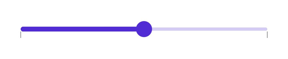

# Tick in .NET MAUI Slider (SfDateTimeSlider)

This section helps to learn about how to add major and minor ticks in the DateTime Slider.

## Show major ticks

You can enable the major ticks on the track. It is a shape which is used to represent the major interval points of the track. The default value of [`ShowTicks`](https://help.syncfusion.com/cr/maui/Syncfusion.Maui.Sliders.SliderBase.html#Syncfusion_Maui_Sliders_SliderBase_ShowTicks) property is `False`.

For example, if [`Minimum`](https://help.syncfusion.com/cr/maui/Syncfusion.Maui.Sliders.SfSlider.html#Syncfusion_Maui_Sliders_SfSlider_Minimum) is 0.0 and [`Maximum`](https://help.syncfusion.com/cr/maui/Syncfusion.Maui.Sliders.SfSlider.html#Syncfusion_Maui_Sliders_SfSlider_Maximum) is 10.0 and [`Interval`](https://help.syncfusion.com/cr/maui/Syncfusion.Maui.Sliders.SliderBase.html#Syncfusion_Maui_Sliders_SliderBase_Interval) is 2.0, the slider will render the major ticks at 0.0, 2.0, 4.0 and so on.

### Without Interval





<sliders:SfDateTimeSlider Minimum="2010-01-01" 
                          Maximum="2018-01-01" 
                          Value="2014-01-01" 
                          ShowTicks="True" />





SfDateTimeSlider slider = new SfDateTimeSlider();
slider.Minimum = new DateTime(2010, 01, 01);
slider.Maximum = new DateTime(2018, 01, 01);
slider.Value = new DateTime(2014, 01, 01);
slider.ShowTicks = true;





### With Interval





<sliders:SfDateTimeSlider Minimum="2010-01-01" 
                          Maximum="2020-01-01" 
                          Value="2014-01-01"
                          Interval="0.2" 
                          ShowTicks="True">
</sliders:SfDateTimeSlider>





SfDateTimeSlider slider = new SfDateTimeSlider();
slider.Minimum = new DateTime(2010, 01, 01);
slider.Maximum = new DateTime(2020, 01, 01);
slider.Value = new DateTime(2014, 01, 01);
slider.Interval = 0.2;
slider.ShowTicks = true;





## Show minor ticks

It is used to represent the number of smaller ticks between two major ticks. For example, if [`Minimum`](https://help.syncfusion.com/cr/maui/Syncfusion.Maui.Sliders.SfSlider.html#Syncfusion_Maui_Sliders_SfSlider_Minimum) is 0.0 and [`Maximum`](https://help.syncfusion.com/cr/maui/Syncfusion.Maui.Sliders.SfSlider.html#Syncfusion_Maui_Sliders_SfSlider_Maximum) is 10.0 and [`Interval`](https://help.syncfusion.com/cr/maui/Syncfusion.Maui.Sliders.SliderBase.html#Syncfusion_Maui_Sliders_SliderBase_Interval) is 2.0, the slider will render the major ticks at 0.0, 2.0, 4.0 and so on. If [`MinorTicksPerInterval`](https://help.syncfusion.com/cr/maui/Syncfusion.Maui.Sliders.SliderBase.html#Syncfusion_Maui_Sliders_SliderBase_MinorTicksPerInterval) is 1, then smaller ticks will be rendered on 1.0 and 3.0 and so on. The default value of [`MinorTicksPerInterval`](https://help.syncfusion.com/cr/maui/Syncfusion.Maui.Sliders.SliderBase.html#Syncfusion_Maui_Sliders_SliderBase_MinorTicksPerInterval) property is Zero.

### Without Interval





<sliders:SfDateTimeSlider Minimum="2010-01-01" 
                          Maximum="2018-01-01" 
                          Value="2014-01-01"
                          ShowLabels="True" 
                          MinorTicksPerInterval="7" 
		                  ShowTicks="True">
</sliders:SfDateTimeSlider>





SfDateTimeSlider slider = new SfDateTimeSlider();
slider.Minimum = new DateTime(2010, 01, 01);
slider.Maximum = new DateTime(2018, 01, 01);
slider.Value = new DateTime(2014, 01, 01);
slider.MinorTicksPerInterval = 7;
slider.ShowTicks = true;
slider.ShowLabels = true;





### With Interval





<sliders:SfDateTimeSlider Minimum="2010-01-01" 
                          Maximum="2020-01-01" 
                          Value="2014-01-01"
                          Interval="2" 
                          ShowLabels="True" 
                          MinorTicksPerInterval="1" 
		                  ShowTicks="True">
</sliders:SfDateTimeSlider>





SfDateTimeSlider slider = new SfDateTimeSlider();
slider.Minimum = new DateTime(2010, 01, 01);
slider.Maximum = new DateTime(2020, 01, 01);
slider.Value = new DateTime(2014, 01, 01);
slider.Interval = 2;
slider.MinorTicksPerInterval = 1;
slider.ShowTicks = true;
slider.ShowLabels = true;





## Major ticks color

You can change the active and inactive major ticks color of the slider using the [`ActiveFill`](https://help.syncfusion.com/cr/maui/Syncfusion.Maui.Sliders.SliderTickStyle.html#Syncfusion_Maui_Sliders_SliderTickStyle_ActiveFill) and [`InactiveFill`](https://help.syncfusion.com/cr/maui/Syncfusion.Maui.Sliders.SliderTickStyle.html#Syncfusion_Maui_Sliders_SliderTickStyle_InactiveFill) properties of the [`MajorTickStyle`](https://help.syncfusion.com/cr/maui/Syncfusion.Maui.Sliders.SliderBase.html#Syncfusion_Maui_Sliders_SliderBase_MajorTickStyle) class.

The active side of the slider is between the [`Minimum`](https://help.syncfusion.com/cr/maui/Syncfusion.Maui.Sliders.SfSlider.html#Syncfusion_Maui_Sliders_SfSlider_Minimum) value and the thumb.

The inactive side of the slider is between the thumb and the [`Maximum`](https://help.syncfusion.com/cr/maui/Syncfusion.Maui.Sliders.SfSlider.html#Syncfusion_Maui_Sliders_SfSlider_Maximum) value.





<sliders:SfDateTimeSlider Minimum="2010-01-01" 
                          Maximum="2020-01-01" 
                          Value="2015-01-01"
                          Interval="2" 
                          ShowTicks="True">
   <sliders:SfDateTimeSlider.MajorTickStyle>
      <sliders:SliderTickStyle ActiveFill="#EE3F3F" 
                               InactiveFill="#F7B1AE"/>
    </sliders:SfDateTimeSlider.MajorTickStyle>
</sliders:SfDateTimeSlider>





SfDateTimeSlider slider = new SfDateTimeSlider();
slider.Minimum = new DateTime(2010, 01, 01);
slider.Maximum = new DateTime(2020, 01, 01);
slider.Value = new DateTime(2015, 01, 01);
slider.Interval = 2;
slider.ShowTicks = true;
slider.MajorTickStyle.ActiveFill = new SolidColorBrush(Color.FromArgb("#EE3F3F"));
slider.MajorTickStyle.InactiveFill = new SolidColorBrush(Color.FromArgb("#F7B1AE"));





## Minor ticks color

You can change the active and inactive minor ticks color of the slider using the [`ActiveFill`](https://help.syncfusion.com/cr/maui/Syncfusion.Maui.Sliders.SliderTickStyle.html#Syncfusion_Maui_Sliders_SliderTickStyle_ActiveFill) and [`InactiveFill`](https://help.syncfusion.com/cr/maui/Syncfusion.Maui.Sliders.SliderTickStyle.html#Syncfusion_Maui_Sliders_SliderTickStyle_InactiveFill) properties of the [`MinorTickStyle`](https://help.syncfusion.com/cr/maui/Syncfusion.Maui.Sliders.SliderBase.html#Syncfusion_Maui_Sliders_SliderBase_MinorTickStyle) class.

The active side of the slider is between the [`Minimum`](https://help.syncfusion.com/cr/maui/Syncfusion.Maui.Sliders.SfSlider.html#Syncfusion_Maui_Sliders_SfSlider_Minimum) value and the thumb.

The inactive side of the slider is between the thumb and the [`Maximum`](https://help.syncfusion.com/cr/maui/Syncfusion.Maui.Sliders.SfSlider.html#Syncfusion_Maui_Sliders_SfSlider_Maximum) value.





<sliders:SfDateTimeSlider Minimum="2010-01-01" 
                          Maximum="2018-01-01" 
                          Value="2014-01-01"
                          Interval="2"
                          ShowTicks="True"
                          ShowLabels="True" 
                          MinorTicksPerInterval="1">
     <sliders:SfDateTimeSlider.MinorTickStyle>
        <sliders:SliderTickStyle ActiveFill="#EE3F3F" 
                                 InactiveFill="#F7B1AE"/>
      </sliders:SfDateTimeSlider.MinorTickStyle>
</sliders:SfDateTimeSlider> 





SfDateTimeSlider slider = new SfDateTimeSlider();
slider.Minimum = new DateTime(2010, 01, 01);
slider.Maximum = new DateTime(2018, 01, 01);
slider.Value = new DateTime(2014, 01, 01);
slider.Interval = 2;
slider.ShowTicks = true;
slider.ShowLabels = true;
slider.MinorTicksPerInterval = 1;
slider.MinorTickStyle.ActiveFill = new SolidColorBrush(Color.FromArgb("#EE3F3F"));
slider.MinorTickStyle.InactiveFill = new SolidColorBrush(Color.FromArgb("#F7B1AE"));





## Tick size

You can change the major and minor tick size of the slider using the [`ActiveSize`](https://help.syncfusion.com/cr/maui/Syncfusion.Maui.Sliders.SliderTickStyle.html#Syncfusion_Maui_Sliders_SliderTickStyle_ActiveSize) and [`InactiveSize`](https://help.syncfusion.com/cr/maui/Syncfusion.Maui.Sliders.SliderTickStyle.html#Syncfusion_Maui_Sliders_SliderTickStyle_InactiveSize) property of the [`MajorTickStyle`](https://help.syncfusion.com/cr/maui/Syncfusion.Maui.Sliders.SliderBase.html#Syncfusion_Maui_Sliders_SliderBase_MajorTickStyle) and [`MinorTickStyle`](https://help.syncfusion.com/cr/maui/Syncfusion.Maui.Sliders.SliderBase.html#Syncfusion_Maui_Sliders_SliderBase_MinorTickStyle)  classes. The default value is is `Size(2.0, 8.0)`.





<sliders:SfDateTimeSlider Minimum="2010-01-01" 
                          Maximum="2020-01-01" 
                          Value="2015-01-01"
                          Interval="2" 
                          ShowTicks="True" 
		                  MinorTicksPerInterval="1">
     <sliders:SfDateTimeSlider.MinorTickStyle>
         <sliders:SliderTickStyle ActiveSize="2,10" 
                                  InactiveSize="2, 10"/>
     </sliders:SfDateTimeSlider.MinorTickStyle>
     <sliders:SfDateTimeSlider.MajorTickStyle>
         <sliders:SliderTickStyle ActiveSize="2,15" 
                                  InactiveSize="2, 15"/>
     </sliders:SfDateTimeSlider.MajorTickStyle>
</sliders:SfDateTimeSlider>





SfDateTimeSlider slider = new SfDateTimeSlider();
slider.Minimum = new DateTime(2010, 01, 01);
slider.Maximum = new DateTime(2020, 01, 01);
slider.Value = new DateTime(2015, 01, 01);
slider.Interval = 2;
slider.ShowTicks = true;
slider.MinorTicksPerInterval = 1;
slider.MinorTickStyle.ActiveSize = new Size(2, 10);
slider.MinorTickStyle.InactiveSize = new Size(2, 10);
slider.MajorTickStyle.ActiveSize = new Size(2, 15);
slider.MajorTickStyle.InactiveSize = new Size(2, 15);
    




## Tick offset

You can adjust the space between track and tick of the slider using the [`Offset`](https://help.syncfusion.com/cr/maui/Syncfusion.Maui.Sliders.SliderTickStyle.html#Syncfusion_Maui_Sliders_SliderTickStyle_Offset) property of the [`MajorTickStyle`](https://help.syncfusion.com/cr/maui/Syncfusion.Maui.Sliders.SliderBase.html#Syncfusion_Maui_Sliders_SliderBase_MajorTickStyle) and [`MinorTickStyle`](https://help.syncfusion.com/cr/maui/Syncfusion.Maui.Sliders.SliderBase.html#Syncfusion_Maui_Sliders_SliderBase_MinorTickStyle). The default value of the [`Offset`](https://help.syncfusion.com/cr/maui/Syncfusion.Maui.Sliders.SliderTickStyle.html#Syncfusion_Maui_Sliders_SliderTickStyle_Offset) property is `3.0`.





<sliders:SfDateTimeSlider Minimum="2010-01-01" 
                          Maximum="2020-01-01" 
                          Value="2014-01-01"
                          Interval="0.2"  
                          ShowTicks="True" 
                          MinorTicksPerInterval="1">
   <sliders:SfDateTimeSlider.MinorTickStyle>
       <sliders:SliderTickStyle Offset="5"/>
   </sliders:SfDateTimeSlider.MinorTickStyle>
   <sliders:SfDateTimeSlider.MajorTickStyle>
       <sliders:SliderTickStyle Offset="6"/>
    </sliders:SfDateTimeSlider.MajorTickStyle>
</sliders:SfDateTimeSlider>





SfDateTimeSlider slider = new SfDateTimeSlider();
slider.Minimum = new DateTime(2010, 01, 01);
slider.Maximum = new DateTime(2020, 01, 01);
slider.Value = new DateTime(2015, 01, 01);
slider.Interval = 2;
slider.ShowTicks = true;
slider.MinorTicksPerInterval = 1;
slider.MinorTickStyle.Offset = 5;
slider.MajorTickStyle.Offset = 6;





## Disabled ticks

You can change the state of the slider to disabled by setting `false` to the `IsEnabled` property. Using the Visual State Manager (VSM), you can customize the slider’s major and minor tick properties based on the visual states. The applicable visual states are enabled(default) and disabled.





<ContentPage.Resources>
    
</ContentPage.Resources>

<ContentPage.Content>
    <VerticalStackLayout Padding="10">
        <Label Text="Enabled Slider" Padding="0,10"/>
        <sliders:SfDateTimeSlider/>
        <Label Text="Disabled Slider" Padding="0,10"/>
        <sliders:SfDateTimeSlider IsEnabled="False"/>
    </VerticalStackLayout>
</ContentPage.Content>





VerticalStackLayout stackLayout = new VerticalStackLayout();
SfDateTimeSlider defaultSlider = new SfDateTimeSlider()
{
    Minimum = new DateTime(2010, 01, 01),
    Maximum = new DateTime(2018, 01, 01),
    Value = new DateTime(2014, 01, 01),
    Interval = 2, 
    ShowTicks = true, 
    MinorTicksPerInterval = 2
};
SfDateTimeSlider disabledSlider = new SfDateTimeSlider
{
    Minimum = new DateTime(2010, 01, 01),
    Maximum = new DateTime(2018, 01, 01),
    Value = new DateTime(2014, 01, 01),,
    IsEnabled = false, 
    Interval = 2, 
    ShowTicks = true, 
    MinorTicksPerInterval = 2
};

VisualStateGroupList visualStateGroupList = new VisualStateGroupList();
VisualStateGroup commonStateGroup = new VisualStateGroup();
// Default State.
VisualState defaultState = new VisualState { Name = "Default" };
defaultState.Setters.Add(new Setter
{
    Property = SfDateTimeSlider.MajorTickStyleProperty,
    Value = new SliderTickStyle
    {
        ActiveSize = new Size(3, 10),
        InactiveSize = new Size(3, 10),
        ActiveFill = Color.FromArgb("#EE3F3F"),
        InactiveFill = Color.FromArgb("#F7B1AE"),
    }
});
defaultState.Setters.Add(new Setter
{
    Property = SfDateTimeSlider.MinorTickStyleProperty,
    Value = new SliderTickStyle
    {
        ActiveSize = new Size(3, 6),
        InactiveSize = new Size(3, 6),
        ActiveFill = Color.FromArgb("#EE3F3F"),
        InactiveFill = Color.FromArgb("#F7B1AE"),
    }
});
// Disabled State.
VisualState disabledState = new VisualState { Name = "Disabled" };
disabledState.Setters.Add(new Setter
{
    Property = SfDateTimeSlider.MajorTickStyleProperty,
    Value = new SliderTickStyle
    {
        ActiveSize = new Size(3, 10),
        InactiveSize = new Size(3, 10),
        ActiveFill = Colors.Grey,
        InactiveFill = Colors.LightGrey,
    }
});
disabledState.Setters.Add(new Setter
{
    Property = SfDateTimeSlider.MinorTickStyleProperty,
    Value = new SliderTickStyle
    {
        ActiveSize = new Size(3, 6),
        InactiveSize = new Size(3, 6),
        ActiveFill = Colors.Grey,
        InactiveFill = Colors.LightGrey,
    }
});

commonStateGroup.States.Add(defaultState);
commonStateGroup.States.Add(disabledState);
visualStateGroupList.Add(commonStateGroup);
VisualStateManager.SetVisualStateGroups(defaultSlider, visualStateGroupList);
VisualStateManager.SetVisualStateGroups(disabledSlider, visualStateGroupList);

stackLayout.Children.Add(new Label() { Text = "Default Slider", Padding = new Thickness(0, 10) });
stackLayout.Children.Add(defaultSlider);
stackLayout.Children.Add(new Label() { Text = "Disabled Slider", Padding = new Thickness(0, 10) });
stackLayout.Children.Add(disabledSlider);
this.Content = stackLayout;





