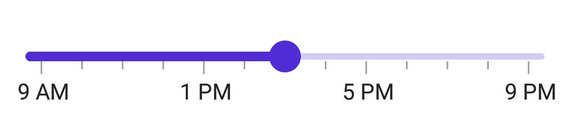

# Track in .NET MAUI DateTime Slider (SfDateTimeSlider)

This section helps to learn about how to customize the track in the DateTime Slider.

## Track color

You can change the active and inactive track color of the DateTime Slider using the [`ActiveFill`](https://help.syncfusion.com/cr/maui/Syncfusion.Maui.Sliders.SliderTrackStyle.html#Syncfusion_Maui_Sliders_SliderTrackStyle_ActiveFill) and [`InactiveFill`](https://help.syncfusion.com/cr/maui/Syncfusion.Maui.Sliders.SliderTrackStyle.html#Syncfusion_Maui_Sliders_SliderTrackStyle_InactiveFill) properties of the [`TrackStyle`](https://help.syncfusion.com/cr/maui/Syncfusion.Maui.Sliders.SliderBase.html#Syncfusion_Maui_Sliders_SliderBase_TrackStyle) class.

The active side of the DateTime Slider is between the [`Minimum`](https://help.syncfusion.com/cr/maui/Syncfusion.Maui.Sliders.SfSlider.html#Syncfusion_Maui_Sliders_SfSlider_Minimum) value and the thumb.

The inactive side of the DateTime Slider is between the thumb and the [`Maximum`](https://help.syncfusion.com/cr/maui/Syncfusion.Maui.Sliders.SfSlider.html#Syncfusion_Maui_Sliders_SfSlider_Maximum) value.





<sliders:SfDateTimeSlider Minimum="2010-01-01" 
                          Maximum="2018-01-01" 
                          Value="2014-01-01">
  <sliders:SfDateTimeSlider.TrackStyle>
     <sliders:SliderTrackStyle ActiveFill="#EE3F3F" InactiveFill="#F7B1AE" />
  </sliders:SfDateTimeSlider.TrackStyle>
</sliders:SfDateTimeSlider>





SfDateTimeSlider slider = new SfDateTimeSlider();
slider.Minimum = new DateTime(2010, 01, 01);
slider.Maximum = new DateTime(2018, 01, 01);
slider.Value = new DateTime(2014, 01, 01);
slider.TrackStyle.ActiveFill = new SolidColorBrush(Color.FromArgb("#EE3F3F"));
slider.TrackStyle.InactiveFill = new SolidColorBrush(Color.FromArgb("#F7B1AE"));





## Track height

You can change the active and inactive track height of the DateTime Slider using the [`ActiveSize`](https://help.syncfusion.com/cr/maui/Syncfusion.Maui.Sliders.SliderTrackStyle.html#Syncfusion_Maui_Sliders_SliderTrackStyle_ActiveSize) and [`InactiveSize`](https://help.syncfusion.com/cr/maui/Syncfusion.Maui.Sliders.SliderTrackStyle.html#Syncfusion_Maui_Sliders_SliderTrackStyle_InactiveSize) properties of the [`TrackStyle`](https://help.syncfusion.com/cr/maui/Syncfusion.Maui.Sliders.SliderBase.html#Syncfusion_Maui_Sliders_SliderBase_TrackStyle) class. The default value of the [`ActiveSize`](https://help.syncfusion.com/cr/maui/Syncfusion.Maui.Sliders.SliderTrackStyle.html#Syncfusion_Maui_Sliders_SliderTrackStyle_ActiveSize) and the [`InactiveSize`](https://help.syncfusion.com/cr/maui/Syncfusion.Maui.Sliders.SliderTrackStyle.html#Syncfusion_Maui_Sliders_SliderTrackStyle_InactiveSize) properties are `8.0` and `6.0` respectively.





<sliders:SfDateTimeSlider Minimum="2010-01-01" 
                          Maximum="2018-01-01" 
                          Value="2014-01-01">
   <sliders:SfDateTimeSlider.TrackStyle>
       <sliders:SliderTrackStyle ActiveSize="10" InactiveSize="8" />
   </sliders:SfDateTimeSlider.TrackStyle>
</sliders:SfDateTimeSlider>





SfDateTimeSlider slider = new SfDateTimeSlider();
slider.Minimum = new DateTime(2010, 01, 01);
slider.Maximum = new DateTime(2020, 01, 01);
slider.Value = new DateTime(2014, 01, 01);
slider.TrackStyle.ActiveSize = 10;
slider.TrackStyle.InactiveSize = 8;





## Track extent

You can extend the track at edges using the `TrackExtent` property. The default value is `0.0` and it should be in pixels.

code snippet for `DateTime` slider,





<sliders:SfDateTimeSlider Minimum="2000-01-01T09:00:00"
                          Maximum="2000-01-01T21:00:00"
                          Value="2000-01-01T15:00:00"
                          IntervalType="Hours"
                          DateFormat="h tt"
                          MinorTicksPerInterval="3"
                          Interval="4"
                          ShowTicks="True"
                          ShowLabels="True"
                          TrackExtent="10" />





SfDateTimeSlider slider = new SfDateTimeSlider();
slider.Minimum = new DateTime(2000, 01, 01, 09, 00, 00);
slider.Maximum = new DateTime(2019, 01, 01, 21, 00, 00);
slider.Value = new DateTime(2000, 01, 01, 15, 00, 00);
slider.Interval = 4;
slider.MinorTicksPerInterval = 3;
slider.IntervalType = SliderDateIntervalType.Hours;
slider.DateFormat = "h tt";
slider.ShowLabels = true;
slider.ShowTicks = true;
slider.TrackExtent = 10;





## Disabled track

You can change the state of the slider to disabled by setting `false` to the `IsEnabled` property. Using the Visual State Manager (VSM), you can customize the slider track properties based on the visual states. The applicable visual states are enabled(default) and disabled.





<ContentPage.Resources>
    
</ContentPage.Resources>

<ContentPage.Content>
    <VerticalStackLayout>
        <Label Text="Enabled Slider"
               Padding="0,10" />
        <sliders:SfDateTimeSlider />
        <Label Text="Disabled Slider"
               Padding="0,10" />
        <sliders:SfDateTimeSlider IsEnabled="False" />
    </VerticalStackLayout>
</ContentPage.Content>





VerticalStackLayout stackLayout = new VerticalStackLayout();
SfDateTimeSlider defaultSlider = new SfDateTimeSlider()
{
    Minimum = new DateTime(2010, 01, 01),
    Maximum = new DateTime(2020, 01, 01),
    Value = new DateTime(2014, 01, 01)
};
SfDateTimeSlider disabledSlider = new SfDateTimeSlider
{
    Minimum = new DateTime(2010, 01, 01),
    Maximum = new DateTime(2020, 01, 01),
    Value = new DateTime(2014, 01, 01),
    IsEnabled = false
};

VisualStateGroupList visualStateGroupList = new VisualStateGroupList();
VisualStateGroup commonStateGroup = new VisualStateGroup();
// Default State.
VisualState defaultState = new VisualState { Name = "Default" };
defaultState.Setters.Add(new Setter
{
    Property = SfDateTimeSlider.TrackStyleProperty,
    Value = new SliderTrackStyle
    {
        ActiveFill = Color.FromArgb("#EE3F3F"),
        InactiveFill = Color.FromArgb("#F7B1AE"),
        ActiveSize = 8,
        InactiveSize = 6,
    }
});
// Disabled State.
VisualState disabledState = new VisualState { Name = "Disabled" };
disabledState.Setters.Add(new Setter
{
    Property = SfDateTimeSlider.TrackStyleProperty,
    Value = new SliderTrackStyle
    {
        ActiveFill = Colors.Grey,
        InactiveFill = Colors.LightGrey,
        ActiveSize = 10,
        InactiveSize = 8,
    }
});

commonStateGroup.States.Add(defaultState);
commonStateGroup.States.Add(disabledState);
visualStateGroupList.Add(commonStateGroup);
VisualStateManager.SetVisualStateGroups(defaultSlider, visualStateGroupList);
VisualStateManager.SetVisualStateGroups(disabledSlider, visualStateGroupList);

stackLayout.Children.Add(new Label() { Text = "Default Slider", Padding = new Thickness(0, 10) });
stackLayout.Children.Add(defaultSlider);
stackLayout.Children.Add(new Label() { Text = "Disabled Slider", Padding = new Thickness(0, 10) });
stackLayout.Children.Add(disabledSlider);
this.Content = stackLayout;





