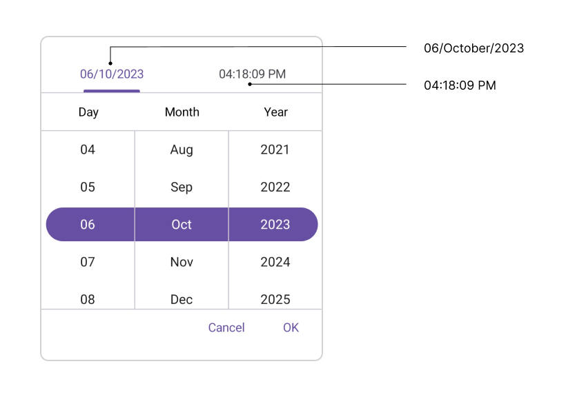
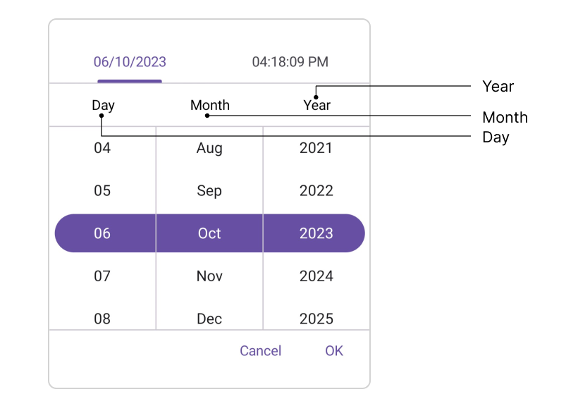
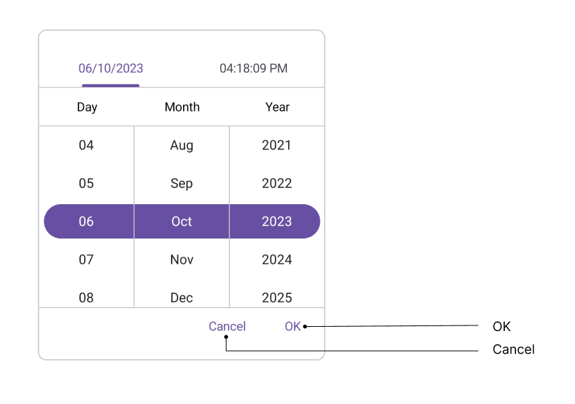
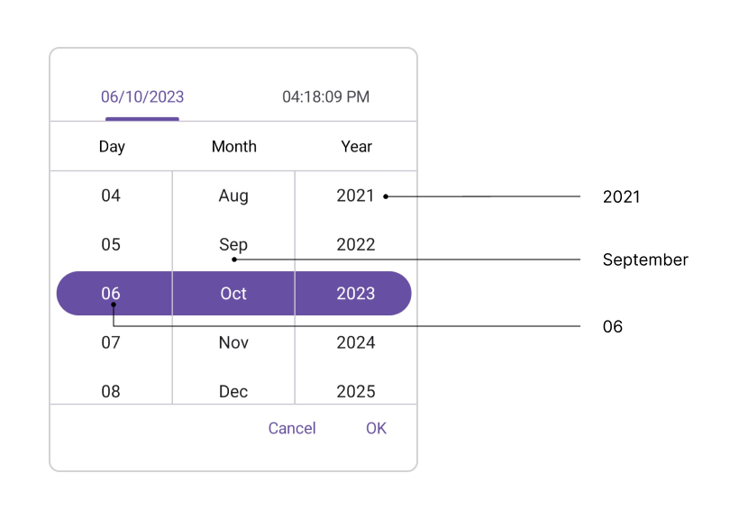

# Accessibility in .NET MAUI Date Time Picker (SfDateTimePicker)

The [.NET MAUI Date Time Picker](https://www.syncfusion.com/maui-controls/maui-datetimepicker) control has interact with the `Header`, `Column Header`, `Footer`, and `Picker Items`.

## Header Layout

The SfDateTimePicker control has interact header text with localization of header layout. It contains [DateFormat](https://help.syncfusion.com/cr/maui/Syncfusion.Maui.Picker.SfDateTimePicker.html#Syncfusion_Maui_Picker_SfDateTimePicker_DateFormat) and [TimeFormat](https://help.syncfusion.com/cr/maui/Syncfusion.Maui.Picker.SfDateTimePicker.html#Syncfusion_Maui_Picker_SfDateTimePicker_TimeFormat) property of the [DateTimePickerHeaderView](https://help.syncfusion.com/cr/maui/Syncfusion.Maui.Picker.DateTimePickerHeaderView.html). For example,

<table>
<tr>
<th>Format</th>
<th>Accessibility</th>
</tr>
<tr>
<td>Date Format</td>
<td>1/January/2023</td>
</tr>
<tr>
<td>Time Format</td>
<td>10:15:30 AM (or) PM</td>
</tr>
</table>

## Column Header Layout

The SfDateTimePicker control has interact column header text with localization of column header layout. It contains [DayHeaderText](https://help.syncfusion.com/cr/maui/Syncfusion.Maui.Picker.DateTimePickerColumnHeaderView.html#Syncfusion_Maui_Picker_DateTimePickerColumnHeaderView_DayHeaderText), [MonthHeaderText](https://help.syncfusion.com/cr/maui/Syncfusion.Maui.Picker.DateTimePickerColumnHeaderView.html#Syncfusion_Maui_Picker_DateTimePickerColumnHeaderView_MonthHeaderText), [YearHeaderText](https://help.syncfusion.com/cr/maui/Syncfusion.Maui.Picker.DateTimePickerColumnHeaderView.html#Syncfusion_Maui_Picker_DateTimePickerColumnHeaderView_YearHeaderText), [HourHeaderText](https://help.syncfusion.com/cr/maui/Syncfusion.Maui.Picker.DateTimePickerColumnHeaderView.html#Syncfusion_Maui_Picker_DateTimePickerColumnHeaderView_HourHeaderText), [MinuteHeaderText](https://help.syncfusion.com/cr/maui/Syncfusion.Maui.Picker.DateTimePickerColumnHeaderView.html#Syncfusion_Maui_Picker_DateTimePickerColumnHeaderView_MinuteHeaderText), [SecondHeaderText](https://help.syncfusion.com/cr/maui/Syncfusion.Maui.Picker.DateTimePickerColumnHeaderView.html#Syncfusion_Maui_Picker_DateTimePickerColumnHeaderView_SecondHeaderText), and [MeridiemHeaderText](https://help.syncfusion.com/cr/maui/Syncfusion.Maui.Picker.DateTimePickerColumnHeaderView.html#Syncfusion_Maui_Picker_DateTimePickerColumnHeaderView_MeridiemHeaderText) properties in the [DateTimePickerColumnHeaderView](https://help.syncfusion.com/cr/maui/Syncfusion.Maui.Picker.DateTimePickerColumnHeaderView.html). The default value of `DayHeaderText` is "Day", `MonthHeaderText` is "Month", `YearHeaderText` is "Year", `HourHeaderText` is "Hour", `MinuteHeaderText` is "Minute", `SecondHeaderText` is "Second", and `MeridiemHeaderText` is "string.Empty".

## Footer Layout

The SfDateTimePicker control has interact validation buttons (OK and Cancel) with localization of footer layout. The Default value of the [OkButtonText](https://help.syncfusion.com/cr/maui/Syncfusion.Maui.Picker.PickerFooterView.html#Syncfusion_Maui_Picker_PickerFooterView_OkButtonText) property is "OK", and [CancelButtonText](https://help.syncfusion.com/cr/maui/Syncfusion.Maui.Picker.PickerFooterView.html#Syncfusion_Maui_Picker_PickerFooterView_CancelButtonText) is "Cancel".

## Picker Items

The SfDateTimePicker control has interact with the item source in picker items. The item source contains based on the [Date Format](https://help.syncfusion.com/cr/maui/Syncfusion.Maui.Picker.PickerDateFormat.html) and [Time Format](https://help.syncfusion.com/cr/maui/Syncfusion.Maui.Picker.PickerTimeFormat.html). For example, 

<table>
<tr>
<th>Format</th>
<th>Example</th></tr>
<tr>
<td>d, M, h, H</td>
<td>1</td>
</tr>
<tr>
<td>dd, MM, hh, HH, mm, ss</td>
<td>01</td>
</tr>
<tr>
<td>MMM</td>
<td>January</td>
</tr> 
<tr>
<td>yyyy</td>
<td>2023</td>
</tr>
<tr>
<td>tt</td>
<td>AM/PM</td>
</tr>
</table>

## Keyboard
`SfDateTimePicker` supports selection using keyboard interactions.

<table>
<tr>
<th>
Key
</th>
<th>
Description
</th>
</tr>
<tr>
<td>
Tab
</td>
<td>
Focus the picker.
</td>
</tr>
<tr>
<td>
Enter
</td>
<td>
Opens the selected picker.
</td>
</tr>
<tr>
<td>
DownArrow
</td>
<td>
Selects an item from the currently expanded list by moving downwards.
</td>
</tr>
<tr>
<td>
UpArrow
</td>
<td>
Selects an item from the currently expanded list by moving upwards.
</td>
</tr>
<tr>
<td>
RightArrow/Tab
</td>
<td>
Navigates through the selected item in the right direction.
</td>
</tr>
<tr>
<td>
LeftArrow/Shift+Tab
</td>
<td>
Navigates through the selected item in the left direction.
</td>
</tr>
<tr>
<td>
Esc/Enter
</td>
<td>
Exit and commit selection.
</td>
</tr>
</table>

