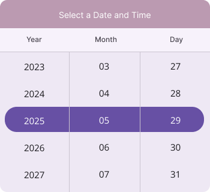
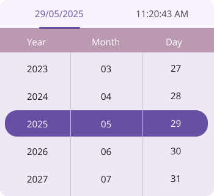
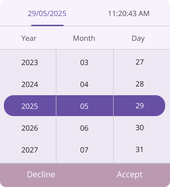

# Customizations in .NET MAUI Date Time Picker (SfDateTimePicker)

The [.NET MAUI Date Time Picker](https://www.syncfusion.com/maui-controls/maui-datetimepicker) header, column header, footer, and selection views can be customized.

## Header Customization

Customize the Date Time Picker header by using the `HeaderView` property of the `SfDateTimePicker`.

### Date Time Picker header

The Date Time Picker provide pre-defined header text. By default it shows the current date and time. If you want to change the header text using the [DateFormat](https://help.syncfusion.com/cr/maui/Syncfusion.Maui.Picker.SfDateTimePicker.html#Syncfusion_Maui_Picker_SfDateTimePicker_DateFormat) and [TimeFormat](https://help.syncfusion.com/cr/maui/Syncfusion.Maui.Picker.SfDateTimePicker.html#Syncfusion_Maui_Picker_SfDateTimePicker_TimeFormat) properties in [SfDateTimePicker](https://help.syncfusion.com/cr/maui/Syncfusion.Maui.Picker.SfDateTimePicker.html).

### Set the divider color

The SfDateTimePicker control allows you to customize the header divider color by setting the [DividerColor](https://help.syncfusion.com/cr/maui/Syncfusion.Maui.Picker.PickerHeaderView.html#Syncfusion_Maui_Picker_PickerHeaderView_DividerColor) property of the [DateTimePickerHeaderView](https://help.syncfusion.com/cr/maui/Syncfusion.Maui.Picker.DateTimePickerHeaderView.html).




<picker:SfDateTimePicker>
    <picker:SfDateTimePicker.HeaderView>
        <picker:DateTimePickerHeaderView DividerColor="Red" />
    </picker:SfDateTimePicker.HeaderView>
</picker:SfDateTimePicker>




SfDateTimePicker picker = new SfDateTimePicker();
picker.HeaderView = new DateTimePickerHeaderView()
{
    DividerColor = Colors.Red,
};

this.Content = picker;




   

### Custom Header Appearance using Datatemplate

You can customize the datetime picker header appearance by using the [HeaderTemplate](https://help.syncfusion.com/cr/maui/Syncfusion.Maui.Picker.PickerBase.html#Syncfusion_Maui_Picker_PickerBase_HeaderTemplate) property in the [SfDateTimePicker](https://help.syncfusion.com/cr/maui/Syncfusion.Maui.Picker.SfDateTimePicker.html).





<picker:SfDateTimePicker x:Name="datetimepicker" >
    <picker:SfDateTimePicker.HeaderTemplate>
        <DataTemplate>
            <Grid BackgroundColor="#BB9AB1">
                <Label HorizontalOptions="Center" VerticalOptions="Center" Text="Select a Date and Time" TextColor="White"/>
            </Grid>
        </DataTemplate>
    </picker:SfDateTimePicker.HeaderTemplate>
</picker:SfDateTimePicker>





N> 
* If a template is applied to the header in the [DateTimePickerHeaderView](https://help.syncfusion.com/cr/maui/Syncfusion.Maui.Picker.DateTimePickerHeaderView.html) will not work except [DividerColor](https://help.syncfusion.com/cr/maui/Syncfusion.Maui.Picker.DateTimePickerHeaderView.html#Syncfusion_Maui_Picker_DateTimePickerHeaderView_DividerColor) Property.
* When a template is applied to the DateTimePicker Header, the built-in time selection switch becomes non-functional.

### Custom Header appearance using DataTemplateSelector

You can customize the datetime picker header appearance by using the [HeaderTemplate](https://help.syncfusion.com/cr/maui/Syncfusion.Maui.Picker.PickerBase.html#Syncfusion_Maui_Picker_PickerBase_HeaderTemplate) property in the [SfDateTimePicker](https://help.syncfusion.com/cr/maui/Syncfusion.Maui.Picker.SfDateTimePicker.html). The DataTemplateSelector allows you to choose a DataTemplate at runtime based on the value bound to the datetime picker header. This lets you apply a custom data template to the header and customize its appearance based on specific conditions.





<Grid.Resources>
    <DataTemplate x:Key="todayDatesTimeTemplate">
        <Grid Background="LightBlue">
            <Label HorizontalOptions="Center" VerticalOptions="Center" Text="Select a Date and Time" TextColor="Red"/>
        </Grid>
    </DataTemplate>
    <DataTemplate x:Key="normalDatesTimeTemplate">
        <Grid Background="LightGreen">
            <Label HorizontalOptions="Center" VerticalOptions="Center" Text="Select a Date and Time" TextColor="Orange"/>
        </Grid>
    </DataTemplate>
    <local:DateTimeTemplateSelector x:Key="headerTemplateSelector" TodayDatesTimeTemplate="{StaticResource todayDatesTimeTemplate}"  NormalDatesTimeTemplate="{StaticResource normalDatesTimeTemplate}"/>
    <picker:SfDateTimePicker x:Name="datetimepicker" HeaderTemplate="{StaticResource headerTemplateSelector}">
    </picker:SfDateTimePicker>
</Grid.Resources>





public class DateTimeTemplateSelector : DataTemplateSelector
{
    public DateTimeTemplateSelector()
    {
    }
    public DataTemplate TodayDatesTimeTemplate { get; set; }
    public DataTemplate NormalDatesTimeTemplate { get; set; }
    protected override DataTemplate OnSelectTemplate(object item, BindableObject container)
    {
        var Details = item as SfDateTimePicker;
        if (Details != null)
        {
            if (Details.SelectedDate < DateTime.Now.Date)
                return TodayDatesTimeTemplate;
        }
        return NormalDatesTimeTemplate;
    }
}





### Customization of the header

Customize the header text style and background color of the `Date Time picker` using the [TextStyle](https://help.syncfusion.com/cr/maui/Syncfusion.Maui.Picker.DateTimePickerHeaderView.html#Syncfusion_Maui_Picker_DateTimePickerHeaderView_TextStyle) and [Background](https://help.syncfusion.com/cr/maui/Syncfusion.Maui.Picker.DateTimePickerHeaderView.html#Syncfusion_Maui_Picker_DateTimePickerHeaderView_Background) properties of the [HeaderView](https://help.syncfusion.com/cr/maui/Syncfusion.Maui.Picker.SfDateTimePicker.html#Syncfusion_Maui_Picker_SfDateTimePicker_HeaderView) in the[DateTimePickerHeaderView](https://help.syncfusion.com/cr/maui/Syncfusion.Maui.Picker.DateTimePickerHeaderView.html).




<picker:SfDateTimePicker>
    <picker:SfDateTimePicker.HeaderView>
        <picker:DateTimePickerHeaderView Background="#D3D3D3">
            <picker:DateTimePickerHeaderView.TextStyle>
                <picker:PickerTextStyle FontSize="15" TextColor="Black" />
            </picker:DateTimePickerHeaderView.TextStyle>
        </picker:DateTimePickerHeaderView>
    </picker:SfDateTimePicker.HeaderView>
</picker:SfDateTimePicker>




SfDateTimePicker picker = new SfDateTimePicker();
picker.HeaderView = new DateTimePickerHeaderView()
{
    Background = Color.FromArgb("#D3D3D3"),
    TextStyle = new PickerTextStyle()
    {
        TextColor = Colors.White,
        FontSize = 15,
    }
};

this.Content = picker;




   

## Column Header Customization

Customize the Date Time Picker column header by using the `ColumnHeaderView` property of the `SfDateTimePicker`.

### Set the custom column header

The `SfDateTimePicker` provides a custom text to its column header by setting the [ColumnHeaderView](https://help.syncfusion.com/cr/maui/Syncfusion.Maui.Picker.SfDateTimePicker.html#Syncfusion_Maui_Picker_SfDateTimePicker_ColumnHeaderView) property of the [SfDateTimePicker](https://help.syncfusion.com/cr/maui/Syncfusion.Maui.Picker.SfDateTimePicker.html), which has [DayHeaderText](https://help.syncfusion.com/cr/maui/Syncfusion.Maui.Picker.DateTimePickerColumnHeaderView.html#Syncfusion_Maui_Picker_DateTimePickerColumnHeaderView_DayHeaderText), [MonthHeaderText](https://help.syncfusion.com/cr/maui/Syncfusion.Maui.Picker.DateTimePickerColumnHeaderView.html#Syncfusion_Maui_Picker_DateTimePickerColumnHeaderView_MonthHeaderText), [YearHeaderText](https://help.syncfusion.com/cr/maui/Syncfusion.Maui.Picker.DateTimePickerColumnHeaderView.html#Syncfusion_Maui_Picker_DateTimePickerColumnHeaderView_YearHeaderText), [HourHeaderText](https://help.syncfusion.com/cr/maui/Syncfusion.Maui.Picker.DateTimePickerColumnHeaderView.html#Syncfusion_Maui_Picker_DateTimePickerColumnHeaderView_HourHeaderText), [MinuteHeaderText](https://help.syncfusion.com/cr/maui/Syncfusion.Maui.Picker.DateTimePickerColumnHeaderView.html#Syncfusion_Maui_Picker_DateTimePickerColumnHeaderView_MinuteHeaderText), [SecondHeaderText](https://help.syncfusion.com/cr/maui/Syncfusion.Maui.Picker.DateTimePickerColumnHeaderView.html#Syncfusion_Maui_Picker_DateTimePickerColumnHeaderView_SecondHeaderText), [MilliSecondHeaderText](https://help.syncfusion.com/cr/maui/Syncfusion.Maui.Picker.DateTimePickerColumnHeaderView.html#Syncfusion_Maui_Picker_DateTimePickerColumnHeaderView_MilliSecondHeaderText), and [MeridiemHeaderText](https://help.syncfusion.com/cr/maui/Syncfusion.Maui.Picker.DateTimePickerColumnHeaderView.html#Syncfusion_Maui_Picker_DateTimePickerColumnHeaderView_MeridiemHeaderText) properties in the [DateTimePickerColumnHeaderView](https://help.syncfusion.com/cr/maui/Syncfusion.Maui.Picker.DateTimePickerColumnHeaderView.html). The default value of `DayHeaderText` is "Day", `MonthHeaderText` is "Month", `YearHeaderText` is "Year", `HourHeaderText` is "Hour", `MinuteHeaderText` is "Minute", `SecondHeaderText` is "Second", `MilliSecondHeaderText` is "MilliSecond" and `MeridiemHeaderText` is "string.Empty".




<picker:SfDateTimePicker>
    <picker:SfDateTimePicker.ColumnHeaderView>
        <picker:DateTimePickerColumnHeaderView 
            DayHeaderText="Day Column" MonthHeaderText="Month Column" YearHeaderText="Year Column" 
            HourHeaderText="Hour Column" MinuteHeaderText="Minute Column" SecondHeaderText="Second Column" 
            MilliSecondHeaderText="MilliSecond Column" MeridiemHeaderText="Meridiem Column" />
    </picker:SfDateTimePicker.ColumnHeaderView>
</picker:SfDateTimePicker>




SfDateTimePicker picker = new SfDateTimePicker();
picker.ColumnHeaderView = new DateTimePickerColumnHeaderView()
{
    DayHeaderText = "Day Column",
    MonthHeaderText = "Month Column",
    YearHeaderText = "Year Column",
    HourHeaderText = "Hour Column",
    MinuteHeaderText = "Minute Column",
    SecondHeaderText = "Second Column",
    MilliSecondHeaderText = "MilliSecond Text"
    MeridiemHeaderText = "Meridiem Column",
};

this.Content = picker;




   

### Set the divider color

The SfDateTimePicker control allows you to customize the column header divider color by setting the [DividerColor](https://help.syncfusion.com/cr/maui/Syncfusion.Maui.Picker.DateTimePickerColumnHeaderView.html#Syncfusion_Maui_Picker_DateTimePickerColumnHeaderView_DividerColor) property of the [DatePickerColumnHeaderView](https://help.syncfusion.com/cr/maui/Syncfusion.Maui.Picker.DateTimePickerColumnHeaderView.html).





<picker:SfDateTimePicker>
    <picker:SfDateTimePicker.ColumnHeaderView>
        <picker:DateTimePickerColumnHeaderView DividerColor="Red" />
    </picker:SfDateTimePicker.ColumnHeaderView>
</picker:SfDateTimePicker>





SfDateTimePicker picker = new SfDateTimePicker();
picker.ColumnHeaderView = new DateTimePickerColumnHeaderView()
{
    DividerColor = Colors.Red,
};

this.Content = picker;




   

### Customization of the column header

Customize the column header view text style and background color of the `Date Time Picker` using the [TextStyle](https://help.syncfusion.com/cr/maui/Syncfusion.Maui.Picker.DateTimePickerColumnHeaderView.html#Syncfusion_Maui_Picker_DateTimePickerColumnHeaderView_TextStyle) and [Background](https://help.syncfusion.com/cr/maui/Syncfusion.Maui.Picker.DateTimePickerColumnHeaderView.html#Syncfusion_Maui_Picker_DateTimePickerColumnHeaderView_Background) properties of the [DateTimePickerColumnHeaderView](https://help.syncfusion.com/cr/maui/Syncfusion.Maui.Picker.DateTimePickerColumnHeaderView.html).




<picker:SfDateTimePicker>
    <picker:SfDateTimePicker.ColumnHeaderView>
        <picker:DateTimePickerColumnHeaderView Background="#D3D3D3">
            <picker:DateTimePickerColumnHeaderView.TextStyle>
                <picker:PickerTextStyle FontSize="15" TextColor="Black" />
            </picker:DateTimePickerColumnHeaderView.TextStyle>
        </picker:DateTimePickerColumnHeaderView>
    </picker:SfDateTimePicker.ColumnHeaderView>
</picker:SfDateTimePicker>




SfDateTimePicker picker = new SfDateTimePicker();
picker.ColumnHeaderView = new DateTimePickerColumnHeaderView()
{
    Background = Color.FromArgb("#D3D3D3"),
    TextStyle = new PickerTextStyle()
    {
        TextColor = Colors.Black,
        FontSize = 15,
    },
};

this.Content = picker;




   

### Custom Column Header Appearance using Datatemplate

You can customize the datetime picker column header appearance by using the [ColumnHeaderTemplate](https://help.syncfusion.com/cr/maui/Syncfusion.Maui.Picker.PickerBase.html#Syncfusion_Maui_Picker_PickerBase_ColumnHeaderTemplate) property in the [SfDateTimePicker](https://help.syncfusion.com/cr/maui/Syncfusion.Maui.Picker.SfDateTimePicker.html).





<picker:SfDateTimePicker x:Name="datetimepicker" >
    <picker:SfDateTimePicker.ColumnHeaderTemplate>
        <DataTemplate>
            <Grid BackgroundColor="#BB9AB1">
                <Grid.ColumnDefinitions>
                    <ColumnDefinition/>
                    <ColumnDefinition/>
                    <ColumnDefinition/>
                </Grid.ColumnDefinitions>
                <Label Text="Year" Grid.Column="0" TextColor="White" HorizontalTextAlignment="Center" VerticalTextAlignment="Center"/>
                <Label Text="Month" Grid.Column="1" TextColor="White"  HorizontalTextAlignment="Center" VerticalTextAlignment="Center"/>
                <Label Text="Day" Grid.Column="2" TextColor="White" HorizontalTextAlignment="Center" VerticalTextAlignment="Center"/>
            </Grid>
        </DataTemplate>
    </picker:SfDateTimePicker.ColumnHeaderTemplate>
</picker:SfDateTimePicker>





N> If a template is applied to the column header in the [DateTimePickerColumnHeaderView](https://help.syncfusion.com/cr/maui/Syncfusion.Maui.Picker.DateTimePickerColumnHeaderView.html), the remaining column header properties will not have any effect, except for the [DividerColor](https://help.syncfusion.com/cr/maui/Syncfusion.Maui.Picker.DateTimePickerColumnHeaderView.html#Syncfusion_Maui_Picker_DateTimePickerColumnHeaderView_DividerColor) Property.

### Custom Column Header appearance using DataTemplateSelector

You can customize the datetime picker column header appearance by using the [ColumnHeaderTemplate](https://help.syncfusion.com/cr/maui/Syncfusion.Maui.Picker.PickerBase.html#Syncfusion_Maui_Picker_PickerBase_ColumnHeaderTemplate) property in the [SfDateTimePicker](https://help.syncfusion.com/cr/maui/Syncfusion.Maui.Picker.SfDateTimePicker.html). The DataTemplateSelector allows you to choose a DataTemplate at runtime based on the value bound to the datetime picker column header. This lets you apply a custom data template to the column header and customize its appearance based on specific conditions.





<Grid.Resources>
    <DataTemplate x:Key="todayDatesTimeTemplate">
        <Grid Background="LightBlue">
            <Grid.ColumnDefinitions>
                <ColumnDefinition/>
                <ColumnDefinition/>
                <ColumnDefinition/>
            </Grid.ColumnDefinitions>
            <Label Text="Year" Grid.Column="0" TextColor="Red" HorizontalTextAlignment="Center" VerticalTextAlignment="Center"/>
            <Label Text="Month" Grid.Column="1" TextColor="Red"  HorizontalTextAlignment="Center" VerticalTextAlignment="Center"/>
            <Label Text="Day" Grid.Column="2" TextColor="Red" HorizontalTextAlignment="Center" VerticalTextAlignment="Center"/>
        </Grid>
    </DataTemplate>
    <DataTemplate x:Key="normalDatesTimeTemplate">
        <Grid Background="LightGreen">
            <Grid.ColumnDefinitions>
                <ColumnDefinition/>
                <ColumnDefinition/>
                <ColumnDefinition/>
            </Grid.ColumnDefinitions>
            <Label Text="Year" Grid.Column="0" TextColor="Orange" HorizontalTextAlignment="Center" VerticalTextAlignment="Center"/>
            <Label Text="Month" Grid.Column="1" TextColor="Orange"  HorizontalTextAlignment="Center" VerticalTextAlignment="Center"/>
            <Label Text="Day" Grid.Column="2" TextColor="Orange" HorizontalTextAlignment="Center" VerticalTextAlignment="Center"/>
            </Grid>
    </DataTemplate>
    <local:DateTimeTemplateSelector x:Key="columnHeaderTemplateSelector" TodayDatesTimeTemplate="{StaticResource todayDatesTimeTemplate}"  NormalDatesTimeTemplate="{StaticResource normalDatesTimeTemplate}"/>
    <picker:SfDateTimePicker x:Name="datetimepicker" ColumnHeaderTemplate="{StaticResource columnHeaderTemplateSelector}">
    </picker:SfDateTimePicker>
</Grid.Resources>





public class DateTimeTemplateSelector : DataTemplateSelector
{
    public DateTimeTemplateSelector()
    {
    }
    public DataTemplate TodayDatesTimeTemplate { get; set; }
    public DataTemplate NormalDatesTimeTemplate { get; set; }
    protected override DataTemplate OnSelectTemplate(object item, BindableObject container)
    {
        var Details = item as SfDateTimePicker;
        if (Details != null)
        {
            if (Details.SelectedDate < DateTime.Now.Date)
                return TodayDatesTimeTemplate;
        }
        return NormalDatesTimeTemplate;
    }
}





## Footer Customization

Customize the Date Time Picker footer view by using the `FooterView` property of the `SfDateTimePicker`.

### Set the footer text with OK and Cancel button customizations

In the SfDateTimePicker control, validation buttons (OK and Cancel) can be customized by setting the [OkButtonText](https://help.syncfusion.com/cr/maui/Syncfusion.Maui.Picker.PickerFooterView.html#Syncfusion_Maui_Picker_PickerFooterView_OkButtonText) and [CancelButtonText](https://help.syncfusion.com/cr/maui/Syncfusion.Maui.Picker.PickerFooterView.html#Syncfusion_Maui_Picker_PickerFooterView_CancelButtonText) properties of the [PickerFooterView](https://help.syncfusion.com/cr/maui/Syncfusion.Maui.Picker.PickerFooterView.html). It allows you to confirm or cancel the selected date and time. The `OkButtonText` can be enabled using the [ShowOkButton](https://help.syncfusion.com/cr/maui/Syncfusion.Maui.Picker.PickerFooterView.html#Syncfusion_Maui_Picker_PickerFooterView_ShowOkButton) property in the [PickerFooterView](https://help.syncfusion.com/cr/maui/Syncfusion.Maui.Picker.PickerFooterView.html). The default value of the `OkButtonText` property is "OK", and `CancelButtonText` is "Cancel". To enable the footer view, set the `Height` property of the [PickerFooterView](https://help.syncfusion.com/cr/maui/Syncfusion.Maui.Picker.PickerFooterView.html) to a value greater than 0. The default value of the `Height` property is 0.




<picker:SfDateTimePicker x:Name="picker" >
    <picker:SfDateTimePicker.FooterView >
        <picker:PickerFooterView Height="40" OkButtonText="Save"
                                 CancelButtonText="Exit"/>
    </picker:SfDateTimePicker.FooterView>
</picker:SfDateTimePicker>




SfDateTimePicker picker = new SfDateTimePicker();
picker.FooterView = new PickerFooterView()
{
    Height = 40,
    OkButtonText = "Save",
    CancelButtonText = "Exit",
};

this.Content = picker;




   

### Set the divider color

The SfDateTimePicker control allows you to customize the footer divider color by setting the [DividerColor](https://help.syncfusion.com/cr/maui/Syncfusion.Maui.Picker.PickerFooterView.html#Syncfusion_Maui_Picker_PickerFooterView_DividerColor) property of the [PickerFooterView](https://help.syncfusion.com/cr/maui/Syncfusion.Maui.Picker.PickerFooterView.html).




<picker:SfDateTimePicker x:Name="picker" >
    <picker:SfDateTimePicker.FooterView >
        <picker:PickerFooterView DividerColor="Red" />
    </picker:SfDateTimePicker.FooterView>
</picker:SfDateTimePicker>




SfDateTimePicker picker = new SfDateTimePicker();
picker.FooterView = new PickerFooterView()
{
    DividerColor = Colors.Red,
};

this.Content = picker;




   

### Customization of the footer

Customize the footer text style and background color of the `Date Time Picker` using the [TextStyle](https://help.syncfusion.com/cr/maui/Syncfusion.Maui.Picker.PickerFooterView.html#Syncfusion_Maui_Picker_PickerFooterView_TextStyle) and [Background](https://help.syncfusion.com/cr/maui/Syncfusion.Maui.Picker.PickerFooterView.html#Syncfusion_Maui_Picker_PickerFooterView_Background) properties of the [PickerFooterView](https://help.syncfusion.com/cr/maui/Syncfusion.Maui.Picker.PickerFooterView.html).




<picker:SfDateTimePicker x:Name="picker" >
    <picker:SfDateTimePicker.FooterView >
        <picker:PickerFooterView Background="#D3D3D3">
            <picker:PickerFooterView.TextStyle >
                <picker:PickerTextStyle FontSize="15" TextColor="Black" />
            </picker:PickerFooterView.TextStyle>
        </picker:PickerFooterView>
    </picker:SfDateTimePicker.FooterView>
</picker:SfDateTimePicker>




SfDateTimePicker picker = new SfDateTimePicker();
picker.FooterView = new PickerFooterView()
{
    Background = Color.FromArgb("#D3D3D3"),
    TextStyle = new PickerTextStyle()
    {
        TextColor = Colors.Black,
        FontSize = 15,
    }
};

this.Content = picker;




   

### Custom Footer Header Appearance using Datatemplate

You can customize the datetime picker footer appearance by using the [FooterTemplate](https://help.syncfusion.com/cr/maui/Syncfusion.Maui.Picker.PickerBase.html#Syncfusion_Maui_Picker_PickerBase_FooterTemplate) property in the [SfDateTimePicker](https://help.syncfusion.com/cr/maui/Syncfusion.Maui.Picker.SfDateTimePicker.html).





<picker:SfDateTimePicker x:Name="datetimepicker">
    <picker:SfDateTimePicker.FooterTemplate>
        <DataTemplate>
            <Grid BackgroundColor="#BB9AB1">
                <Grid.ColumnDefinitions>
                    <ColumnDefinition/>
                    <ColumnDefinition/>
                </Grid.ColumnDefinitions>
                <Button Grid.Column="0" Text="Decline" TextColor="White" Background="Transparent" />
                <Button Grid.Column="1" Text="Accept" TextColor="White" Background="Transparent" />
            </Grid>
        </DataTemplate>
    </picker:SfDateTimePicker.FooterTemplate>
</picker:SfDateTimePicker>





N> If a template is applied to the footer in the [PickerFooterView](https://help.syncfusion.com/cr/maui/Syncfusion.Maui.Picker.PickerFooterView.html), the remaining footer properties will not have any effect, except for the [DividerColor](https://help.syncfusion.com/cr/maui/Syncfusion.Maui.Picker.PickerFooterView.html#Syncfusion_Maui_Picker_PickerFooterView_DividerColor) Property.

### Custom Footer appearance using DataTemplateSelector

You can customize the datetime picker footer appearance by using the [FooterTemplate](https://help.syncfusion.com/cr/maui/Syncfusion.Maui.Picker.PickerBase.html#Syncfusion_Maui_Picker_PickerBase_FooterTemplate) property in the [SfDateTimePicker](https://help.syncfusion.com/cr/maui/Syncfusion.Maui.Picker.SfDateTimePicker.html). The DataTemplateSelector allows you to choose a DataTemplate at runtime based on the value bound to the datetime picker footer. This lets you apply a custom data template to the footer and customize its appearance based on specific conditions.





<Grid.Resources>
    <DataTemplate x:Key="todayDatesTimeTemplate">
        <Grid Background="LightBlue">
            <Grid.ColumnDefinitions>
                <ColumnDefinition/>
                <ColumnDefinition/>
            </Grid.ColumnDefinitions>
            <Button Grid.Column="0" Text="Decline" TextColor="Red" Background="Transparent" />
            <Button Grid.Column="1" Text="Accept" TextColor="Red" Background="Transparent" />
        </Grid>
    </DataTemplate>
    <DataTemplate x:Key="normalDatesTimeTemplate">
        <Grid Background="LightGreen">
            <Grid.ColumnDefinitions>
                <ColumnDefinition/>
                <ColumnDefinition/>
            </Grid.ColumnDefinitions>
            <Button Grid.Column="0" Text="Decline" TextColor="Orange" Background="Transparent" />
            <Button Grid.Column="1" Text="Accept" TextColor="Orange" Background="Transparent" />
        </Grid>
    </DataTemplate>
    <local:DateTimeTemplateSelector x:Key="footerTemplateSelector" TodayDatesTimeTemplate="{StaticResource todayDatesTimeTemplate}"  NormalDatesTimeTemplate="{StaticResource normalDatesTimeTemplate}"/>
    <picker:SfDateTimePicker x:Name="datetimepicker" FooterTemplate="{StaticResource footerTemplateSelector}">
    </picker:SfDateTimePicker>
</Grid.Resources>





public class DateTimeTemplateSelector : DataTemplateSelector
{
    public DateTimeTemplateSelector()
    {
    }
    public DataTemplate TodayDatesTimeTemplate { get; set; }
    public DataTemplate NormalDatesTimeTemplate { get; set; }
    protected override DataTemplate OnSelectTemplate(object item, BindableObject container)
    {
        var Details = item as SfDateTimePicker;
        if (Details != null)
        {
            if (Details.SelectedDate < DateTime.Now.Date)
                return TodayDatesTimeTemplate;
        }
        return NormalDatesTimeTemplate;
    }
}





## Selection View Customization

Customize the Date Time Picker selection view by using the `SelectionView` property of the `SfDateTimePicker`.

### Set the selection view

In the SfDateTimePicker control, the corner radius, stroke , and padding can be customized by setting the [CornerRadius](https://help.syncfusion.com/cr/maui/Syncfusion.Maui.Picker.PickerSelectionView.html#Syncfusion_Maui_Picker_PickerSelectionView_CornerRadius), [Stroke](https://help.syncfusion.com/cr/maui/Syncfusion.Maui.Picker.PickerSelectionView.html#Syncfusion_Maui_Picker_PickerSelectionView_Stroke), and [Padding](https://help.syncfusion.com/cr/maui/Syncfusion.Maui.Picker.PickerSelectionView.html#Syncfusion_Maui_Picker_PickerSelectionView_Padding) properties in the [PickerSelectionView](https://help.syncfusion.com/cr/maui/Syncfusion.Maui.Picker.PickerSelectionView.html).




<picker:SfDateTimePicker x:Name="picker" >
    <picker:SfDateTimePicker.SelectionView >
        <picker:PickerSelectionView CornerRadius="10" Stroke="#36454F" Padding="10, 5, 10, 5" Background="#808080" />
    </picker:SfDateTimePicker.SelectionView>
</picker:SfDateTimePicker>




SfDateTimePicker picker = new SfDateTimePicker();
picker.SelectionView = new PickerSelectionView()
{
    CornerRadius = 10,
    Stroke = Color.FromArgb("#36454F"),
    Pading = new Thickness(10, 5, 10, 5),
    Background = Color.FromArgb("#808080"),
};

this.Content = picker;




   

### Customization of the selected item

Customize the selected view text style of the `Date Time Picker` using the [SelectedTextStyle](https://help.syncfusion.com/cr/maui/Syncfusion.Maui.Picker.PickerBase.html#Syncfusion_Maui_Picker_PickerBase_SelectedTextStyle) property of the [SfDateTimePicker](https://help.syncfusion.com/cr/maui/Syncfusion.Maui.Picker.PickerBase.html#Syncfusion_Maui_Picker_PickerBase_SelectedTextStyle).




<picker:SfDateTimePicker x:Name="picker" >
    <picker:SfDateTimePicker.SelectedTextStyle >
        <picker:PickerTextStyle FontSize="15" TextColor="White"/>
    </picker:SfDateTimePicker.SelectedTextStyle>
</picker:SfDateTimePicker>




SfDateTimePicker picker = new SfDateTimePicker();
picker.SelectedTextStyle = new PickerTextStyle()
{
    TextStyle = new PickerTextStyle()
    {
        TextColor = Colors.White,
        FontSize = 15,
    }
};

this.Content = picker;




   

## Column divider color

Customize the column divider color using the [ColumnDividerColor](https://help.syncfusion.com/cr/maui/Syncfusion.Maui.Picker.PickerBase.html#Syncfusion_Maui_Picker_PickerBase_ColumnDividerColor) property in [SfDateTimePicker](https://help.syncfusion.com/cr/maui/Syncfusion.Maui.Picker.SfDateTimePicker.html).




<picker:SfDateTimePicker x:Name="picker"
                         ColumnDividerColor="Red">
</picker:SfDateTimePicker>




SfDateTimePicker picker = new SfDateTimePicker();
picker.ColumnDividerColor = Colors.Red;
this.Content = picker;




   

### Customization of the day column text style

Customize the day column text style of the `Date Time Picker` using The [DayColumnTextStyle](https://help.syncfusion.com/cr/maui/Syncfusion.Maui.Picker.PickerBase.html#Syncfusion_Maui_Picker_PickerBase_DayColumnTextStyle) property of the [SfDateTimePicker](https://help.syncfusion.com/cr/maui/Syncfusion.Maui.Picker.SfDateTimePicker.html).





<picker:SfDateTimePicker x:Name="datetimepicker" >
    <picker:SfDateTimePicker.DayColumnTextStyle>
        <picker:PickerTextStyle FontSize="15" TextColor="DeepPink"/>
    </picker:SfDateTimePicker.DayColumnTextStyle>
</picker:SfDateTimePicker>





SfDateTimePicker dateTimePicker = new SfDateTimePicker();
dateTimePicker.DayColumnTextStyle = new PickerTextStyle()
{
    TextStyle = new PickerTextStyle()
    {
        TextColor = Colors.DeepPink,
        FontSize = 15,
    }
};

this.Content = dateTimePicker;





### Customization of the month column text style

Customize the month column text style of the `Date Time Picker` using The [MonthColumnTextStyle](https://help.syncfusion.com/cr/maui/Syncfusion.Maui.Picker.PickerBase.html#Syncfusion_Maui_Picker_PickerBase_MonthColumnTextStyle) property of the [SfDateTimePicker](https://help.syncfusion.com/cr/maui/Syncfusion.Maui.Picker.SfDateTimePicker.html).





<picker:SfDateTimePicker x:Name="datetimepicker" >
    <picker:SfDateTimePicker.MonthColumnTextStyle>
        <picker:PickerTextStyle FontSize="15" TextColor="MediumPurple"/>
    </picker:SfDateTimePicker.MonthColumnTextStyle>
</picker:SfDateTimePicker>





SfDateTimePicker dateTimePicker = new SfDateTimePicker();
dateTimePicker.MonthColumnTextStyle = new PickerTextStyle()
{
    TextStyle = new PickerTextStyle()
    {
        TextColor = Colors.MediumPurple,
        FontSize = 15,
    }
};

this.Content = dateTimePicker;





### Customization of the year column text style

Customize the year column text style of the `Date Time Picker` using The [YearColumnTextStyle](https://help.syncfusion.com/cr/maui/Syncfusion.Maui.Picker.PickerBase.html#Syncfusion_Maui_Picker_PickerBase_YearColumnTextStyle) property of the [SfDateTimePicker](https://help.syncfusion.com/cr/maui/Syncfusion.Maui.Picker.SfDateTimePicker.html).





<picker:SfDateTimePicker x:Name="datetimepicker" >
    <picker:SfDateTimePicker.YearColumnTextStyle>
        <picker:PickerTextStyle FontSize="15" TextColor="DarkCyan"/>
    </picker:SfDateTimePicker.YearColumnTextStyle>
</picker:SfDateTimePicker>





SfDateTimePicker dateTimePicker = new SfDateTimePicker();
dateTimePicker.YearColumnTextStyle = new PickerTextStyle()
{
    TextStyle = new PickerTextStyle()
    {
        TextColor = Colors.DarkCyan,
        FontSize = 15,
    }
};

this.Content = dateTimePicker;





### Customization of the day column width

Customize the day column width of the `Date Time Picker` using the [DayColumnWidth](https://help.syncfusion.com/cr/maui/Syncfusion.Maui.Picker.PickerBase.html#Syncfusion_Maui_Picker_PickerBase_DayColumnWidth) property in the [SfDateTimePicker](https://help.syncfusion.com/cr/maui/Syncfusion.Maui.Picker.SfDateTimePicker.html).





<picker:SfDateTimePicker x:Name="datetimepicker" DayColumnWidth="150"/>





SfDateTimePicker dateTimePicker = new SfDateTimePicker();
dateTimePicker.DayColumnWidth = 150;

this.Content = dateTimePicker;





### Customization of the month column width

Customize the month column width of the `Date Time Picker` using the [MonthColumnWidth](https://help.syncfusion.com/cr/maui/Syncfusion.Maui.Picker.PickerBase.html#Syncfusion_Maui_Picker_PickerBase_MonthColumnWidth) property in the [SfDateTimePicker](https://help.syncfusion.com/cr/maui/Syncfusion.Maui.Picker.SfDateTimePicker.html).





<picker:SfDateTimePicker x:Name="datetimepicker" MonthColumnWidth="150"/>





SfDateTimePicker dateTimePicker = new SfDateTimePicker();
dateTimePicker.MonthColumnWidth = 150;

this.Content = dateTimePicker;





### Customization of the year column width

Customize the year column width of the `Date Time Picker` using the [YearColumnWidth](https://help.syncfusion.com/cr/maui/Syncfusion.Maui.Picker.PickerBase.html#Syncfusion_Maui_Picker_PickerBase_YearColumnWidth) property in the [SfDateTimePicker](https://help.syncfusion.com/cr/maui/Syncfusion.Maui.Picker.SfDateTimePicker.html).





<picker:SfDateTimePicker x:Name="datetimepicker" YearColumnWidth="150"/>





SfDateTimePicker dateTimePicker = new SfDateTimePicker();
dateTimePicker.YearColumnWidth = 150;

this.Content = dateTimePicker;





### Customization of the hour column text style

Customize the hour column text style of the `Date Time Picker` using The [HourColumnTextStyle](https://help.syncfusion.com/cr/maui/Syncfusion.Maui.Picker.PickerBase.html#Syncfusion_Maui_Picker_PickerBase_HourColumnTextStyle) property of the [SfDateTimePicker](https://help.syncfusion.com/cr/maui/Syncfusion.Maui.Picker.SfDateTimePicker.html).





<picker:SfDateTimePicker x:Name="datetimepicker" >
    <picker:SfDateTimePicker.HourColumnTextStyle>
        <picker:PickerTextStyle FontSize="15" TextColor="DeepPink"/>
    </picker:SfDateTimePicker.HourColumnTextStyle>
</picker:SfDateTimePicker>





SfDateTimePicker dateTimePicker = new SfDateTimePicker();
dateTimePicker.HourColumnTextStyle = new PickerTextStyle()
{
    TextStyle = new PickerTextStyle()
    {
        TextColor = Colors.DeepPink,
        FontSize = 15,
    }
};

this.Content = dateTimePicker;





### Customization of the minute column text style

Customize the minute column text style of the `Date Time Picker` using The [MinuteColumnTextStyle](https://help.syncfusion.com/cr/maui/Syncfusion.Maui.Picker.PickerBase.html#Syncfusion_Maui_Picker_PickerBase_MinuteColumnTextStyle) property of the [SfDateTimePicker](https://help.syncfusion.com/cr/maui/Syncfusion.Maui.Picker.SfDateTimePicker.html).





<picker:SfDateTimePicker x:Name="datetimepicker" >
    <picker:SfDateTimePicker.MinuteColumnTextStyle>
        <picker:PickerTextStyle FontSize="15" TextColor="MediumPurple"/>
    </picker:SfDateTimePicker.MinuteColumnTextStyle>
</picker:SfDateTimePicker>





SfDateTimePicker dateTimePicker = new SfDateTimePicker();
dateTimePicker.MinuteColumnTextStyle = new PickerTextStyle()
{
    TextStyle = new PickerTextStyle()
    {
        TextColor = Colors.MediumPurple,
        FontSize = 15,
    }
};

this.Content = dateTimePicker;





### Customization of the second column text style

Customize the second column text style of the `Date Time Picker` using The [SecondColumnTextStyle](https://help.syncfusion.com/cr/maui/Syncfusion.Maui.Picker.PickerBase.html#Syncfusion_Maui_Picker_PickerBase_SecondColumnTextStyle) property of the [SfDateTimePicker](https://help.syncfusion.com/cr/maui/Syncfusion.Maui.Picker.SfDateTimePicker.html).





<picker:SfDateTimePicker x:Name="datetimepicker" >
    <picker:SfDateTimePicker.SecondColumnTextStyle>
        <picker:PickerTextStyle FontSize="15" TextColor="DarkCyan"/>
    </picker:SfDateTimePicker.SecondColumnTextStyle>
</picker:SfDateTimePicker>





SfDateTimePicker dateTimePicker = new SfDateTimePicker();
dateTimePicker.SecondColumnTextStyle = new PickerTextStyle()
{
    TextStyle = new PickerTextStyle()
    {
        TextColor = Colors.DarkCyan,
        FontSize = 15,
    }
};

this.Content = dateTimePicker;





### Customization of the meridiem column text style

Customize the meridiem column text style of the `Date Time Picker` using The [MeridiemColumnTextStyle](https://help.syncfusion.com/cr/maui/Syncfusion.Maui.Picker.PickerBase.html#Syncfusion_Maui_Picker_PickerBase_MeridiemColumnTextStyle) property of the [SfDateTimePicker](https://help.syncfusion.com/cr/maui/Syncfusion.Maui.Picker.SfDateTimePicker.html).





<picker:SfDateTimePicker x:Name="datetimepicker" >
    <picker:SfDateTimePicker.MeridiemColumnTextStyle>
        <picker:PickerTextStyle FontSize="15" TextColor="DarkCyan"/>
    </picker:SfDateTimePicker.MeridiemColumnTextStyle>
</picker:SfDateTimePicker>





SfDateTimePicker dateTimePicker = new SfDateTimePicker();
dateTimePicker.MeridiemColumnTextStyle = new PickerTextStyle()
{
    TextStyle = new PickerTextStyle()
    {
        TextColor = Colors.DarkCyan,
        FontSize = 15,
    }
};

this.Content = dateTimePicker;





### Customization of the milli second column text style

Customize the milli second column text style of the `Date Time Picker` using The [MilliSecondColumnTextStyle](https://help.syncfusion.com/cr/maui/Syncfusion.Maui.Picker.PickerBase.html#Syncfusion_Maui_Picker_PickerBase_MilliSecondColumnTextStyle) property of the [SfDateTimePicker](https://help.syncfusion.com/cr/maui/Syncfusion.Maui.Picker.SfDateTimePicker.html).





<picker:SfDateTimePicker x:Name="datetimepicker" >
    <picker:SfDateTimePicker.MilliSecondColumnTextStyle>
        <picker:PickerTextStyle FontSize="15" TextColor="DarkCyan"/>
    </picker:SfDateTimePicker.MilliSecondColumnTextStyle>
</picker:SfDateTimePicker>





SfDateTimePicker dateTimePicker = new SfDateTimePicker();
dateTimePicker.MilliSecondColumnTextStyle = new PickerTextStyle()
{
    TextStyle = new PickerTextStyle()
    {
        TextColor = Colors.DarkCyan,
        FontSize = 15,
    }
};

this.Content = dateTimePicker;





### Customization of the hour column width

Customize the hour column width of the `Date Time Picker` using the [HourColumnWidth](https://help.syncfusion.com/cr/maui/Syncfusion.Maui.Picker.PickerBase.html#Syncfusion_Maui_Picker_PickerBase_HourColumnWidth) property in the [SfDateTimePicker](https://help.syncfusion.com/cr/maui/Syncfusion.Maui.Picker.SfDateTimePicker.html).





<picker:SfDateTimePicker x:Name="datetimepicker" HourColumnWidth="150"/>





SfDateTimePicker dateTimePicker = new SfDateTimePicker();
dateTimePicker.HourColumnWidth = 150;

this.Content = dateTimePicker;





### Customization of the minute column width

Customize the minute column width of the `Date Time Picker` using the [MinuteColumnWidth](https://help.syncfusion.com/cr/maui/Syncfusion.Maui.Picker.PickerBase.html#Syncfusion_Maui_Picker_PickerBase_MinuteColumnWidth) property in the [SfDateTimePicker](https://help.syncfusion.com/cr/maui/Syncfusion.Maui.Picker.SfDateTimePicker.html).





<picker:SfDateTimePicker x:Name="datetimepicker" MinuteColumnWidth="150"/>





SfDateTimePicker dateTimePicker = new SfDateTimePicker();
dateTimePicker.MinuteColumnWidth = 150;

this.Content = dateTimePicker;





### Customization of the second column width

Customize the second column width of the `Date Time Picker` using the [SecondColumnWidth](https://help.syncfusion.com/cr/maui/Syncfusion.Maui.Picker.PickerBase.html#Syncfusion_Maui_Picker_PickerBase_SecondColumnWidth) property in the [SfDateTimePicker](https://help.syncfusion.com/cr/maui/Syncfusion.Maui.Picker.SfDateTimePicker.html).





<picker:SfDateTimePicker x:Name="datetimepicker" SecondColumnWidth="150"/>





SfDateTimePicker dateTimePicker = new SfDateTimePicker();
dateTimePicker.SecondColumnWidth = 150;

this.Content = dateTimePicker;





### Customization of the meridiem column width

Customize the meridiem column width of the `Date Time Picker` using the [MeridiemColumnWidth](https://help.syncfusion.com/cr/maui/Syncfusion.Maui.Picker.PickerBase.html#Syncfusion_Maui_Picker_PickerBase_MeridiemColumnWidth) property in the [SfDateTimePicker](https://help.syncfusion.com/cr/maui/Syncfusion.Maui.Picker.SfDateTimePicker.html).





<picker:SfDateTimePicker x:Name="datetimepicker" MeridiemColumnWidth="150"/>





SfDateTimePicker dateTimePicker = new SfDateTimePicker();
dateTimePicker.MeridiemColumnWidth = 150;

this.Content = dateTimePicker;





### Customization of the milli second column width

Customize the milli second column width of the `Date Time Picker` using the [MilliSecondColumnWidth](https://help.syncfusion.com/cr/maui/Syncfusion.Maui.Picker.PickerBase.html#Syncfusion_Maui_Picker_PickerBase_MilliSecondColumnWidth) property in the [SfDateTimePicker](https://help.syncfusion.com/cr/maui/Syncfusion.Maui.Picker.SfDateTimePicker.html).





<picker:SfDateTimePicker x:Name="datetimepicker" MilliSecondColumnWidth="150"/>





SfDateTimePicker dateTimePicker = new SfDateTimePicker();
dateTimePicker.MilliSecondColumnWidth = 150;

this.Content = dateTimePicker;



