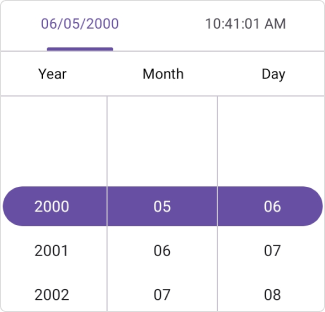
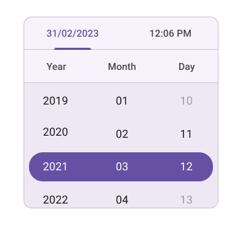
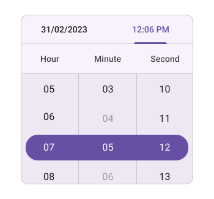

# Date Restriction in .NET MAUI Date Time Picker (SfDateTimePicker)

Restrict which dates and times a user can select using the following options: `MinimumDate` and `MaximumDate` define an allowed range, and `BlackoutDateTimes` disables specific dates or time slots within that range.

N> The `MinimumDate` and `MaximumDate` properties are of type `DateTime`. The default values are `DateTime.MinValue` (1/1/0001) and `DateTime.MaxValue` (12/31/9999) respectively. If `MinimumDate` is set to a value greater than `MaximumDate`, the picker throws an `ArgumentOutOfRangeException` when initialized.

## Minimum date
The Date Time Picker restricts selection to dates and times on or after the [MinimumDate](https://help.syncfusion.com/cr/maui/Syncfusion.Maui.Picker.SfDateTimePicker.html#Syncfusion_Maui_Picker_SfDateTimePicker_MinimumDate) property. The `MinimumDate` value must be less than or equal to `MaximumDate`.




<picker:SfDateTimePicker x:Name="picker"
                         MinimumDate="2000/5/6 3:34:12 AM">
</picker:SfDateTimePicker>




SfDateTimePicker picker = new SfDateTimePicker();
picker.MinimumDate = new DateTime(2000, 5, 6, 3, 34, 12);
this.Content = picker;

  


   

## Maximum date
The Date Time Picker restricts selection to dates and times on or before the [MaximumDate](https://help.syncfusion.com/cr/maui/Syncfusion.Maui.Picker.SfDateTimePicker.html#Syncfusion_Maui_Picker_SfDateTimePicker_MaximumDate) property.




<picker:SfDateTimePicker x:Name="picker"
                         MaximumDate="2042/10/10 12:15:03 PM">
</picker:SfDateTimePicker>




SfDateTimePicker picker = new SfDateTimePicker();
picker.MaximumDate = new DateTime(2042, 10, 10, 12, 15, 03);
this.Content = picker;

  


   

## Blackout Date times

The [Blackout Date times](https://help.syncfusion.com/cr/maui/Syncfusion.Maui.Picker.SfDateTimePicker.html#Syncfusion_Maui_Picker_SfDateTimePicker_BlackoutDateTimes) property in the [SfDateTimePicker](https://help.syncfusion.com/cr/maui/Syncfusion.Maui.Picker.SfDateTimePicker.html) component allows you to block the selection of specific dates and times. The property accepts an `ObservableCollection<DateTime?>`; each entry can represent an entire day (time component is midnight) or a specific time slot within a day. This feature is useful for enforcing availability rules, such as restricting specific days or hours.




<picker:SfDateTimePicker x:Name="picker">
   <picker:SfDateTimePicker.BlackoutDateTimes>
      <date:DateTime>2001-08-10</date:DateTime>
      <date:DateTime>2001-08-12</date:DateTime>
      <date:DateTime>2001-08-14</date:DateTime>
      <date:DateTime>2001-08-17</date:DateTime>
      <date:DateTime>2001-08-18</date:DateTime>
      <date:DateTime>2001-08-20</date:DateTime>
      <date:DateTime>2001-08-23</date:DateTime>
      <date:DateTime>2001-08-27</date:DateTime>
      <date:DateTime>2001-08-03</date:DateTime>
      <date:DateTime>2001-08-15 12:11:00</date:DateTime>
      <date:DateTime>2001-08-15 12:12:00</date:DateTime>
      <date:DateTime>2001-08-15 12:08:00</date:DateTime>
      <date:DateTime>2001-08-15 12:06:00</date:DateTime>
      <date:DateTime>2001-08-15 12:14:00</date:DateTime>
   </picker:SfDateTimePicker.BlackoutDateTimes>
</picker:SfDateTimePicker>




SfDateTimePicker picker = new SfDateTimePicker();
picker.BlackoutDateTimes.Add(new DateTime(2001, 8, 10));
picker.BlackoutDateTimes.Add(new DateTime(2001, 8, 12));
picker.BlackoutDateTimes.Add(new DateTime(2001, 8, 14));
picker.BlackoutDateTimes.Add(new DateTime(2001, 8, 17));
picker.BlackoutDateTimes.Add(new DateTime(2001, 8, 18));
picker.BlackoutDateTimes.Add(new DateTime(2001, 8, 20));
picker.BlackoutDateTimes.Add(new DateTime(2001, 8, 23));
picker.BlackoutDateTimes.Add(new DateTime(2001, 8, 27));
picker.BlackoutDateTimes.Add(new DateTime(2001, 8, 3));
picker.BlackoutDateTimes.Add(new DateTime(2001, 8, 15, 12, 11, 0));
picker.BlackoutDateTimes.Add(new DateTime(2001, 8, 15, 12, 12, 0));
picker.BlackoutDateTimes.Add(new DateTime(2001, 8, 15, 12, 8, 0));
picker.BlackoutDateTimes.Add(new DateTime(2001, 8, 15, 12, 6, 0));
picker.BlackoutDateTimes.Add(new DateTime(2001, 8, 15, 12, 14, 0));
this.Content = picker;

  


N> The `Selection View` will not be applicable when setting `Blackout date times`.