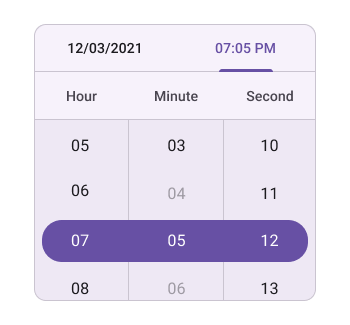

# Date Restriction in .NET MAUI Date Time Picker (SfDateTimePicker)

## Minimum date
The Date time picker provides an option to restrict the selection of date and time using the [MinimumDate](https://help.syncfusion.com/cr/maui/Syncfusion.Maui.Picker.SfDateTimePicker.html#Syncfusion_Maui_Picker_SfDateTimePicker_MinimumDate) property in [SfDateTimePicker](https://help.syncfusion.com/cr/maui/Syncfusion.Maui.Picker.SfDateTimePicker.html), and you cannot select the date and time beyond the minimum date range. The MinimumDate value has to be lesser than the MaximumDate value.




<picker:SfDateTimePicker x:Name="picker"
                         MinimumDate="2000/5/6 3:34:12 AM">
</picker:SfDateTimePicker>




SfDateTimePicker picker = new SfDateTimePicker();
picker.MinimumDate = new DateTime(2000, 5, 6, 3, 34, 12);
this.Content = picker;

  


   

## Maximum date
The Date time picker provides an option to restrict the selection of date and time using the [MaximumDate](https://help.syncfusion.com/cr/maui/Syncfusion.Maui.Picker.SfDateTimePicker.html#Syncfusion_Maui_Picker_SfDateTimePicker_MaximumDate) property in [SfDateTimePicker](https://help.syncfusion.com/cr/maui/Syncfusion.Maui.Picker.SfDateTimePicker.html), and you cannot select the date and time beyond the maximum date range.




<picker:SfDateTimePicker x:Name="picker"
                         MaximumDate="2042/10/10 12:15:03 PM">
</picker:SfDateTimePicker>




SfDateTimePicker picker = new SfDateTimePicker();
picker.MaximumDate = new DateTime(2042, 10, 10, 12, 15, 03);
this.Content = picker;

  


   

## Blackout Date times

The [Blackout Date times](https://help.syncfusion.com/cr/maui/Syncfusion.Maui.Picker.SfDateTimePicker.html#Syncfusion_Maui_Picker_SfDateTimePicker_BlackoutDateTimes) property in the [SfDateTimePicker](https://help.syncfusion.com/cr/maui/Syncfusion.Maui.Picker.SfDateTimePicker.html) component allows you to block the selection of specific dates and times. You can define a list of entire dates or particular time slots within those dates to disable, preventing their selection. This feature is useful for enforcing availability rules, such as restricting specific days or hours.




<picker:SfDateTimePicker x:Name="picker">
   <picker:SfDateTimePicker.BlackoutDateTimes>
      <date:DateTime>2001-08-10</date:DateTime>
      <date:DateTime>2001-08-12</date:DateTime>
      <date:DateTime>2001-08-14</date:DateTime>
      <date:DateTime>2001-08-17</date:DateTime>
      <date:DateTime>2001-08-18</date:DateTime>
      <date:DateTime>2001-08-20</date:DateTime>
      <date:DateTime>2001-08-23</date:DateTime>
      <date:DateTime>2001-08-27</date:DateTime>
      <date:DateTime>2001-08-03</date:DateTime>
      <date:DateTime>2001-08-15 12:11:00</date:DateTime>
      <date:DateTime>2001-08-15 12:12:00</date:DateTime>
      <date:DateTime>2001-08-15 12:08:00</date:DateTime>
      <date:DateTime>2001-08-15 12:06:00</date:DateTime>
      <date:DateTime>2001-08-15 12:14:00</date:DateTime>
   </picker:SfDateTimePicker.BlackoutDateTimes>
</picker:SfDateTimePicker>




SfDatePicker picker = new SfDatePicker();
picker.BlackoutDateTimes.Add(new DateTime(2001, 8, 10));
picker.BlackoutDateTimes.Add(new DateTime(2001, 8, 12));
picker.BlackoutDateTimes.Add(new DateTime(2001, 8, 14));
picker.BlackoutDateTimes.Add(new DateTime(2001, 8, 17));
picker.BlackoutDateTimes.Add(new DateTime(2001, 8, 18));
picker.BlackoutDateTimes.Add(new DateTime(2001, 8, 20));
picker.BlackoutDateTimes.Add(new DateTime(2001, 8, 23));
picker.BlackoutDateTimes.Add(new DateTime(2001, 8, 27));
picker.BlackoutDateTimes.Add(new DateTime(2001, 8, 3));
picker.BlackoutDateTimes.Add(new DateTime(2001, 8, 15, 12, 11, 0));
picker.BlackoutDateTimes.Add(new DateTime(2001, 8, 15, 12, 12, 0));
picker.BlackoutDateTimes.Add(new DateTime(2001, 8, 15, 12, 8, 0));
picker.BlackoutDateTimes.Add(new DateTime(2001, 8, 15, 12, 6, 0));
picker.BlackoutDateTimes.Add(new DateTime(2001, 8, 15, 12, 14, 0));
this.Content = picker;

  


N> The `Selection View` will not be applicable when setting `Blackout date times`.