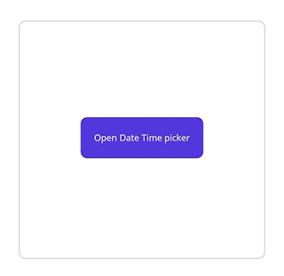
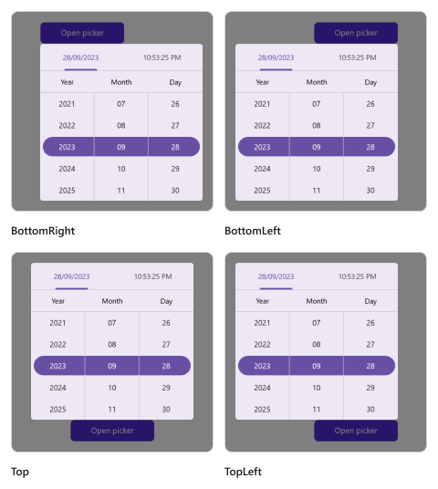
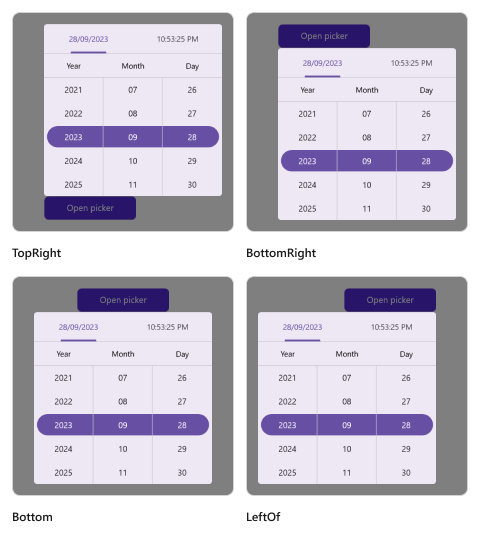

# Date Time picker mode in .NET MAUI Date Time Picker (SfDateTimePicker)
The date time picker mode is specified in the picker property enumeration, which is used to display the date time picker based on the modes. It offers three modes: `Default`, `Dialog`, and `RelativeDialog`. The default picker mode in the [SfDateTimePicker](https://help.syncfusion.com/cr/maui/Syncfusion.Maui.Picker.SfDateTimePicker.html) is `Default`.

## Dialog mode

The dialog mode is used to display the date time picker in a popup by setting the [Mode](https://help.syncfusion.com/cr/maui/Syncfusion.Maui.Picker.PickerBase.html#Syncfusion_Maui_Picker_PickerBase_Mode) property to [`Dialog`](https://help.syncfusion.com/cr/maui/Syncfusion.Maui.Picker.PickerMode.html#Syncfusion_Maui_Picker_PickerMode_Dialog) in [SfDateTimePicker](https://help.syncfusion.com/cr/maui/Syncfusion.Maui.Picker.SfDateTimePicker.html).




<picker:SfDateTimePicker x:Name="picker"
                         Mode="Dialog">
</picker:SfDateTimePicker>




SfDateTimePicker picker = new SfDateTimePicker();
picker.Mode = PickerMode.Dialog;
this.Content = picker;

  


The Date Time picker can be opened programmatically by setting the [`IsOpen`](https://help.syncfusion.com/cr/maui/Syncfusion.Maui.Picker.PickerBase.html#Syncfusion_Maui_Picker_PickerBase_IsOpen) property to `true` of [SfDateTimePicker](https://help.syncfusion.com/cr/maui/Syncfusion.Maui.Picker.SfDateTimePicker.html). By default, the `IsOpen` property is `false`.

Note: This property automatically changes to `false` when you close the dialog by clicking outside of it.




<Grid>
    <picker:SfDateTimePicker x:Name="picker" 
                             Mode="Dialog">
    </picker:SfDateTimePicker>
    <Button Text="Open Date Time picker" 
            x:Name="pickerButton"
            Clicked="Button_Clicked"
            HorizontalOptions="Center"
            VerticalOptions="Center"
            HeightRequest="50" 
            WidthRequest="150">
    </Button>
</Grid>




private void Button_Clicked(object sender, EventArgs e)
{
    this.picker.IsOpen = true;
}

  


   

## Relative dialog mode

The relative dialog mode is used to display the date time picker in a pop-up by setting the [Mode](https://help.syncfusion.com/cr/maui/Syncfusion.Maui.Picker.PickerBase.html#Syncfusion_Maui_Picker_PickerBase_Mode) property to [RelativeDialog](https://help.syncfusion.com/cr/maui/Syncfusion.Maui.Picker.PickerMode.html#Syncfusion_Maui_Picker_PickerMode_RelativeDialog). It is used to align the picker in a specific position. You can set the position by setting the [RelativePosition](https://help.syncfusion.com/cr/maui/Syncfusion.Maui.Picker.PickerBase.html#Syncfusion_Maui_Picker_PickerBase_RelativePosition) property in the [SfDateTimePicker](https://help.syncfusion.com/cr/maui/Syncfusion.Maui.Picker.SfDateTimePicker.html).

### Relative position

The relative position is specified in the picker property enumeration, which is used to align the picker in a specific position. It provides eight positions such as `AlignTop`, `AlignToLeftOf`, `AlignToRightOf`, `AlignBottom`, `AlignTopLeft`, `AlignTopRight`, `AlignBottomLeft`, and `AlignBottomRight`. The default relative position is `AlignTop` in the [SfDateTimePicker](https://help.syncfusion.com/cr/maui/Syncfusion.Maui.Picker.SfDateTimePicker.html).

The Date Time picker can be opened programmatically by setting the [`IsOpen`](https://help.syncfusion.com/cr/maui/Syncfusion.Maui.Picker.PickerBase.html#Syncfusion_Maui_Picker_PickerBase_IsOpen) property to `true` of [SfDateTimePicker](https://help.syncfusion.com/cr/maui/Syncfusion.Maui.Picker.SfDateTimePicker.html). By default, the `IsOpen` property is `false`.

Note: This property is automatically changed to `false` when you close the dialog by clicking outside of the dialog.




<Grid>
    <picker:SfDateTimePicker x:Name="picker" 
                             Mode="RelativeDialog"
                             RelativePosition="AlignTopLeft">
    </picker:SfDateTimePicker>
    <Button Text="Open Date Time picker" 
            x:Name="pickerButton"
            Clicked="Button_Clicked"
            HorizontalOptions="Center"
            VerticalOptions="Center"
            HeightRequest="50" 
            WidthRequest="150">
    </Button>
</Grid>




private void Button_Clicked(object sender, EventArgs e)
{
    this.picker.IsOpen = true;
}

  


### Relative view

The [RelativeView] is specified in the picker's property enumeration and is used to display the picker dialog relative to a view by setting setting the [Mode](https://help.syncfusion.com/cr/maui/Syncfusion.Maui.Picker.PickerBase.html#Syncfusion_Maui_Picker_PickerBase_Mode) property to [RelativeDialog](https://help.syncfusion.com/cr/maui/Syncfusion.Maui.Picker.PickerMode.html#Syncfusion_Maui_Picker_PickerMode_RelativeDialog). You can set the position by setting the [RelativePosition](https://help.syncfusion.com/cr/maui/Syncfusion.Maui.Picker.PickerBase.html#Syncfusion_Maui_Picker_PickerBase_RelativePosition) property in the [SfDateTimePicker](https://help.syncfusion.com/cr/maui/Syncfusion.Maui.Picker.SfDateTimePicker.html).

N>
It is only applicable in `RelativeDialog mode`. If `no` relative view is specified, the picker base will be set as the `default` relative view.





<Grid>
    <picker:SfDateTimePicker x:Name="picker" 
                             Mode="RelativeDialog"
                             RelativePosition="AlignTopLeft"
                             RelativeView = "{x:Reference pickerButton}">
    </picker:SfDateTimePicker>
    <Button Text="Open Date Time picker" 
            x:Name="pickerButton"
            Clicked="Button_Clicked"
            HorizontalOptions="Center"
            VerticalOptions="Center"
            HeightRequest="50" 
            WidthRequest="150">
    </Button>
</Grid>





private void Button_Clicked(object sender, EventArgs e)
{
    this.picker.IsOpen = true;
    this.picker.RelativeView = pickerButton;
}





   

   