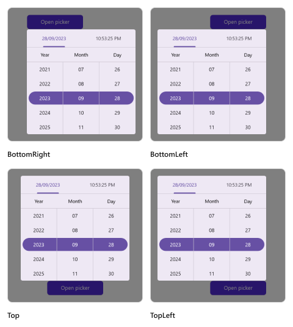
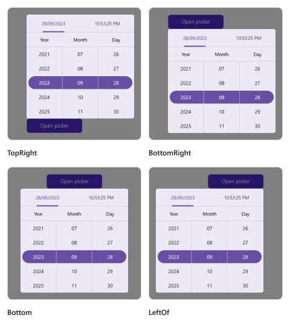

# Date Time picker mode in .NET MAUI Date Time Picker (SfDateTimePicker)

The [Mode](https://help.syncfusion.com/cr/maui/Syncfusion.Maui.Picker.PickerBase.html#Syncfusion_Maui_Picker_PickerBase_Mode) property controls how the Date Time Picker is displayed. It offers three values: [Default](https://help.syncfusion.com/cr/maui/Syncfusion.Maui.Picker.PickerMode.html#Syncfusion_Maui_Picker_PickerMode_Default), [Dialog](https://help.syncfusion.com/cr/maui/Syncfusion.Maui.Picker.PickerMode.html#Syncfusion_Maui_Picker_PickerMode_Dialog), and [RelativeDialog](https://help.syncfusion.com/cr/maui/Syncfusion.Maui.Picker.PickerMode.html#Syncfusion_Maui_Picker_PickerMode_RelativeDialog). The default picker mode in the [SfDateTimePicker](https://help.syncfusion.com/cr/maui/Syncfusion.Maui.Picker.SfDateTimePicker.html) is `Default`.

## Default mode

In `Default` mode, the Date Time Picker renders inline in the page layout and the user can interact with it directly (no popup is shown). This is the default behavior when no other [Mode](https://help.syncfusion.com/cr/maui/Syncfusion.Maui.Picker.PickerBase.html#Syncfusion_Maui_Picker_PickerBase_Mode) is set.

## Dialog mode

The dialog mode is used to display the date time picker in a popup by setting the [Mode](https://help.syncfusion.com/cr/maui/Syncfusion.Maui.Picker.PickerBase.html#Syncfusion_Maui_Picker_PickerBase_Mode) property to [Dialog](https://help.syncfusion.com/cr/maui/Syncfusion.Maui.Picker.PickerMode.html#Syncfusion_Maui_Picker_PickerMode_Dialog) in [SfDateTimePicker](https://help.syncfusion.com/cr/maui/Syncfusion.Maui.Picker.SfDateTimePicker.html).




<picker:SfDateTimePicker x:Name="picker"
                         Mode="Dialog">
</picker:SfDateTimePicker>




SfDateTimePicker picker = new SfDateTimePicker();
picker.Mode = PickerMode.Dialog;
this.Content = picker;

  


The Date Time picker can be opened programmatically by setting the [`IsOpen`](https://help.syncfusion.com/cr/maui/Syncfusion.Maui.Picker.PickerBase.html#Syncfusion_Maui_Picker_PickerBase_IsOpen) property to `true` of [SfDateTimePicker](https://help.syncfusion.com/cr/maui/Syncfusion.Maui.Picker.SfDateTimePicker.html). By default, the `IsOpen` property is `false`.

Note: This property automatically changes to `false` when you close the dialog by clicking outside of it.




<Grid>
    <picker:SfDateTimePicker x:Name="picker" 
                             Mode="Dialog">
    </picker:SfDateTimePicker>
    <Button Text="Open Date Time picker" 
            x:Name="pickerButton"
            Clicked="Button_Clicked"
            HorizontalOptions="Center"
            VerticalOptions="Center"
            HeightRequest="50" 
            WidthRequest="150">
    </Button>
</Grid>




private void Button_Clicked(object sender, EventArgs e)
{
    this.picker.IsOpen = true;
}

  


   

## Relative dialog mode

[RelativeDialog](https://help.syncfusion.com/cr/maui/Syncfusion.Maui.Picker.PickerMode.html#Syncfusion_Maui_Picker_PickerMode_RelativeDialog) mode displays the Date Time Picker as a popup anchored to another view. Use the [RelativePosition](https://help.syncfusion.com/cr/maui/Syncfusion.Maui.Picker.PickerRelativePosition.html) property to choose the anchor side, and the [RelativeView](https://help.syncfusion.com/cr/maui/Syncfusion.Maui.Picker.PickerBase.html#Syncfusion_Maui_Picker_PickerBase_RelativeView) property to choose the anchor view.

### Relative position

The [RelativePosition](https://help.syncfusion.com/cr/maui/Syncfusion.Maui.Picker.PickerRelativePosition.html) property accepts the following values. The default is [AlignTop](https://help.syncfusion.com/cr/maui/Syncfusion.Maui.Picker.PickerRelativePosition.html#Syncfusion_Maui_Picker_PickerRelativePosition_AlignTop).

* [AlignTop](https://help.syncfusion.com/cr/maui/Syncfusion.Maui.Picker.PickerRelativePosition.html#Syncfusion_Maui_Picker_PickerRelativePosition_AlignTop) - Above the relative view, horizontally aligned to its center.
[AlignToLeftOf](https://help.syncfusion.com/cr/maui/Syncfusion.Maui.Picker.PickerRelativePosition.html#Syncfusion_Maui_Picker_PickerRelativePosition_AlignToLeftOf) - To the left of the relative view, vertically aligned to its center.
[AlignToRightOf](https://help.syncfusion.com/cr/maui/Syncfusion.Maui.Picker.PickerRelativePosition.html#Syncfusion_Maui_Picker_PickerRelativePosition_AlignToRightOf) - To the right of the relative view, vertically aligned to its center.
[AlignBottom](https://help.syncfusion.com/cr/maui/Syncfusion.Maui.Picker.PickerRelativePosition.html#Syncfusion_Maui_Picker_PickerRelativePosition_AlignBottom) - Below the relative view, horizontally aligned to its center.
[AlignTopLeft](https://help.syncfusion.com/cr/maui/Syncfusion.Maui.Picker.PickerRelativePosition.html#Syncfusion_Maui_Picker_PickerRelativePosition_AlignTopLeft) - Above and to the left of the relative view.
[AlignTopRight](https://help.syncfusion.com/cr/maui/Syncfusion.Maui.Picker.PickerRelativePosition.html#Syncfusion_Maui_Picker_PickerRelativePosition_AlignTopRight) - Above and to the right of the relative view.
[AlignBottomLeft](https://help.syncfusion.com/cr/maui/Syncfusion.Maui.Picker.PickerRelativePosition.html#Syncfusion_Maui_Picker_PickerRelativePosition_AlignBottomLeft) - Below and to the left of the relative view.
[AlignBottomRight](https://help.syncfusion.com/cr/maui/Syncfusion.Maui.Picker.PickerRelativePosition.html#Syncfusion_Maui_Picker_PickerRelativePosition_AlignBottomRight) - Below and to the right of the relative view.

The Date Time picker can be opened programmatically by setting the [`IsOpen`](https://help.syncfusion.com/cr/maui/Syncfusion.Maui.Picker.PickerBase.html#Syncfusion_Maui_Picker_PickerBase_IsOpen) property to `true` of [SfDateTimePicker](https://help.syncfusion.com/cr/maui/Syncfusion.Maui.Picker.SfDateTimePicker.html). By default, the `IsOpen` property is `false`.

Note: This property is automatically changed to `false` when you close the dialog by clicking outside of the dialog.




<Grid>
    <picker:SfDateTimePicker x:Name="picker" 
                             Mode="RelativeDialog"
                             RelativePosition="AlignTopLeft">
    </picker:SfDateTimePicker>
    <Button Text="Open Date Time picker" 
            x:Name="pickerButton"
            Clicked="Button_Clicked"
            HorizontalOptions="Center"
            VerticalOptions="Center"
            HeightRequest="50" 
            WidthRequest="150">
    </Button>
</Grid>




private void Button_Clicked(object sender, EventArgs e)
{
    this.picker.IsOpen = true;
}

  


### Relative view

The [RelativeView](https://help.syncfusion.com/cr/maui/Syncfusion.Maui.Picker.PickerBase.html#Syncfusion_Maui_Picker_PickerBase_RelativeView) is specified in the picker's property enumeration and is used to display the picker dialog relative to a view by setting setting the [Mode](https://help.syncfusion.com/cr/maui/Syncfusion.Maui.Picker.PickerBase.html#Syncfusion_Maui_Picker_PickerBase_Mode) property to [RelativeDialog](https://help.syncfusion.com/cr/maui/Syncfusion.Maui.Picker.PickerMode.html#Syncfusion_Maui_Picker_PickerMode_RelativeDialog). You can set the position by setting the [RelativePosition](https://help.syncfusion.com/cr/maui/Syncfusion.Maui.Picker.PickerBase.html#Syncfusion_Maui_Picker_PickerBase_RelativePosition) property in the [SfDateTimePicker](https://help.syncfusion.com/cr/maui/Syncfusion.Maui.Picker.SfDateTimePicker.html).

N> It is only applicable in `RelativeDialog` mode. If `no relative view` is specified, the picker base will be set as the `default` relative view.





<Grid>
    <picker:SfDateTimePicker x:Name="picker" 
                             Mode="RelativeDialog"
                             RelativePosition="AlignTopLeft"
                             RelativeView = "{x:Reference pickerButton}">
    </picker:SfDateTimePicker>
    <Button Text="Open Date Time picker" 
            x:Name="pickerButton"
            Clicked="Button_Clicked"
            HorizontalOptions="Center"
            VerticalOptions="Center"
            HeightRequest="50" 
            WidthRequest="150">
    </Button>
</Grid>





private void Button_Clicked(object sender, EventArgs e)
{
    this.picker.IsOpen = true;
    this.picker.RelativeView = pickerButton;
}





   

   

## Custom popup size

When using `Dialog` or `RelativeDialog` mode, control the size of the popup with the [PopupWidth](https://help.syncfusion.com/cr/maui/Syncfusion.Maui.Picker.PickerBase.html#Syncfusion_Maui_Picker_PickerBase_PopupWidth) and [PopupHeight](https://help.syncfusion.com/cr/maui/Syncfusion.Maui.Picker.PickerBase.html#Syncfusion_Maui_Picker_PickerBase_PopupHeight) properties. These have no effect in `Default` mode.





<picker:SfDateTimePicker x:Name="picker"
                         Mode="Dialog"
                         PopupWidth="300"
                         PopupHeight="400"/>





this.picker.PopupWidth = 300;
this.picker.PopupHeight = 400;

 


