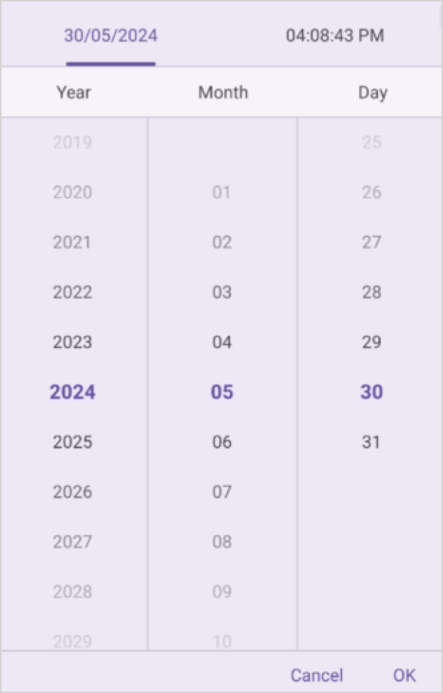
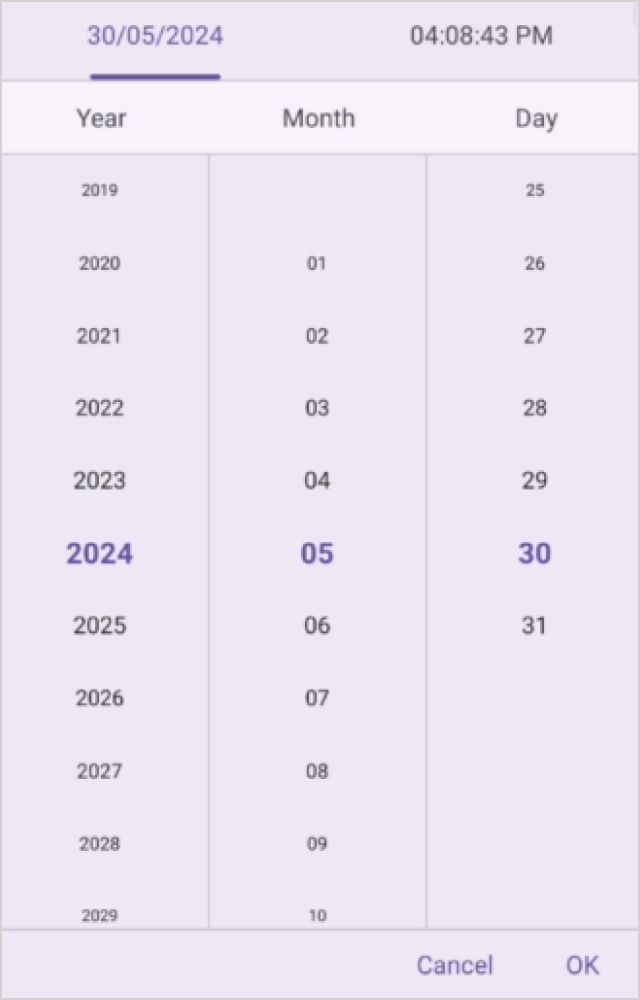
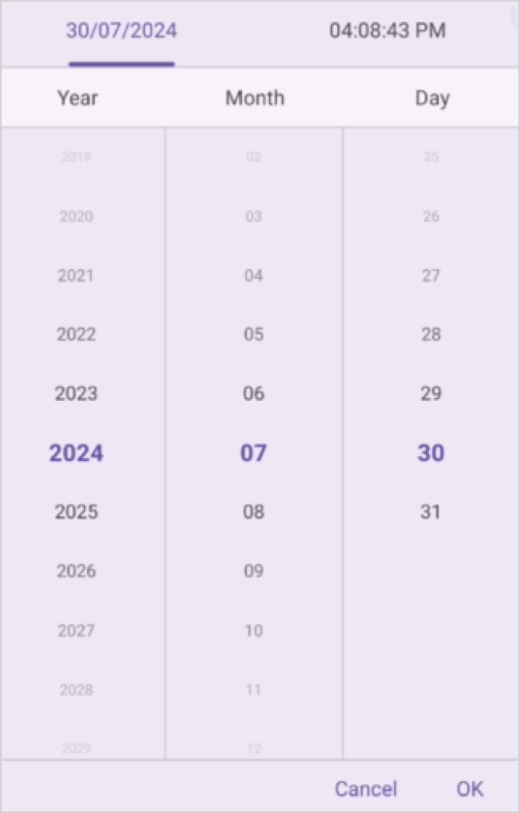

# Text display mode in .NET MAUI Picker (SfDateTimePicker)

The date time picker text display mode is specified in the date time picker property enumeration, which is used to display the date time picker items based on the modes. It offers four modes: `Default`, `Fade`, `Shrink` and `FadeAndShrink`. The default date time picker text display mode is `Default` in the `SfDateTimePicker`.

## Fade Mode

The fade mode in the date time picker gradually decreases the visibility of unselected items relative to the selected item. This effect is achieved by setting the `TextDisplayMode` property to `Fade` in `SfDateTimePicker`.





<dateTimePicker:SfDateTimePicker x:Name="dateTimePicker"
                 TextDisplayMode="Fade"/>





SfDateTimePicker dateTimePicker = new SfDateTimePicker()
{
    TextDisplayMode = PickerTextDisplayMode.Fade
};

this.Content = dateTimePicker;





## Shrink Mode

The shrink mode is used to display the font size of date time picker items decreased from the selected item by setting the `TextDisplayMode` property to `Shrink` in `SfDateTimePicker`.





<dateTimePicker:SfDateTimePicker x:Name="dateTimePicker"
                 TextDisplayMode="Shrink"/>





SfDateTimePicker dateTimePicker = new SfDateTimePicker()
{
    TextDisplayMode = PickerTextDisplayMode.Shrink
};

this.Content = dateTimePicker;





## FadeAndShrink Mode

The fade and shrink mode are used to decrease the opacity and font size of date time picker items from the selected item by setting the `TextDisplayMode` property to `FadeAndShrink` in `SfDateTimePicker`.





<dateTimePicker:SfDateTimePicker x:Name="dateTimePicker"
                 TextDisplayMode="FadeAndShrink"/>





SfDateTimePicker dateTimePicker = new SfDateTimePicker()
{
    TextDisplayMode = PickerTextDisplayMode.FadeAndShrink
};

this.Content = dateTimePicker;





