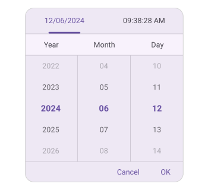
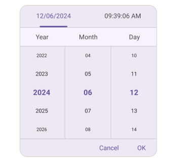

# Text display mode in .NET MAUI Picker (SfDateTimePicker)

The DateTimePicker text display mode is specified in the DateTimePicker property enumeration, which is used to display the DateTimePicker items based on the modes. It offers four modes: [Default](https://help.syncfusion.com/cr/maui/Syncfusion.Maui.Picker.PickerTextDisplayMode.html#Syncfusion_Maui_Picker_PickerTextDisplayMode_Default), [Fade](https://help.syncfusion.com/cr/maui/Syncfusion.Maui.Picker.PickerTextDisplayMode.html#Syncfusion_Maui_Picker_PickerTextDisplayMode_Fade), [Shrink](https://help.syncfusion.com/cr/maui/Syncfusion.Maui.Picker.PickerTextDisplayMode.html#Syncfusion_Maui_Picker_PickerTextDisplayMode_Shrink) and [FadeAndShrink](https://help.syncfusion.com/cr/maui/Syncfusion.Maui.Picker.PickerTextDisplayMode.html#Syncfusion_Maui_Picker_PickerTextDisplayMode_FadeAndShrink). The default DateTimePicker text display mode is [Default](https://help.syncfusion.com/cr/maui/Syncfusion.Maui.Picker.PickerTextDisplayMode.html#Syncfusion_Maui_Picker_PickerTextDisplayMode_Default) in the [SfDateTimePicker](https://help.syncfusion.com/cr/maui/Syncfusion.Maui.Picker.SfDateTimePicker.html).

## Fade Mode

The fade mode in the DateTimePicker gradually decreases the visibility of unselected items relative to the selected item. This effect is achieved by setting the [TextDisplayMode](https://help.syncfusion.com/cr/maui/Syncfusion.Maui.Picker.PickerBase.html#Syncfusion_Maui_Picker_PickerBase_TextDisplayMode) property to [Fade](https://help.syncfusion.com/cr/maui/Syncfusion.Maui.Picker.PickerTextDisplayMode.html#Syncfusion_Maui_Picker_PickerTextDisplayMode_Fade) in [SfDateTimePicker](https://help.syncfusion.com/cr/maui/Syncfusion.Maui.Picker.SfDateTimePicker.html).





<dateTimePicker:SfDateTimePicker x:Name="dateTimePicker"
                 TextDisplayMode="Fade"/>





SfDateTimePicker dateTimePicker = new SfDateTimePicker()
{
    TextDisplayMode = PickerTextDisplayMode.Fade
};

this.Content = dateTimePicker;





## Shrink Mode

The shrink mode is used to display the font size of DateTimePicker items decreased relative to the selected item by setting the [TextDisplayMode](https://help.syncfusion.com/cr/maui/Syncfusion.Maui.Picker.PickerBase.html#Syncfusion_Maui_Picker_PickerBase_TextDisplayMode) property to [Shrink](https://help.syncfusion.com/cr/maui/Syncfusion.Maui.Picker.PickerTextDisplayMode.html#Syncfusion_Maui_Picker_PickerTextDisplayMode_Shrink) in [SfDateTimePicker](https://help.syncfusion.com/cr/maui/Syncfusion.Maui.Picker.SfDateTimePicker.html).





<dateTimePicker:SfDateTimePicker x:Name="dateTimePicker"
                 TextDisplayMode="Shrink"/>





SfDateTimePicker dateTimePicker = new SfDateTimePicker()
{
    TextDisplayMode = PickerTextDisplayMode.Shrink
};

this.Content = dateTimePicker;





## FadeAndShrink Mode

The fade and shrink modes are used to decrease the opacity and font size of DateTimePicker items from the selected item by setting the [TextDisplayMode](https://help.syncfusion.com/cr/maui/Syncfusion.Maui.Picker.PickerBase.html#Syncfusion_Maui_Picker_PickerBase_TextDisplayMode) property to [FadeAndShrink](https://help.syncfusion.com/cr/maui/Syncfusion.Maui.Picker.PickerTextDisplayMode.html#Syncfusion_Maui_Picker_PickerTextDisplayMode_FadeAndShrink) in [SfDateTimePicker](https://help.syncfusion.com/cr/maui/Syncfusion.Maui.Picker.SfDateTimePicker.html).





<dateTimePicker:SfDateTimePicker x:Name="dateTimePicker"
                 TextDisplayMode="FadeAndShrink"/>





SfDateTimePicker dateTimePicker = new SfDateTimePicker()
{
    TextDisplayMode = PickerTextDisplayMode.FadeAndShrink
};

this.Content = dateTimePicker;





