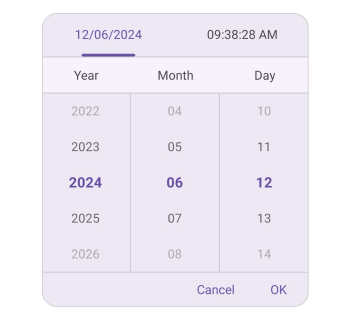
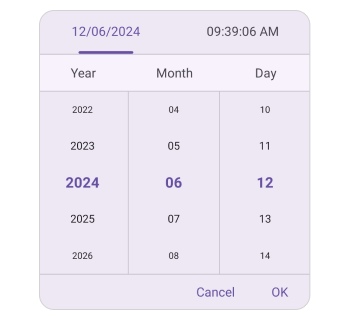
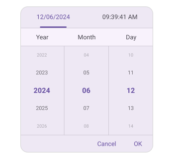

# Text display mode in .NET MAUI Picker (SfDateTimePicker)

The [TextDisplayMode](https://help.syncfusion.com/cr/maui/Syncfusion.Maui.Picker.PickerTextDisplayMode.html) property controls how unselected items are rendered relative to the selected item. It offers four modes: [Default](https://help.syncfusion.com/cr/maui/Syncfusion.Maui.Picker.PickerTextDisplayMode.html#Syncfusion_Maui_Picker_PickerTextDisplayMode_Default), [Fade](https://help.syncfusion.com/cr/maui/Syncfusion.Maui.Picker.PickerTextDisplayMode.html#Syncfusion_Maui_Picker_PickerTextDisplayMode_Fade), [Shrink](https://help.syncfusion.com/cr/maui/Syncfusion.Maui.Picker.PickerTextDisplayMode.html#Syncfusion_Maui_Picker_PickerTextDisplayMode_Shrink), and [FadeAndShrink](https://help.syncfusion.com/cr/maui/Syncfusion.Maui.Picker.PickerTextDisplayMode.html#Syncfusion_Maui_Picker_PickerTextDisplayMode_FadeAndShrink). The default value is [Default](https://help.syncfusion.com/cr/maui/Syncfusion.Maui.Picker.PickerTextDisplayMode.html#Syncfusion_Maui_Picker_PickerTextDisplayMode_Default).

## Fade mode

Fade mode fades out unselected items relative to the selected item. Set the [TextDisplayMode](https://help.syncfusion.com/cr/maui/Syncfusion.Maui.Picker.PickerBase.html#Syncfusion_Maui_Picker_PickerBase_TextDisplayMode) property to [Fade](https://help.syncfusion.com/cr/maui/Syncfusion.Maui.Picker.PickerTextDisplayMode.html#Syncfusion_Maui_Picker_PickerTextDisplayMode_Fade) to apply this effect to the [SfDateTimePicker](https://help.syncfusion.com/cr/maui/Syncfusion.Maui.Picker.SfDateTimePicker.html).





<ContentPage
    . . .
    xmlns:dateTimePicker="clr-namespace:Syncfusion.Maui.Picker;assembly=Syncfusion.Maui.Picker">
    <dateTimePicker:SfDateTimePicker x:Name="dateTimePicker"
                                     TextDisplayMode="Fade"/>
</ContentPage>





using Syncfusion.Maui.Picker;
. . .
public partial class MainPage : ContentPage
{
    public MainPage()
    {
        InitializeComponent();
        SfDateTimePicker dateTimePicker = new SfDateTimePicker()
        {
            TextDisplayMode = PickerTextDisplayMode.Fade
        };
        this.Content = dateTimePicker;
    }
}





## Shrink mode

Shrink mode reduces the font size of unselected items relative to the selected item. Set the [TextDisplayMode](https://help.syncfusion.com/cr/maui/Syncfusion.Maui.Picker.PickerBase.html#Syncfusion_Maui_Picker_PickerBase_TextDisplayMode) property to [Shrink](https://help.syncfusion.com/cr/maui/Syncfusion.Maui.Picker.PickerTextDisplayMode.html#Syncfusion_Maui_Picker_PickerTextDisplayMode_Shrink) to apply this effect to the [SfDateTimePicker](https://help.syncfusion.com/cr/maui/Syncfusion.Maui.Picker.SfDateTimePicker.html).





<ContentPage
    . . .
    xmlns:dateTimePicker="clr-namespace:Syncfusion.Maui.Picker;assembly=Syncfusion.Maui.Picker">
    <dateTimePicker:SfDateTimePicker x:Name="dateTimePicker"
                                     TextDisplayMode="Shrink"/>
</ContentPage>





using Syncfusion.Maui.Picker;
. . .
public partial class MainPage : ContentPage
{
    public MainPage()
    {
        InitializeComponent();
        SfDateTimePicker dateTimePicker = new SfDateTimePicker()
        {
            TextDisplayMode = PickerTextDisplayMode.Shrink
        };
        this.Content = dateTimePicker;
    }
}





## Fade and shrink mode

Fade and shrink mode reduces both the opacity and the font size of unselected items relative to the selected item. Set the [TextDisplayMode](https://help.syncfusion.com/cr/maui/Syncfusion.Maui.Picker.PickerBase.html#Syncfusion_Maui_Picker_PickerBase_TextDisplayMode) property to [FadeAndShrink](https://help.syncfusion.com/cr/maui/Syncfusion.Maui.Picker.PickerTextDisplayMode.html#Syncfusion_Maui_Picker_PickerTextDisplayMode_FadeAndShrink) to apply this effect to the [SfDateTimePicker](https://help.syncfusion.com/cr/maui/Syncfusion.Maui.Picker.SfDateTimePicker.html).





<ContentPage
    . . .
    xmlns:dateTimePicker="clr-namespace:Syncfusion.Maui.Picker;assembly=Syncfusion.Maui.Picker">
    <dateTimePicker:SfDateTimePicker x:Name="dateTimePicker"
                                     TextDisplayMode="FadeAndShrink"/>
</ContentPage>





using Syncfusion.Maui.Picker;
. . .
public partial class MainPage : ContentPage
{
    public MainPage()
    {
        InitializeComponent();
        SfDateTimePicker dateTimePicker = new SfDateTimePicker()
        {
            TextDisplayMode = PickerTextDisplayMode.FadeAndShrink
        };
        this.Content = dateTimePicker;
    }
}





