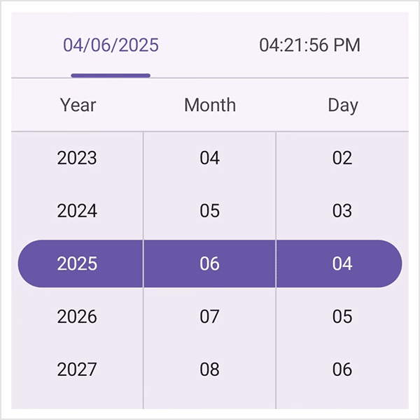

# Looping support in .NET MAUI Date Time Picker (SfDateTimePicker)

The [EnableLooping](https://help.syncfusion.com/cr/maui/Syncfusion.Maui.Picker.PickerBase.html#Syncfusion_Maui_Picker_PickerBase_EnableLooping) property enables cyclic navigation in the [SfDateTimePicker](https://help.syncfusion.com/cr/maui/Syncfusion.Maui.Picker.SfDateTimePicker.html). When enabled, supported columns wrap from the last item to the first item and vice versa during both forward and backward navigation.

To enable looping in the [SfDateTimePicker](https://help.syncfusion.com/cr/maui/Syncfusion.Maui.Picker.SfDateTimePicker.html), set the [EnableLooping](https://help.syncfusion.com/cr/maui/Syncfusion.Maui.Picker.PickerBase.html#Syncfusion_Maui_Picker_PickerBase_EnableLooping) property to `true`. The default value is `false`.





<picker:SfDateTimePicker x:Name="dateTimePicker"
                     EnableLooping="True"/>



  

SfDateTimePicker dateTimePicker = new SfDateTimePicker()
{
    EnableLooping = true,
};

this.Content = dateTimePicker;





{:width="330" height="360"}