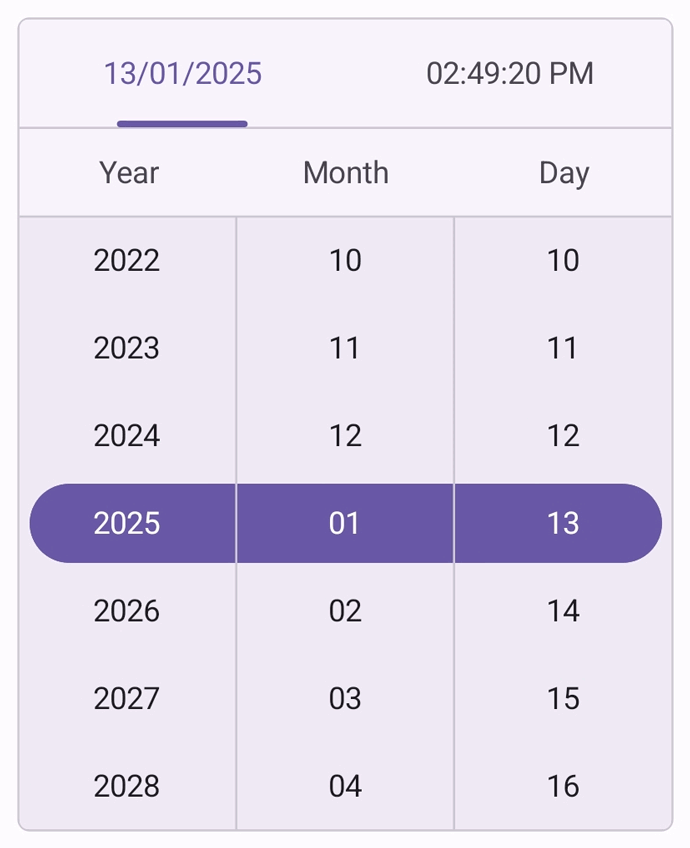

# Looping support in .NET MAUI Date Time Picker (SfDateTimePicker)

The [EnableLooping](https://help.syncfusion.com/cr/maui/Syncfusion.Maui.Picker.EnableLooping.html) property allows you to enable looping support in the date time picker control. With looping enabled, the control seamlessly navigates from the last item to the first item and back again, iterating in both forward and backward directions.

To enable the looping in date time picker by setting the [EnableLooping](https://help.syncfusion.com/cr/maui/Syncfusion.Maui.Picker.EnableLooping.html) property as `true`. The default value is `false`.





<picker:SfDateTimePicker x:Name="dateTimePicker"
                     EnableLooping="True"/>



  

SfDateTimePicker dateTimePicker = new SfDateTimePicker()
{
    EnableLooping = True,
};

this.Content = dateTimePicker;





{:width="330" height="360"}