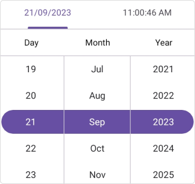
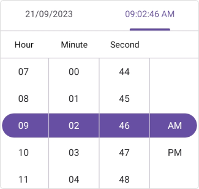

# Formatting in .NET MAUI Date Time Picker (SfDateTimePicker)
Format is a way to represent the date and time value in a different string format.

## Date format
You can customize the date format of the date time picker by using the [DateFormat](https://help.syncfusion.com/cr/maui/Syncfusion.Maui.Picker.SfDateTimePicker.html#Syncfusion_Maui_Picker_SfDateTimePicker_DateFormat) property of type [PickerDateFormat](https://help.syncfusion.com/cr/maui/Syncfusion.Maui.Picker.PickerDateFormat.html) in [SfDateTimePicker](https://help.syncfusion.com/cr/maui/Syncfusion.Maui.Picker.SfDateTimePicker.html). The default format is `yyyy_MM_dd`.

The different types of formats are:

[`dd_MM`](https://help.syncfusion.com/cr/maui/Syncfusion.Maui.Picker.PickerDateFormat.html#Syncfusion_Maui_Picker_PickerDateFormat_dd_MM) - Represents the day month in dd/MM format.

[`dd_MM_yyyy`](https://help.syncfusion.com/cr/maui/Syncfusion.Maui.Picker.PickerDateFormat.html#Syncfusion_Maui_Picker_PickerDateFormat_dd_MM_yyyy) - Represents the day month year in dd/MM/yyyy format.

[`dd_MMM_yyyy`](https://help.syncfusion.com/cr/maui/Syncfusion.Maui.Picker.PickerDateFormat.html#Syncfusion_Maui_Picker_PickerDateFormat_dd_MMM_yyyy) - Represents the day month year in dd/MMM/yyyy format.

[`M_d_yyyy`](https://help.syncfusion.com/cr/maui/Syncfusion.Maui.Picker.PickerDateFormat.html#Syncfusion_Maui_Picker_PickerDateFormat_M_d_yyyy) - Represents the month day year in M/d/yyyy format.

[`MM_dd_yyyy`](https://help.syncfusion.com/cr/maui/Syncfusion.Maui.Picker.PickerDateFormat.html#Syncfusion_Maui_Picker_PickerDateFormat_MM_dd_yyyy) - Represents the month day year in MM/dd/yyyy format.

[`MM_yyyy`](https://help.syncfusion.com/cr/maui/Syncfusion.Maui.Picker.PickerDateFormat.html#Syncfusion_Maui_Picker_PickerDateFormat_MM_yyyy) - Represents the month year in MM/yyyy format.

[`MMM_yyyy`](https://help.syncfusion.com/cr/maui/Syncfusion.Maui.Picker.PickerDateFormat.html#Syncfusion_Maui_Picker_PickerDateFormat_MMM_yyyy) - Represents the month year in MMM/yyyy format.

[`yyyy_MM_dd`](https://help.syncfusion.com/cr/maui/Syncfusion.Maui.Picker.PickerDateFormat.html#Syncfusion_Maui_Picker_PickerDateFormat_yyyy_MM_dd) - Represents the year month day in yyyy/MM/dd format.

[`Default`](https://help.syncfusion.com/cr/maui/Syncfusion.Maui.Picker.PickerDateFormat.html#Syncfusion_Maui_Picker_PickerDateFormat_Default) - Represents the day month year in default culture based format.




<picker:SfDateTimePicker x:Name="picker"
                         DateFormat="dd_MMM_yyyy">
</picker:SfDateTimePicker>




SfDateTimePicker picker = new SfDateTimePicker();
picker.DateFormat = PickerDateFormat.dd_MMM_yyyy;
this.Content = picker;

  


   

## Time format
You can customize the time format of the date time picker by using the [TimeFormat](https://help.syncfusion.com/cr/maui/Syncfusion.Maui.Picker.SfDateTimePicker.html#Syncfusion_Maui_Picker_SfDateTimePicker_TimeFormat) property of type [PickerTimeFormat](https://help.syncfusion.com/cr/maui/Syncfusion.Maui.Picker.PickerTimeFormat.html) in [SfDateTimePicker](https://help.syncfusion.com/cr/maui/Syncfusion.Maui.Picker.SfDateTimePicker.html). The default format is `HH_mm_ss`.

The different types of formats are:

[`H_mm`](https://help.syncfusion.com/cr/maui/Syncfusion.Maui.Picker.PickerTimeFormat.html#Syncfusion_Maui_Picker_PickerTimeFormat_H_mm) - Represents the hour minute in H_mm format.

[`H_mm_ss`](https://help.syncfusion.com/cr/maui/Syncfusion.Maui.Picker.PickerTimeFormat.html#Syncfusion_Maui_Picker_PickerTimeFormat_H_mm_ss) - Represents the hour minute second in H_mm_ss format.

[`HH_mm_ss_fff`](https://help.syncfusion.com/cr/maui/Syncfusion.Maui.Picker.PickerTimeFormat.html#Syncfusion_Maui_Picker_PickerTimeFormat_HH_mm_ss_fff) - Represents the hour minute second millisecond in HH_mm_ss_fff format.

[`h_mm_ss_tt`](https://help.syncfusion.com/cr/maui/Syncfusion.Maui.Picker.PickerTimeFormat.html#Syncfusion_Maui_Picker_PickerTimeFormat_h_mm_ss_tt) - Represents the hour minute second meridiem in h_mm_ss_tt format.

[`hh_mm_ss_fff_tt`](https://help.syncfusion.com/cr/maui/Syncfusion.Maui.Picker.PickerTimeFormat.html#Syncfusion_Maui_Picker_PickerTimeFormat_hh_mm_ss_fff_tt) - Represents the hour minute second millisecond meridiem in hh_mm_ss_fff_tt format.

[`h_mm_tt`](https://help.syncfusion.com/cr/maui/Syncfusion.Maui.Picker.PickerTimeFormat.html#Syncfusion_Maui_Picker_PickerTimeFormat_h_mm_tt) - Represents the hour minute meridiem in h_mm_tt format.

[`HH_mm`](https://help.syncfusion.com/cr/maui/Syncfusion.Maui.Picker.PickerTimeFormat.html#Syncfusion_Maui_Picker_PickerTimeFormat_HH_mm) - Represents the hour minute in HH_mm format.

[`HH_mm_ss`](https://help.syncfusion.com/cr/maui/Syncfusion.Maui.Picker.PickerTimeFormat.html#Syncfusion_Maui_Picker_PickerTimeFormat_HH_mm_ss) - Represents the hour minute second in HH_mm_ss format.

[`hh_mm_ss_tt`](https://help.syncfusion.com/cr/maui/Syncfusion.Maui.Picker.PickerTimeFormat.html#Syncfusion_Maui_Picker_PickerTimeFormat_hh_mm_ss_tt) - Represents the hour minute second meridiem in hh_mm_ss_tt format.

[`hh_mm_tt`](https://help.syncfusion.com/cr/maui/Syncfusion.Maui.Picker.PickerTimeFormat.html#Syncfusion_Maui_Picker_PickerTimeFormat_hh_mm_tt) - Represents the hour minute meridiem in hh_mm_tt format.

[`hh_tt`](https://help.syncfusion.com/cr/maui/Syncfusion.Maui.Picker.PickerTimeFormat.html#Syncfusion_Maui_Picker_PickerTimeFormat_hh_tt) - Represents the hour meridiem in hh_tt format.

[`ss_fff`](https://help.syncfusion.com/cr/maui/Syncfusion.Maui.Picker.PickerTimeFormat.html#Syncfusion_Maui_Picker_PickerTimeFormat_ss_fff) - Represents the second millisecond in ss_fff format.

[`mm_ss`](https://help.syncfusion.com/cr/maui/Syncfusion.Maui.Picker.PickerTimeFormat.html#Syncfusion_Maui_Picker_PickerTimeFormat_mm_ss) - Represents the minute second in mm_ss format.

[`mm_ss_fff`](https://help.syncfusion.com/cr/maui/Syncfusion.Maui.Picker.PickerTimeFormat.html#Syncfusion_Maui_Picker_PickerTimeFormat_mm_ss_fff) - Represents the minute second millisecond in mm_ss_fff format.

[`Default`](https://help.syncfusion.com/cr/maui/Syncfusion.Maui.Picker.PickerTimeFormat.html#Syncfusion_Maui_Picker_PickerTimeFormat_Default) - Represents the hour minute second meridiem in default culture based format.




<picker:SfDateTimePicker x:Name="picker"
                         TimeFormat="hh_mm_ss_tt">
</picker:SfDateTimePicker>




SfDateTimePicker picker = new SfDateTimePicker();
picker.TimeFormat = PickerTimeFormat.hh_mm_ss_tt;
this.Content = picker;

  


   