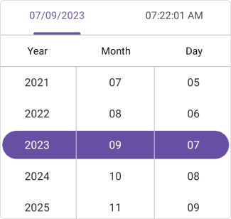

# Getting Started with the .NET MAUI DateTimePicker
This section explains how to add the Date Time Picker control. It covers only the basic features needed to get started with Syncfusion&reg; Date Time Picker. Follow the steps below to add a .NET MAUI Date time picker to your project.

To get start quickly with our .NET MAUI Date Time Picker, you can check the below video.



## Prerequisites

Before proceeding, ensure the following are set up:
1. Install [.NET 7 SDK](https://dotnet.microsoft.com/en-us/download/dotnet/7.0) or later is installed.
2. Set up a .NET MAUI environment with Visual Studio 2022 (v17.3 or later) or Visual Studio Code. For Visual Studio Code users, ensure that the .NET MAUI workload is installed and configured as described [here.](https://learn.microsoft.com/en-us/dotnet/maui/get-started/installation?view=net-maui-8.0&tabs=visual-studio-code)

## Step 1: Create a New .NET MAUI Project

### Visual Studio

1. Go to **File > New > Project** and choose the **.NET MAUI App** template.
2. Name the project and choose a location. Then click **Next**.
3. Select the .NET framework version and click **Create**.

### Visual Studio Code

1. Open the command palette by pressing `Ctrl+Shift+P` and type **.NET:New Project** and enter.
2. Choose the **.NET MAUI App** template.
3. Select the project location, type the project name and press **Enter**.
4. Then choose **Create project.**

## Step 2: Install the Syncfusion .NET MAUI DateTimePicker NuGet Package

1. In **Solution Explorer,** right-click the project and choose **Manage NuGet Packages.**
2. Search for [Syncfusion.Maui.Picker](https://www.nuget.org/packages/Syncfusion.Maui.Picker/) and install the latest version.
3. Ensure the necessary dependencies are installed correctly, and the project is restored.

## Step 3: Register the handler

The [Syncfusion.Maui.Core](https://www.nuget.org/packages/Syncfusion.Maui.Core/) NuGet is a dependent package for all Syncfusion® controls of .NET MAUI. In the **MauiProgram.cs** file, register the handler for Syncfusion® core.




using Syncfusion.Maui.Core.Hosting;
namespace GettingStarted
{
    public static class MauiProgram
    {
        public static MauiApp CreateMauiApp()
        {
            var builder = MauiApp.CreateBuilder();

            builder.ConfigureSyncfusionCore();
            builder
            .UseMauiApp<App>()
            .ConfigureFonts(fonts =>
            {
                fonts.AddFont("OpenSans-Regular.ttf", "OpenSansRegular");
            });

            return builder.Build();
        }
    }
}




## Step 4: Add .NET MAUI Date time picker control

1. To initialize the control, import the `Syncfusion.Maui.Picker` namespace into your code.
2. Initialize [SfDateTimePicker](https://help.syncfusion.com/cr/maui/Syncfusion.Maui.Picker.SfDateTimePicker.html).




<ContentPage   
    . . .
    xmlns:picker="clr-namespace:Syncfusion.Maui.Picker;assembly=Syncfusion.Maui.Picker">

    <picker:SfDateTimePicker />
</ContentPage>




using Syncfusion.Maui.Picker;
. . .

public partial class MainPage : ContentPage
{
    public MainPage()
    {
        InitializeComponent();
        SfDateTimePicker picker = new SfDateTimePicker();
        this.Content = picker;
    }
}




## Date Time Picker header

The [SfDateTimePicker](https://help.syncfusion.com/cr/maui/Syncfusion.Maui.Picker.SfDateTimePicker.html) control provides the default header which shows the current selected date and selected time.

## Set footer to the Date Time Picker

In the SfDateTimePicker control, validation buttons (OK and Cancel) can be customized by setting the [OkButtonText](https://help.syncfusion.com/cr/maui/Syncfusion.Maui.Picker.PickerFooterView.html#Syncfusion_Maui_Picker_PickerFooterView_OkButtonText) and [CancelButtonText](https://help.syncfusion.com/cr/maui/Syncfusion.Maui.Picker.PickerFooterView.html#Syncfusion_Maui_Picker_PickerFooterView_CancelButtonText) properties in the [PickerFooterView](https://help.syncfusion.com/cr/maui/Syncfusion.Maui.Picker.PickerFooterView.html). It allows you to confirm or cancel the selected date and time. The `OkButtonText` can be enabled using the [ShowOkButton](https://help.syncfusion.com/cr/maui/Syncfusion.Maui.Picker.PickerFooterView.html#Syncfusion_Maui_Picker_PickerFooterView_ShowOkButton) property in the [PickerFooterView](https://help.syncfusion.com/cr/maui/Syncfusion.Maui.Picker.PickerFooterView.html).




<picker:SfDateTimePicker x:Name="picker">
    <picker:SfDateTimePicker.FooterView>
        <picker:PickerFooterView ShowOkButton="True" Height="40" />
    </picker:SfDateTimePicker.FooterView>
</picker:SfDateTimePicker>




SfDateTimePicker picker = new SfDateTimePicker();
picker.FooterView= new PickerFooterView()
{  
    ShowOkButton = true,
    Height = 40,
};

this.Content = picker;

  


   

## Set height and width to the Date Time Picker

The SfDateTimePicker control allows you to change the height and width by using the `HeightRequest` and `WidthRequest` properties in the `SfDateTimePicker`.




<picker:SfDateTimePicker x:Name="picker" 
                    HeightRequest="280" 
                    WidthRequest="300">
</picker:SfDateTimePicker>




SfDateTimePicker picker = new SfDateTimePicker()
{
    HeightRequest = 280,
    WidthRequest = 300,
};

this.Content = picker;

  


   

## Set selected date and selected time to the Date Time Picker

The SfDateTimePicker control allows you to select the date and time by using the [SelectedDate](https://help.syncfusion.com/cr/maui/Syncfusion.Maui.Picker.SfDateTimePicker.html#Syncfusion_Maui_Picker_SfDateTimePicker_SelectedDate) property in the [SfDateTimePicker](https://help.syncfusion.com/cr/maui/Syncfusion.Maui.Picker.SfDateTimePicker.html). The default value of the `SelectedDate` is the current date and time.




<picker:SfDateTimePicker x:Name="picker" 
                         SelectedDate="9/7/2023 10:15:22">
</picker:SfDateTimePicker>




SfDateTimePicker picker = new SfDateTimePicker()
{
    SelectedDate = new DateTime(2023, 09, 07, 10, 15, 22),
};

this.Content = picker;

  


   

## Clear selection

The .NET MAUI DateTimePicker provides clear selection support, allowing you to clear the selected date and time by setting the `SelectedDate` property to `null`.




<picker:SfDateTimePicker x:Name="picker" />




    this.Picker.SelectedDate = null;

  


N> You can refer to our [.NET MAUI Date Time Picker](https://www.syncfusion.com/maui-controls/maui-datetimepicker) feature tour page for its groundbreaking feature representations. You can also explore our [.NET MAUI Date Time Picker Example](https://github.com/syncfusion/maui-demos/tree/master/MAUI/Picker/SampleBrowser.Maui.Picker/Samples/DateTimePicker/GettingStarted) that shows you how to render the Date Time Picker in .NET MAUI.