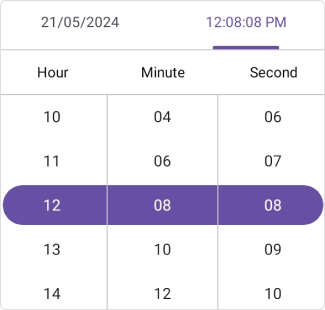
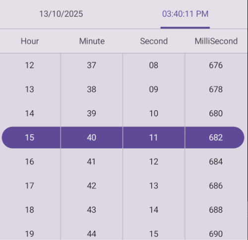

# Intervals in .NET MAUI Date Time Picker control
The `SfDateTimePicker` provides seven intervals in [.NET MAUI Date Time Picker](https://www.syncfusion.com/maui-controls/maui-datetimepicker). Use these to control the step size shown for each date or time column.

 * [`DayInterval`](https://help.syncfusion.com/cr/maui/Syncfusion.Maui.Picker.SfDateTimePicker.html#Syncfusion_Maui_Picker_SfDateTimePicker_DayInterval)
 * [`MonthInterval`](https://help.syncfusion.com/cr/maui/Syncfusion.Maui.Picker.SfDateTimePicker.html#Syncfusion_Maui_Picker_SfDateTimePicker_MonthInterval)
 * [`YearInterval`](https://help.syncfusion.com/cr/maui/Syncfusion.Maui.Picker.SfDateTimePicker.html#Syncfusion_Maui_Picker_SfDateTimePicker_YearInterval)
 * [`HourInterval`](https://help.syncfusion.com/cr/maui/Syncfusion.Maui.Picker.SfDateTimePicker.html#Syncfusion_Maui_Picker_SfDateTimePicker_HourInterval)
 * [`MinuteInterval`](https://help.syncfusion.com/cr/maui/Syncfusion.Maui.Picker.SfDateTimePicker.html#Syncfusion_Maui_Picker_SfDateTimePicker_MinuteInterval)
 * [`SecondInterval`](https://help.syncfusion.com/cr/maui/Syncfusion.Maui.Picker.SfDateTimePicker.html#Syncfusion_Maui_Picker_SfDateTimePicker_SecondInterval)
 * [`MilliSecondInterval`](https://help.syncfusion.com/cr/maui/Syncfusion.Maui.Picker.SfDateTimePicker.html#Syncfusion_Maui_Picker_SfDateTimePicker_MilliSecondInterval)

## Day interval
Sets the interval between days using the [DayInterval](https://help.syncfusion.com/cr/maui/Syncfusion.Maui.Picker.SfDateTimePicker.html#Syncfusion_Maui_Picker_SfDateTimePicker_DayInterval) property of [SfDateTimePicker](https://help.syncfusion.com/cr/maui/Syncfusion.Maui.Picker.SfDateTimePicker.html).




<ContentPage
    . . .
    xmlns:picker="clr-namespace:Syncfusion.Maui.Picker;assembly=Syncfusion.Maui.Picker">
    <picker:SfDateTimePicker x:Name="picker"
                             DayInterval="2"/>
</ContentPage>




using Syncfusion.Maui.Picker;
. . .
public partial class MainPage : ContentPage
{
    public MainPage()
    {
        InitializeComponent();
        SfDateTimePicker dateTimePicker = new SfDateTimePicker();
        dateTimePicker.DayInterval = 2;
        this.Content = dateTimePicker;
    }
}




   

## Month interval
Sets the interval between months using the [MonthInterval](https://help.syncfusion.com/cr/maui/Syncfusion.Maui.Picker.SfDateTimePicker.html#Syncfusion_Maui_Picker_SfDateTimePicker_MonthInterval) property of [SfDateTimePicker](https://help.syncfusion.com/cr/maui/Syncfusion.Maui.Picker.SfDateTimePicker.html).




<ContentPage
    . . .
    xmlns:picker="clr-namespace:Syncfusion.Maui.Picker;assembly=Syncfusion.Maui.Picker">
    <picker:SfDateTimePicker x:Name="picker"
                             MonthInterval="2"/>
</ContentPage>




using Syncfusion.Maui.Picker;
. . .
public partial class MainPage : ContentPage
{
    public MainPage()
    {
        InitializeComponent();
        SfDateTimePicker dateTimePicker = new SfDateTimePicker();
        dateTimePicker.MonthInterval = 2;
        this.Content = dateTimePicker;
    }
}




   

## Year interval
Sets the interval between years using the [YearInterval](https://help.syncfusion.com/cr/maui/Syncfusion.Maui.Picker.SfDateTimePicker.html#Syncfusion_Maui_Picker_SfDateTimePicker_YearInterval) property of [SfDateTimePicker](https://help.syncfusion.com/cr/maui/Syncfusion.Maui.Picker.SfDateTimePicker.html).




<ContentPage
    . . .
    xmlns:picker="clr-namespace:Syncfusion.Maui.Picker;assembly=Syncfusion.Maui.Picker">
    <picker:SfDateTimePicker x:Name="picker"
                             YearInterval="2"/>
</ContentPage>




using Syncfusion.Maui.Picker;
. . .
public partial class MainPage : ContentPage
{
    public MainPage()
    {
        InitializeComponent();
        SfDateTimePicker dateTimePicker = new SfDateTimePicker();
        dateTimePicker.YearInterval = 2;
        this.Content = dateTimePicker;
    }
}




   

## Hour interval
Sets the interval between hours using the [HourInterval](https://help.syncfusion.com/cr/maui/Syncfusion.Maui.Picker.SfDateTimePicker.html#Syncfusion_Maui_Picker_SfDateTimePicker_HourInterval) property of [SfDateTimePicker](https://help.syncfusion.com/cr/maui/Syncfusion.Maui.Picker.SfDateTimePicker.html).




<ContentPage
    . . .
    xmlns:picker="clr-namespace:Syncfusion.Maui.Picker;assembly=Syncfusion.Maui.Picker">
    <picker:SfDateTimePicker x:Name="picker"
                             HourInterval="2"/>
</ContentPage>


  

using Syncfusion.Maui.Picker;
. . .
public partial class MainPage : ContentPage
{
    public MainPage()
    {
        InitializeComponent();
        SfDateTimePicker dateTimePicker = new SfDateTimePicker();
        dateTimePicker.HourInterval = 2;
        this.Content = dateTimePicker;
    }
}




   

## Minute interval
Sets the interval between minutes using the [MinuteInterval](https://help.syncfusion.com/cr/maui/Syncfusion.Maui.Picker.SfDateTimePicker.html#Syncfusion_Maui_Picker_SfDateTimePicker_MinuteInterval) property of [SfDateTimePicker](https://help.syncfusion.com/cr/maui/Syncfusion.Maui.Picker.SfDateTimePicker.html).




<ContentPage
    . . .
    xmlns:picker="clr-namespace:Syncfusion.Maui.Picker;assembly=Syncfusion.Maui.Picker">
    <picker:SfDateTimePicker x:Name="picker"
                             MinuteInterval="2"/>
</ContentPage>


  

using Syncfusion.Maui.Picker;
. . .
public partial class MainPage : ContentPage
{
    public MainPage()
    {
        InitializeComponent();
        SfDateTimePicker dateTimePicker = new SfDateTimePicker();
        dateTimePicker.MinuteInterval = 2;
        this.Content = dateTimePicker;
    }
}




   

## Second interval
Sets the interval between seconds using the [SecondInterval](https://help.syncfusion.com/cr/maui/Syncfusion.Maui.Picker.SfDateTimePicker.html#Syncfusion_Maui_Picker_SfDateTimePicker_SecondInterval) property of [SfDateTimePicker](https://help.syncfusion.com/cr/maui/Syncfusion.Maui.Picker.SfDateTimePicker.html).




<ContentPage
    . . .
    xmlns:picker="clr-namespace:Syncfusion.Maui.Picker;assembly=Syncfusion.Maui.Picker">
    <picker:SfDateTimePicker x:Name="picker"
                             SecondInterval="2"/>
</ContentPage>


  

using Syncfusion.Maui.Picker;
. . .
public partial class MainPage : ContentPage
{
    public MainPage()
    {
        InitializeComponent();
        SfDateTimePicker dateTimePicker = new SfDateTimePicker();
        dateTimePicker.SecondInterval = 2;
        this.Content = dateTimePicker;
    }
}




   

## Millisecond interval
Sets the interval between milliseconds using the [MilliSecondInterval](https://help.syncfusion.com/cr/maui/Syncfusion.Maui.Picker.SfDateTimePicker.html#Syncfusion_Maui_Picker_SfDateTimePicker_MilliSecondInterval) property of [SfDateTimePicker](https://help.syncfusion.com/cr/maui/Syncfusion.Maui.Picker.SfDateTimePicker.html). To display milliseconds, the `TimeFormat` must include a fractional component such as `fff`.




<ContentPage
    . . .
    xmlns:picker="clr-namespace:Syncfusion.Maui.Picker;assembly=Syncfusion.Maui.Picker">
    <picker:SfDateTimePicker x:Name="picker"
                             TimeFormat="hh_mm_ss_fff_tt"
                             MilliSecondInterval="2"/>
</ContentPage>


  

using Syncfusion.Maui.Picker;
. . .
public partial class MainPage : ContentPage
{
    public MainPage()
    {
        InitializeComponent();
        SfDateTimePicker dateTimePicker = new SfDateTimePicker();
        dateTimePicker.TimeFormat = "hh_mm_ss_fff_tt";
        dateTimePicker.MilliSecondInterval = 2;
        this.Content = dateTimePicker;
    }
}




   