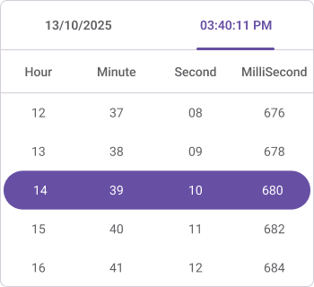

# Date Time intervals in .NET MAUI Date Time Picker (SfDateTimePicker)
The `SfDateTimePicker` provides six intervals in [.NET MAUI Date Time Picker](https://www.syncfusion.com/maui-controls/maui-datetimepicker).

 * [`DayInterval`](https://help.syncfusion.com/cr/maui/Syncfusion.Maui.Picker.SfDateTimePicker.html#Syncfusion_Maui_Picker_SfDateTimePicker_DayInterval)
 * [`MonthInterval`](https://help.syncfusion.com/cr/maui/Syncfusion.Maui.Picker.SfDateTimePicker.html#Syncfusion_Maui_Picker_SfDateTimePicker_MonthInterval)
 * [`YearInterval`](https://help.syncfusion.com/cr/maui/Syncfusion.Maui.Picker.SfDateTimePicker.html#Syncfusion_Maui_Picker_SfDateTimePicker_YearInterval)
 * [`HourInterval`](https://help.syncfusion.com/cr/maui/Syncfusion.Maui.Picker.SfDateTimePicker.html#Syncfusion_Maui_Picker_SfDateTimePicker_HourInterval)
 * [`MinuteInterval`](https://help.syncfusion.com/cr/maui/Syncfusion.Maui.Picker.SfDateTimePicker.html#Syncfusion_Maui_Picker_SfDateTimePicker_MinuteInterval)
 * [`SecondInterval`](https://help.syncfusion.com/cr/maui/Syncfusion.Maui.Picker.SfDateTimePicker.html#Syncfusion_Maui_Picker_SfDateTimePicker_SecondInterval)
 * [`MilliSecondInterval`](https://help.syncfusion.com/cr/maui/Syncfusion.Maui.Picker.SfDateTimePicker.html#Syncfusion_Maui_Picker_SfDateTimePicker_MilliSecondInterval)

## Day interval
Date Time picker provides an option to give an interval between days using the [DayInterval](https://help.syncfusion.com/cr/maui/Syncfusion.Maui.Picker.SfDateTimePicker.html#Syncfusion_Maui_Picker_SfDateTimePicker_DayInterval) property of [SfDateTimePicker](https://help.syncfusion.com/cr/maui/Syncfusion.Maui.Picker.SfDateTimePicker.html).




<picker:SfDateTimePicker x:Name="picker"
                         DayInterval="2"/>




SfDateTimePicker picker = new SfDateTimePicker();
picker.DayInterval = 2;
this.Content = picker;




   

## Month interval
Date Time picker provides an option to give an interval between months using the [MonthInterval](https://help.syncfusion.com/cr/maui/Syncfusion.Maui.Picker.SfDateTimePicker.html#Syncfusion_Maui_Picker_SfDateTimePicker_MonthInterval) property of [SfDateTimePicker](https://help.syncfusion.com/cr/maui/Syncfusion.Maui.Picker.SfDateTimePicker.html).




<picker:SfDateTimePicker x:Name="picker"
                         MonthInterval="2"/>




SfDateTimePicker picker = new SfDateTimePicker();
picker.MonthInterval = 2;
this.Content = picker;




   

## Year interval
Date Time picker provides an option to give an interval between years using the [YearInterval](https://help.syncfusion.com/cr/maui/Syncfusion.Maui.Picker.SfDateTimePicker.html#Syncfusion_Maui_Picker_SfDateTimePicker_YearInterval) property of [SfDateTimePicker](https://help.syncfusion.com/cr/maui/Syncfusion.Maui.Picker.SfDateTimePicker.html).




<picker:SfDateTimePicker x:Name="picker"
                         YearInterval="2"/>




SfDateTimePicker picker = new SfDateTimePicker();
picker.YearInterval = 2;
this.Content = picker;




   

## Hour interval
Date Time picker provides an option to give an interval between hours using the [HourInterval](https://help.syncfusion.com/cr/maui/Syncfusion.Maui.Picker.SfDateTimePicker.html#Syncfusion_Maui_Picker_SfDateTimePicker_HourInterval) property of [SfDateTimePicker](https://help.syncfusion.com/cr/maui/Syncfusion.Maui.Picker.SfDateTimePicker.html).




<picker:SfDateTimePicker x:Name="picker"
                         HourInterval="2"/>


  

SfDateTimePicker picker = new SfDateTimePicker();
picker.HourInterval = 2;
this.Content = picker;




   

## Minute interval
Date Time picker provides an option to give an interval between minutes using the [MinuteInterval](https://help.syncfusion.com/cr/maui/Syncfusion.Maui.Picker.SfDateTimePicker.html#Syncfusion_Maui_Picker_SfDateTimePicker_MinuteInterval) property of [SfDateTimePicker](https://help.syncfusion.com/cr/maui/Syncfusion.Maui.Picker.SfDateTimePicker.html).




<picker:SfDateTimePicker x:Name="picker"
                         MinuteInterval="2"/>


  

SfDateTimePicker picker = new SfDateTimePicker();
picker.MinuteInterval = 2;
this.Content = picker;




   

## Second interval
Date Time picker provides an option to give an interval between seconds using the [SecondInterval](https://help.syncfusion.com/cr/maui/Syncfusion.Maui.Picker.SfDateTimePicker.html#Syncfusion_Maui_Picker_SfDateTimePicker_SecondInterval) property of [SfDateTimePicker](https://help.syncfusion.com/cr/maui/Syncfusion.Maui.Picker.SfDateTimePicker.html).




<picker:SfDateTimePicker x:Name="picker"
                         SecondInterval="2"/>


  

SfDateTimePicker picker = new SfDateTimePicker()
picker.SecondInterval = 2;
this.Content = picker;




   

## MilliSecond Interval
Date Time Picker provides an option to give an interval between milliseconds using the [MilliSecondInterval](https://help.syncfusion.com/cr/maui/Syncfusion.Maui.Picker.SfDateTimePicker.html#Syncfusion_Maui_Picker_SfDateTimePicker_MilliSecondInterval) property of [SfDateTimePicker](https://help.syncfusion.com/cr/maui/Syncfusion.Maui.Picker.SfDateTimePicker.html).




<picker:SfDateTimePicker x:Name="picker"
                         TimeFormat="hh_mm_ss_fff_tt"
                         MilliSecondInterval="2"/>


  

SfDateTimePicker picker = new SfDateTimePicker()
picker.MilliSecondInterval = 2;
this.Content = picker;




   