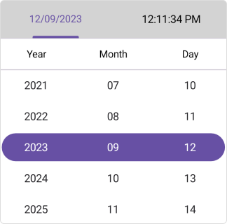
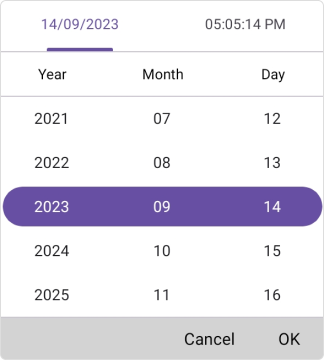
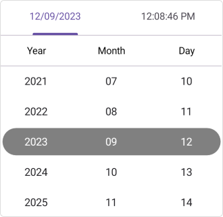
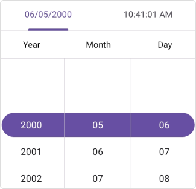
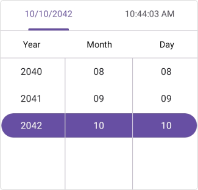
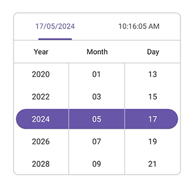
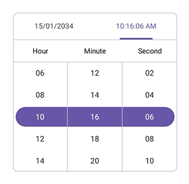

# Overview of .NET MAUI Date Time Picker (SfDateTimePicker)

The Syncfusion&reg; [.NET MAUI Date Time Picker](https://www.syncfusion.com/maui-controls/maui-datetimepicker) allows users to pick a date, time, or date and time. The Date Time Picker also enables you to set date ranges and date and time formats and to customize its dialog appearance by configuring its header, footer, and more.

## Key features

* **Header view**: The .NET MAUI Date Time Picker provides pre-defined header text and allows the user to customize the header text with date and time format.

   

* **Column header view**: The .NET MAUI Date Time Picker supports a customizable column header view to separate headings for each column.

   

* **Footer view**: Provides validation buttons (OK and Cancel) (OK and Cancel) in the footer view. The footer text and background color can be customized.

   

* **Selection view**: The selection view is used to show the selected item, and it can be customized.

   

* **Date format**: Offers 8 predefined formats to represent the value of the date in different string formats.

   

* **Time format**: Offers 9 predefined formats to represent the value of the time.

   

* **Picker mode**: Show the picker in a Popup with a dialog mode. The relative dialog mode is used to align the picker in a specific position.

   

* **Date restriction**: Restrict the selection of date items beyond the specified minimum and maximum dates.

   

   

* **Date intervals**: The date values can be populated individually with intervals for days, months, and years.

   

* **Time intervals**: The time values can be populated individually with intervals for hours, minutes, and seconds.

   

* **Picker interactions**: The .NET MAUI Picker allows you to select a date and time through tap and scroll interaction.

   