> **Notice**: After **Volume 3 2025 (Mid of Sep 2025)**, feature enhancements for this control will no longer be available in the Syncfusion® package. Please switch to the **Syncfusion® Toolkit for .NET MAUI** for continued support. For a smooth transition refer this [migration document](https://help.syncfusion.com/maui-toolkit/migration).

# Overview of .NET MAUI Date Time Picker (SfDateTimePicker)

The Syncfusion&reg; [.NET MAUI Date Time Picker](https://www.syncfusion.com/maui-controls/maui-datetimepicker) provides a way to pick a date, time, or date and time. The Date Time Picker also enables you to set date ranges and date and time formats and to customize its dialog appearance by configuring its header, footer, and more.

## Business use cases

- Scheduling and calendar applications that require **selecting both date and time for events or appointments**.  
- Booking and reservation systems that depend on **validated date-time inputs within specific ranges**.  
- Form-based applications that require **structured date and time entry for user data**.  
- Data-driven applications that use **time-based filtering and configuration for analytics or reporting**.  

## Key features

- **Header view support** allows displaying predefined or custom header text with date and time formatting.

   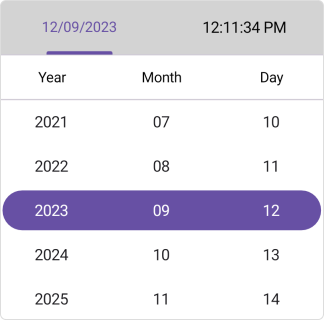

- **Column header view support** allows separating and customizing headers for date and time elements.  

   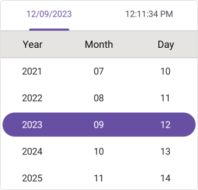

- **Footer view support** provides OK and Cancel buttons with customizable text and appearance.  

   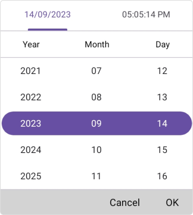

- **Selection view support** allows displaying the selected date and time in a configurable section.

   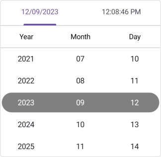

- **Date format support** allows representing date values using predefined formats.  

   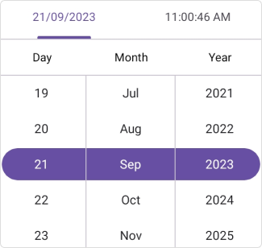

- **Time format support** allows configuring time values using predefined formats.  

   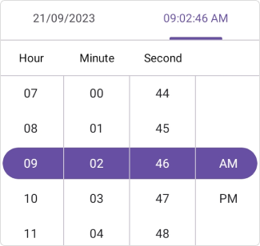

- **Picker mode options** allow displaying the picker in popup or dialog modes with flexible positioning.

   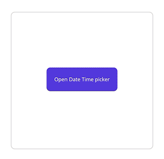

- **Date restriction support** allows limiting date selection within minimum and maximum values.  

   

   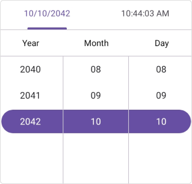

- **Date interval support** allows configuring intervals for days, months, and years. 

   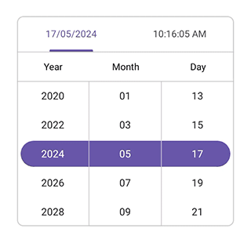

- **Time interval support** allows configuring intervals for hours, minutes, and seconds.

   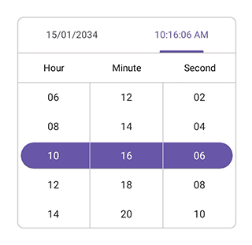

- **User interaction support** allows selecting values through intuitive tap and scroll gestures.

   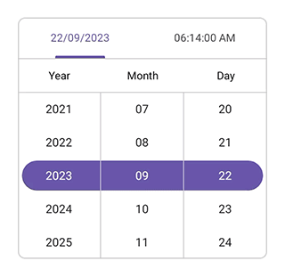  

## Globalization

The following table summarizes the globalization support available in the [SfDateTimePicker](https://www.syncfusion.com/maui-controls/maui-datetimepicker) control.

 Full Support  

<table>
<tr>
<th align="center">Control</th>
<th align="center">Localization</th>
<th align="center">RTL</th>
<th align="center">Time zone</th>
<th align="center">Screen reader</th>
<th align="center">Keyboard navigation</th>
</tr>
<tr>
<td><a href="/maui/datetimrpicker/overview">Date Time Picker</a></td>
<td align="center"></td>
<td align="center"></td>
<td align="center"></td>
<td align="center"></td>
<td align="center"></td>
</tr> 
</table>

## Related controls

- **[DatePicker](https://help.syncfusion.com/maui/datepicker/overview)** for selecting date-only values.  
- **[Calendar](https://help.syncfusion.com/maui/calendar/overview)** for navigating and selecting dates using full calendar views.

## Next steps

Explore further resources:

- [Getting Started](https://help.syncfusion.com/maui/datetimepicker/getting-started) - step-by-step guide to begin using the Date Time Picker control.  
- [Formatting](https://help.syncfusion.com/maui/datetimepicker/formatting) - configure date and time formats.  
- [Customization](https://help.syncfusion.com/maui/datetimepicker/customizations) - customize appearance and behavior.  
- [UI Kit](https://www.syncfusion.com/demos/maui#maui-ui-control) - explore interactive demos and ready‑made UI examples.

## Learnings

<!-- Card 1 -->
<a href="https://www.syncfusion.com/blogs/category/net-maui" class="form-card" target="_blank">
  

    <h3 class="form-title">Explore Blogs</h3>
    

      Read insights, tutorials, and developer journeys.
    

  

</a>
<!-- Card 2 -->
<a href="https://support.syncfusion.com/kb/cross-platforms/category/76" class="form-card" target="_blank">
  

    <h3 class="form-title">Explore KB's</h3>
    

      Find quick solutions and step‑by‑step guidance.
    

  

</a>
<!-- Card 3 -->
<a href="https://www.syncfusion.com/maui-controls/maui-datetimepicker" class="form-card" target="_blank">
  

    <h3 class="form-title">Feature Tour</h3>
    

      Walk through highlights and core capabilities.
    

  

</a>
<!-- Card 4 -->
<a href="https://www.syncfusion.com/tutorial-videos/maui/date-time-picker" class="form-card" target="_blank">
  

    <h3 class="form-title">Tutorial Videos</h3>
    

      Step‑by‑step guidance through video tutorials.
    

  

</a>
