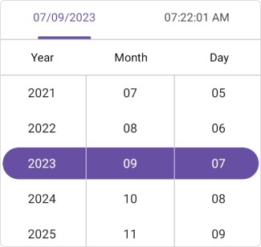

# Selection in .NET MAUI Date Time Picker (SfDateTimePicker)

## Set selected date and selected time to the Date Time Picker

The SfDateTimePicker control allows you to select the date and time by using the [SelectedDate](https://help.syncfusion.com/cr/maui/Syncfusion.Maui.Picker.SfDateTimePicker.html#Syncfusion_Maui_Picker_SfDateTimePicker_SelectedDate) property in the [SfDateTimePicker](https://help.syncfusion.com/cr/maui/Syncfusion.Maui.Picker.SfDateTimePicker.html). The default value of the `SelectedDate` is the current date and time.




<picker:SfDateTimePicker x:Name="picker" 
                         SelectedDate="9/7/2023 10:15:22">
</picker:SfDateTimePicker>




SfDateTimePicker picker = new SfDateTimePicker()
{
    SelectedDate = new DateTime(2023, 09, 07, 10, 15, 22),
};

this.Content = picker;

  


   

## Clear selection

The .NET MAUI DateTimePicker provides clear selection support, allowing you to clear the selected date and time by setting the `SelectedDate` property to `null`.




<picker:SfDateTimePicker x:Name="picker" />




    this.Picker.SelectedDate = null;

  
