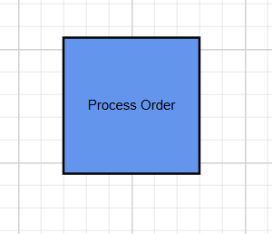
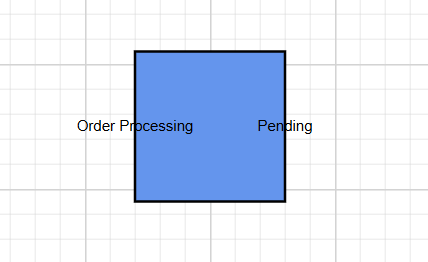
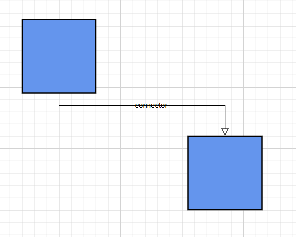
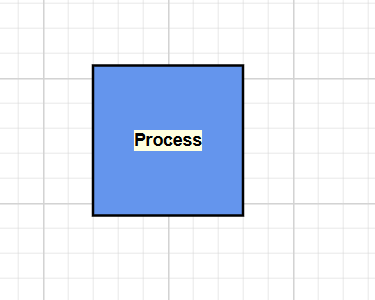
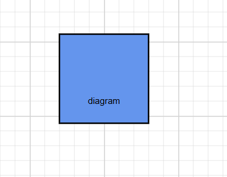

# Annotations in .NET MAUI Diagram

Annotation is used to textually represent an object with a string that can be edited at run time on the nodes and connectors. They help describe diagram elements and improve the readability of a diagram.

The Diagram control supports two annotation types:

- **Node annotations** – Use [ShapeAnnotation](https://help.syncfusion.com/cr/maui/Syncfusion.Maui.Diagram.ShapeAnnotation.html) for nodes.
- **Connector annotations** – Use [PathAnnotation](https://help.syncfusion.com/cr/maui/Syncfusion.Maui.Diagram.PathAnnotation.html) for connectors.

Annotations can be customized using the [TextStyle](https://help.syncfusion.com/cr/maui/Syncfusion.Maui.Diagram.TextStyle.html) class and alignment options.

> **Note:** The `TextAlign` property on `TextStyle` and the `TextDecoration` property on `TextStyle` are scheduled for a future release. They are not available in the current package version.

## Prerequisites

Refer to the [Getting started](https://help.syncfusion.com/maui/diagram/getting-started) page to create a project, install the package, and register the handler. Annotation examples assume that the host node or connector has been assigned to an [SfDiagram](https://help.syncfusion.com/cr/maui/Syncfusion.Maui.Diagram.SfDiagram.html) instance.

---

## Node annotations

Node annotations display text within or around a node. They are added through the [Node.Annotations](https://help.syncfusion.com/cr/maui/Syncfusion.Maui.Diagram.Node.html#Syncfusion_Maui_Diagram_Node_Annotations) collection.

```csharp
using Syncfusion.Maui.Diagram;

Node node = new Node
{
    Id = "ProcessNode",
    OffsetX = 200,
    OffsetY = 150,
    Width = 120,
    Height = 60
};

node.Annotations.Add(
    new ShapeAnnotation
    {
        Content = "Process Order"
    });
```


### Multiple annotation

A node can contain multiple annotations:

```csharp
node.Annotations.Add(
    new ShapeAnnotation
    {
        Id = "title",
        Content = "Order Processing",
        Offset = new DiagramPoint(0, 0.5),
    });

node.Annotations.Add(
    new ShapeAnnotation
    {
        Id = "status",
        Content = "Pending",
        Offset = new DiagramPoint(1, 0.5),
    });
```


---

## Connector annotations

Connector annotations display text along a connector path. They are added through the [Connector.Annotations](https://help.syncfusion.com/cr/maui/Syncfusion.Maui.Diagram.Connector.html#Syncfusion_Maui_Diagram_Connector_Annotations) collection.

```csharp
var connector = new Connector
{
    Id = "connector1",
    SourceID = "node1",
    TargetID = "node2"
};

connector.Annotations.Add(
    new PathAnnotation
    {
        Content = "connector"
    });
```

---

## Annotation properties

The following properties apply to both `ShapeAnnotation` and `PathAnnotation`.

| Property | Description |
| --- | --- |
| [Id](https://help.syncfusion.com/cr/maui/Syncfusion.Maui.Diagram.ShapeAnnotation.html#Syncfusion_Maui_Diagram_ShapeAnnotation_Id) | Unique identifier for the annotation. |
| [Content](https://help.syncfusion.com/cr/maui/Syncfusion.Maui.Diagram.ShapeAnnotation.html#Syncfusion_Maui_Diagram_ShapeAnnotation_Content) | Display text for the annotation. |
| [Style](https://help.syncfusion.com/cr/maui/Syncfusion.Maui.Diagram.ShapeAnnotation.html#Syncfusion_Maui_Diagram_ShapeAnnotation_Style) | Text style based on the [TextStyle](https://help.syncfusion.com/cr/maui/Syncfusion.Maui.Diagram.TextStyle.html) class. |
| [Offset](https://help.syncfusion.com/cr/maui/Syncfusion.Maui.Diagram.ShapeAnnotation.html#Syncfusion_Maui_Diagram_ShapeAnnotation_Offset) | Position of the annotation. Node annotations use node-relative coordinates; connector annotations use path-relative coordinates. |
| [HorizontalAlignment](https://help.syncfusion.com/cr/maui/Syncfusion.Maui.Diagram.ShapeAnnotation.html#Syncfusion_Maui_Diagram_ShapeAnnotation_HorizontalAlignment) | Horizontal alignment through the [AnnotationHorizontalAlignment](https://help.syncfusion.com/cr/maui/Syncfusion.Maui.Diagram.AnnotationHorizontalAlignment.html) enumeration. |
| [VerticalAlignment](https://help.syncfusion.com/cr/maui/Syncfusion.Maui.Diagram.ShapeAnnotation.html#Syncfusion_Maui_Diagram_ShapeAnnotation_VerticalAlignment) | Vertical alignment through the [AnnotationVerticalAlignment](https://help.syncfusion.com/cr/maui/Syncfusion.Maui.Diagram.AnnotationVerticalAlignment.html) enumeration. |

> **Note:** The `Offset` property on `ShapeAnnotation` exposes `OffsetX` and `OffsetY` values. The point type used by `PathAnnotation.Offset` should be verified against the package version you use.

### Horizontal and vertical alignment

| Horizontal | Vertical |
| --- | --- |
| `Left` | `Top` |
| `Center` | `Center` |
| `Right` | `Bottom` |
| `Stretch` | `Stretch` |
| `Auto` | `Auto` |

---

## Style annotations

Use the [Style](https://help.syncfusion.com/cr/maui/Syncfusion.Maui.Diagram.ShapeAnnotation.html#Syncfusion_Maui_Diagram_ShapeAnnotation_Style) property to customize a node's appearance  like FontFamily, FontSize, Color, and Bold. The conceptual styling properties are listed below.


| Property | Description |
| --- | --- |
| [FontFamily](https://help.syncfusion.com/cr/maui/Syncfusion.Maui.Diagram.TextStyle.html#Syncfusion_Maui_Diagram_TextStyle_FontFamily) | Font family for the annotation text. |
| [FontSize](https://help.syncfusion.com/cr/maui/Syncfusion.Maui.Diagram.TextStyle.html#Syncfusion_Maui_Diagram_TextStyle_FontSize) | Text size in device-independent units. |
| [Color](https://help.syncfusion.com/cr/maui/Syncfusion.Maui.Diagram.TextStyle.html#Syncfusion_Maui_Diagram_TextStyle_Color) | Text color. |
| [Fill](https://help.syncfusion.com/cr/maui/Syncfusion.Maui.Diagram.TextStyle.html#Syncfusion_Maui_Diagram_TextStyle_Fill) | Background color behind the text. |
| [Bold](https://help.syncfusion.com/cr/maui/Syncfusion.Maui.Diagram.TextStyle.html#Syncfusion_Maui_Diagram_TextStyle_Bold) | `true` for bold text. `false` otherwise. |
| [Italic](https://help.syncfusion.com/cr/maui/Syncfusion.Maui.Diagram.TextStyle.html#Syncfusion_Maui_Diagram_TextStyle_Italic) | `true` for italic text. `false` otherwise. |

### Example

```csharp
node.Annotations.Add(
    new ShapeAnnotation
    {
        Content = "Process",
        Style = new TextStyle
        {
            FontFamily = "Arial",
            FontSize = 14,
            Color = Colors.Black,
            Fill = Colors.LightYellow,
            Bold = true,
            Italic = false
        }
    });
```

---

## Positioning

### Node annotation 

For [ShapeAnnotation](https://help.syncfusion.com/cr/maui/Syncfusion.Maui.Diagram.ShapeAnnotation.html), the [Offset](https://help.syncfusion.com/cr/maui/Syncfusion.Maui.Diagram.ShapeAnnotation.html#Syncfusion_Maui_Diagram_ShapeAnnotation_Offset) value uses node-relative coordinates.

| Position | Offset values |
| --- | --- |
| Top center | `Offset = new DiagramPoint(0.5, 0)` |
| Left center | `Offset = new DiagramPoint(0, 0.5)` |
| Right center | `Offset = new DiagramPoint(1, 0.5)` |
| Bottom center | `Offset = new DiagramPoint(0.5, 1)` |
| Center | `Offset = new DiagramPoint(0.5, 0.5)` |

For example, to place an annotation at the bottom-center of a node:

```csharp

node.Annotations.Add(
    new ShapeAnnotation
    {
        Content = "diagram",
        Offset = new DiagramPoint(0.5, 1),
    });

```


### Connector annotation 

For [PathAnnotation](https://help.syncfusion.com/cr/maui/Syncfusion.Maui.Diagram.PathAnnotation.html), the [Offset](https://help.syncfusion.com/cr/maui/Syncfusion.Maui.Diagram.PathAnnotation.html#Syncfusion_Maui_Diagram_PathAnnotation_Offset) value specifies the relative position of the annotation along the connector path. The value is normalized from `0` to `1`, where:

- `0` places the annotation at the source end of the connector.
- `0.5` places the annotation at the midpoint of the connector.
- `1` places the annotation at the target end of the connector.

> Note: Connector annotations support only a single offset value that determines the position along the path. A separate perpendicular offset is not supported.


---

## See also

- [Nodes](https://help.syncfusion.com/maui/diagram/nodes)
- [Connectors](https://help.syncfusion.com/maui/diagram/connectors)