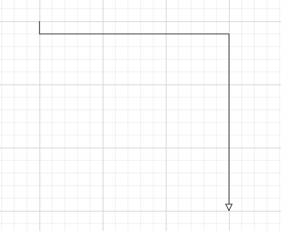
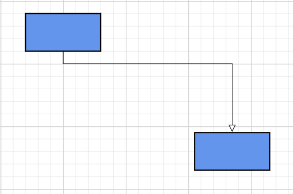
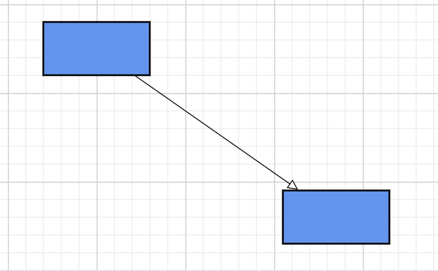
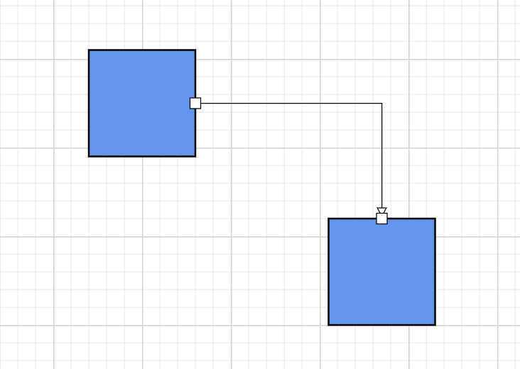
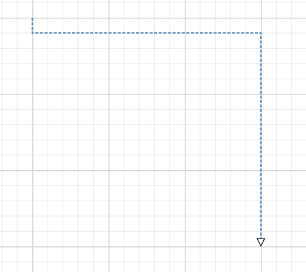
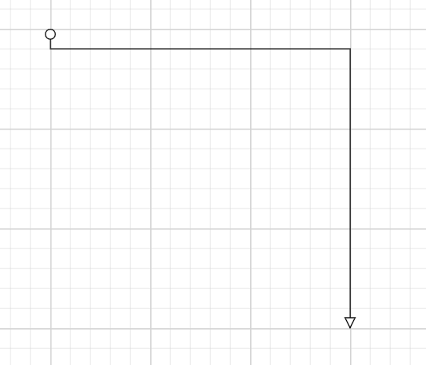
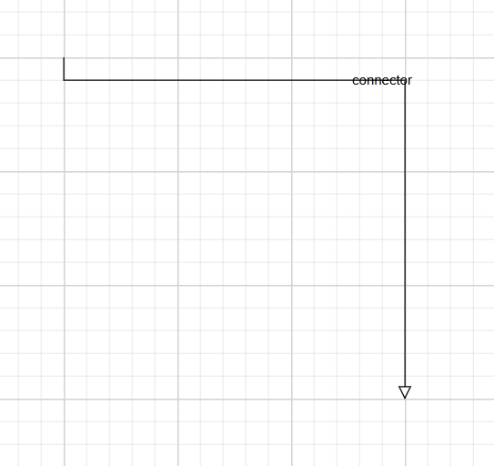
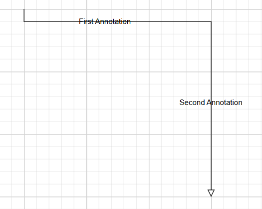

# Connectors in .NET MAUI Diagram

Connectors establish relationships between nodes and define the flow of information within a diagram. They are commonly used in flowcharts, workflow diagrams, process diagrams, organizational charts, and network diagrams.

A connector can connect nodes, ports, or specific points within the diagram surface.

## Prerequisites

Refer to the [Getting started](getting-started.md) page to create a project, install the package, and register the handler. Connector examples assume that the `Nodes` and `Connectors` collections have been assigned to an `SfDiagram` instance.

---

## Create Connector

A connector is created using the `Connector` class and added to the `SfDiagram.Connectors` collection.

```csharp
using Syncfusion.Maui.Diagram;

Connector connector = new Connector
{
    Id = "connector",
    SourcePoint = new Point(100, 100),
    TargetPoint = new Point(400,400),
};

diagram.Connectors.Add(connector);

```

## Connector properties

| Property | Description |
| --- | --- |
| `Id` | Unique identifier for the connector. |
| `SourceID` | ID of the source node, source port's parent node, or used together with `SourcePoint`. |
| `TargetID` | ID of the target node, target port's parent node, or used together with `TargetPoint`. |
| `SourcePortID` | ID of the source port. Requires the matching port on the source node. |
| `TargetPortID` | ID of the target port. Requires the matching port on the target node. |
| `SourcePoint` | Starting point when the connector is not attached to a node. |
| `TargetPoint` | Ending point when the connector is not attached to a node. |
| `Type` | Routing algorithm, set through `ConnectorSegmentType`. |
| `Style` | Visual style for the connector line. |
| `Annotations` | Collection of `PathAnnotation` labels. |
| `SourceDecorator` | Decorator shown at the start of the connector. |
| `TargetDecorator` | Decorator shown at the end of the connector. |

> **Note:** `DiagramPoint` is not implemented in the current release. Verify the supported point type for connector endpoint coordinates before using `SourcePoint` and `TargetPoint`.


---

## Create connection between nodes

The connector can be created between nodes to display the relationship between them. The SourceID and TargetID properties allows you to represent the nodes to be connected.

```csharp
Connector connector = new Connector
{
    Id = "connector1",
    SourceID = "node1",
    TargetID = "node2"
};
```


---

## Connector types

The Diagram control supports two routing styles configured through `ConnectorSegmentType`. The diagram supports two types.

 * Straight
 * Orthogonal

### Straight connector

A straight connector establishes the shortest direct path between two points.

```csharp
Connector connector = new Connector
{
    Id = "connector1",
    SourceID = "node1",
    TargetID = "node2",
    Type = ConnectorSegmentType.Straight
};
```

Use straight connectors for process diagrams, network diagrams, and entity-relationship diagrams.




### Orthogonal connector

An orthogonal connector creates right-angle segments between the source and target points.

```csharp
Connector connector = new Connector
{
    Id = "connector1",
    SourceID = "node1",
    TargetID = "node2",
    Type = ConnectorSegmentType.Orthogonal
};
```

Use orthogonal connectors for flowcharts, workflow designers, and business-process diagrams.


---

## Connect using ports

Ports define explicit connection points on a node. Using ports instead of node-to-node connections keeps connector routing predictable, which is especially useful for workflow designers, flowcharts, and process diagrams. The connection between any specific point of source and target nodes can be achieved with ports.

```csharp
var connector = new Connector
{
    ID = "connector1",
    SourceID = "node1",
    SourcePortID = "RightPort",
    TargetID = "node2",
    TargetPortID = "LeftPort"
};
```


---

## Connector endpoint points

When a connector is not attached to a node, use `SourcePoint` and `TargetPoint` to specify the line endpoints.

> **Note:** `DiagramPoint` is not implemented in the current release. Use the point type documented for your package version.

```csharp

Connector connector = new Connector
{
    Id = "connector",
    SourcePoint = new Point(100, 200),
    TargetPoint = new Point(400,500),
};

diagram.Connectors.Add(connector);

```


---

## Style connectors

Use the `Style` property to customize a connector's appearance  like StrokeColor, StrokeWidth, opacity, and StrokeDashArray. The conceptual styling properties are listed below.

| Property | Description |
| --- | --- |
| `StrokeColor` | Line color. |
| `StrokeWidth` | Line thickness. |
| `Opacity` | Line transparency from `0` to `1`. |
| `StrokeDashArray` | Dash pattern. The accepted value format depends on the package version. |

```csharp


Connector connector = new Connector
{
    Id = "connector",
    SourcePoint = new Point(100, 200),
    TargetPoint = new Point(400,500),
};

connector.Style = new ShapeStyle
{
    StrokeColor = Colors.SteelBlue,
    StrokeWidth = 2,
    Opacity = 0.9,
    StrokeDashArray = "4,2"
};

```


---

## Connector decorators

Decorators indicate direction and are commonly displayed at the source or target end of a connector. The source and target points of a connector can be decorated with some customizable shapes like arrows, circles, diamond, or any path. You can decorate the connection end points using the `SourceDecorator` and `TargetDecorator` properties of connector. They are configured through `DecoratorSettings`, which supports `Shape`, `Width`, `Height`, and `Style`.

```csharp

Connector connector = new Connector
{
    Id = "connector",
    SourcePoint = new Point(100, 200),
    TargetPoint = new Point(400,500),
};

connector.TargetDecorator = new DecoratorSettings
{
    Shape = DecoratorShape.Arrow
};

connector.SourceDecorator = new DecoratorSettings
{
    Shape = DecoratorShape.Circle
};

```


### Supported decorator shapes

The Diagram control supports the following decorator shapes through the `DecoratorShapes` enumeration.

| Enumerator | Description |
| --- | --- |
| `Arrow` | Filled arrowhead. |
| `OpenArrow` | Open arrowhead. |
| `Diamond` | Diamond endpoint (commonly used in UML aggregation). |
| `Circle` | Circular endpoint. |
| `Square` | Square endpoint. |
| `Fletch` | Fletch-style arrowhead. |
| `OpenFletch` | Open fletch endpoint. |
| `IndentedArrow` | Indented arrowhead. |
| `OutdentedArrow` | Outdented arrowhead. |
| `DoubleArrow` | Double arrowhead. |
| `None` | Removes the decorator. |

---

## Connector annotations

Annotation is used to textually represent an object with a string that can be edited at run time. Annotations display text along a connector through the `PathAnnotation` class. Connector labels describe the relationship between connected nodes. They help visualize decision branches, transitions, and conditions.

```csharp

connector.Annotations.Add(
    new PathAnnotation
    {
        Content = "Approved"
    });
    
```


### Multiple Annotations

Multiple labels can be displayed on the same connector:

```csharp
connector.Annotations.Add(
    new PathAnnotation
    {
        Content = "First Annotation",
        Offset = 0.25,
    });

connector.Annotations.Add(
    new PathAnnotation
    {
        Content = "Second Annotation",
        Offset = 0.75,
    });
```

> **Note:** `DiagramPoint` is not implemented in the current release. Confirm whether offset coordinates use the supported point type before using this property.



---

## Best practices

- Assign meaningful, unique IDs to every connector.
- Use orthogonal connectors in business workflows and flowcharts.
- Use a target decorator (such as `Arrow`) to indicate flow direction.
- Use connector annotations to label decision outcomes.
- Use ports for precise and predictable connections.
- Apply consistent connector styling across the diagram.

---

## See also

- [Nodes](nodes.md)
- [Ports](ports.md)
- [Annotations](annotations.md)