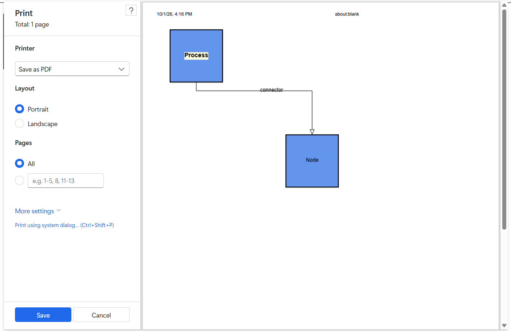

# Export and print in .NET MAUI Diagram

The Diagram control supports exporting the current diagram and sending it to the system printing pipeline. These capabilities let users share, archive, review, and distribute diagram content outside the application.

> **Note:** Visit the [export-print API reference](https://help.syncfusion.com/cr/maui/Syncfusion.Maui.Diagram.SfDiagram.html) for your package version to confirm the export format parameters and platform availability.

## Prerequisites

Refer to the [Getting started](https://help.syncfusion.com/maui/diagram/getting-started) page to create a project, install the package, and register the handler. Export and print examples assume that an [SfDiagram](https://help.syncfusion.com/cr/maui/Syncfusion.Maui.Diagram.SfDiagram.html) instance named `diagram` is available.

---

## Export members

| Member | Description | Status |
| --- | --- | --- |
| [ExportDiagram](https://help.syncfusion.com/cr/maui/Syncfusion.Maui.Diagram.SfDiagram.html#Syncfusion_Maui_Diagram_SfDiagram_ExportDiagram_Syncfusion_Maui_Diagram_DiagramExportOptions_) | Exports the diagram to a file or stream. | Implemented. |

---

## Print members

| Member | Description | Status |
| --- | --- | --- |
| [Print](https://help.syncfusion.com/cr/maui/Syncfusion.Maui.Diagram.SfDiagram.html#Syncfusion_Maui_Diagram_SfDiagram_Print_Syncfusion_Maui_Diagram_DiagramExportOptions_) | Sends the diagram to the system printing pipeline. | Implemented. |

---

## Export the diagram

Exporting creates an external representation of the diagram that can be shared with stakeholders. Common use cases include attaching diagrams to reports, archiving workflow definitions, and reviewing diagrams offline.

```csharp

diagram.ExportDiagram();

```

A typical application exports the latest diagram when the user clicks an **Export** button:

```csharp
private  void ExportButton_Clicked(object sender, EventArgs e)
{
     diagram.ExportDiagram();
}
```

Call [FitToPage](https://help.syncfusion.com/cr/maui/Syncfusion.Maui.Diagram.SfDiagram.html#Syncfusion_Maui_Diagram_SfDiagram_FitToPage) before exporting if you want the visible area to be exported:

```csharp

diagram.FitToPage();
diagram.ExportDiagram();

```

---

## Print the diagram

Printing is available through `Print`. Common use cases include discussions, design reviews, process workshops, and physical archives.

```csharp

diagram.Print();

```

Call `FitToPage` before printing if needed:

```csharp

diagram.FitToPage();
diagram.Print();

```

> **Note:** Printing on mobile platforms depends on the underlying operating system support. Validate the supported platforms in the API reference for your package.

---

## Best practices

- Use the asynchronous `ExportDiagram` and `Print` methods to keep the UI thread responsive.
- Call `FitToPage` before exporting or printing to make sure that all elements are visible.
- Combine export and print with save and load to support versioned archives of diagrams.
- Verify the supported export formats and printing platforms against the API reference for the package version in use.

---

## See also

- [Save and load](https://help.syncfusion.com/maui/diagram/save-load)
- [Getting started](https://help.syncfusion.com/maui/diagram/getting-started)