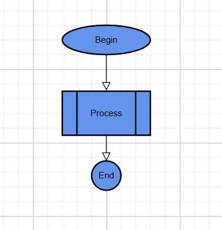

# Getting Started with .NET MAUI Diagram

This guide shows how to add the Syncfusion .NET MAUI Diagram control to an application and create a simple diagram with two connected nodes.

## Prerequisites

Before you begin, make sure that you have:

- A .NET MAUI development environment. See the [official .NET MAUI installation guide](https://learn.microsoft.com/en-us/dotnet/maui/get-started/installation?view=net-maui-10.0&tabs=visual-studio).
- A supported version of the .NET SDK and Visual Studio for your Syncfusion release.
- A Syncfusion license key. See [licensing](https://help.syncfusion.com/maui/licensing/overview).

> **Note:** Review the release notes for the package version that you plan to install to confirm the supported .NET, .NET MAUI, Visual Studio, and target-platform versions.

## Step 1: Create a .NET MAUI project

1. Open Visual Studio.
2. Select **Create a new project**.
3. Choose **.NET MAUI App**, and then select **Next**.
4. Enter a project name and location, and then select **Create**.

## Step 2: Install the Diagram NuGet package

Install the [Syncfusion.Maui.Diagram](https://www.nuget.org/packages/Syncfusion.Maui.Diagram) package in the project. You can use the NuGet Package Manager or run the following command in the Package Manager Console:

```powershell
Install-Package Syncfusion.Maui.Diagram
```

## Step 3: Register Syncfusion controls

In `MauiProgram.cs`, add the Syncfusion hosting namespace and call `ConfigureSyncfusionCore` when building the application:

```csharp
using Syncfusion.Maui.Core.Hosting;

namespace DiagramDemo;

public static class MauiProgram
{
    public static MauiApp CreateMauiApp()
    {
        var builder = MauiApp.CreateBuilder();

        builder
            .UseMauiApp<App>()
            .ConfigureSyncfusionCore();

        return builder.Build();
    }
}
```

> **Important:** The Syncfusion core handler must be registered before the application uses Syncfusion controls.

## Step 4: Register the license key

Register the license key during application startup, before the controls are used. Follow the instructions in the [Syncfusion licensing guide](https://help.syncfusion.com/maui/licensing/how-to-register-in-an-application).

Do not commit a license key to source control. Use the registration method and namespace required by the Syncfusion release used by your project.

## Step 5: Add the Diagram control

Open `MainPage.xaml` and add the Diagram namespace and control:

```xml
<?xml version="1.0" encoding="utf-8" ?>
<ContentPage xmlns="http://schemas.microsoft.com/dotnet/2021/maui"
             xmlns:x="http://schemas.microsoft.com/winfx/2009/xaml"
             xmlns:diagram="clr-namespace:Syncfusion.Maui.Diagram;assembly=Syncfusion.Maui.Diagram"
             x:Class="DiagramDemo.MainPage">
    <diagram:SfDiagram x:Name="diagram" />
</ContentPage>
```

The `x:Name` value makes the control available from `MainPage.xaml.cs`.

## Step 6: Add nodes and a connector

Open `MainPage.xaml.cs`. Add the required namespaces and assign the nodes and connector in the page constructor after `InitializeComponent`:

```csharp
using System.Collections.ObjectModel;
using Syncfusion.Maui.Diagram;

namespace DiagramDemo;

public partial class MainPage : ContentPage
{
    public MainPage()
    {
        InitializeComponent();

        Node node1 = new Node
 {
     Id = "node1",
     OffsetX = 300,
     OffsetY = 60,
     Width = 120,
     Height = 40,
     Shape = new BasicShape()
     {
         Shape = NodeBasicShapes.Ellipse
     },
 };
 ShapeStyle style = new ShapeStyle();
 style.Fill = Colors.CornflowerBlue;
 style.StrokeColor = Colors.Black;
 style.StrokeWidth = 2;
 style.StrokeDashArray = "0,0";

 node1.Style = style;

 node1.Annotations.Add(
  new ShapeAnnotation
  {
      Id = "Begin",
      Content = "Begin",
     
  });
 diagram.Nodes.Add(node1);


 Node node2 = new Node
 {
     Id = "node2",
     OffsetX = 300,
     OffsetY = 160,
     Width = 120,
     Height = 60,
     Shape = new FlowShape()
     {
         Shape = NodeFlowShapes.PreDefinedProcess
     },
 };


 node2.Style = style;

 node2.Annotations.Add(
  new ShapeAnnotation
  {
      Id = "Process",
      Content = "Process",

  });

 diagram.Nodes.Add(node2);


 Node node3 = new Node
 {
     Id = "node3",
     OffsetX = 300,
     OffsetY = 245,
     Width = 40,
     Height = 40,
     Shape = new BasicShape()
     {
         Shape = NodeBasicShapes.Ellipse
     },
 };

 node3.Style = style;

 node3.Annotations.Add(
  new ShapeAnnotation
  {
      Id = "End",
      Content = "End",

  });

 diagram.Nodes.Add(node3);

 Connector connector1 = new Connector
 {
     Id = "connector1",
     SourceID = "node1",
     TargetID = "node2",

     
 };
 diagram.Connectors.Add(connector1);

 Connector connector2 = new Connector
 {
     Id = "connector2",
     SourceID = "node2",
     TargetID = "node3",


 };
 diagram.Connectors.Add(connector2);
    }
}
```


`OffsetX` and `OffsetY` position the nodes on the diagram surface. `SourceID` and `TargetID` connect the connector to the corresponding node IDs.

## Expected result

When you run the application, the Diagram control displays two nodes positioned horizontally with a connector between them. The exact appearance can vary with the target platform and the control's default styles.

## Troubleshooting

### The Diagram control is not displayed

- Confirm that the `Syncfusion.Maui.Diagram` package is installed in the startup project.
- Confirm that `ConfigureSyncfusionCore` is called in `MauiProgram.cs`.
- Confirm that the XAML namespace uses the `Syncfusion.Maui.Diagram` assembly.
- Clean and rebuild the project after changing package or startup configuration.

### The nodes are not visible

- Confirm that the nodes are assigned to `diagram.Nodes`.
- Check that the node offsets place them inside the visible diagram area.
- Confirm that every node has a unique `ID`.

## Next steps

- Learn about [nodes](https://help.syncfusion.com/maui/diagram/nodes) and [connectors](https://help.syncfusion.com/maui/diagram/connectors).
- Connect nodes using [ports](https://help.syncfusion.com/maui/diagram/ports).
- Save and restore a diagram with [serialization](https://help.syncfusion.com/maui/diagram/save-load).