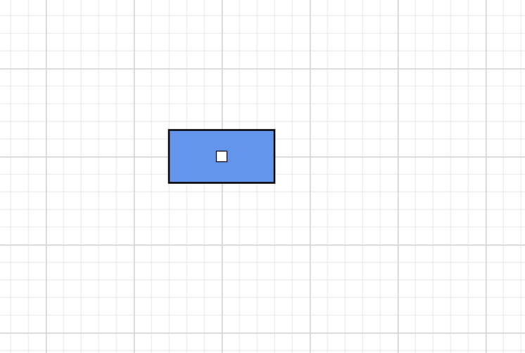
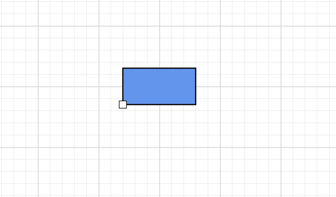
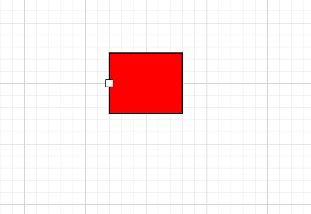
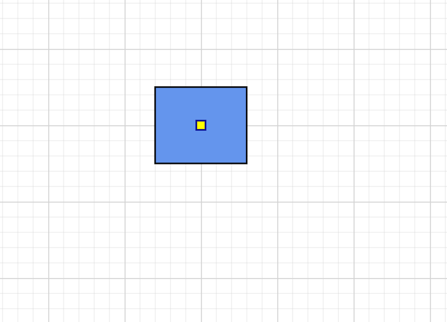
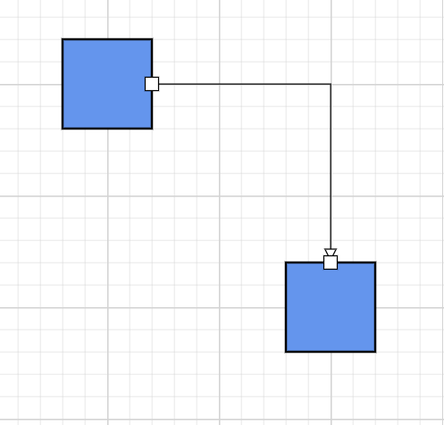
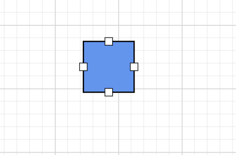

# Ports in .NET MAUI Diagram

Ports define specific connection points on a node. They provide precise control over where connectors begin and terminate, helping users build structured and visually organized diagrams.

Ports are commonly used in workflow designers, flowcharts, process diagrams, and node-based editors where connection locations must be predictable.

## Prerequisites

Refer to the [Getting started](getting-started.md) page to create a project, install the package, and register the handler. Port examples assume that the host node has been created in the diagram.

---

## Port creation

A port is created using the `PointPort` class and added to the `Node.Ports` collection.

```csharp
using Syncfusion.Maui.Diagram;

 Node node = new Node
 {
     Id = "node1",
     OffsetX = 500,
     OffsetY = 300,
     Width = 120,
     Height = 60
 };
 ShapeStyle style = new ShapeStyle();
 style.Fill = Colors.CornflowerBlue;
 style.StrokeColor = Colors.Black;
 style.StrokeWidth = 2;
 style.StrokeDashArray = "0,0";

 node.Style = style;
 node.Ports.Add(
 new PointPort
 {
     Id = "TopPort", Visibility = PortVisibility.Visible,
 });

 diagram.Nodes.Add(node);

```

## Port properties

| Property | Description |
| --- | --- |
| `Id` | Unique identifier for the port within the host node. |
| `Offset` | Port position. The accepted coordinate type depends on the package version. |
| `Visibility` | Controls when the port is visible through the `PortVisibility` enumeration. |
| `Style` | Visual style for the port based on the `ShapeStyle` class. |


> **Note:** The `Offset` type is implemented in a different class than `DiagramPoint`. Verify the supported type in the API reference for your package version.

---

## Port Position

The `Offset` property defines the position of a port relative to its host node. The position is specified using normalized coordinates, where the values range from `0` to `1`.

- `Offset.X` determines the horizontal position.
- `Offset.Y` determines the vertical position.

### Coordinate reference

| Axis | `0` | `1` |
| --- | --- | --- |
| `Offset.X` | Left edge | Right edge |
| `Offset.Y` | Top edge | Bottom edge |

### Common port positions

| Position | Offset value |
| --- | --- |
| Top center | `new DiagramPoint(0.5, 0)` |
| Left center | `new DiagramPoint(0, 0.5)` |
| Right center | `new DiagramPoint(1, 0.5)` |
| Bottom center | `new DiagramPoint(0.5, 1)` |
| Center | `new DiagramPoint(0.5, 0.5)` |

For example, the following code places a port at the right-center of a node:

```csharp

 Node node = new Node
 {
     Id = "node",
     OffsetX = 500,
     OffsetY = 300,
     Width = 120,
     Height = 60
 };
 ShapeStyle style = new ShapeStyle();
 style.Fill = Colors.CornflowerBlue;
 style.StrokeColor = Colors.Black;
 style.StrokeWidth = 2;
 style.StrokeDashArray = "0,0";

 node.Style = style;
 node.Ports.Add(
 new PointPort
 {
     Id = "Port", Visibility = PortVisibility.Visible,
     Offset = new DiagramPoint(0, 1),
 });

 diagram.Nodes.Add(node);

```

---

## Port visibility

The `Visibility` property determines when a port is displayed.

| Visibility | Description |
| --- | --- |
| `Visible` | The port is always visible. |
| `Hidden` | The port is never displayed. |
| `Hover` | The port becomes visible when the pointer hovers over the node. |
| `Connect` | The port becomes visible during connection operations. |

```csharp


Node node = new Node
{
    Id = "node",
    OffsetX = 500,
    OffsetY = 300,
    Width = 120,
    Height = 100
};
ShapeStyle style = new ShapeStyle();
style.Fill = Colors.Red;
style.StrokeColor = Colors.Black;
style.StrokeWidth = 2;
style.StrokeDashArray = "0,0";

node.Style = style;
PointPort port= new PointPort
{
    Id = "Port", 
    Offset = new DiagramPoint(0,0.5),
};

port.Visibility = PortVisibility.Visible;

node.Ports(port);

```

---

## Appearance

Port appearance is customized using  the `Style` property of the `Port` class.

```csharp

 PointPort port = new PointPort
 {
     Id = "Port",
 };

 port.Style = new ShapeStyle
 {
     Fill = Colors.Yellow,
     StrokeColor = Colors.DarkBlue,
     StrokeWidth = 2,
     Opacity = 1
 };

```
### Properties

| Property | Description |
| --- | --- |
| `Fill` | Port background color. |
| `StrokeColor` | Port border color. |
| `StrokeWidth` | Border thickness. |
| `Opacity` | Port transparency from `0` to `1`. |
| `StrokeDashArray` | Dash pattern for the border. The accepted value format depends on the package version. |


---

## Connections with ports

The connection between any specific point of source and target nodes can be achieved with ports. Connectors reference source and target ports through `SourcePortID` and `TargetPortID`.

```csharp

Node node1 = new Node
{
    Id="Node1",
    OffsetX = 200,
    OffsetY = 200,
    Width = 80,
    Height = 80
};
ShapeStyle style = new ShapeStyle();
style.Fill = Colors.CornflowerBlue;
style.StrokeColor = Colors.Black;
style.StrokeWidth = 2;
style.StrokeDashArray = "0,0";

node1.Style = style;
Node node2 = new Node
{
    Id = "Node2",
    OffsetX = 400,
    OffsetY = 400,
    Width = 80,
    Height = 80
};

node2.Style = style;
PointPort RightPort = new PointPort
{
    Id = "RightPort",
    Offset = new DiagramPoint(1, 0.5),
    Visibility = PortVisibility.Visible,
};
PointPort LeftPort = new PointPort
{
    Id = "LeftPort",
    Offset = new DiagramPoint(0.5, 0),
    Visibility = PortVisibility.Visible
};

node1.Ports.Add(RightPort);
node2.Ports.Add(LeftPort);

diagram.Nodes.Add(node1);
diagram.Nodes.Add(node2);

Connector connector = new Connector
{
    Id = "connector1",
    SourceID = "Node1",
    SourcePortID = "RightPort",
    TargetID = "Node2",
    TargetPortID = "LeftPort"
};

diagram.Connectors.Add(connector);

```

---

## Multiple ports

A node can contain any number of ports, each scoped to the host node by its `Id`.

```csharp
 Node node = new Node
 {
     OffsetX = 200,
     OffsetY =200,
     Width = 80,
     Height = 80
 };

node.Ports.Add(new PointPort { Id = "TopPort",    Offset = new DiagramPoint { X = 0.5, Y = 0 }, Visibility = PortVisibility.Visible });
node.Ports.Add(new PointPort { Id = "BottomPort", Offset = new DiagramPoint { X = 0.5, Y = 1 }, Visibility = PortVisibility.Visible });
node.Ports.Add(new PointPort { Id = "LeftPort",   Offset = new DiagramPoint { X = 0,   Y = 0.5 }, Visibility = PortVisibility.Visible });
node.Ports.Add(new PointPort { Id = "RightPort",  Offset = new DiagramPoint { X = 1,   Y = 0.5 }, Visibility = PortVisibility.Visible });

```

> **Note:** `DiagramPoint` is not implemented in the current release. Verify the supported coordinate type for port positioning before using this property.


---

## Best practices

- Use the same `Id` scheme (`TopPort`, `BottomPort`, `LeftPort`, `RightPort`) for ports across similar nodes so that connectors can be reused in symbol palettes.
- Use `PortVisibility.Hover` or `PortVisibility.Connect` to keep the diagram surface clean when ports are not actively used.
- Combine ports with orthogonal connectors to keep workflow diagrams aligned and predictable.

---

## See also

- [Nodes](nodes.md)
- [Connectors](connectors.md)