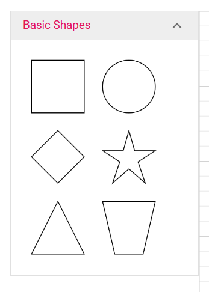
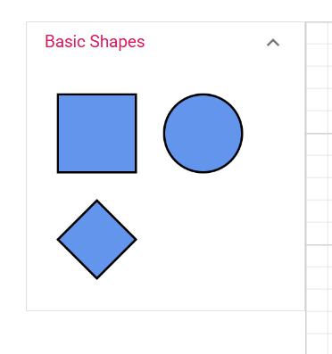
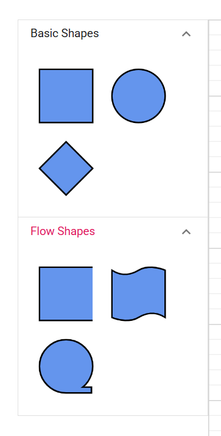
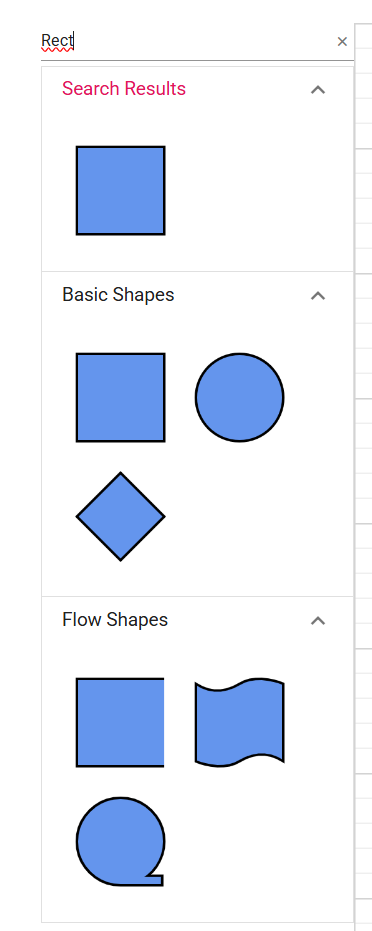

# Symbol palette in .NET MAUI Diagram

The Symbol Palette is a UI element that displays reusable symbols. Users drag symbols from the palette onto the diagram surface to create new nodes.

A symbol palette organizes symbols into one or more palettes. Each palette belongs to a logical category, such as **Basic Shapes** or **Flow Shapes**.

## Prerequisites

Refer to the [Getting started](getting-started.md) page to create a project, install the package, and register the handler. Symbol examples assume that an `SfDiagram` instance is available.

---

## SymbolPalette control

The `SymbolPalette` control exposes the implemented members listed below.

| Property | Description | Status |
| --- | --- | --- |
| `EnableSearch` | `true` to display a search box above the palettes. | Implemented. |
| `SymbolHeight` | Height applied to symbols in the palette. | Implemented. |
| `SymbolWidth` | Width applied to symbols in the palette. | Implemented. |
| `Palettes` | Collection of `Palette` items. | Implemented. |
| `Width` | Width of the Symbol Palette. | Not implemented in the current release. |
| `Height` | Height of the Symbol Palette. | Not implemented in the current release. |
|`ExpandMode`| Specifies whether one or multiple palettes can be expanded at a time. Default is DiagramPaletteExpandMode.Multiple. | Implemented. |

> **Note:** `WidthRequest` and `HeightRequest` are still available because they are inherited from the MAUI `View` base class. The `Width` and `Height` properties listed in legacy documents are not implemented on `SymbolPalette` directly. Verify the supported layout properties in the API reference for your package.


---

## Palette class

A `Palette` represents a category of symbols within the Symbol Palette.

| Property | Description | Status |
| --- | --- | --- |
| `Id` | Unique identifier for the palette. | Implemented. |
| `Title` | Header text displayed for the palette. | Implemented. |
| `Symbols` | Collection of nodes shown as symbols. | Implemented. |
| `Expanded` | Whether the palette is initially expanded. | Implemented. |
| `IconCss` | Icon associated with the palette. | Implemented. |
| `Height` | Height of the palette. | Not implemented in the current release. |

---

## Add symbols

Symbols are added through the `Palette.Symbols` collection. Each symbol is typically a `Node` configured with the desired shape and size.

```csharp
var basicPalette = new Palette
{
    Id = "basicShapes",
    Title = "Basic Shapes"
};

ShapeStyle style = new ShapeStyle();
style.Fill = Colors.CornflowerBlue;
style.StrokeColor = Colors.Black;
style.StrokeWidth = 2;
style.StrokeDashArray = "0,0";


basicPalette.Symbols.Add(
    new Node
    {
        Id = "Rectangle",
        Shape = new BasicShape { Shape = NodeBasicShapes.Rectangle },
        Height = 70,
        Width = 70,
        Style = style
    });

basicPalette.Symbols.Add(
    new Node
    {
        Id = "Ellipse",
        Shape = new BasicShape { Shape = NodeBasicShapes.Ellipse },
        Height = 70, Width = 70,
        Style = style
    });

basicPalette.Symbols.Add(
    new Node
    {
        Id = "Diamond",
        Shape = new BasicShape { Shape = NodeBasicShapes.Diamond },
        Height = 70,
        Width = 70,
        Style = style
    });
```

---

## Multiple palettes

The `Palettes` collection holds the palettes that are exposed by the Symbol Palette.

```csharp

// First palette
var basicPalette = new Palette
{
    Id = "basicShapes",
    Title = "Basic Shapes"
};
ShapeStyle style = new ShapeStyle();
style.Fill = Colors.CornflowerBlue;
style.StrokeColor = Colors.Black;
style.StrokeWidth = 2;
style.StrokeDashArray = "0,0";

         
basicPalette.Symbols.Add(
    new Node
    {
        Id = "Rectangle",
        Shape = new BasicShape { Shape = NodeBasicShapes.Rectangle },
        Height = 70,
        Width = 70,
        Style = style
    });

basicPalette.Symbols.Add(
    new Node
    {
        Id = "Ellipse",
        Shape = new BasicShape { Shape = NodeBasicShapes.Ellipse },
        Height = 70, Width = 70,
        Style = style
    });

basicPalette.Symbols.Add(
    new Node
    {
        Id = "Diamond",
        Shape = new BasicShape { Shape = NodeBasicShapes.Diamond },
        Height = 70,
        Width = 70,
        Style = style
    });

// First palette
var flowPalette = new Palette
{
    Id = "flowPalette",
    Title = "Flow Shapes"
};

flowPalette.Symbols.Add(
    new Node
    {
        Id = "Rectangle",
        Shape = new FlowShape { Shape = NodeFlowShapes.Annotation },
        Height = 70,
        Width = 70,
        Style = style
    });

flowPalette.Symbols.Add(
    new Node
    {
        Id = "Ellipse",
        Shape = new FlowShape { Shape = NodeFlowShapes.PaperTap },
        Height = 70,
        Width = 70,
        Style = style
    });

flowPalette.Symbols.Add(
    new Node
    {
        Id = "Diamond",
        Shape = new FlowShape { Shape = NodeFlowShapes.SequentialAccessStorage },
        Height = 70,
        Width = 70,
        Style = style
    });

symbolPalette.Palettes = new ObservableCollection<Palette>
{
    basicPalette, flowPalette

};

```

---

## Search

Enable search to help users locate a symbol quickly when a palette contains many entries.

```csharp

symbolPalette.EnableSearch = true;

```

Supported symbol dimensions such as `SymbolWidth` and `SymbolHeight` control how each symbol is rendered inside the palette.

---

## Layout the palette

Because the `SymbolPalette.Width` and `SymbolPalette.Height` properties are not implemented, use MAUI layout properties to size the control.

```XAML
<diagram:SymbolPalette
    x:Name="symbolPalette"
    WidthRequest="250" />
```

If `SymbolPalette` is hosted inside a layout container such as `Grid`, set the row or column size to control the height.

---