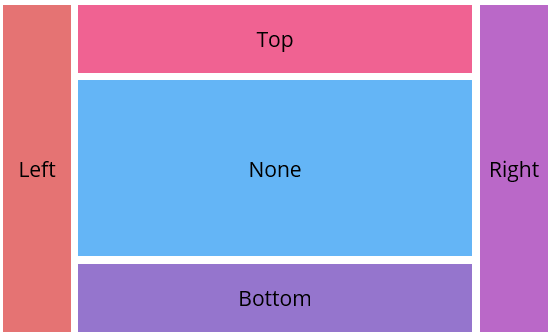

# Customization in .NET MAUI DockLayout Control

## Expand LastChild
The `ShouldExpandLastChild` property (of type `bool`) determines whether the last docked child should automatically occupy all remaining space after other docked children have been positioned. By default, this property is set to `True`. This feature is particularly valuable for ensuring that the last child element fully utilizes available space, resulting in a seamless and gap-free layout.




<dx:SfDockLayout ShouldExpandLastChild="False">
    <!-- Since ShouldExpandLastChild is False, the last child's size must be defined explicitly -->
    <Label Text="None" HeightRequest="45"/>
</dx:SfDockLayout>





 SfDockLayout dockLayout = new SfDockLayout() { ShouldExpandLastChild = false };
 dockLayout.Children.Add(new Label() { Text = "None", WidthRequest = 45 });





## Spacing
Customize the spacing between child elements using the `HorizontalSpacing` and `VerticalSpacing` properties.The default value for both is 0.

* [HorizontalSpacing]() —  Specifies the horizontal gap between docked children.
* [VerticalSpacing]() — Specifies the vertical  gap between docked children.





<dx:SfDockLayout HorizontalSpacing="10" VerticalSpacing="10">
    ...
</dx:SfDockLayout>
 


SfDockLayout dockLayout = new SfDockLayout() 
{ 
    HorizontalSpacing = 10, VerticalSpacing = 10
};




## Methods in .NET MAUI DockLayout Control

## GetDock
The `GetDock` method retrieves the docking position for a specified view within the layout.

`GetDock(BindableObject view)`

### Parameters
- **view:** `BindableObject` - The targeted child view for docking evaluation.



{% highlight c# % hl_lines="6"}

SfDockLayout dockLayout = new SfDockLayout();
var leftLabel = new Label() { Text = "Left", WidthRequest = 80, Background = Color.FromArgb("#CA7842") };
dockLayout.Children.Add(leftLabel, Dock.Left);
Content = dockLayout;

Dock currentPosition = SfDockLayout.GetDock((BindableObject)dockLayout.Children[0]);





## SetDock
The `SetDock` method assigns a specific docking position to a child element within the layout.

`SetDock(BindableObject view, Dock position)`

### Parameters
* view: `BindableObject` - The targeted child view for docking adjustment.
* position: `Dock` - The designated docking position to assign.



{% highlight c# % hl_lines="5 9 13 17"}

 SfDockLayout dockLayout = new SfDockLayout();

var leftLabel = new Label() { Text = "Left", WidthRequest = 80, Background = Color.FromArgb("#CA7842") };
dockLayout.Children.Add(leftLabel);
SfDockLayout.SetDock((BindableObject)leftLabel, Dock.Left);

var rightLabel = new Label() { Text = "Right", WidthRequest = 80, Background = Color.FromArgb("#71C0BB") };
dockLayout.Children.Add(rightLabel);
SfDockLayout.SetDock((BindableObject)rightLabel, Dock.Right);

var topLabel = new Label() { Text = "Top", HeightRequest = 80, Background = Color.FromArgb("#B2CD9C") };
dockLayout.Children.Add(topLabel);
SfDockLayout.SetDock((BindableObject)topLabel, Dock.Top);

var bottomLabel = new Label() { Text = "Bottom", HeightRequest = 80, Background = Color.FromArgb("#94B4C1") };
dockLayout.Children.Add(bottomLabel);
SfDockLayout.SetDock((BindableObject)bottomLabel, Dock.Bottom);

Content = dockLayout;





## Right To Left in .NET MAUI DockLayout

The .NET MAUI DockLayout control supports Right-to-Left (RTL) layout direction. When the `FlowDirection` property is set to `RightToLeft`, the docking positions are mirrored to align with RTL language standards.

You can enable RTL either by setting `FlowDirection` directly on the DockLayout, or by changing the device language to one that uses an RTL script.





<dx:SfDockLayout FlowDirection="RightToLeft">
...
</dx:SfDockLayout>



SfDockLayout dockLayout = new SfDockLayout()
{
    FlowDirection = FlowDirection.RightToLeft,
};




