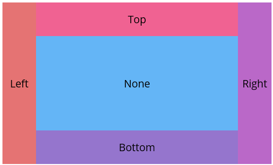

# Getting Started with .NET MAUI DockLayout (SfDockLayout)

This guide details the initial setup and basic usage of the [`SfDockLayout`]() control, offering insight into the layout's capability to arrange views using different docking positions such as top, bottom, left, right, and none.




## Prerequisites

Ensure the following are installed before you begin:

1. [.NET 8 SDK](https://dotnet.microsoft.com/en-us/download/dotnet/8.0) or later.
2. Visual Studio 2022 version 17.8 or later with the .NET MAUI workload.

## Step 1: Create a new .NET MAUI project

1. In **Visual Studio**, go to **File > New > Project**.
2. Select the **.NET MAUI App** template and click **Next**.
3. Enter a project name and location, then click **Create**.

## Step 2: Install the Syncfusion® .NET MAUI Core Package

1. Right-click on the project in **Solution Explorer** and choose **Manage NuGet Packages**.
2. Search for [Syncfusion.Maui.Core](https://www.nuget.org/packages/Syncfusion.Maui.Core/) and install the latest version.
3. Ensure all dependent packages are installed and the project builds successfully.

## Step 3: Register the Syncfusion Core Handler

[Syncfusion.Maui.Core](https://www.nuget.org/packages/Syncfusion.Maui.Core) nuget is a dependent package for all Syncfusion® controls of .NET MAUI. In the **MauiProgram.cs** file, register the handler for Syncfusion® core.





using Microsoft.Extensions.Logging;
using Syncfusion.Maui.Core.Hosting;

namespace DockLayoutGettingStarted
{
    public static class MauiProgram
    {
        public static MauiApp CreateMauiApp()
        {
            var builder = MauiApp.CreateBuilder();
            builder
                .UseMauiApp<App>()
                .ConfigureSyncfusionCore()
                .ConfigureFonts(fonts =>
                {
                    fonts.AddFont("OpenSans-Regular.ttf", "OpenSansRegular");
                });

            return builder.Build();
        }
    }
}




## Step 4: Initialize the DockLayout Control

1. To initialize the control, import the `Synfusion.Maui.Core` namespace.
2. Initialize an [SfDockLayout]() instance.

 



<ContentPage
    . . .    
    xmlns:dx="clr-namespace:Syncfusion.Maui.Core;
    assembly=Syncfusion.Maui.Core">
   
     <dx:SfDockLayout/>

</ContentPage>
 




using Syncfusion.Maui.Core;
namespace DockLayoutGettingStarted
{
    public partial class MainPage : ContentPage
    {
        public MainPage()
        {
            InitializeComponent();  
            SfDockLayout dockLayout = new SfDockLayout();
            Content = dockLayout;       
        }
    }   
}







## Prerequisites

Make sure the following are installed:
1. Install [.NET 8 SDK](https://dotnet.microsoft.com/en-us/download/dotnet/8.0) or later is installed.
2. Set up a .NET MAUI environment with Visual Studio Code.
3. Ensure that the .NET MAUI extension is installed and configured as described [here](https://learn.microsoft.com/en-us/dotnet/maui/get-started/installation?view=net-maui-8.0&tabs=visual-studio-code).

## Step 1: Create a new .NET MAUI project

1. Open the command palette by pressing `Ctrl+Shift+P`, type **.NET:New Project** and press **Enter**.
2. Choose the **.NET MAUI App** template.
3. Select the project location, type the project name, and press **Enter**.
4. Then choose **Create project**.

## Step 2: Install the Syncfusion® MAUI Core NuGet package

1. Press <kbd>Ctrl</kbd> + <kbd>`</kbd> (backtick) to open the integrated terminal in Visual Studio Code.
2. Ensure you're in the project root directory where your .csproj file is located.
3. Run the command `dotnet add package Syncfusion.Maui.Core` to install the Syncfusion® .NET MAUI Core package.
4. To ensure all dependencies are installed, run `dotnet restore`.

## Step 3: Register the handler

The [Syncfusion.Maui.Core](https://www.nuget.org/packages/Syncfusion.Maui.Core/) NuGet is a dependent package for all Syncfusion® controls of .NET MAUI. In the `MauiProgram.cs` file, register the handler for Syncfusion® core.



using Microsoft.Maui;
using Microsoft.Maui.Hosting;
using Microsoft.Maui.Controls.Compatibility;
using Microsoft.Maui.Controls.Hosting;
using Microsoft.Maui.Controls.Xaml;
using Syncfusion.Maui.Core.Hosting;

namespace DockLayoutSample
{
  public static class MauiProgram
  {
	public static MauiApp CreateMauiApp()
	{
		var builder = MauiApp.CreateBuilder();
		builder
		.UseMauiApp<App>()
		.ConfigureSyncfusionCore()
		.ConfigureFonts(fonts =>
		{
			fonts.AddFont("OpenSans-Regular.ttf", "OpenSansRegular");
		});

		return builder.Build();
	 }
   
  }

}     



## Step 4: Initialize the DockLayout Control

1. To initialize the control, import the `Synfusion.Maui.Core` namespace.
2. Initialize an [SfDockLayout]() instance.

 


<ContentPage
    . . .    
    xmlns:dx="clr-namespace:Syncfusion.Maui.Core;
    assembly=Syncfusion.Maui.Core">
   
     <dx:SfDockLayout/>

</ContentPage>
 




using Syncfusion.Maui.Core;
namespace DockLayoutGettingStarted
{
    public partial class MainPage : ContentPage
    {
        public MainPage()
        {
            InitializeComponent();  
            SfDockLayout dockLayout = new SfDockLayout();
            Content = dockLayout;       
        }
    }   
}





### Set Dock Position for Child Views
Inside the [SfDockLayout]() control, child views can be arranged using the [Dock]() attached property. This property allows to dock elements to specific edges— `Top`, `Bottom`, `Left`, `Right`, or set to `None` to remain undocked and fill the remaining space.





<ContentPage xmlns="http://schemas.microsoft.com/dotnet/2021/maui"
             xmlns:x="http://schemas.microsoft.com/winfx/2009/xaml"
             xmlns:dx="clr-namespace:Syncfusion.Maui.Core;assembly=Syncfusion.Maui.Core"
             x:Class="DockLayoutGettingStarted.MainPage">

   <ContentPage.Content>
        <dx:SfDockLayout >
             <Label Text="Left"  WidthRequest="80" dx:SfDockLayout.Dock="Left" Background="#E57373" />
            <Label Text="Top" HeightRequest="80" dx:SfDockLayout.Dock="Top" Background="#F06292" />
            <Label Text="Right"  WidthRequest="80"  dx:SfDockLayout.Dock="Right" Background="#BA68C8" />
            <Label Text="Bottom" HeightRequest="80"  dx:SfDockLayout.Dock="Bottom" 
            Background="#9575CD"/>
            <Label Text="None" dx:SfDockLayout.Dock="Top" MinimumHeightRequest="80" BackgroundColor="#64B5F6" />
        </dx:SfDockLayout>
    </ContentPage.Content>
    
</ContentPage>





using Syncfusion.Maui.Core;

namespace DockLayoutGettingStarted
{
    public partial class MainPage : ContentPage
    {
        public MainPage()
        {
            InitializeComponent();
            SfDockLayout dockLayout = new SfDockLayout();
            dockLayout.Children.Add(new Label() { Text = "Left", WidthRequest = 80, Background = Color.FromArgb("#E57373") }, Dock.Left);
            dockLayout.Children.Add(new Label() { Text = "Top", HeightRequest = 80, Background = Color.FromArgb("#F06292") }, Dock.Top);
            dockLayout.Children.Add(new Label() { Text = "Right", WidthRequest = 80, Background = Color.FromArgb("#BA68C8") }, Dock.Right);
            dockLayout.Children.Add(new Label() { Text = "Bottom", HeightRequest = 80, Background = Color.FromArgb("#9575CD") }, Dock.Bottom);
            dockLayout.Children.Add(new Label() { Text = "None", Background = Color.FromArgb("#64B5F6") });
            Content = dockLayout;   
        }
    }
}




You can access a complete getting started sample from this [link.](https://github.com/SyncfusionExamples/GettingStarted_DockLayout_MAUI)