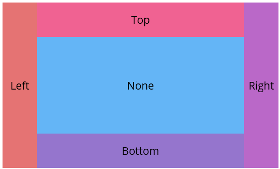

# Getting Started with .NET MAUI DockLayout (SfDockLayout)

This guide details the initial setup and basic usage of the [SfDockLayout](https://help.syncfusion.com/cr/maui/Syncfusion.Maui.Core.SfDockLayout.html) control, offering insight into the layout's capability to arrange views using different docking positions such as top, bottom, left, right, and none.

To get start quickly with our [.NET MAUI DockLayout](https://help.syncfusion.com/cr/maui/Syncfusion.Maui.Core.SfDockLayout.html), you can check the below video.

 




## Prerequisites

Before proceeding, ensure the following are set up:

1. Install [.NET 9 SDK](https://dotnet.microsoft.com/en-us/download/dotnet/9.0) or later.
2. Set up a .NET MAUI environment with Visual Studio 2022 v17.12 or later.

## Step 1: Create a new .NET MAUI project

1. Go to **File > New > Project** and choose the **.NET MAUI App** template.
2. Name the project and choose a location. Then, click **Next**.
3. Select the .NET framework version and click **Create**.

## Step 2: Install the Syncfusion® MAUI Core NuGet package

1. In **Solution Explorer**, right-click the project and choose **Manage NuGet Packages**.
2. Search for [Syncfusion.Maui.Core](https://www.nuget.org/packages/Syncfusion.Maui.Core/) and install the latest version.
3. Ensure the necessary dependencies are installed correctly, and the project is restored.




## Prerequisites

Before proceeding, ensure the following are set up:

1. Install [.NET 9 SDK](https://dotnet.microsoft.com/en-us/download/dotnet/9.0) or later.
2. Set up a .NET MAUI environment with Visual Studio Code.
3. Ensure that the .NET MAUI workloads are installed and configured as described [here](https://learn.microsoft.com/en-us/dotnet/maui/get-started/installation?view=net-maui-9.0&tabs=visual-studio-code).

## Step 1: Create a new .NET MAUI project

1. Open the Command Palette by pressing **Ctrl+Shift+P** and type **.NET:New Project** and press Enter.
2. Choose the **.NET MAUI App** template.
3. Select the project location, type the project name and press Enter.
4. Then choose **Create project**

## Step 2: Install the Syncfusion® MAUI Core NuGet package

1. Press <kbd>Ctrl</kbd> + <kbd>`</kbd> (backtick) to open the integrated terminal in Visual Studio Code.
2. Ensure you're in the project root directory where your .csproj file is located.
3. Run the command `dotnet add package Syncfusion.Maui.Core` to install the Syncfusion® .NET MAUI Core package.
4. To ensure all dependencies are installed, run `dotnet restore`.




## Prerequisites

Before proceeding, ensure the following are set up:

1. Install [.NET 9 SDK](https://dotnet.microsoft.com/en-us/download/dotnet/9.0) or later.
2. Set up a .NET MAUI environment with JetBrains Rider 2024.3 or later.
3. Make sure the MAUI workloads are installed and configured as described [here.](https://www.jetbrains.com/help/rider/MAUI.html#before-you-start)

## Step 1: Create a new .NET MAUI project

1. Go to **File > New Solution,** Select .NET (C#) and choose the .NET MAUI App template.
2. Enter the Project Name, Solution Name, and Location.
3. Select the .NET framework version and click Create.

## Step 2: Install the Syncfusion® MAUI Core NuGet package

1. In **Solution Explorer,** right-click the project and choose **Manage NuGet Packages.**
2. Search for [Syncfusion.Maui.Core](https://www.nuget.org/packages/Syncfusion.Maui.Core/) and install the latest version.
3. Ensure the necessary dependencies are installed correctly, and the project is restored. If not, Open the Terminal in Rider and manually run: `dotnet restore`




## Step 3: Register Syncfusion handler

Make sure to add the namespace.
 


using Syncfusion.Maui.Core.Hosting;


 
Register the Syncfusion core handler in your `CreateMauiApp` method of `MauiProgram.cs` file to use Syncfusion controls.
 


builder.ConfigureSyncfusionCore();



## Step 4: Import the DockLayout namespace
 
Add the following namespace in your XAML or C#.
 


 
xmlns:sf="clr-namespace:Syncfusion.Maui.Core;assembly=Syncfusion.Maui.Core"
 


 
using Syncfusion.Maui.Core;
 



## Step 5: Create a DockLayout with Dock Position for Child Views

Initialize the [SfDockLayout](https://help.syncfusion.com/cr/maui/Syncfusion.Maui.Core.SfDockLayout.html) control and arrange the child views using [Dock](https://help.syncfusion.com/cr/maui/Syncfusion.Maui.Core.SfDockLayout.html#Syncfusion_Maui_Core_SfDockLayout_DockProperty) property. This property allows to dock elements to specific edges- `Top`, `Bottom`, `Left`, `Right`, or set to `None` to remain non-docked and fill the remaining space.




    <sf:SfDockLayout >
        <Label Text="Left" WidthRequest="80" sf:SfDockLayout.Dock="Left" Background="#E57373" />
        <Label Text="Right" WidthRequest="80" sf:SfDockLayout.Dock="Right" Background="#BA68C8" />
        <Label Text="Top" HeightRequest="80" sf:SfDockLayout.Dock="Top" Background="#F06292" />
        <Label Text="Bottom" HeightRequest="80"  sf:SfDockLayout.Dock="Bottom" Background="#9575CD"/>
        <Label Text="None" BackgroundColor="#64B5F6" />
    </sf:SfDockLayout>



    
SfDockLayout dockLayout = new SfDockLayout();
dockLayout.Children.Add(new Label() { Text = "Left", WidthRequest = 80, Background = Color.FromArgb("#E57373") }, Dock.Left);
dockLayout.Children.Add(new Label() { Text = "Right", WidthRequest = 80, Background = Color.FromArgb("#BA68C8") }, Dock.Right);
dockLayout.Children.Add(new Label() { Text = "Top", HeightRequest = 80, Background = Color.FromArgb("#F06292") }, Dock.Top);
dockLayout.Children.Add(new Label() { Text = "Bottom", HeightRequest = 80, Background = Color.FromArgb("#9575CD") }, Dock.Bottom);
dockLayout.Children.Add(new Label() { Text = "None", Background = Color.FromArgb("#64B5F6") });




The following screenshot illustrates the result of the above code.

You can download the DockLayout Getting Started sample from [GitHub](https://github.com/SyncfusionExamples/GettingStarted_DockLayout_MAUI).