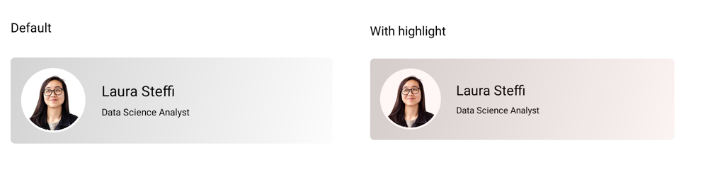
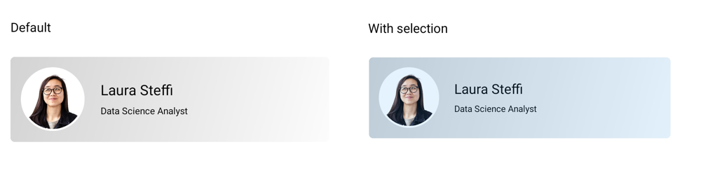
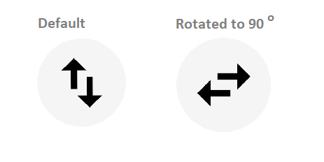

# Customization in .NET MAUI Effects View

## Prerequisites

Before using the [`SfEffectsView`](https://help.syncfusion.com/cr/maui/Syncfusion.Maui.Core.SfEffectsView.html), ensure the following NuGet package is installed in your .NET MAUI project:

- `Syncfusion.Maui.Core`

For a step-by-step setup, refer to the [Getting Started](https://help.syncfusion.com/maui/effects-view/getting-started) documentation.

The `SfEffectsView` control exposes properties that customize the duration, size, color, and angle of each effect.

## Animation Durations

The three animation-duration properties control how long each effect takes to complete, in milliseconds.

### RippleAnimationDuration

The [RippleAnimationDuration](https://help.syncfusion.com/cr/maui/Syncfusion.Maui.Core.SfEffectsView.html#Syncfusion_Maui_Core_SfEffectsView_RippleAnimationDuration) property sets the duration of the ripple animation. The default value is `400` milliseconds.

# 



<syncEffectsView:SfEffectsView x:Name="effectsView"
                               HorizontalOptions="Center" 
                               VerticalOptions="Center"
                               RippleAnimationDuration="800">
    <Grid Padding="12" 
          WidthRequest="350" 
          HeightRequest="150"
          HorizontalOptions="Center" 
          VerticalOptions="Center">
        <Grid.Background>
            <LinearGradientBrush EndPoint="1,1">
                <GradientStop Color="#FF6B6B" 
                              Offset="0.0" />
                <GradientStop Color="#4ECDC4" 
                              Offset="1.0" />
            </LinearGradientBrush>
        </Grid.Background>
    </Grid>
</syncEffectsView:SfEffectsView>





var grid = new Grid
{
    Padding = new Thickness(12),
    WidthRequest = 350,
    HeightRequest = 150,
    HorizontalOptions = LayoutOptions.Center,
    VerticalOptions = LayoutOptions.Center,
    Background = new LinearGradientBrush
    {
        EndPoint = new Point(1, 1),
        GradientStops = new GradientStopCollection
        {
            new GradientStop(Color.FromArgb("#FF6B6B"), 0.0f),
            new GradientStop(Color.FromArgb("#4ECDC4"), 1.0f)
        }
    }
};

var effectsView = new SfEffectsView
{
    HorizontalOptions = LayoutOptions.Center,
    VerticalOptions = LayoutOptions.Center,
    RippleAnimationDuration = 800,
    Content = grid
};

this.Content = effectsView;





### ScaleAnimationDuration

The [ScaleAnimationDuration](https://help.syncfusion.com/cr/maui/Syncfusion.Maui.Core.SfEffectsView.html#Syncfusion_Maui_Core_SfEffectsView_ScaleAnimationDuration) property sets the duration of the scale animation. The default value is `200` milliseconds.

# 



<syncEffectsView:SfEffectsView x:Name="effectsView"
                               HorizontalOptions="Center" 
                               VerticalOptions="Center"
                               ScaleAnimationDuration="800"
                               LongPressEffects="Scale"
                               ScaleFactor="0.85">
    <Grid Padding="12" 
          WidthRequest="350" 
          HeightRequest="150"
          HorizontalOptions="Center" 
          VerticalOptions="Center">
        <Grid.Background>
            <LinearGradientBrush EndPoint="1,1">
                <GradientStop Color="#FF6B6B" 
                              Offset="0.0" />
                <GradientStop Color="#4ECDC4" 
                              Offset="1.0" />
            </LinearGradientBrush>
        </Grid.Background>
    </Grid>
</syncEffectsView:SfEffectsView>





var grid = new Grid
{
    Padding = new Thickness(12),
    WidthRequest = 350,
    HeightRequest = 150,
    HorizontalOptions = LayoutOptions.Center,
    VerticalOptions = LayoutOptions.Center,
    Background = new LinearGradientBrush
    {
        EndPoint = new Point(1, 1),
        GradientStops = new GradientStopCollection
        {
            new GradientStop(Color.FromArgb("#FF6B6B"), 0.0f),
            new GradientStop(Color.FromArgb("#4ECDC4"), 1.0f)
        }
    }
};

var effectsView = new SfEffectsView
{
    HorizontalOptions = LayoutOptions.Center,
    VerticalOptions = LayoutOptions.Center,
    ScaleAnimationDuration = 800,
    LongPressEffects = SfEffects.Scale,
    ScaleFactor = 0.85,
    Content = grid
};

this.Content = effectsView;





### RotationAnimationDuration

The [RotationAnimationDuration](https://help.syncfusion.com/cr/maui/Syncfusion.Maui.Core.SfEffectsView.html#Syncfusion_Maui_Core_SfEffectsView_RotationAnimationDuration) property sets the duration of the rotation animation. The default value is `200` milliseconds.

# 



<syncEffectsView:SfEffectsView x:Name="effectsView"
                               HorizontalOptions="Center" 
                               VerticalOptions="Center"
                               RotationAnimationDuration="800"
                               Angle="180"
                               TouchDownEffects="Rotation">
    <Grid Padding="12" 
          WidthRequest="350" 
          HeightRequest="150"
          HorizontalOptions="Center" 
          VerticalOptions="Center">
        <Grid.Background>
            <LinearGradientBrush EndPoint="1,1">
                <GradientStop Color="#FF6B6B" 
                              Offset="0.0" />
                <GradientStop Color="#4ECDC4" 
                              Offset="1.0" />
            </LinearGradientBrush>
        </Grid.Background>
    </Grid>
</syncEffectsView:SfEffectsView>





var grid = new Grid
{
    Padding = new Thickness(12),
    WidthRequest = 350,
    HeightRequest = 150,
    HorizontalOptions = LayoutOptions.Center,
    VerticalOptions = LayoutOptions.Center,
    Background = new LinearGradientBrush
    {
        EndPoint = new Point(1, 1),
        GradientStops = new GradientStopCollection
        {
            new GradientStop(Color.FromArgb("#FF6B6B"), 0.0f),
            new GradientStop(Color.FromArgb("#4ECDC4"), 1.0f)
        }
    }
};

var effectsView = new SfEffectsView
{
    HorizontalOptions = LayoutOptions.Center,
    VerticalOptions = LayoutOptions.Center,
    RotationAnimationDuration = 800,
    Angle = 180,
    TouchDownEffects = SfEffects.Rotation,
    Content = grid
};

this.Content = effectsView;





## Size and Position

### InitialRippleFactor

The [InitialRippleFactor](https://help.syncfusion.com/cr/maui/Syncfusion.Maui.Core.SfEffectsView.html#Syncfusion_Maui_Core_SfEffectsView_InitialRippleFactor) property sets the starting size of the ripple as a fraction of the view's smaller dimension. The default value is `0.1`. Valid range is `0` to `1`.

# 



<Border HorizontalOptions="Center" 
        VerticalOptions="Center">
    <Border.StrokeShape>
        <RoundRectangle CornerRadius="18" />
    </Border.StrokeShape>
    <Border.Background>
        <LinearGradientBrush EndPoint="1,0">
            <GradientStop Color="#FFCDCDD2" 
                          Offset="0.0" />
            <GradientStop Color="#FFCDCDD2" 
                          Offset="1.0" />
        </LinearGradientBrush>
    </Border.Background>
    <syncEffectsView:SfEffectsView InitialRippleFactor="0.1">
        <Grid>
            <Grid.ColumnDefinitions>
                <ColumnDefinition Width="90" />
                <ColumnDefinition Width="*"/>
            </Grid.ColumnDefinitions>
            <Image Source="laura.png" 
                   Margin="7" 
                   VerticalOptions="Center"
                   WidthRequest="72" 
                   HeightRequest="72" />
                <StackLayout Grid.Column="1" 
                             VerticalOptions="Center">
                    <Label Text="Laura Steffi" 
                           Margin="10,0,10,0" 
                           FontSize="18" />
                    <Label Text="Data Science Analyst" 
                           Margin="10,0,10,0" 
                           FontSize="12"/>
                </StackLayout>
        </Grid>
    </syncEffectsView:SfEffectsView>
</Border>





var grid = new Grid
{
    ColumnDefinitions =
    {
        new ColumnDefinition { Width = 90 },
        new ColumnDefinition { Width = GridLength.Star }
    }
};

var image = new Image
{
    Source = "laura.png",
    Margin = new Thickness(7),
    VerticalOptions = LayoutOptions.Center,
    WidthRequest = 72,
    HeightRequest = 72
};

var nameLabel = new Label
{
    Text = "Laura Steffi",
    Margin = new Thickness(10, 0),
    FontSize = 18
};

var roleLabel = new Label
{
    Text = "Data Science Analyst",
    Margin = new Thickness(10, 0),
    FontSize = 12
};

var stackLayout = new StackLayout
{
    VerticalOptions = LayoutOptions.Center,
    Children = { nameLabel, roleLabel }
};

grid.Add(image);
grid.Add(stackLayout, 1, 0);

var effectsView = new SfEffectsView
{
    InitialRippleFactor = 0.1,
    Content = grid
};

var border = new Border
{
    HorizontalOptions = LayoutOptions.Center,
    VerticalOptions = LayoutOptions.Center,
    StrokeShape = new RoundRectangle
    {
        CornerRadius = 18
    },
    Background = new LinearGradientBrush
    {
        EndPoint = new Point(1, 0),
        GradientStops = new GradientStopCollection
        {
            new GradientStop(Color.FromArgb("#FFCDCDD2"), 0.0f),
            new GradientStop(Color.FromArgb("#FFCDCDD2"), 1.0f)
        }
    },
    Content = effectsView
};

this.Content = border;





### ScaleFactor

The [ScaleFactor](https://help.syncfusion.com/cr/maui/Syncfusion.Maui.Core.SfEffectsView.html#Syncfusion_Maui_Core_SfEffectsView_ScaleFactor) property sets the target scale applied during the `Scale` effect. The default value is `1.0`. Values below `1` shrink the view; values above `1` grow it. See [Scale Effect](Effects/Scale.md) for details on the effect itself.

# 



<HorizontalStackLayout HorizontalOptions="Center" 
                       Spacing="12">
    <syncEffectsView:SfEffectsView x:Name="EffectsView1"
                                   ScaleFactor="0.85"
                                   LongPressEffects="Scale"
                                   TouchDownEffects="None"
                                   TouchUpEffects="None"
                                   LongPressed="OnEffectsView1LongPressed">
        <Grid WidthRequest="100" 
              HeightRequest="100">
            <Image Source="person3.jpg" 
                   WidthRequest="100" 
                   HeightRequest="100"
                   Aspect="AspectFill" />
            <Border x:Name="Tick1" 
                    Padding="0" 
                    IsVisible="False" 
                    BackgroundColor="Blue"
                    WidthRequest="18" 
                    HeightRequest="18"
                    HorizontalOptions="End" 
                    VerticalOptions="Start"
                    StrokeThickness="0">
                <Border.StrokeShape>
                    <RoundRectangle CornerRadius="9" />
                </Border.StrokeShape>
                <Label Text="✓" 
                       FontSize="12" 
                       TextColor="White" 
                       FontAttributes="Bold" 
                       HorizontalOptions="Center" 
                       VerticalOptions="Center" />
            </Border>
        </Grid>
    </syncEffectsView:SfEffectsView>
    
    <syncEffectsView:SfEffectsView x:Name="EffectsView2"
                                   ScaleFactor="0.85"
                                   LongPressEffects="Scale"
                                   TouchDownEffects="None"
                                   TouchUpEffects="None"
                                   LongPressed="OnEffectsView2LongPressed">
        <Grid WidthRequest="100" 
              HeightRequest="100">
            <Image Source="person2.jpg" 
                   WidthRequest="100" 
                   HeightRequest="100"
                   Aspect="AspectFill" />
            <Border x:Name="Tick2" 
                    Padding="0" 
                    IsVisible="False" 
                    BackgroundColor="Blue"
                    WidthRequest="18" 
                    HeightRequest="18"
                    HorizontalOptions="End" 
                    VerticalOptions="Start"
                    StrokeThickness="0">
                <Border.StrokeShape>
                    <RoundRectangle CornerRadius="9" />
                </Border.StrokeShape>
                <Label Text="✓" 
                       FontSize="12" 
                       TextColor="White" 
                       FontAttributes="Bold" 
                       HorizontalOptions="Center" 
                       VerticalOptions="Center" />
            </Border>
        </Grid>
    </syncEffectsView:SfEffectsView>

    <syncEffectsView:SfEffectsView x:Name="EffectsView3"
                                   ScaleFactor="0.85"
                                   LongPressEffects="Scale"
                                   TouchDownEffects="None"
                                   TouchUpEffects="None"
                                   LongPressed="OnEffectsView3LongPressed">
        <Grid WidthRequest="100" 
              HeightRequest="100">
            <Image Source="person1.jpg" 
                   WidthRequest="100" 
                   HeightRequest="100"
                   Aspect="AspectFill" />
            <Border x:Name="Tick3" 
                    Padding="0" 
                    IsVisible="False" 
                    BackgroundColor="Blue"
                    WidthRequest="18" 
                    HeightRequest="18"
                    HorizontalOptions="End" 
                    VerticalOptions="Start"
                    StrokeThickness="0">
                <Border.StrokeShape>
                    <RoundRectangle CornerRadius="9" />
                </Border.StrokeShape>
                <Label Text="✓" 
                       FontSize="12" 
                       TextColor="White" 
                       FontAttributes="Bold" 
                       HorizontalOptions="Center" 
                       VerticalOptions="Center" />
            </Border>
        </Grid>
    </syncEffectsView:SfEffectsView>
</HorizontalStackLayout>





/// 

/// Handle LongPressed event for EffectsView1
/// 

private void OnEffectsView1LongPressed(object sender, EventArgs e)
{
    SelectImage(EffectsView1, Tick1);
}

/// 

/// Handle LongPressed event for EffectsView2
/// 

private void OnEffectsView2LongPressed(object sender, EventArgs e)
{
    SelectImage(EffectsView2, Tick2);
}

/// 

/// Handle LongPressed event for EffectsView3
/// 

private void OnEffectsView3LongPressed(object sender, EventArgs e)
{
    SelectImage(EffectsView3, Tick3);
}

/// 

/// Select an image: apply scale effect and show tick mark.
/// 

private async void SelectImage(SfEffectsView effectsView, Border tickFrame)
{
    // Apply scale effect to the newly selected image
    await effectsView.ScaleTo(0.85, 300, Easing.CubicInOut);
    
    // Show the tick mark
    tickFrame.IsVisible = true;
}





## Background Colors

The three `*Background` properties accept any `Brush`. The XAML examples below use a hex color string, which the type converter accepts; the C# examples use `SolidColorBrush`. For a gradient, pass a `LinearGradientBrush` or `RadialGradientBrush` instead.

### HighlightBackground

The [HighlightBackground](https://help.syncfusion.com/cr/maui/Syncfusion.Maui.Core.SfEffectsView.html#Syncfusion_Maui_Core_SfEffectsView_HighlightBackground) property sets the brush applied during the `Highlight` effect. The default value is `SolidColorBrush(Color.FromArgb("#14000000"))`.

# 



<Border HorizontalOptions="Center" 
        VerticalOptions="Center">
    <Border.StrokeShape>
        <RoundRectangle CornerRadius="18" />
    </Border.StrokeShape>
    <Border.Background>
        <LinearGradientBrush EndPoint="1,0">
            <GradientStop Color="#FFCDCDD2" 
                          Offset="0.0" />
            <GradientStop Color="#FFCDCDD2" 
                          Offset="1.0" />
        </LinearGradientBrush>
    </Border.Background>
    <syncEffectsView:SfEffectsView  HighlightBackground="#FFF36421"
                                    TouchDownEffects="Highlight">
        <Grid>
            <Grid.ColumnDefinitions>
                <ColumnDefinition Width="90" />
                <ColumnDefinition Width="*"/>
            </Grid.ColumnDefinitions>
            <Image Source="laura.png" 
                   Margin="7" 
                   VerticalOptions="Center"
                   WidthRequest="72" 
                   HeightRequest="72" />
                <StackLayout Grid.Column="1" 
                             VerticalOptions="Center">
                    <Label Text="Laura Steffi" 
                           Margin="10,0,10,0" 
                           FontSize="18" />
                    <Label Text="Data Science Analyst" 
                           Margin="10,0,10,0" 
                           FontSize="12"/>
                </StackLayout>
        </Grid>
    </syncEffectsView:SfEffectsView>
</Border>





var grid = new Grid
{
    ColumnDefinitions =
    {
        new ColumnDefinition { Width = 90 },
        new ColumnDefinition { Width = GridLength.Star }
    }
};

var image = new Image
{
    Source = "laura.png",
    Margin = new Thickness(7),
    VerticalOptions = LayoutOptions.Center,
    WidthRequest = 72,
    HeightRequest = 72
};

var nameLabel = new Label
{
    Text = "Laura Steffi",
    Margin = new Thickness(10, 0),
    FontSize = 18
};

var roleLabel = new Label
{
    Text = "Data Science Analyst",
    Margin = new Thickness(10, 0),
    FontSize = 12
};

var stackLayout = new StackLayout
{
    VerticalOptions = LayoutOptions.Center,
    Children = { nameLabel, roleLabel }
};

grid.Add(image);
grid.Add(stackLayout, 1, 0);

var effectsView = new SfEffectsView
{
    HighlightBackground = new SolidColorBrush(Colors.OrangeRed),
    TouchDownEffects = SfEffects.Highlight,
    Content = grid
};

var border = new Border
{
    HorizontalOptions = LayoutOptions.Center,
    VerticalOptions = LayoutOptions.Center,
    StrokeShape = new RoundRectangle
    {
        CornerRadius = 18
    },
    Background = new LinearGradientBrush
    {
        EndPoint = new Point(1, 0),
        GradientStops = new GradientStopCollection
        {
            new GradientStop(Color.FromArgb("#FFCDCDD2"), 0.0f),
            new GradientStop(Color.FromArgb("#FFCDCDD2"), 1.0f)
        }
    },
    Content = effectsView
};

this.Content = border;





### RippleBackground

The [RippleBackground](https://help.syncfusion.com/cr/maui/Syncfusion.Maui.Core.SfEffectsView.html#Syncfusion_Maui_Core_SfEffectsView_RippleBackground) property sets the brush applied during the `Ripple` effect. The default value is `SolidColorBrush(Color.FromArgb("#22FFFFFF"))`.

# 



<Border HorizontalOptions="Center" 
        VerticalOptions="Center">
    <Border.StrokeShape>
        <RoundRectangle CornerRadius="18" />
    </Border.StrokeShape>
    <Border.Background>
        <LinearGradientBrush EndPoint="1,0">
            <GradientStop Color="#FFCDCDD2" 
                          Offset="0.0" />
            <GradientStop Color="#FFCDCDD2" 
                          Offset="1.0" />
        </LinearGradientBrush>
    </Border.Background>
    <syncEffectsView:SfEffectsView  x:Name="effectsView"
                                    RippleBackground="#2196F3">
        <Grid>
            <Grid.ColumnDefinitions>
                <ColumnDefinition Width="90" />
                <ColumnDefinition Width="*"/>
            </Grid.ColumnDefinitions>
            <Image Source="laura.png" 
                   Margin="7" 
                   VerticalOptions="Center"
                   WidthRequest="72" 
                   HeightRequest="72" />
                <StackLayout Grid.Column="1" 
                             VerticalOptions="Center">
                    <Label Text="Laura Steffi" 
                           Margin="10,0,10,0" 
                           FontSize="18" />
                    <Label Text="Data Science Analyst" 
                           Margin="10,0,10,0" 
                           FontSize="12"/>
                </StackLayout>
        </Grid>
    </syncEffectsView:SfEffectsView>
</Border>





var grid = new Grid
{
    ColumnDefinitions =
    {
        new ColumnDefinition { Width = 90 },
        new ColumnDefinition { Width = GridLength.Star }
    }
};

var image = new Image
{
    Source = "laura.png",
    Margin = new Thickness(7),
    VerticalOptions = LayoutOptions.Center,
    WidthRequest = 72,
    HeightRequest = 72
};

var nameLabel = new Label
{
    Text = "Laura Steffi",
    Margin = new Thickness(10, 0),
    FontSize = 18
};

var roleLabel = new Label
{
    Text = "Data Science Analyst",
    Margin = new Thickness(10, 0),
    FontSize = 12
};

var stackLayout = new StackLayout
{
    VerticalOptions = LayoutOptions.Center,
    Children = { nameLabel, roleLabel }
};

grid.Add(image);
grid.Add(stackLayout, 1, 0);

var effectsView = new SfEffectsView
{
    RippleBackground = new SolidColorBrush(Colors.Aqua),
    Content = grid
};

var border = new Border
{
    HorizontalOptions = LayoutOptions.Center,
    VerticalOptions = LayoutOptions.Center,
    StrokeShape = new RoundRectangle
    {
        CornerRadius = 18
    },
    Background = new LinearGradientBrush
    {
        EndPoint = new Point(1, 0),
        GradientStops = new GradientStopCollection
        {
            new GradientStop(Color.FromArgb("#FFCDCDD2"), 0.0f),
            new GradientStop(Color.FromArgb("#FFCDCDD2"), 1.0f)
        }
    },
    Content = effectsView
};

this.Content = border;





### SelectionBackground

The [SelectionBackground](https://help.syncfusion.com/cr/maui/Syncfusion.Maui.Core.SfEffectsView.html#Syncfusion_Maui_Core_SfEffectsView_SelectionBackground) property sets the brush applied during the `Selection` effect. The default value is `SolidColorBrush(Color.FromArgb("#14000000"))`.

# 



<Border HorizontalOptions="Center" 
        VerticalOptions="Center">
    <Border.StrokeShape>
        <RoundRectangle CornerRadius="18" />
    </Border.StrokeShape>
    <Border.Background>
        <LinearGradientBrush EndPoint="1,0">
            <GradientStop Color="#FFCDCDD2" 
                          Offset="0.0" />
            <GradientStop Color="#FFCDCDD2" 
                          Offset="1.0" />
        </LinearGradientBrush>
    </Border.Background>
    <syncEffectsView:SfEffectsView  x:Name="effectsView"
                                    LongPressEffects="Selection"
                                    SelectionBackground="#2196F3">
        <Grid>
            <Grid.ColumnDefinitions>
                <ColumnDefinition Width="90" />
                <ColumnDefinition Width="*"/>
            </Grid.ColumnDefinitions>
            <Image Source="laura.png" 
                   Margin="7" 
                   VerticalOptions="Center"
                   WidthRequest="72" 
                   HeightRequest="72" />
                <StackLayout Grid.Column="1" 
                             VerticalOptions="Center">
                    <Label Text="Laura Steffi" 
                           Margin="10,0,10,0" 
                           FontSize="18" />
                    <Label Text="Data Science Analyst" 
                           Margin="10,0,10,0" 
                           FontSize="12"/>
                </StackLayout>
        </Grid>
    </syncEffectsView:SfEffectsView>
</Border>





var grid = new Grid
{
    ColumnDefinitions =
    {
        new ColumnDefinition { Width = 90 },
        new ColumnDefinition { Width = GridLength.Star }
    }
};

var image = new Image
{
    Source = "laura.png",
    Margin = new Thickness(7),
    VerticalOptions = LayoutOptions.Center,
    WidthRequest = 72,
    HeightRequest = 72
};

var nameLabel = new Label
{
    Text = "Laura Steffi",
    Margin = new Thickness(10, 0),
    FontSize = 18
};

var roleLabel = new Label
{
    Text = "Data Science Analyst",
    Margin = new Thickness(10, 0),
    FontSize = 12
};

var stackLayout = new StackLayout
{
    VerticalOptions = LayoutOptions.Center,
    Children = { nameLabel, roleLabel }
};

grid.Add(image);
grid.Add(stackLayout, 1, 0);

var effectsView = new SfEffectsView
{
    LongPressEffects = SfEffects.Selection,
    SelectionBackground = new SolidColorBrush(Colors.Aqua),
    Content = grid
};

var border = new Border
{
    HorizontalOptions = LayoutOptions.Center,
    VerticalOptions = LayoutOptions.Center,
    StrokeShape = new RoundRectangle
    {
        CornerRadius = 18
    },
    Background = new LinearGradientBrush
    {
        EndPoint = new Point(1, 0),
        GradientStops = new GradientStopCollection
        {
            new GradientStop(Color.FromArgb("#FFCDCDD2"), 0.0f),
            new GradientStop(Color.FromArgb("#FFCDCDD2"), 1.0f)
        }
    },
    Content = effectsView
};

this.Content = border;





## Rotation

### Angle

The [Angle](https://help.syncfusion.com/cr/maui/Syncfusion.Maui.Core.SfEffectsView.html#Syncfusion_Maui_Core_SfEffectsView_Angle) property sets the rotation angle in degrees. The default value is `0`. Positive values rotate clockwise. See [Rotation Effect](Effects/Rotation.md) for details on the effect itself.

# 



<VerticalStackLayout VerticalOptions="Center"
                     Spacing="8">
    <Label x:Name="tagText"
           Text="Default" 
           HorizontalTextAlignment="Center"
           VerticalTextAlignment="Start"/>
    <Border WidthRequest="32"
            HeightRequest="32"
            HorizontalOptions="Center"
            VerticalOptions="Center"
            StrokeThickness="0">
        <Border.StrokeShape>
            <RoundRectangle CornerRadius="10" />
        </Border.StrokeShape>
        <syncEffectsView:SfEffectsView Angle="90"
                                       TouchDownEffects="Ripple,Rotation"
                                       TouchDown="SfEffectsView_TouchDown">
            <HorizontalStackLayout Spacing="-4">
                <Label Text="↑"
                       FontSize="20"
                       FontAttributes="Bold"
                       VerticalOptions="Start" />
                <Label Text="↓"
                       FontSize="20"
                       FontAttributes="Bold"
                       VerticalOptions="End"
                       Margin="0,8,0,0" />
            </HorizontalStackLayout>
        </syncEffectsView:SfEffectsView>
    </Border>
</VerticalStackLayout>





private Label tagText;

public MainPage()
{
    InitializeComponent();
    
    // Create the tag label
    tagText = new Label
    {
        Text = "Default",
        HorizontalTextAlignment = TextAlignment.Center,
        VerticalTextAlignment = TextAlignment.Start
    };
    
    // Create the up arrow label
    var upArrowLabel = new Label
    {
        Text = "↑",
        FontSize = 20,
        FontAttributes = FontAttributes.Bold,
        VerticalOptions = LayoutOptions.Start
    };
    
    // Create the down arrow label
    var downArrowLabel = new Label
    {
        Text = "↓",
        FontSize = 20,
        FontAttributes = FontAttributes.Bold,
        VerticalOptions = LayoutOptions.End,
        Margin = new Thickness(0, 8, 0, 0)
    };
    
    // Create the horizontal stack layout with arrows
    var arrowStackLayout = new HorizontalStackLayout
    {
        Spacing = -4,
        Children = { upArrowLabel, downArrowLabel }
    };
    
    // Create the effects view
    var effectsView = new SfEffectsView
    {
        Angle = 90,
        TouchDownEffects = SfEffects.Ripple | SfEffects.Rotation,
        Content = arrowStackLayout
    };
    
    // Attach the TouchDown event handler
    effectsView.TouchDown += SfEffectsView_TouchDown;
    
    // Create the border with rounded corners
    var border = new Border
    {
        WidthRequest = 32,
        HeightRequest = 32,
        HorizontalOptions = LayoutOptions.Center,
        VerticalOptions = LayoutOptions.Center,
        StrokeThickness = 0,
        StrokeShape = new RoundRectangle { CornerRadius = 10 },
        Content = effectsView
    };
    
    // Create the vertical stack layout container
    var verticalStackLayout = new VerticalStackLayout
    {
        VerticalOptions = LayoutOptions.Center,
        Spacing = 8,
        Children = { tagText, border }
    };
    
    // Set it as the page content
    this.Content = verticalStackLayout;
}

private void SfEffectsView_TouchDown(object sender, EventArgs e)
{
    if (sender is SfEffectsView view)
    {
        if (view.Angle == 90)
        {
            tagText.Text = "Rotated to 90";
        }
    }
}





## See also

- [Effects](https://help.syncfusion.com/maui/effects-view/effects/overview) documents the built-in highlight, ripple, scale, selection, and rotation effects that these properties customize.  
- [Features](https://help.syncfusion.com/maui/effects-view/features) introduces complementary options such as `IsSelected`, `ShouldIgnoreTouches`, and `AutoResetEffects`.  
- [Getting Started](https://help.syncfusion.com/maui/effects-view/getting-started) walks through setting up the SfEffectsView before applying any customization.