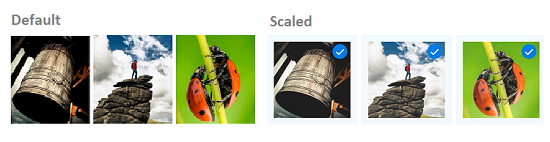

# Effects in .NET MAUI Effects View (SfEffectsView)

The `SfEffectsView` control provides modern effects such as highlight, ripple, selection, scaling, and rotation. This section explains about these effects.

## Highlight

`SfEffects.Highlight` is a smooth transition on the background color of `SfEffectsView`

 

 

<syncEffectsView:SfEffectsView
    TouchDownEffects="Highlight"
    HighlightBackground="#FF0000">
</syncEffectsView:SfEffectsView>



 

var effectsView = new SfEffectsView
{
    TouchDownEffects = SfEffects.Highlight,
    HighlightBackground = new SolidColorBrush(Colors.Aqua)
};





## Ripple

The `SfEffects.Ripple` is a expandable circle, which is initially placed on the tapped location, and it grows till the whole layout is filled. `SfEffects.Ripple` is rendered based on `InitialRippleFactor`.

 

 

<syncEffectsView:SfEffectsView TouchDownEffects="Ripple">
</syncEffectsView:SfEffectsView>



 

var effectsView = new SfEffectsView()
{
    TouchDownEffects = SfEffects.Ripple
};





## Scale

`SfEffects.Scale` is a smooth transition on the size of the `SfEffectsView.Content` from its actual size to the size calculated based on `ScaleFactor` in pixels.

 

 

<syncEffectsView:SfEffectsView
    ScaleFactor="0.85"
    TouchDownEffects="None"
    TouchUpEffects="None"
    LongPressEffects="Scale">
</syncEffectsView:SfEffectsView>



 

var effectsView = new SfEffectsView
{
    ScaleFactor = 0.85,
    TouchDownEffects = SfEffects.None,
    TouchUpEffects = SfEffects.None,
    LongPressEffects = SfEffects.Scale
};





## Selection

`SfEffects.Selection` is a smooth color transition to indicate whether the `SfEffectsView` state is selected or not.

 

 

<syncEffectsView:SfEffectsView
    LongPressEffects="Selection"
    SelectionBackground="#FF0000">
</syncEffectsView:SfEffectsView>



 

var effectsView = new SfEffectsView
{
    LongPressEffects = SfEffects.Selection,
    SelectionBackground = new SolidColorBrush(Colors.Aqua)
};





## Rotation

`SfEffects.Rotation` provides a circular movement to `SfEffectsView` around the center of the `SfEffectsView` based on the specified `Angle`.

 

 

<syncEffectsView:SfEffectsView
    TouchDownEffects="Rotation"
    Angle="180">
</syncEffectsView:SfEffectsView>



 

var effectsView = new SfEffectsView
{
    TouchDownEffects = SfEffects.Rotation,
    Angle = 180,
};





## Combinations

The `SfEffectsView` control provides support to apply multiple `SfEffects` in combination. The following are some valid combinations of `SfEffects`:

### Highlight and ripple

 

 

<syncEffectsView:SfEffectsView TouchDownEffects="Highlight,Ripple">
</syncEffectsView:SfEffectsView>



 

var effectsView = new SfEffectsView()
{
    TouchDownEffects = SfEffects.Highlight | SfEffects.Ripple
};





### Highlight and selection

 

 

<syncEffectsView:SfEffectsView
    LongPressEffects="Selection"
    TouchDownEffects="Highlight">
</syncEffectsView:SfEffectsView>



 

var effectsView = new SfEffectsView()
{
    LongPressEffects = SfEffects.Selection,
    TouchDownEffects = SfEffects.Highlight
};





### Ripple and selection

 

 

<syncEffectsView:SfEffectsView
    TouchDownEffects="Ripple"
    TouchUpEffects="Selection">
</syncEffectsView:SfEffectsView>



 

var effectsView = new SfEffectsView()
{
    TouchDownEffects = SfEffects.Ripple,
    TouchUpEffects = SfEffects.Selection
};





### Highlight, ripple, and selection

 

 

<syncEffectsView:SfEffectsView
    LongPressEffects="Selection"
    TouchDownEffects="Highlight,Ripple">
</syncEffectsView:SfEffectsView>



 

var effectsView = new SfEffectsView()
{
    LongPressEffects = SfEffects.Selection,
    TouchDownEffects = SfEffects.Highlight | SfEffects.Ripple
};





### Scale and selection

 

 

 <syncEffectsView:SfEffectsView LongPressEffects="Scale,Selection">
</syncEffectsView:SfEffectsView>



 

var effectsView = new SfEffectsView()
{
    LongPressEffects = SfEffects.Scale | SfEffects.Selection
};




